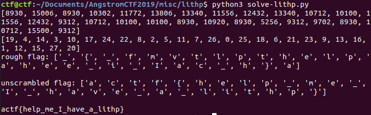

# Lithp

This was a fairly simple problem from Angstrom CTF 2019, a high school CTF similar to PicoCTF. It was 60 points, where point levels ranged from 10 to about 250. I found it to be a helpful review of some basic Lisp, as I am a bit of a Lisp newbie (see, however, _Structure and Interpretation of Computer Programs_) for good practice with Scheme, a Lisp-based language). I thought I would stretch my Lisp muscles a bit with this problem.

### Problem Description

This is basically a reverse-engineering problem. Here is the source code:

```common-lisp
;LITHP

(defparameter *encrypted* '(8930 15006 8930 10302 11772 13806 13340 11556 12432 13340 10712 10100 11556 12432 9312 10712 10100 10100 8930 10920 8930 5256 9312 9702 8930 10712 15500 9312))
(defparameter *flag* '(redacted))
(defparameter *reorder* '(19 4 14 3 10 17 24 22 8 2 5 11 7 26 0 25 18 6 21 23 9 13 16 1 12 15 27 20))

(defun enc (plain)
    (setf uwuth (multh plain))
    (setf uwuth (owo uwuth))
    (setf out nil)
    (dotimes (ind (length plain) out)
        (setq out (append out (list (/ (nth ind uwuth) -1))))))

(defun multh (plain)
    (cond
        ((null plain) nil)
        (t (cons (whats-this (- 1 (car plain)) (car plain)) (multh (cdr plain))))))

(defun owo (inpth)
    (setf out nil)
    (do ((redth *reorder* (cdr redth)))
        ((null redth) out)
        (setq out (append out (list (nth (car redth) inpth))))))

(defun whats-this (x y)
    (cond
        ((equal y 0) 0)
        (t (+ (whats-this x (- y 1)) x))))

;flag was encrypted with (enc *flag*) to give *encrypted*
```

I approached this problem as a complete Lisp newbie. A run-down of how the functions work: `whats-this` takes two parameters. If the second (`y`) is equal to zero, it returns zero; otherwise (the second condition is always true, as forced by the `t` at the start of the second line under the `cond` statement), it takes the first parameter and adds itself to itself `y-1` times. In other words, the function is a convoluted way to multiply two numbers, `x` and `y`.

Next, let's take a look at `multh`. It takes an input list, `plain`, containing elements such as (`a`,`b`,`c`,`d`) etc. It then iteratively returns a list for which `(1-x)(x)` is calculated for each element `x` of the list (so, `(a(1-a), b(1-b), c(1-c))`, and so on). `owo` does reordering. It takes an input list (in this case, the result of `multh` applied to the plaintext), and finds the `i`th element of the input list for each element `i` of the list `reorder`. So, we're basically reshuffling the elements of `multh` applied to `plain`. Finally, we loop through those reshuffled elements of `multh` applied to `plain`, and construct a list of those elements such that each element is divided by `-1` (i.e. negated).

### Solution

To get the plaintext back, we need to undo the reshuffling, and then solve the quadratic equation `x(x-1) = c` for each element `c` in the reshuffled elements of `ct`. The resulting numbers are ASCII, so I converted them to letters with the `chr` function. Here's the Python code to do that:

```python
ct = [8930,15006,8930,10302,11772,13806,13340,11556,12432,13340,10712,10100,11556,12432,9312,10712,10100,10100,8930,10920,8930,5256,9312,9702,8930,10712,15500,9312]
order = [19,4,14,3,10,17,24,22,8,2,5,11,7,26,0,25,18,6,21,23,9,13,16,1,12,15,27,20]

flag = ['Y']*28 # Initialization
print(ct)
print(order)
flag2 = ['Z']*28

def solve_quadratic(n):
	return (1+pow(1+4*n,0.5))*0.5

for i in range(28):
	flag[i] = chr(int(solve_quadratic(ct[i])))

for i in range(28):
	for j in range(28):
		if order[j]==i:
			flag2[i]=flag[j]

print("rough flag: " + str(flag) + "\n")
print("unscrambled flag: " + str(flag2) + "\n")
print(''.join(flag2))
```

And the resulting flag:



### Comparison to Other Approaches

The other write-ups on CTF Time aren't that different. The point of this problem was just to practice reading Lisp and reverse engineering.
