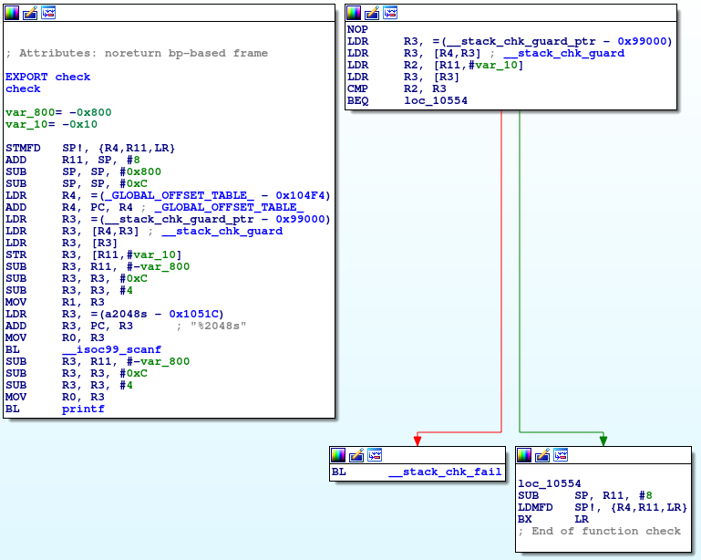
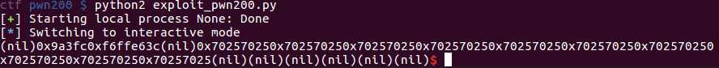

# HackIT2017 pwn200: Terminator Canary

HackIT2017 is a Capture the Flag competition hosted in the Ukraine. This challenge has a "Terminator 2" theme.

### Recon

Running `file` with the path to the binary as a parameter indicates the following:

    pwn200: ELF 32-bit LSB executable, ARM, EABI5 version 1 (SYSV), statically linked, for GNU/Linux 3.2.0, BuildID[sha1]=d78f4d65bc199dc2216d5076b7944d7707c6163a, not stripped

The binary is a 32-bit ARM executable. Examining the challenge with IDA confirms this (i.e. it's not just a case of the first few bits of the file getting overwritten with a fake file label, which is common in CTFs). For this problem I got myself familiar with 32-bit ARM assembly, going [here](http://students.mimuw.edu.pl/~zbyszek/asm/arm/asm_guide.pdf) page for a quick overview and consulting [here](http://simplemachines.it/doc/arm_inst.pdf) for more details. Here's the function `main`:

The application appears to have two functions, `check` and `fight`, that could be exploited. `check` echoes user input back to the user, and a quick glance suggests that it might be vulnerable to a format string attack. (In fact I chose this problem because one of my teammates spotted this in a couple of seconds.)

My first intuition was to use the `check` function to get a libc address, hopefully a second format string vulnerability in `fight` to overwrite the return address with a %n write to avoid overwriting the canary, and then return to a libc function. Something like that. I started by trying to figure out what kind of libc functions we can call, then looked more closely at `check` and `fight`.

It's important to note that this binary is statically linked, and not all libc functions have been incorporated into the binary. In particular, `system` is not one of them, and neither are `execve` or related functions that could easily get a shell. But there are functions like `opendir`, `readdir`, `open` and `close` -- so I started thinking that instead of getting shell, I could display the contents of a directory, find the directory containing the flag, and read the flag file. Additionally, I noticed that this application references a libc function called `_dl_make_stack_executable`, and started to suspect that I could either execute shellcode on the stack directly to get a shell, or else try to use `_dl_make_stack_executable` to make the stack executable using ROP, and then actually return to the stack to execute shellcode. So two possible strategies in my head at this point were setting up a ROP to read the flag, or else craft my own ARM shellcode to get shell.

I learned something interesting here -- to check whether the stack was executable I took a snapshot and ran this binary in a VM, then took a look at the /proc/[pid]/maps file. That suggested that the stack was *not* executable.  But later on, when I ran `vmmap` from within GDB, I found that the stack *was* executable. It turns out that `_dl_make_stack_executable` gets called during initialization of the program, and perhaps because of the emulation with QEMU I just was getting bad information from /proc/[pid]/maps. The moral of the story is that a debugger gives the most accurate information about the memory layout of a running process.

Next I looked at `check` and `fight`. Here's `check`:

This function appears to set up a buffer, read into the buffer, and then directly print the contents of the buffer without first specifying a format string. Then it returns. Pretty simple, and it's more or less what I expected. Next, `fight`:

This function reads up to 0x800 bytes from `stdin` into a buffer, checks the canary, and returns if the canary hasn't been overwritten. So I thought that to read from and write to arbitrary locations in memory an unlimited number of times, maybe I should overwrite the return address for `main` during the call to `check` with the address of the `check` function (or possibly the `fight` function if it also were to contain a format string vulnerability). Of course I wouldn't know any stack addresses during an initial call to `check` but I might be able to overwrite a GOT entry with the address of `main`, thereby looping back to a second call to `check` after calling it once and letting me return to the stack the second time.

Next I set up GDB to connect to this process running in QEMU, in order to view the stack at the time that I exploit the format string vulnerability. [Here's](http://www.ece.cmu.edu/~ee349/f-2012/lab2/qemu.pdf) how to do it.

### Leaking Information

Debugging ARM is wild! First I sent a string containing `%p` 20 times to `check` and immediately stopped at a breakpoint after printing:

I was able to leak the address of the buffer containing the text I just entered. Great! This is an address to which I could potentially return and start ROPing. And since the C functions in which I was interested are statically linked, I actually already knew their addresses -- I could grab them straight out of IDA.

...

Hey, wait a minute! (At this point I realized the stack was executable!! Bet you already saw that.) Great! I decided to try to return to the stack, and my first intuition was to use the format string vulnerability to do the equivalent of overwriting a function pointer in the Global Offset Table (GOT) of an ELF binary. But wait a second, do ARM executables even *have* a Global Offset Table? The answer: technically yes they do -- I think there is a section of the code labeled .got -- but in practice, functions just directly call other functions instead of referencing an offset table. The call to `puts` at 0x17908 in the function `main`, for example, is just `0x10688:	bl	0x17908`.

A line of output in the application reads "I need your clothes, your boots and your motorcycle." In an odd coincidence, at this point I headed to a coffee shop, and passed a flyer posted by some poor soul who had had a leather vest and riding boots stolen -- the photo on the flyer was of the guy standing next to a motorcycle. You can't make this stuff up.

So the next question was what to overwrite in order to take advantage of this leaked stack address. A closer look at `fight` shows that the function moves the stack pointer down by 0x400 bytes and change, retrieves the canary from memory and stores it to the stack, sets the 1024 byes of memory right below that location to zeroes using a call to `memset`, and then reads 2048 bytes of memory from standard input into that buffer. I saw that if I were to somehow obtain the value of the canary used for `fight` during my mischief in `printf`, then I could use it here to overwrite the return address on the stack while still preserving the proper value of the canary. And sure enough, the same canary value gets read from memory and used for stack protection in both `check` and `fight`.

I next figured that I should try to get my format string in `check` to print the value of the canary referenced in `fight`, which is stored at 0x98f8c. That format string, however, proved impossible to craft. I needed to write something to the address 0x00098f8c, which meant I needed to write the string "\x8c\x8f\x09\x00". While '\x00' could be placed on the end of a format string, "\x09" is the character for TAB and simply can't be included in a format string. So I needed another solution. I realized, however, that the same canary is used to protect the stack for the `check` and `fight` functions, so during `check`, I could print the canary straight off the stack by using a high enough number N in a `%[N]p` specifier. And it works! `%3$p` will print a stack address, and `%517$p` prints the canary.

### Gaining arbitrary code execution

This part is pretty straightforward. Once I had a stack address and the canary, I just filled the first 0x400 characters of the buffer sent to `fight` with junk, followed by the canary and then my desired return address -- the beginning of the characters I entered into the `fight` buffer. That gave me:

Great! The seg fault when trying to execute 'AAAA' indicates that I was trying to execute my code and the instructions were invalid.

### Getting shell

I learned a few useful things about ARM at this point, so I thought I'd share. At this point there was plenty of time left in the contest but I had not slept much, so I set about trying to find a potentially inelegant solution to execute some shell code that would still take advantage of the opportunity to learn about ARM while still leaving room for error given my slightly impaired state. In other words, I was having a great deal of fun.

I was super-excited about crafting ARM shellcode, but I realized that I didn't have access to `execve()` or `system` so I'd have to implement everything that `execve()` does in shell...not too tricky, but definitely error-prone, and I did not know what problems I would encounter concerning avoiding the use of null bytes. I considered that ROPing to existing functions might be faster to do during the contest, as well as easier to debug. My goal was to get the current directory, display its contents, and hopefully open and read a file that contains the flag. If I could figure out how to call one function using ROP, calling four probably would not be much harder.

To get the active directory, I wanted to call `getenv("PWD")`. In particular I needed to get a pointer to the string "PWD" in R0. Using the ROP Gadget tool, I tried naively using ROP the same way it's done with ELF binaries -- trying the equivalent of `pop eax; ret`, which translates in ARM to `pop {r0} ; bx lr`. I ran into this problem:

I'm in a never-ending loop because, unlike x86 and x86-64 architectures, ARM doesn't increment the stack pointer when returning from a function! So return-oriented programming for (32-bit) ARM is really an entirely different animal than it is for x86 and x86-64. Instead, following [this demonstration](https://github.com/zhengmin1989/ROP_STEP_BY_STEP/blob/master/arm32/exp/level9.py), I realized I needed to call `pop {pc}` to move on to the next desired function. That's the equivalent of `pop esp` for Intel processors. So I ROP Gadgeted around for `pop {r0, pc}`. I didn't find that but I did find `pop {r0, lr} ; bx lr` which is just as good.

But then I realized that once I called a function such as `getenv("PWD")` with the correct parameters, I was stuck again because once again, the stack pointer didn't get incremented upon returning from that function, and I did not have control over the code right before that final return. That does not mean that all is lost -- it just means that I did not know how to proceed, and while learning how was not tricky I was also low on time. My teammates suggested that writing shellcode would be faster, so I tabled this approach to return to it another day.

Moving on to shellcode, I started with **shellcraft** in **pwntools**. My final solution was not particularly pretty -- in true script kiddie fashion I grabbed [Jonathan Borgeaud's](http://shell-storm.org/shellcode/files/shellcode-904.php) code wholesale from Shell Storm and just ran it, and it worked. First, however, I tried writing my own code. [**Shellcraft**](http://docs.pwntools.com/en/stable/shellcraft/arm.html) has a section on writing ARM system calls, so I started with that. I also referred to sources such as [this one](https://azeria-labs.com/writing-arm-shellcode/) and [this one](https://www.exploit-db.com/papers/15652/). I started by trying to reproduce the following from Shellcraft:

    /* call syscall(11, 1, 'sp', 2, 0) */
    mov  r0, #1
    mov  r1, sp
    mov  r2, #2
    eor  r3, r3 /* 0 (#0) */
    mov  r7, #0xb
    svc  0

Of course, the above code does not include passing a '/bin/sh' parameter to the system call so it is not complete by itself. Avoiding the use of null bytes was a little tricky, and I was able to do so by using approaches such as replacing the first line with:

    mov r1, #1 /* \x01 \x10 \xa0 \xe3 */
    push r1, lr /* mov r0, r1 has null bytes */ /* \x02 \x40 \x2d \xE9 */
    pop r0, lr /* \x01 \x40 \xbd \xE8 */

That got me as far as the final call to `svc 0`, which turns out to be interchangeable with `svc 1` for some reason. But either approach ends up containing null bytes. In practice, the solution for this is to write 16-bit shellcode instead of 32-bit shellcode using THUMB mode. Stepping in to THUMB mode was error-prone for me, basically because I was parroting other approaches in terms of moving things into registers and did not really understand what I was doing. The problem was that I did not know how the processor gets signalled to interpret assembly as 16-bit instead of 32-bit assembly, and I was missing that critical step and sending valid 16-bit THUMB assembly that was getting interpreted as 32-bit ARM. At that point I tried Jonathan Borgeaud's shellcode, which executed just fine and immediately gave me a shell! Getting the exploit to work on the server required no additional effort.

The 'final' exploit is [here](exploit_pwn200_clean.py). I would like to revisit this in order to get my own shell code to work and possibly try a solution that uses ROP as well. I have some other more priorities to attend to first, but keep an eye out for updates to this writeup. In summary I really enjoyed this problem.
