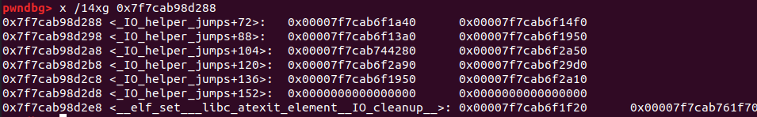
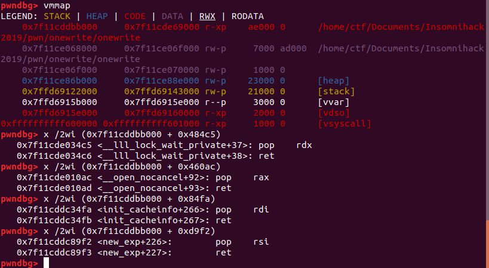
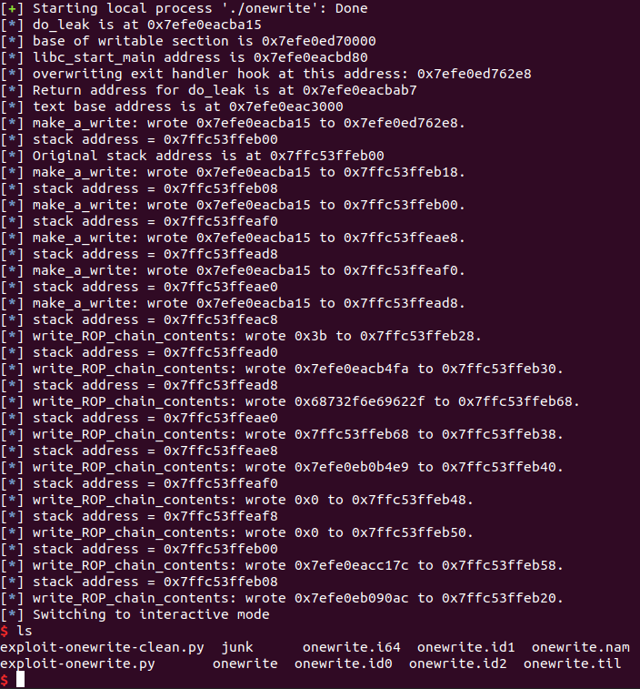
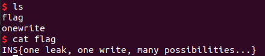

# OneWrite

Insomnihack 2019

This was a fun and challenging pwnable challenge for the Insomnihack quals. It was worth 82 points as it was considered relatively easy, but I learned quite a bit from the problem.

### Reconnaissance

This is a 64-bit Linux ELF binary. `checksec` yields:

```
RELRO           STACK CANARY      NX            PIE             RPATH      RUNPATH      FILE
Partial RELRO   Canary found      NX enabled    PIE enabled     No RPATH   No RUNPATH   onewrite
```

Here's some sample interaction with the program:

```
All you need to pwn nowadays is a leak and a qword write they say...
What do you want to leak ?
1. stack
2. pie
 > 1
0x7ffd69e9b4c0
address :
data :
```

The problem lets me leak a stack address or the address of `do_leak` in the code section. Then I can write to a location of my choice, but only eight bytes. So the dilemma here appears to be that knowing a stack address, I could potentially overwrite a return address, but I don't know where to return to; knowing the address of `do_leak`, I would know where to return to, but I wouldn't know where to do the write. And it appears that I can only do one read and one write.


Here's the `do_leak` function:

```
.text:0000000000008A15 ; =============== S U B R O U T I N E =======================================
.text:0000000000008A15
.text:0000000000008A15
.text:0000000000008A15                 public do_leak
.text:0000000000008A15 do_leak         proc near               ; CODE XREF: main+4Cp
.text:0000000000008A15                                         ; DATA XREF: do_leak+4o
.text:0000000000008A15
.text:0000000000008A15 var_10          = qword ptr -10h
.text:0000000000008A15
.text:0000000000008A15                 sub     rsp, 18h
.text:0000000000008A19                 lea     rax, do_leak
.text:0000000000008A20                 mov     [rsp+18h+var_10], rax
.text:0000000000008A25                 lea     rdi, aWhatDoYouWantT ; "What do you want to leak ?"
.text:0000000000008A2C                 call    puts
.text:0000000000008A31                 lea     rdi, a1_Stack   ; "1. stack"
.text:0000000000008A38                 call    puts
.text:0000000000008A3D                 lea     rdi, a2_Pie     ; "2. pie"
.text:0000000000008A44                 call    puts
.text:0000000000008A49                 lea     rdi, asc_880E6  ; " > "
.text:0000000000008A50                 mov     eax, 0
.text:0000000000008A55                 call    printf
.text:0000000000008A5A                 call    read_int_3
.text:0000000000008A5F                 cmp     rax, 1
.text:0000000000008A63                 jz      short loc_8A6D
.text:0000000000008A65                 cmp     rax, 2
.text:0000000000008A69                 jz      short loc_8A86
.text:0000000000008A6B                 jmp     short loc_8AA1
.text:0000000000008A6D ; ---------------------------------------------------------------------------
.text:0000000000008A6D
.text:0000000000008A6D loc_8A6D:                               ; CODE XREF: do_leak+4Ej
.text:0000000000008A6D                 mov     rax, rsp
.text:0000000000008A70                 mov     rsi, rax
.text:0000000000008A73                 lea     rdi, off_880EA
.text:0000000000008A7A                 mov     eax, 0
.text:0000000000008A7F                 call    printf
.text:0000000000008A84                 jmp     short loc_8AAD
.text:0000000000008A86 ; ---------------------------------------------------------------------------
.text:0000000000008A86
.text:0000000000008A86 loc_8A86:                               ; CODE XREF: do_leak+54j
.text:0000000000008A86                 mov     rax, [rsp+18h+var_10]
.text:0000000000008A8B                 mov     rsi, rax
.text:0000000000008A8E                 lea     rdi, off_880EA
.text:0000000000008A95                 mov     eax, 0
.text:0000000000008A9A                 call    printf
.text:0000000000008A9F                 jmp     short loc_8AAD
.text:0000000000008AA1 ; ---------------------------------------------------------------------------
.text:0000000000008AA1
.text:0000000000008AA1 loc_8AA1:                               ; CODE XREF: do_leak+56j
.text:0000000000008AA1                 lea     rdi, aNope      ; "Nope"
.text:0000000000008AA8                 call    puts
.text:0000000000008AAD
.text:0000000000008AAD loc_8AAD:                               ; CODE XREF: do_leak+6Fj
.text:0000000000008AAD                                         ; do_leak+8Aj
.text:0000000000008AAD                 call    do_overwrite
.text:0000000000008AB2                 nop
.text:0000000000008AB3                 add     rsp, 18h
.text:0000000000008AB7                 retn
.text:0000000000008AB7 do_leak         endp
```

### Getting multiple leaks and writes

I am writing this up a few months after the competition, but I remember that my idea was to overwrite a hook of some sort to jump to the code section, namely back to `main` in order to allow me to set up a ROP. I was reminded of the approach I learned from PicoCTF 2017's [Deeper Into the Matrix](https://github.com/Sudoite/ctf-writeups/tree/master/PicoCTF2017/matrix-deeper) problem, which involved bypassing full RELRO by overwriting a writable hook for `calloc` in `libc`. Since this binary calls `exit()` right after completing the write, my thought was to make use of some sort of writable `libc` hook for an exit handler if possible.

[Here](https://binholic.blogspot.com/2017/05/notes-on-abusing-exit-handlers.html) is a write-up on abusing exit handlers. Over the course of an hour or two during the competition, I read up on how exit handlers work, then I stepped through the `libc` code that gets called when `exit()` is called, and I took a look at the writable portion of `libc` for sections that had names that look useful. I found the following handler in the writable section of `libc`, which looked promising:



`__elf_set__libc_atexit_element__IO_cleanup__` can potentially contain a pointer to a function, which gets called during `exit()` if it is not null. From the blog posts I had been reading, I was a little concerned that that pointer is normally stored in mangled form, and demangled immediately on use as a security feature. But it turned out that the pointer is not mangled, and so I could simply use the leaked address of `do_leak` to calculate the location of `__elf_set__libc_atexit_element__IO_cleanup__`, then overwrite that hook with a pointer to `do_leak` in order to return to the start of the main program! At that point I could go ahead and leak a stack address, and build up a ROP chain.

### Building the ROP chain

No `libc` file was not provided with this binary because it was statically linked. In other words, plenty of ROP gadgets were available in the binary, and I did not use `libc`. Here are some of the gadgets I used:



(In the end, I found a gadget that let me pop both `rdx` and `rsi` at the same time, and used that.)

I wrote the ROP chain in a hurry, using some fairly "hacky" methods. I started by overwriting the return address from `do_leak` with a pointer to the start of `do_leak`. I already had a return to `do_leak` in place with the exit handler hook overwritten, of course, but overwriting the return address from `do_leak` helped to keep the stack pointer close to its original value each time I returned to `do_leak`. Essentially, returning to `do_leak` from `do_leak` moved the stack pointer up the stack, while returning to `do_leak` from `do_overwrite` moved it down the stack. That allowed me to populate the stack with nine or ten consecutive pointers to `do_leak` as a precursor to writing the ROP chain. Here's some data from the stack from when I was in the process of creating the ROP chain:

```
returning from do_overwrite:
pwndbg> x /20xg $rsp
0x7ffdf5e45be8: 0x00007fe2c2b52a15  0x00007fe2c2b52a15
0x7ffdf5e45bf8: 0x00007fe2c2b52a15  0x00007fe2c2b52a15
0x7ffdf5e45c08: 0x00007fe2c2b52a15  0x00007fe2c2b52a15
0x7ffdf5e45c18: 0x00007fe2c2b52a15  0x00007fe2c2b52a15
0x7ffdf5e45c28: 0x00007fe2c2b52a15  0x3039313136303431
0x7ffdf5e45c38: 0xb4ed50aeddd67b00  0x0000000000000000
0x7ffdf5e45c48: 0x00007fe2c2b52060  0x00007fe2c2b53780
0x7ffdf5e45c58: 0x00007fe2c2b53810  0x0000000000000000
0x7ffdf5e45c68: 0x0000000000000000  0x0000000000000000
0x7ffdf5e45c78: 0x00007fe2c2b5927a  0x0000000000000000
```

Having created the space for my ROP chain, I then populated it. My ROP chain calls `execve('/bin/sh', NULL, NULL)` as follows:

```
# rdi: pointer to "/bin/sh"
# rsi: null
# rdx: null
# rax: 0x3b
# jump to SYSCALL
```

[Here's](./exploit-onewrite.py) the exploit code (with debugging information left in for clarity), and here's the exploit in action:



And the flag:



### Comparison to other approaches

I was interested to see how others had approached this problem. [MadHat](https://go-madhat.github.io/onewrite-writeup/) takes a similar approach to me, except that they write the ROP chain to the `.bss` section. [Auxy233](https://github.com/Auxy233/Writeups/blob/master/2019/2019-01-20-inso-hack.md#onewrite) makes the "obvious" choice: they leak the stack address first and then overwrite the last two bytes of the return address from `main` in order to loop back to `do_leak`. They use `ropper` to generate the ROP chain and also place it in the `.bss` section. [EmpireCTF](https://github.com/EmpireCTF/empirectf/blob/master/writeups/2019-01-19-Insomni-Hack-Teaser/README.md#onewrite) builds the ROP chain by placing two hooks in the exit handler sequence, in something they refer to as the `_fini_array` (I'll have to read into that). The idea is that each time `exit` is called, first they write part of the ROP chain, and then they loop back to `main`. That author places the ROP chain on the stack.

Finally, [r00ta](https://github.com/r00ta/myWriteUps/blob/master/InsomnihackTeaser2019/exploit.py) from [ChocolateMakers](https://ctftime.org/team/603) has an interesting take. He starts by leaking a stack address and overwrites the last byte, fair enough, but the ROP chain is pretty neat. He found a gadget that pops `rsp`, and so he simply returns to `do_leak` to perform a write to the ROP chain, then in returning from `do_leak` he pops `rsp`, and pops the address of the return address to `do_leak`. That creates an infinite loop that he uses to create his ROP chain, and his final action is to overwrite the address containing that value of `rsp` that he was continually popping, and pop the start of the ROP chain into `rsp` instead. I really liked that creative solution.

Five write-ups, five solutions. Nice problem design.
