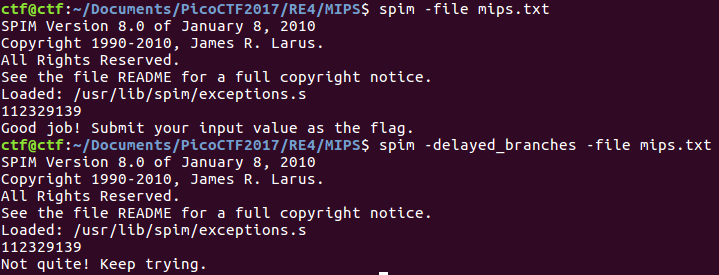
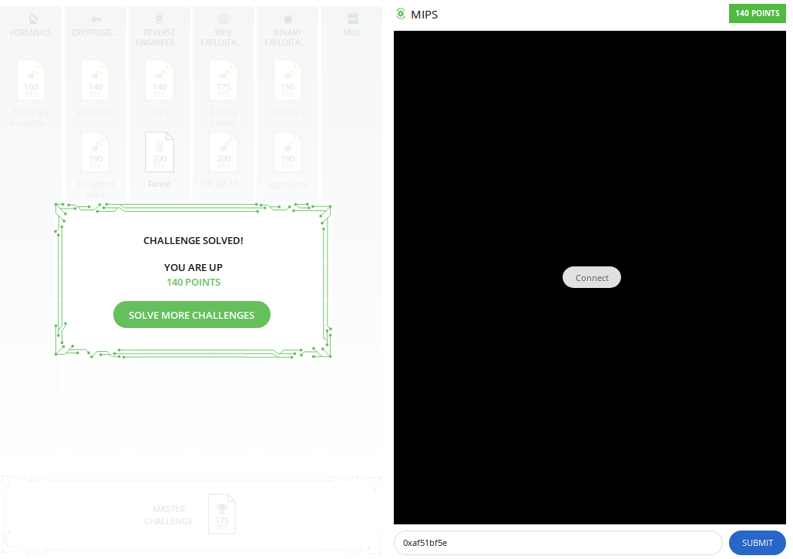

# MIPS

This is a level 4, 140-point reverse engineering problem from PicoCTF2017.

The problem provides some [MIPS assembly code](./mips.txt), which reads an integer from standard input, performs some calculations and compares to a desired integer. The flag is supposed to simply be the input integer in hexadecimal form.

### Blind Alley

The only problem is that in fact there appear to be at least 257 solutions to the problem! The code does a conditional branch at one point, and one of these branches apparently is supposed to lead to a state in which no possible input would lead to a solution. But that is the branch with 256 solutions. The second branch is apparently the intended branch.

Let's take a 32-bit input integer and denote the first eight bits (2^0 - 2^7) as `alpha`, the second eight as `beta`, the third eight as `gamma` and the last eight as `delta`. Then, the program can be reduced to the following pseudocode:

    if `beta == 2*alpha + 3`:
        if alpha - delta + gamma + 2^24 * delta - 191*2^16*gamma + 2^9*alpha == -913220864:
            output 'success'
        else:
            output 'failure'
    else:
        if alpha + gamma - delta + 2^24*gamma - 191*gamma == 100629649:
            output 'success'
        else:
            output 'failure'

For the second branch, setting `(alpha, gamma, delta) = (179, 178, 6)` satisfies the constraint, and `beta` can take any value. I found these somewhat straightforward to puzzle out with logic, as `delta` is the only parameter affecting the highest eight bits in the solution and `gamma` is the only parameter affecting bits 10-23. `alpha` can be derived after that. Unfortunately, the problem designers appear to have not anticipated this solution, so all 256 of these integers are not the flag. To arrive at this solution, I used the XSPIM GUI interface for the SPIM MIPS Simulator (here are [training videos](https://www.youtube.com/watch?v=hlEgH-PE8Ok)).

After realizing there were multiple solutions, I quickly checked the hints and another [write-up](https://github.com/in-s-ane/picoctf-2017/blob/master/MIPS_140/solution.cpp) just enough to confirm that the accepted solution indeed has `beta = 2*alpha + 3`. Happily the hints also suggested using the SPIM simulator. By all accounts, it appeared that I had encountered a broken problem. I got ready to go back and puzzle out a solution for the first branch.

### Correct Solution

At that point I read the second hint on the PicoCTF page:

    We recommend the SPIM simulator with some extra options enabled.
    The MIPS R2000 architecture uses branch-delay slots.

I'd never heard of branch-delay slots before, so this problem was great for my learning. The assembly code indeed contained some mysterious-looking instructions after unconditional branch statements that appeared to never get executed. I had assumed that they were in the assembly to throw off the careless reader -- quite the opposite! They are [optimizations](https://en.wikipedia.org/wiki/Branch_delay_slot) built into the MISC architecture to improve the efficiency of pipelining. So by running the SPIM simulator with the `-delayed_branches` flag set, I got a different outcome!

 It turns out that I had fooled myself by using the SPIM simulator as a way to check my work this time.

(In some cases, then, the hints almost seem like an extension of the problem description.) Enabling delayed branches is as easy as running the command `xspim -font 6x10 -delayed_branches -file mips.txt`. Assuming for the moment that `beta = 2*alpha + 3`, we need to satisfy the constraint problems:

 `alpha - delta + gamma - 191*2^16*gamma + 2^24*delta = 1922105344` and `beta = 2*alpha + 3`.

 In binary, the right side of the first equation is represented as `0b01110010100100010000000000000000`. Looking at the first equation, I know that `alpha-delta+gamma < 2^10`, so I get `alpha-delta+gamma = 0`. The only term that can affect bits 17-24 is `gamma`, so from that I get `gamma=81`. Next, I can compute `delta=175` by knowing `gamma` and bits 25-32 of the right side of the first equation. `alpha=94` and `beta=191` immediately follow from `alpha-delta+gamma=0` and `beta=2*alpha+3`.

 Thus, `(alpha, beta, gamma, delta) = (94, 191, 81, 175)`, and the solution is `0x53bf51af`:

 

 The problem became much easier given the hint that the assembly language was written for a MIPS 2000 processor that uses delayed branches.

 ### Comparison to Other approaches

 The [Insane Potato Team](https://github.com/in-s-ane/picoctf-2017/blob/master/MIPS_140/solution.cpp) bring up the possibility of using a constraint solver. They also were able to use brute force for this particular problem. 
