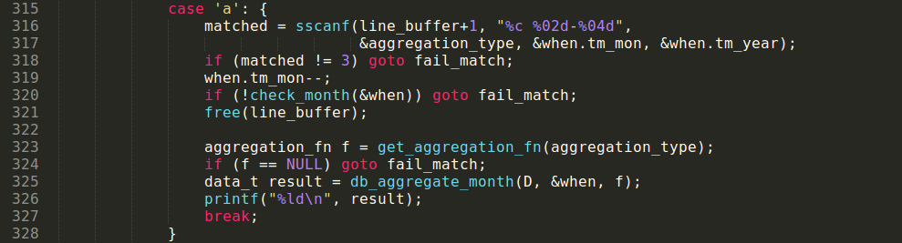
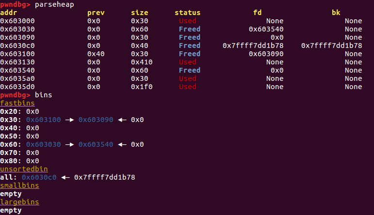
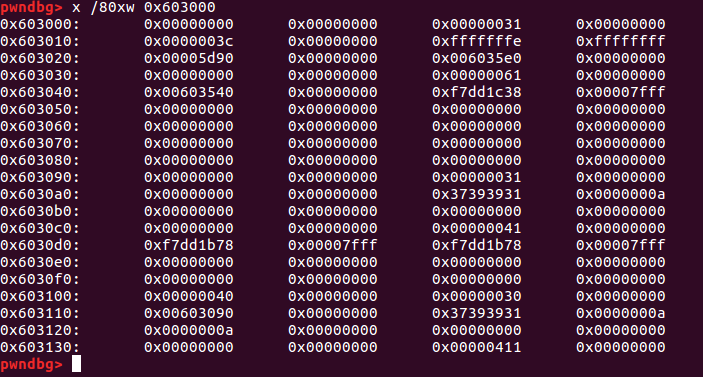
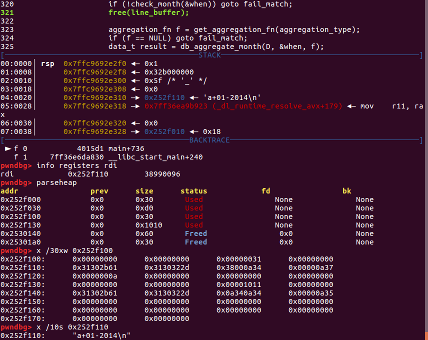
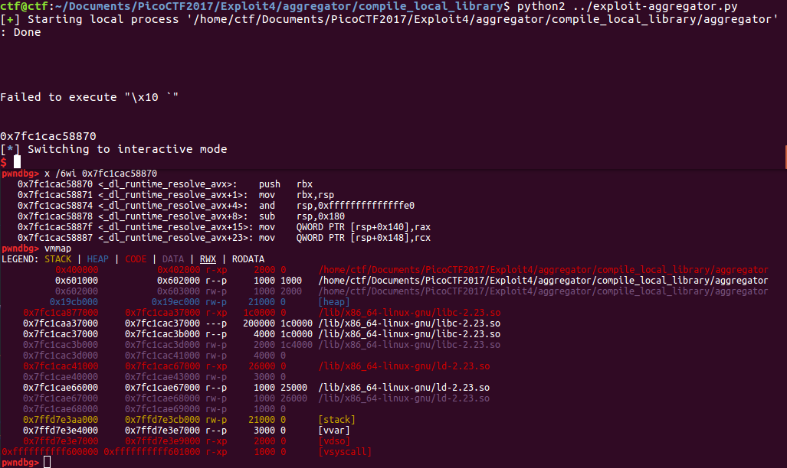
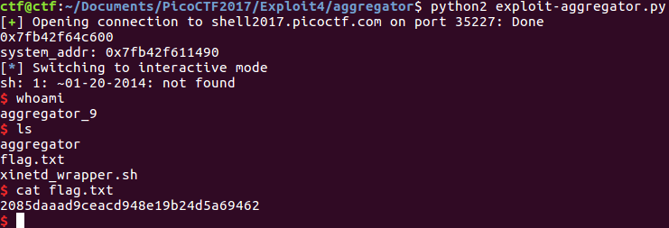

# Aggregator

This is a 190-point level 4 binary exploitation challenge from [PicoCTF2017](https://2017game.picoctf.com). Here's the description:

    I wrote a program to help me synthesize my log files. You can edit the
    log files to add annotations that will print out aggregated information.
    Because the original program that outputs the logs was a bit faulty, I also
    included the ability to clear a single day of logs.

At face value, this sounds like a heap challenge.

### Reconnaissance

The binary is a 64-bit ELF executable.

Here's a break-down of how the code works:

The user creates a note with something like "+ 01-24-2017 86".  At that point a `ymon_t` object gets created in `db_add`, which is the year times 12 plus the month, or 24205. Then, `chain_get` gets called, which tries to find a `dbchain` in the `data_table` pointed to by `D`, using `chain_head`. But there is no such chain, so that call returns `NULL`, and hence `chain_get` returns `NULL`. So `db_add` calls `chain_add`.

In `chain_add`, since the `size` of the data table `D` is 0, the `start_month` is set to 2017 x 12 + 1 - (24/2), or 24193. [Note that we can reset the start month later.]

Next, the `offset` is calculated to be 24205 - 24193 = 12, the midpoint of the range covered by the start_month and the number of allocated pointers in the pointer array `D->table`. And since that offset is between 0 and 24, we `xmalloc` space for the new chain, initialize its size and capacity, `xmalloc` space for the data, set the day, and (critically), set some pointers to `next` and have the `data_table` point to this `dbchain`. These last two lines (115 and 116) could potentially get manipulated if we can break `offset`.

The way `chain_add` normally works, if we want to add a note that's in a year_month that falls outside the range of `D->start_month` to `D->start_month + D->months`, then we expand the table right (if the year_month is greater than or equal to `D->start_month + D->months`), or else left (if the year_month for the note is less than `D->start_month`).

But things can potentially get nasty if we can drop `D->size` back to 0 after adding some notes, and then add another note. Isn't that supposed to be impossible? Well, in `db_rem`, let's say we try to remove a note corresponding to a day, month and year that are not in the `data_table` (lines 142-158). Then, the `while` statement and `if` statement never get entered, but we still decrement `D->size`!! Once we drop the size to zero, we can manipulate `D->start_month` however we like. And therefore, we can change the `chain_index` for any `dbchain`. I think it may be possible to manipulate this to read or write off the edge of an array, and possibly leak a `libc` address.

Other places I could cause trouble: if I can set `ch->capacity` to 0 for some chain, then a call to `chain_append` will end up calling `free` on that chain, a behavior that is potentially exploitable (what happens if I then try to free that chain later by deleting it?)

Now the only way I can see to leak information is through a call to the aggregator, since that has a `printf` command.

As far as exploiting a call to `system`, if I can overwrite the pointer to `free` in the GOT with a pointer to `system` and then input a comment containing `; sh;`, I can get a shell without calling `free` on anything else first

### Leaking information

I found another bug just by experimenting with the application to get familiar with the input.  Lines 315-328 read as follows:

Later in the same`for` loop, we see:

    fail_match: fprintf(stderr, "Failed to execute \"%s\"\n", line_buffer);

If the user enters a line such as 'a D 09-2017', `line_buffer` passes the first two checks, gets freed, but then `get_aggregation_fn` returns `NULL` since 'D' is not an aggregation function. `fail_match` then gets called, which tries to print something that has already been freed -- leaking a heap address in the process.

Additionally, there's a second bug that helps me to manipulate the contents of the fastbins on the heap: `line_buffer` never gets freed on line 321 if either of the checks on lines 318 and 320 fail -- and other cases in the `switch` section have similar problems with their logic.

So how can we use this information to leak a `libc` and a heap address? Well I basically manually fuzzed this application to produce some problematic output, and let's take a look at the inputs and the heap at that point. Here are my inputs and, indented under them, the outputs they produce (if any):

    a 01-09-1997\n
        Failed to execute ""
    01-09-1997 87\n
    01-09-1997 98\n
    01-09-1998 134\n
    ~ 01-09-1997\n
    ~ 01-09-1999\n
    ~ 01-09-1998\n
    adf
      Failed to execute "adf\n"
    a 01-09-1997\n
    Failed to execute "[unprintable characters here]"

Here's the heap, as viewed with `angelheap`. Note that I needed the symbols for `libc` in order to be able to display the heap with this tool, so I am not using the server's `libc` and will have to be aware of that for later, when writing correct GOT addresses -- but for the present purposes, it is not a problem to work with a `libc` version for which I have the source code.

The `fd` and `bk` pointers at 0x6030c0 correspond to part of an original block of 0xd0 bytes that was originally `D->table`, containing 24 8-byte pointers to `dbchain` objects and a 16-byte header. When I added 01-09-1998, `db_add` called `chain_add`, which increased `D->months` to 60 and therefore expanded `D->table` to 0x1f0 bytes (relocated to 0x6035d0).   
In allocating a small bin and then freeing it due to the line `01-09-1998 134\n`, the `fd` and `bk` pointers at 0x603040 and 0x603048 point into `clib`, to `main_arena` plus an offset. I then immediately allocate 0x60 bytes starting at 0x603030 for the data section corresponding to the `dbchain` for January 1998. I later free it with `~ 01-09-1998\n`, and 0x603030 is pushed onto the stack of available chunks in the fastbin of size 0x60. I then use that same chunk yet again to contain `line_buffer` holding `a 01-09-1997\n`. Processing that input in lines 315-328, `aggregator.c` passes the first two checks, with the space ('') getting stored to `%c`, `when->month` storing 01, and `when->year` storing 9 (as the 04 in `%04d` species the *maximum* field width). `line_buffer` then gets freed again, so as the chunk is now a fastbin, 0x603040 gets a `fwd` pointer to 0x603540 but 0x603048 does not get overwritten with a `bk` pointer. As a result, we now leak the heap address 0x03540 when `fail_match` gets called. This is the `FWD` pointer for a free chunk located in the '0x60' fastbin.

Now can we leak a `libc` address using this approach? The answer is no, and the reason is twofold: first, chunks in fastbins are stored as singly-linked lists, so they have no `BK` pointer that would potentially point to the main arena. Second, I can currently only print the `FWD` pointer of a free chunk that is exactly 0x30 bytes in size. That will never point to `libc`. Time for another approach.

We can also immediately pass in some input that contains exactly eight characters that meet the same criteria as the previous input, without a newline. That will leak the `libc` address! Let's try:
`ad05-1999`.

GOT IT! I read too much into this, it's a Use After Free problem and in fact I don't need to use the bug in `case: a` to print a heap address. Instead, the key here is that when I delete a day of logs, two chunks of memory are freed: `ch` and `ch->data`. But I can still USE the deleted chunk in the aggregation function: in doing so, I can print the contents of `ch->data`. If I use a new memory block to overwrite the contents of `ch`, I can write a pointer to the Global Offset Table, then dereference it there during `db_aggregate_month`, thereby leaking a `libc` address for, say, `free`. Next, I can also write to the GOT. To do that, I need to call `db_add` with a day and year that will end up referencing the chunk that has now been freed. As long as the 8 bytes corresponding to `ch->data` have been replaced with a pointer to the location of the pointer to `free` in the GOT, I can then replace that pointer with a pointer to `system`. Next, adding a comment containing `; sh;` should spawn a shell. Also, I know that I can write arbitrary information to a chunk of size 0x30 simply by inputting a `line_buffer` that doesn't get freed prior to calling `fail_match`. At this point, I have all the ingredients I need for an exploit, and all that remains is execution. Looks like my accidentally-successful manual fuzz was a red herring.

### Implementing the Exploit

#### Leaking a libc Address

The first thing to do is to make sure we can still access `ch->data` after I free a log day and then enter something into `line_buffer`. Let's say I run the following commands:

    '01-09-2014 87\n'
    '01-09-2014 95\n'
    '~01-09-2014\n'
    'a+01-2014\n'

Here's the heap right before calling `aggregator.c:321`:

I've overwritten the pointer to `data` in the freed `ch` with 'a+01-201'. So that's no good. Let me try allocating another day of logs corresponding to a separate month, freeing January 9th first, and then deleting that second day of logs so that January 9th won't get overwritten by the contents of `line_buffer`. That doesn't work either, of course, because the command to delete the second day of logs in itself creates another `line_buffer` that overwrites the `*ch` pointer for the January 9th entry. (In fact, in retrospect, as soon as I free the block containing a `data_table_chain`, `*data` will get overwritten by the `FWD` pointer to the next free fastbin of the same size (possibly NULL). At least `ch->day` does not get overwritten, that makes my life easier.)

Well, what if I create my own pointer to the GOT, then, using `line_buffer` itself? On the server, `free` is in the GOT at 0x601ee0 (I can see this by calling `objdump -d -j .plt aggregator`). What happens if I input a line containing '\x60\x1e\e0\00'? It goes to `default:` (line 330 in `aggregator.c`), the number of matched arguments are not equal to 4, so `line_buffer` is never freed and we go straight to `fail_match`. Perfect! Here's my new set of commands, substituting '\x60\x1e\e0\x00' with the location of the `free` pointer in my local version of `aggregator` for debugging purposes.

    '01-09-2014 87\n'
    '01-09-2014 95\n'
    '~01-09-2014\n'
    '\x06\x60\x1e\e0\x00\n'
    'a+01-2014\n'

Next, in `db_aggregate_month`, a check is made using the value `ch->size`. This value, located 24 bytes into the input string, should be a long (`size_t`) with a value equal to 1. Finally, I'll need `ch->next` to be NULL, so I need another set of eight zeros after `ch->size`. Here's the payload:

    p.send('\x18\x20\x60\x00' + '\x00' * 20 + '\x01\x00\x00\x00\x00\x00\x00\x00' + '\x00' * 8 + '\n')

That is enough to leak a libc address.

#### Writing to the GOT

Next, we want to make a call to `db_add` and overwrite `free`. Keep in mind that we needed our `ch->size` to be exactly 1 for the last read; therefore, if we still want to use the same heap chunk that we used to read from the GOT to write back to the GOT, its size will be 1 and we'll end up doing a write to `ch->data[ch->size] = ch->data[1]`, which is currently the location of the pointer to `free` plus `size_of(size_t) = 0x08`. Okay, what if in the previous step, instead of reading from `free`, we read from `free-0x8`? Well that location is a pointer to a function that hasn't been used yet, so the pointer goes to the linker's `_dl_runtime_resolve_avx` function:

It's possible to calculate the location of `system` from this address, but I don't want to have to rely on knowing the exact versions of both `libc` and the linker running on the server. So, to make life easier for myself, I think I'll write back to the GOT by freeing and reusing a fresh chunk.

So I add the following:

    p.send('01-20-2014 66\n')
    p.send('~01-20-2014\n')
    p.send('\x10\x20\x60\x00' + '\x00' * 4 + '\x14' + '\x00' * 15 + '\x01\x00\x00\x00\x00\x00\x00\x00' + '\x00' * 8 + '\n')

Great! That overwrites `free` with a pointer to `system` in the GOT. Now all I have to do is call it. How about sending in a comment? Something like `#;sh;` will call `system(#;sh;)`. But wait, that means that the shell command gets interpreted as part of a bash comment, and thus ignored!! Too funny. Okay, in that case, let's exploit the call to `free` in case '~' by sending `'~01-20-2014;sh;'`. And with that, I've got a local shell.

#### Getting the Exploit to Work on the Server

Now I just want to make sure I know the location of `free` in the GOT for the server application. It's easy enough to locate, by running `readelf -r` on the executable provided with the problem. That shows `free` to be located at 0x601ef0. Using that offset with the different offsets for `free` and `system` in the `libc` version running on the server, we can get the exploit to work on the server:

Hooray! [Here's](./exploit-aggregator.py) the full exploit code.
