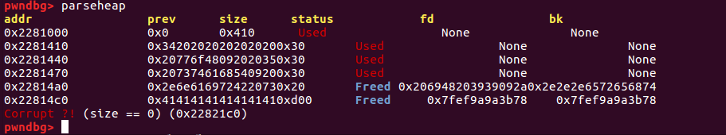

# Chat-Logger

This challenge is a 200-point problem for Level 3 of PicoCTF, and a bit of a tribute to Alan Turing.

Here's the problem description:

> You've been given admin access to the chat logs for our organization to help clean up the language. See if you can get a shell on shell2017.picoctf.com:51628.

### Hints for Others who are Still Solving this Problem

1. It's really important to visualize the heap for this problem. Try **pwndbg** and **angelheap** (installation instructions in this [write-up](https://github.com/Sudoite/ctf-writeups/blob/master/PicoCTF2017/matrix/EnterTheMatrix.md)).

2. I read the hints on the PicoCTF2017 server after finishing this write-up: you definitely need to work with local versions of the chat logs.

3. The bug in the C code for this problem is more about what's not in the code than what's in the code. That's probably also why it's worth a few more points.

4. The next hint is a bigger one.

5. Look closely at what is happening to the lengths of the messages as messages are edited and as new messages are inserted into the singly-linked list storing the messages.

### Recon

This problem presents a user with a chat log containing 10 rooms, two of which have conversations and eight of which appear to be empty. The conversations are retrieved from the server's local storage, so it's possible that for this problem, exploitation will only be possible remotely. Of course, I could also generate some fake conversations and store the files in the right place on disk in order to test an exploit locally. But let's take a look at how the program works normally on the server first.

    Welcome to the chat logs.
    Type "help" for a command listing.
    > help
    Commands:
	    chat <chatid>          print out a conversation
	    find <chatid> <str>    find a message
	    edit <newtext>         edit the most recently found message
	    add  <uid> <text>      add a message after the most recently found message
	    quit                   exit
    >

There are a total of 10 chat rooms, two of which contain content. The two conversations appear to be Turing test conversations -- neat! It's possible to print a conversation out with input such as `chat 0`, then find a line of text in the chat, and finally enter text with the `add` command. Then the user can print the entire chat again and view their own input. Initial thoughts: I wonder if it's possible to enter non-printable characters? And how does the insertion of a message take place? Are there checks on how long the input message can be?

Looking at `print_messages`: it prints up to 50 messages from a conversation, which means a message might have more information. I count 37 messages printed from the first chat (which starts with a "hello" exchange), and 50 messages from the second (which appears to "start" mid-conversation). So I wonder if merely finding a way to print the entire conversation will get the flag...well, the `find` function starts at the end of the conversation and browses forward until the desired substring is found in the text. `find 2 !` yields `Don't speak FRENCH!!!`, a line not visible from the limited log seen from `chat 2`. [That turns out to not be too relevant.]

Here is the struct for a message:

    typedef struct chat_message* chat_message_t;

    struct chat_message {
        uint64_t uid;
        size_t length;
        char * text;
        chat_message_t prev;
    };

More reading through the code indicates a bug in `add_message_after`:

    void add_message_after(chat_message_t cur, uint64_t uid, char * text) {
        chat_message_t msg = make_message(cur->prev, cur->uid, text);
        char * new_text = msg->text;
        msg->text = cur->text;

        cur->text = new_text;
        cur->uid = uid;
        cur->prev = msg;
    }

Messages are stored as singly-linked lists, and `add_message_after` takes a new message and inserts it into the singly-linked list by setting it to `cur` and moving the previous message into `msg`. The problem with this code is that it does not update the `length` field in a message, so the length of the new message `cur` is mistakenly set to the length of the previous message, and the length of the previous message is replaced with the length of the new message. This allows an attacker to set the length of the previous message to be greater than the number of bytes allocated for the structure in memory. In subsequently executing the `edit` function, the attacker could then potentially set a message to contain a message that is longer than the original length but shorter than the updated length, thereby overwriting data on the heap. Since the data we can thereby overwrite probably includes a pointer to something (given the `chat_message` objects are chock full of pointers), we should be able to then write to an arbitrary location in memory. At that point, the exploit is probably similar to Enter the Matrix in which we overwrite a function pointer to `system`, then call a C function that takes a string as input, pass "/bin/sh" into that function, and end up calling `system("/bin/sh")`. Let's see if we can make that happen. We'll no doubt need a libc address, unless ASLR is turned off on the server. And we also need to be able to leak information.

Let's try breaking something:

    ctf chatlogger $ ./chat-logger
    Welcome to the chat logs.
    Type "help" for a command listing.
    > find 2 existence.
    42  	I'm aware of my existence.
    > add 99 Hiya.
    Message added.
    > edit 99 Hi there...AAAAAAAA
    Message edited.
    > chat 2
    ...
           15  	Are you aware of our conversation?
           42  	I'm aware of my existence.
           99 *	99 Hi there...AAAAAAAA
           15  	Are you aware of my existence?
           42  	Yes. Are you aware of yours?
    .

(Looks like `edit` does not take a `uid`.) Now I go into `gdb` with **pwndbg** and **angelheap** installed [see this write-up](https://github.com/Sudoite/ctf-writeups/blob/master/PicoCTF2017/matrix/README.md), and display the heap:

Great! We're writing into inappropriate places on the heap, and the AAAAAA's are visible as 0x41 in hexadecimal. Sounds like we're on the right track.

### Leaking a Libc Address

Further investigation shows that at the beginning of this program, a large amount of space gets allocated to store the full contents of the log file containing the text of the chat room. This space gets freed once the application closes the log file. At the point that the user is prompted for input, the heap contains a large free chunk (probably in the form of a smallbin or unsorted bin) followed by dozens of allocated chunks. When new messages are added, `malloc` allocates space from this mid-sized block (I have a size of 0xe30), storing it on the heap in *front* of the freed chunk. That gives us the potential to read a libc address from the heap, if we can edit the freed chunk in such a manner as to overwrite the heap right up to but not beyond the `FWD` pointer in the free chunk. Printing that message with a call to `chat` should then also print the pointer, so long as we can somehow write the input to the heap without adding a null string terminator at the end. Alas! There is no way to do so. The application requires a newline at the end of a command, and the only way to get around the requirement is to completely close stdin. I searched around a little for clever ways to close a pipe and reopen it without losing access to the process, but could not find one. Time to look for another solution.

Next, suppose we were to overwrite the pointer to `text` in the memory block allocated for a `chat_message`, replacing it with a pointer to an address in the Global Offset Table that points into libc. At that point, a call to `print_messages()` would display that libc address. Great! So we can not only write to arbitrary memory but read from arbitrary memory as well.

To demonstrate the mechanics of overwriting a pointer in another memory block, here are some screen grabs from `gdb` after I have run the following commands:

    find 2 I told you my name is Brian
    add 2 AAAA
    find 2 I told you my name is Brian
    add 2 BBBB
    find 2 AAAA
    edit AABBBBCCCCDDDDEEEEFFFFGGGGHHHHIIIIJJJJKKKKLLLL  

"I told you my name is Brian" is a substring of a fairly long message that is allocated 128 bytes of memory. The `edit` command is suffixed with the bytecode corresponding to an address in the Global Offset Table (0x601e4d for the initial test shown here). Calling "find 2 I told you my name is Brian" twice places the pointer to that message on the heap directly above the memory block containing the text for "AAAA". We can now edit the message contained at 0x1aa4050 to overwrite the pointer to the "I told you my name is Brian" message on the heap. The resulting heap layout is:

 The 48-byte block of memory containing the `chat_message` structure for " \t 2 AAAA" is in the address space from 0x1fb43c8 to 0x1fb43f7, and contains the block size, the UID (2), the `length` field which corresponds to the length of the long "I told you my name is Brian" message (128 bytes), a pointer to "\*\tAABBBBCCCCDDDDEEEE...\x4d\x1e\x60\n" , and a pointer to the previous message in the chat history (which in this case is a pointer to the bottom of the heap because I've added the message "BBBB"). The block containing information about that message starts at 0x1fb3068 -- it has been moved to the top of the heap because the function `add_message_after` malloc's a new chunk of memory and copies the message referenced by the `find` command into that chunk -- everything except the length, of course. 0x1fb3078 originally contained the length of the string " \tAAAA", rounded up to the nearest multiple of eight bytes, but in the screenshot, that number 0x8 has now been swapped a second time with the length of " \tBBBB" that was stored in 0x1fb3028, then overwritten with ASCII characters.

At this point, printing the chat room contents gives:

The "...my name is Brian" message has been replaced with information from the GOT, which can now be parsed to retrieve a libc address. The UID has been replaced with "0x4a4a4a4a49494949" interpreted as a 64-bit unsigned long. Adjusting the libc pointer to 0x601e48, the address of the pointer to `strlen` in the GOT (selected because its libc offset on the server has no null characters), we now get the libc address.

### Calling system("/bin/sh")

For the purposes of calling `system("/bin/sh")`, the `strchr` pointer appears to be a good choice of function pointer to overwrite in the GOT, as its offset also contains no null bytes. Also, it takes as its first parameter input from the user, meaning that we can pass in "/bin/sh" as input once we have the pointer `system` in place. Additionally, in editing the pointer to `strchr` in the GOT, we have to actually start writing at least two bytes to the left of the desired address, so that the leading two bytes of the string ("\*\t"), which get automatically prepended to a message passed to the `edit` command, do not interfere with the placement of the pointer. Note that first we have to *find* a message in order to edit it. Because the first two bytes to the left of the address of a function pointer in the GOT are always null bytes, we would not be able to display any part of the desired message in calling the `chat` command, and hence there is nothing to `find`. I therefore decided to direct my pointer to *four* bytes to the left of `strchr` -- recognizing that the first four bytes of any two libc addresses will be the same -- and then just searched for the two non-printable characters associated with those four bytes in the chat log. Of course, (one would hope that) only the message we have altered will contain non-printable characters, so the search becomes an easy one.

A minor detail: apparently due to an optimization in libc, the entry point for `strchr` placed in the GOT turns out to not be the same as that in the executable's symbol table, as returned by the `readelf -s` command. A quick look at the libc executables in IDA identified the issue, and I compensated by adding appropriate offsets to the exploit code.

Given the above strategy, implementing the actual exploit was not too tricky, and resulted in a shell. Note that the code is not guaranteed to work, because due to ASLR a desired address will occasionally contain a byte such as '0x0a' and get interpreted as a newline when being submitted to the `edit` function. It works often enough, however, to not pose a problem.

I was really looking forward to the flag this time so that I could read the full text of the second Turing test conversation. Here's "proof" of the exploit and an excerpt from the chat room -- go ahead and solve this one yourself for the full text!

