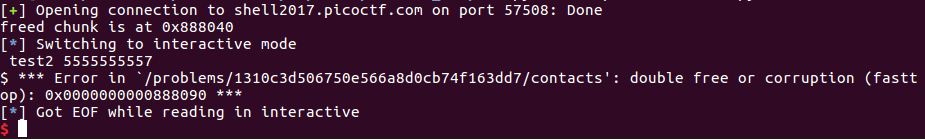

# Contact Helper

This 225-point, level 4 PicoCTF2017 binary exploitation challenge is worth the most points of any single challenge (except maybe the final challenge). Here's the [source code](./contacts.c) and description:

    In order to keep track of the contact information
    in our ever-growing organization, I made a simple
    helper tool. You can find it running at
    shell2017.picoctf.com:57508.

### Reconnaissance

Compiling the code doesn't give any easy clues -- we probably don't have format string vulnerabilities in the code, and a quick look at the `printf` lines confirms this. The application is a tool that allows the user to insert and modify contacts. Ostensibly a user can't delete contacts, but there are nonetheless still calls to `free` in the code, so use after free is still a possibility. There might be some buffer overflows. RELRO is disabled for this problem, so I can write to the GOT. Here's a quick sense of what the application does:

    printf(
      "Possible commands:\n"
      "\tlist                                 list all contacts\n"
      "\tget <id>                             get a contact by id\n"
      "\tfind <username>                      get a contact by name\n"
      "\tupdate-id <username> <new-id>        update the id when an employee changes departments\n"
      "\tupdate-phone <id> <new-phone>        update the phone-number of an employee\n"
      "\tadd <id> <username> <phone>          add a new employee\n"
      "\texit-mode <default|save|goodbye>     choose how to exit\n"
      "\tquit\n");

Next I looked for bugs. I spotted one in `find_contact`:

    contact_t find_contact(char * username) {
        for (uint64_t i=MAX_CONTACTS-1; i-->0;) {
            if (data.contacts[i] != NULL && !strncmp(data.contacts[i]->username, username, USERNAME_LENGTH)) {
                return data.contacts[i];
            }
        }
        return NULL;
    }

Any contact located at `data.contacts[MAX_CONTACTS-1]` will not be found even though it's in `data.contacts` -- an off-by-one bug. I'm not yet sure how to use it. The same bug exists for `get_contact`:

    contact_t get_contact(uint64_t id) {
        for (uint64_t i=MAX_CONTACTS-1; i-->0;) {
            if (data.contacts[i] != NULL && data.contacts[i]->id == id) {
                return data.contacts[i];
            }
        }
        return NULL;
    }

`update_id` makes the possible exploitation a little clearer: we can get two records with different usernames having the same `id` in the database, if one of those records is in `data.contacts[MAX_CONTACTS-1]`.

There's a possible bug in `copy_phone`:

    bool copy_phone(char * dest, char * src) {
        char tmp[PHONE_LENGTH];
        uint64_t i, j;
        for (i=0, j=0; src[j] && i < PHONE_LENGTH; ++j) {
            if ('0' <= src[j] && src[j] <= '9') {
                tmp[i++] = src[j];
            }
        }
        if (i == PHONE_LENGTH) {
            memcpy(dest, tmp, PHONE_LENGTH);
            dest[PHONE_LENGTH] = '\0';
            return true;
        }
        return false;
    }

Let's say that `src` is 5553234308. That copies correctly. But 555x323asdf4308 also copies correctly, with `dest` containing '5553234308\0'. I'm not sure if that matters...

We can indeed insert a contact in `data.contacts[MAX_CONTACTS-1]`.

Also, there's no 'delete contact' function, but it's still possible to delete a contact without adding one simply by calling `add_contact` with the `id` of a contact already in the database, but passing in an invalid phone number. In that case, `add_contact` finds the record for the `old_employee`, frees its `contact_data` structure, allocates a new `contact_data` structure and then frees that structure before calling `insert_contact`. Importantly, the pointer to `old_employee` in `data->contacts` is not set back to NULL. This is looking like a Use After Free vulnerability.

Perhaps we can leak a heap address by printing the contents of a free `contact_data` structure, as `find_contact` should probably still work even for a free block, with the `id` field now potentially containing a heap address for a fastbin. All the chunks allocated are going to be of the same fastbin size; the question is, if I allocate enough of them, does that singly-linked list get too long such that we start using smallbin chunks instead? If so, then I could end up leaking a `libc` address by printing the `BK` pointer of the first available free smallbin chunk. Additionally, if I can leak the contents of the `id` field of a chunk after freeing it, then I could be able to use that information as input to a second `add_contact` call that then executes a second `free` call on the freed chunk -- a [double free](http://homes.soic.indiana.edu/yh33/Teaching/I433-2016/lec13-HeapAttacks.pdf) vulnerability that could allow an arbitrary write. Time to get my hands dirty.

### Attempting a Double Free (Blind Alley)

Working with `Angelheap`, indeed I can free a block, run `find` with the block's original name, and leak a heap address that way. Then I should be able to call `add_contact` a second time on the free block, passing in the heap address as the id and setting up a double free!

A quick `for` loop showed me that allocating a lot of records doesn't eventually create smallbins, just a very long singly-linked list of fastbins. That means I'll only be working with `FWD` pointers for this problem, and the first question I have is whether it is possible to pull off a double free exploit with only `FWD` pointers.

Next, I'd like to free my free chunk a second time, in order for its forward pointer to point to itself.

Well, it was a good idea! But it fails because there is protection in the server's version of libc against freeing a block of memory twice. That doesn't mean this is impossible, I just have to be clever and bypass the protection.

Here's what the protection in question looks like in `malloc.c`:

    mchunkptr old = * fb, old2;

    if (SINGLE_THREAD_P)
      {
    /* Check that the top of the bin is not the record we are going to
     add (i.e., double free).  * /
    if (__ builtin_expect (old == p, 0))
    malloc_printerr ("double free or corruption (fasttop)");
    p->fd = old;
    * fb = p;
      }

According to the source code and  [dhavalkapil](https://heap-exploitation.dhavalkapil.com/attacks/double_free.html), with fastbins I can definitely use double free to get two used chunks to actually refer to the same space in memory, such that changes to one affect the other. That's interesting, but I am not sure how I would use that.

Also, in order to pull off the double free technique, I also need to start by allocating a number of chunks that I won't free, in order for `data->num_contacts` to not go negative and cause the comparison in line 122 to fail during the process of adding a contact. Accordingly, I allocated about 30 chunks of memory just to have plenty of room to work.

### Thinking Backwards

Next, I noticed that I can use `update_id` to overwrite the FWD pointer in a freed fastbin. Once I do that, then I could `malloc` any location I wish in memory, as long as it is writeable and I know where it is. I could write to the GOT, but of course I want to read from it first in order to bypass ASLR. What can be done?

My idea is to overwrite the pointers in the `data->contacts` field. After freeing and then not reallocating a chunk, I can send a command such as the following:

    update-id chunk1 " + str(0x602110) + "\n"

This would potentially write into the middle of those pointers. The fastbin pointers then look like:

    0x40: 0x1d41090 --> 0x1d41050 --> 0x602110 (data+80) --> 0x1d41320 <-- ...

Adding two new contacts then brings the pointer for the next fastbin of size 0x40 to be `malloc`'ed to 0x602110. But `malloc`ing a new chunk then produces an error:

    *** Error in './local/contacts_local': malloc(): memory corruption (fast): 0x0000000000602120 ***

The `malloc.c` source code reveals the check that's done:

    if (SINGLE_THREAD_P)
    	    * fb = victim->fd;
    	  else
    	    REMOVE_FB (fb, pp, victim);
    	  if (__ glibc_likely (victim != NULL))
    	    {
    	      size_t victim_idx = fastbin_index (chunksize (victim));
    	      if (__ builtin_expect (victim_idx != idx, 0))
    		malloc_printerr ("malloc(): memory corruption (fast)");
    	      check_remalloced_chunk (av, victim, nb);    

The freed "chunk" I'm pointing to must be of size 0x40. A little poking around the GOT indicates that because RELRO isn't used in the present case, the last entry, for `exit`, is an address starting with 0x40. I can therefore overwrite some pointers after all! The next figure shows the format of `contact_data` chunks in the heap, compared to the end of the GOT. In the `name` field, I just need six bytes of junk, followed by the address I would like to read in the GOT and a terminating null.

I found out that my local version of the executable had the GOT in a slightly different location than the server's version, so I used `patchelf` to use the server version locally. (Ideally I would first use a tool to diff the downloaded binary with the one I compiled.) But on the server version, I can't overwrite the pointers to contact chunks! I'm 15 bytes short.

Darn. Wait, maybe there's another way. What if the first time I do a malloc, I simply write "0x40" to somewhere around 20 bytes after the GOT? That would allow me to later do a malloc that really is within striking distance of the data section.

Sending:

    payload = "add " + str(int(0x41414141)) + " " + "B" * 30+ "\x40 " + "7777777777\n"

I get:

Now I'm in striking distance! I just need to free another chunk, change its id so that it points to 0x601f28, `malloc` the chunk, and do another `malloc`.

I'd like to first read the pointer to `strtok` in libc out of the Global Offset Table, then go back and set it to point to `system`. Here's the end of the GOT as I'm preparing to make a `malloc` to 0x601f28:

Let's say that I overwrite 0x601f48 with 0x601ee8, such that `data.contacts[0].id` contains the pointer to `strtok`. I want to be able to look up that contact using the `find` command, which means I need `data.contacts[0].name` to contain a string rather than a null pointer. I therefore have to modify the `id` field in the first payload to contain eight non-zero bytes. Cleaning the above narrative up into functions, we get:

    prepare_chunk_to_be_malloced(0, "chunk0", 1, "chunk1", int(end_of_got_addr))
    send_valid_add(int(0x4141414141414141), "B" * 30+"\x40", "7777777777")
    sleep_and_flush()

    prepare_chunk_to_be_malloced(10, "chunk10", 11, "chunk11", int(past_end_of_got_addr))
    send_valid_add(int(0x44444444), "C" * 24 + "\xe8\x1e\x60", "8888888888")
    sleep_and_flush()

which generates:

Note that randomization of the address space means that occasionally the leading byte of the heap address will be 0x01 and sometimes it will be 0x00. I need it to be 0x00 in order to properly read from the GOT. I believe it is possible to ensure that the leading byte is 0x00 with another write, but it's simpler just to replay the attack until the leading byte is 0x00 by chance. I've corrupted the first few pointers in `data.contacts`, but as they are accessed from highest to lowest during the `find_contact` and `get_contact` functions, that is not a problem.

### Wrapping Up

With a pointer to the GOT in place in the desired location, it is straightforward to leak the `strtok` address in libc and then replace the associated GOT pointer with a call to system, and then call `strtok("/bin/sh")`.

Hooray! I didn't need to use any hints for this one. [Here's](./exploit_contact_helper_clean.py) the full exploit code.

### Comparison to Other Approaches

I found a video write-up on YouTube by [kileak](https://www.youtube.com/watch?v=g1NYv3avSbU). The basic technique (known as a fastbin attack) is the same, but he leaks his LIBC address by overwriting a chunk size to make it appear larger, then freeing that chunk. Next, instead of overwriting a GOT address, he overwrites the function pointer to `exit`, which is located on the heap. He points to a LIBC adress identified by OneGadget in order to avoid having to pass a parameter to whatever `exit` now points to after the overwrite. Nice! I like this approach, as it is more robust. It is probably what the problem designers intended, and the solution I found is pure serendipity. So interesting. I love these problems.
