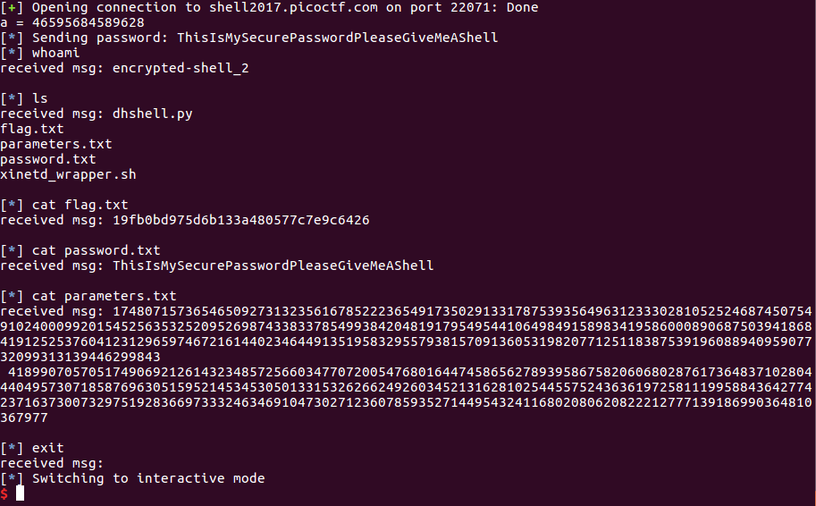
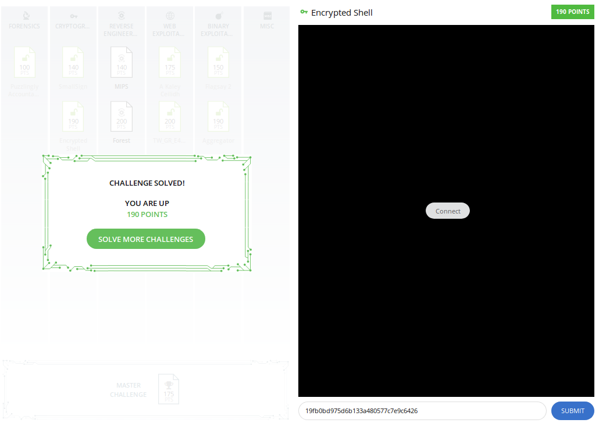

# Encrypted Shell

This is a 190-point level 4 cryptography challenge for PicoCTF2017. Here's the description:

"[This service](./dhshell.py) gives a shell, but it's password protected! We were able intercept [this encrypted traffic](./traffic.pcap) which may contain a successful password authentication. Can you get shell access and read the contents of flag.txt? The service is running at shell2017.picoctf.com:22071."

The PCAP file contains output from a previous session running dhshell.py:

    Welcome to the
    ______ _   _   _____ _          _ _
    |  _  \ | | | /  ___| |        | | |
    | | | | |_| | \ `--.| |__   ___| | |
    | | | |  _  |  `--. \ '_ \ / _ \ | |
    | |/ /| | | | /\__/ / | | |  __/ | |
    |___/ \_| |_/ \____/|_| |_|\___|_|_|

    Parameters:
    p = 174807157365465092731323561678522236549173502913317875393564963123330281052524687450754910240009920154525635325209526987433833785499384204819179549544106498491589834195860008906875039418684191252537604123129659746721614402346449135195832955793815709136053198207712511838753919608894095907732099313139446299843
    g = 41899070570517490692126143234857256603477072005476801644745865627893958675820606802876173648371028044404957307185876963051595214534530501331532626624926034521316281025445575243636197258111995884364277423716373007329751928366973332463469104730271236078593527144954324116802080620822212777139186990364810367977
    A = 118273972112639120186970068947944724773714770611796145560317038505039351377800437911584090954295445815108415228076067419564334318734103894856428799576147989726840111816497674618324630523684004675727128364154281009934628997112127793757633331795515579928803348552388657916707518365689221161578522942036857923828
    Please supply B:
    93745993751447503346396377281638158212564483727794429481438000562251573416232023154361841727945097797806065461693048826773559972703901706048613213733868461602449808032567839707922022630860776385491198101215693030172217682493643125763047405649582118389305170287200364245392146359258691658118945747317260110074

I first checked whether AES in this case uses a non-random IV, but the input for the IV is indeed a cryptographically random number. Next, I just looked at the name of the application. "DH" must stand for Diffie-Hellman, and so this appears to be a discrete log problem, where the goal is to determine `b` such that `B = g^b (mod p)`. As a sanity check, I confirmed [here](https://www.alpertron.com.ar/ECM.HTM) that the supplied `p` is indeed prime. Now the discrete log problem is generally speaking quite difficult, so to make sure I was on the right path I took a look at the supplied hint:

    Are any of the parameters used in the key exchange weaker than they should be?

Yep, indeed `p` is 309 digits, whereas it's recommended to be at least 600. So I looked into algorithms for computing discrete logarithms modulo a large prime number, where `g` is a generator. That took me to the [Handbook of Applied Cryptography](http://cacr.uwaterloo.ca/hac/about/chap3.pdf#page=21). Pollard's Rho works when the goal is to find a discrete logarithm modulo a prime number when the base is a generator, and that is what we want as `b` in this case is a [primitive root](https://en.wikipedia.org/wiki/Primitive_root_modulo_n) of the prime number `p`. But its running time is O(sqrt(p)), which is too long in this case. Next, I could try the Pohlig-Hellman algorithm, which would work well if p-1 is smooth. I start by [factoring](https://www.alpertron.com.ar/ECM.HTM) p-1 using `primefac`. It turns out that it has just two factors: 2 and a very large prime number.

Moving on to using the Index Calculus method, I used code from [pyDLP](https://github.com/davidcox143/pyDLP), which requires installing SageMath to solve systems of linear equations. My beginners' understanding of this method is that it involves setting a smoothness bound (a number is B-smooth if all its prime factors are less than B). Basically the larger the smoothness bound, the more likely it is that the algorithm will find a solution, but the greater the number of smoothness tests that must be conducted. According to the lecture notes from [this MIT course](https://math.mit.edu/classes/18.783/2015/LectureNotes11.pdf), an optimal smoothness bound is B=exp(0.5*sqrt(log(N)*log(log(N)))). But that's still a value of 664596596624736!! There's no way this problem will reach a solution in reasonable time.

Okay, I'm going at this the wrong way. What about the fact that the parameter `a < 70368744177664`? `a` is the only parameter that is small.

I kept searching, but was stuck by the idea that I would need an algorithm with subexponential running time. I had already passed over Pollard's Rho because it would not reach a solution in time faster than sqrt(p). But it [turns out](https://hgarrereyn.gitbooks.io/th3g3ntl3man-ctf-writeups/content/2017/picoCTF_2017/problems/cryptography/Encrypted_Shell/Encrypted_Shell.html) that the same paper included the lesser-known Pollard's Kangaroo algorithm (also known as Pollard's lambda), which will find a log that is known to be between two bounds, `a` and `b`, in `O(sqrt(b-a))` running time. Here, we have that `b=2^46` and `a=0` (known by reading the source code), so we can get a solution in `O(2^23)`. That algorithm is implemented in SageMath as `discrete_log_lambda`.

As I am a newcomer to SageMath, actually executing this function was not straightforward and could use some exposition. Suppose we know `3^6 (mod 7) = 1` and we want to show that `log_3 (1) = 6 (mod 7)`. Here's the syntax:

    sage: F = GF(7)
    sage: discrete_log_lambda(F(1),F(3),(1,7))
    6

First, the code initializes a [Galois Field](https://en.wikipedia.org/wiki/Finite_field) of size 7 (deliberately using a prime number for the size). Next, for the base and the number being logged, it passes into `discrete_log_lambda` *elements of that field*, and not merely integers. That indicates that we will be taking logs modulo 7. Technically, only the base, 3, must be a field element, but the documentation suggests that both the base and the number being logged must be group elements.) Finally, the tuple passed in as the third parameter corresponds to `(a,b)`.

Here's the Sage code, after inputting p, A, and g:

    F = GF(p)
    AField = F(A)
    gField = F(g)
    discrete_log_lambda(AField),gField,(1,2^46))

That returns `a`.

I considered whether I needed to attempt to solve for `B` as well in the new shell, before realizing that the server never uses `b` (from the calculation `B = g^b mod p`), so I could simply assume that `b` remains what it is in the Pcap file, and simply send the original B. Next, I get prompted for an encrypted password, which I can obtain by decrypting the password from the pcap traffic. To do that, I simply use the computed value of `a` to determine the AES key. The password turns out to be `ThisIsMySecurePasswordPleaseGiveMeAShell\n`.

To get a shell on the server, I repeat the process of finding `a` given `A`, `p` and `g`, then compute the AES key, encrypt and send the password and then encrypt and send shell commands, while decrypting and printing the responses.

 [Here's](./exploit_encrypted_shell_clean.py) the final exploit code.

I learned quite a bit from this challenge, but ultimately did not solve it on my own. Credit is due to [Valar_Dragon with th3g3ntl3man](https://hgarrereyn.gitbooks.io/th3g3ntl3man-ctf-writeups/content/The_Team.html) for finding Pollard's Kangaroo algorithm, pointing out that SageMath contains an implementation of it, and providing guidance with the SageMath syntax. Also, I drew on code by [David Cox](https://github.com/davidcox143/pyDLP) for executing Sage commands from Python, as used in his implementation of the index calculus method for calculating discrete logs.
