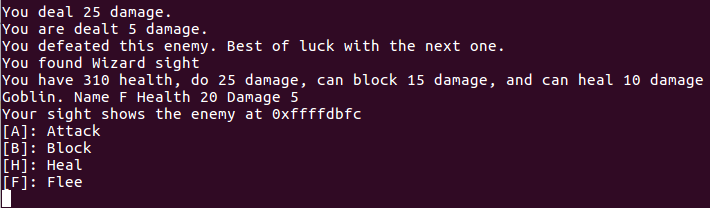
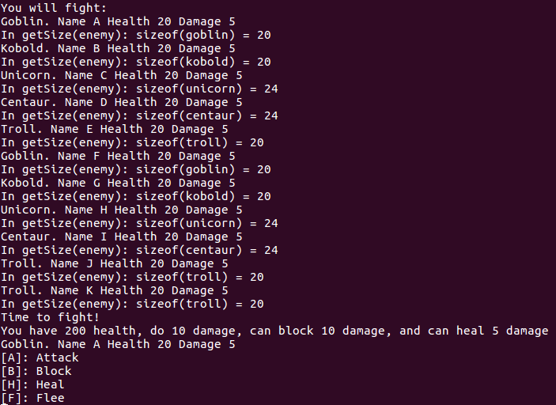
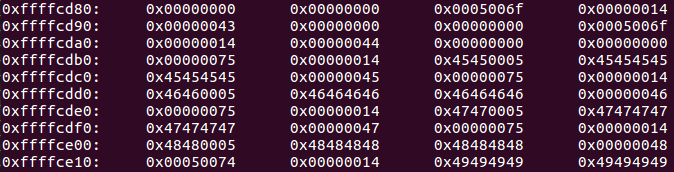
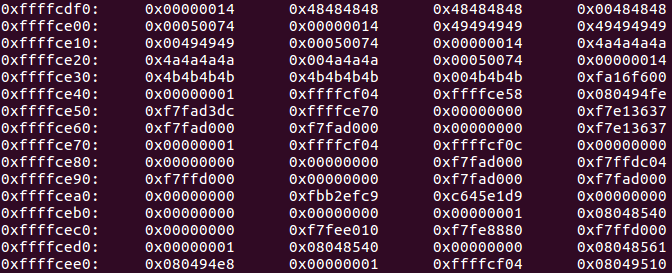
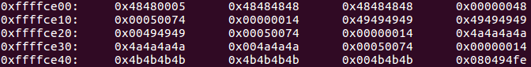
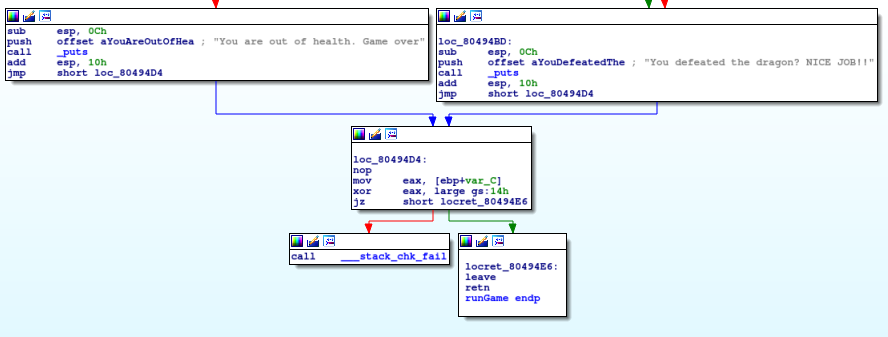
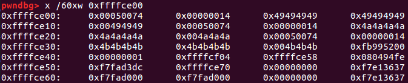
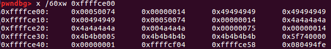
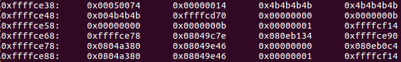
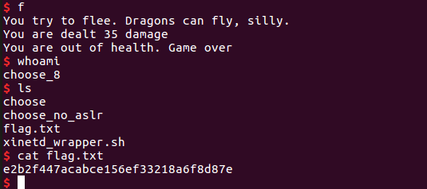

# Choose

This is a 150-point binary exploitation challenge that is the final challenge for PicoCTF2017. I only worked on this challenge after solving every other challenge offered in the CTF, so it was exciting to get this far! (In all fairness, some problems I only solved after receiving significant hints from other write-ups, in many cases because they required the use of techniques I had never seen before. But in each case, I learned a great deal from the problem.)

This is a fitting conclusion to the CTF, as the problem is a game that requires the user to slay a dragon with `0x1122334455667788` hit points. (Actually the goal is to get a shell, but potentially slaying the dragon along the way is a fun idea.)

Here's the problem description:

"Unhappy that you can't choose which enemies to fight? [Choose](./choose) your own adventure! [Source](./choose.c). Connect on shell2017.picoctf.com:25532. ASLR is not enabled.""

The only thing I know in advance is that this problem may be a buffer overflow problem, based on a fleeting glance that I accidentally took at someone's blog summarizing the nature of the PicoCTF contest maybe a month ago. Given that this is a 150-point problem, I doubt that would be a huge surprise once I were to see the C code anyway.

### Reconnaissance

The [code](./choose.c) is straightforward enough after working on all the other binary exploitation problems. Structs are defined constituting various monsters, the user gets to pick the order in which they are presented followed by their names, the monsters' names and stats are printed, and a game ensues in which the player may choose to attack, block, flee, or heal. After facing 11 monsters, the unbeatable dragon appears and inevitably defeats the player. Additionally, the players receive power-ups after defeating the lesser monsters, with the type of power-up specific to the monster. One power-up, so-called "Wizard Sight", will display subsequent monsters' location on the stack:

Really, every game should provide that sort of feature, that should be a standard weapon modification for Team Fortress.

The first bug (feature?) I noticed, in playing the game, is that unicorns and centaurs deal no damage. In fact the `buildUnicorn()` and `buildCentaur()` specify that they should deal 5 damage, so something is amiss there. A second bug is that attempting to flee any monster other than the dragon also prints a message suggesting that fleeing worked, but the next monster has the same name as the creature the player just fled. Still, the player now has to face one less creature prior to facing the dragon. The cause of the bug is that in `runGame()`, when `processCommand()` returns 1 in the case of successfully fleeing an enemy, the `enemOffset` integer does not increase. The bug does not, however, appear to be exploitable. Next, I noticed that in a few places in the code, an arbitrary enemy is actually cast as an `orc` when referenced, potentially leading to bugs if the struct for another creature is written slightly differently. Following on that hunch, I noticed that the positions of `damage` and `health` are reversed in the `typedef`s of `unicorn` and `centaur`, compared to the other monsters:

    typedef struct _kobold{
        char type;
        short damage;
        int health;
        char name[ENEMNAMELEN];
    } kobold;

    typedef struct _unicorn{
        char type;
        int health;
        short damage;
        char name[ENEMNAMELEN];
    } unicorn;

How could that reversal pose a problem? Well, there are at least two ways: first, calling `((orc *) monster)->damage`, where `monster` references a unicorn, might actually reference its health, or potentially 0 if the padding is different for a `unicorn` than for a `kobold`. Indeed, thinking about this further, `damage` is a short, so `gcc` would normally require its starting byte to be a multiple of 2. But `health` is an integer, so its starting byte is normally a multiple of 4 (although I believe `gcc` can actually be run with a flag that ignores these standard alignment requirements, for cases when memory requirements are extremely tight). What's more, alignment issues might actually change the size of the structs themselves, thereby potentially creating buffer overflow vulnerabilities. To check this, I added some additional statements to the code to print out the size of the monster structs as they're presented to the user. Here's some output:

Indeed, this looks potentially exploitable. It is useful to look at the alignment just to understand what's going on:

Here's the `typedef` for an orc:

    typedef struct _orc{
        char type;
        short damage;
        int health;
        char name[ENEMNAMELEN];
    } orc;

Starting at 0xffffcd88, I've got an orc (\x6f denotes an 'o'). Following the 1-byte char 'o' there is a byte of padding, followed by a two-byte short 0x0005. So indeed alignment requirements add a byte of padding. Next, there are four bytes for health starting at 0xffffcd8c, followed by 12 bytes for the creature's name, 'C', at 0xffffcd90 (up to 11 bytes of content followed by a null byte terminating the string), for a total of 20 bytes. At 0xffffcdb0 we have a unicorn, which starts with a one-byte char and follows with THREE bytes of padding followed by four bytes for health, which for alignment purposes is placed at 0xffffcdb4. Then at 0xfffcdb8 there are two bytes for the creature's damage, followed by no padding and 12 bytes for the name ('EEEEEEEEEEE'). An additional three bytes of padding precedes the next enemy, so we end up with 24 bytes for a unicorn. So I can see why a unicorn deals zero damage now: when the `damage` field is accessed for a unicorn, the unicorn is first cast as an orc, so the padding right after `type` is referenced because that's where an orc's `damage` short is located.

My partner for this part of the problem immediately noticed the definition at the top of the file:

    #define ENEMSIZE sizeof(orc)

followed by

    memset(enemies,0,ENEMSIZE*NUMMONSTERS);

during `runGame()`. So, we can potentially write information onto the stack past the end of the array of enemies. Let's see what's on the stack after this array, to see what can be overwritten. Here's the stack with 11 orcs (thus exactly fitting into the allocated space and showing an unadulterated stack):

The last enemy has name "KKKKKKKKKKK" (0x4b), so the first byte after the enemies is 0xffffce3c. Later on, 0x080494fe looks like a return address, and indeed it's the next instruction after the call to `runGame()`. Great! Maybe I can overwrite the return address and jump somewhere else. And can I write beyond the intended destination?

Indeed I can. Here I've almost overwritten the return address, just by creating four unicorns.

### (Instructive) blind alley: canary in local compiled source code

Here I went down a blind alley that I thought I would keep in the write-up because of the insight it provides about padding.

I don't like those bytes at 0xffffce3c: they look rather random, like a canary. Is there a canary check at the end of `runGame()`? Let's check out the code in `IDA Pro`:

Yes. Darn, I must be looking at a canary then.

It turns out that the canary is only in my compiled code, and not the executable from the server. (I was attempting to compile the executable myself as practice, in order to not execute a downloaded binary locally.) I can mimic the server's code by passing `-fno-stack-protector` as a flag to `gcc`. But in any case, I first tried to bypass the canary (and succeeded!) At first I wasn't sure exactly how the padding works in the case of an overflow. `memset` should initialize the allocated memory to zeroes before adding data, I believe, but a section of the stack past the end of that allocated memory is not affected by `memset`. So is it possible to see "through" padding to what was underneath before the bytes were overwritten? Do the padding bytes act like holes? Indeed they do. In particular, I think if I add a unicorn with a ten-byte name (followed by a null terminator), the last three bytes of the struct are padding and could sit right on top of the last three bytes of the canary, leaving it intact.

First I confirm that the null byte at 0xffffce3c is not a fluke:

Indeed it is not because the null terminator in the address prevents buffer overflow attacks on functions such as `strcpy`, which require strings with no null bytes prior to overwriting the return address. Next, I'll allocate a single unicorn at the end, with a 10-character name:

I've overwritten part of the canary with a null byte, but two bytes of the canary are indeed still visible "through" the padding. That means that I could brute force an attack: About one time in 256, the canary would also have a null byte at 0xffffce3d. That's actually acceptable since I don't need to be stealthy for this problem.

In actuality, the executable provided with the problem has no canary:

### Devising the exploit

How about setting up the rest of the attack? Well, I have 11 bytes to play with for the name. If I know the address of `system()` in `libc`, then can I place "/bin/sh" on the stack right above the return address and have it interpreted as the parameter for `system()`? Not quite, because the first four bytes above the pointer to `system` will be interpreted as the return address from `system`, and the next four bytes after that would contain the argument for `system`. But I don't have that many bytes.

It took me awhile to see this because I assumed that these harder problems won't have an executable stack, but it turns out that this problem does have an executable stack. Evidently the point is to teach people to write shell code as a transition into more serious hacking competitions. I'm game! I can return to those parts of the stack I can control, using jump instructions at the end of each set of 11 bytes so that I have more to work with than just 11 bytes of space.

There are lots of ways to spawn a shell, but I think I'll just note that the return address of whatever "function" the shell code would be is stored at 0xffffce70. That means that if I have my shell code call `system()`, then the argument for system would be stored at 0xffffce74. Thus, I can have my shell code simply move a pointer to "/bin/sh" to 0xffffce74 and jump to the address of `system()`. That should be very straightforward.

### Shellcode Development

I made one more blunder that is worth mentioning: my first thought for exploiting the overflow vulnerability was to note that the return address of whatever "function" the shell code would be is stored at 0xffffce70. That means that if I have my shell code call `system()`, then the argument for system would be stored on the stack eight bytes above 0xffffce70. Thus, I can have my shell code simply move a pointer to "/bin/sh" to 0xffffce74 and jump to the address of `system()`. That would be very straightforward.

The only problem is that there is no `libc` AT ALL in this executable!! I simply made a false assumption because `libc` so far has always been part of every binary exploitation problem on which I have worked. Now I've learned my lesson: early in a problem, check what parts of the process are writable, executable, etc. And check if there's a `libc` section, as occasionally there is not.

But that just means that I have to call `execve()` directly instead of `system()`, no big deal. Chapter 5 of Hacking: the Art of Exploitation in fact shows how to develop exactly this type of shellcode. Essentially the registers must be set up as follows: `%ebx` must contain a pointer to the null-terminated string "/bin/sh". `%ecx` must contain a pointer to an array containing a pointer to the address of the "/bin/sh" string as its first entry, and a null pointer as its second entry. `%edx` can be simply a null pointer. And `%ecx` must contain `0xb`. Furthermore the shell code must contain no null values. Here is the full shell code during debugging:

    void main(){
    	__asm__("mov $0xffffcdca, %ebx;" // arg1 = pointer to /bin/sh
    		    "mov $0xffffcde2, %ecx;" // arg2 = pointer to null-terminated pointer to /bin/sh
    			"mov $0xffffcdd1, %edx;" // arg3 = 0
    			"xor %eax, %eax;"        // zero-out %eax
    			"mov $0xb, %al;"           // arg0 = 11 for system call
    			"int $0x80");
    }

Compiling this gives the following bytes:

    80483de:	bb ca cd ff ff       	mov    $0xffffcdca,%ebx
    80483e3:	b9 e2 cd ff ff       	mov    $0xffffcde2,%ecx
    80483e8:	ba d1 cd ff ff       	mov    $0xffffcdd1,%edx
    80483ed:	31 c0                	xor    %eax,%eax
    80483ef:	b0 0b                	mov    $0xb,%al
    80483f1:	cd 80                	int    $0x80

Of course, I only have 11 bytes to work with at a time, but I can split the shellcode up into four sections separated by relative jumps. So I use the op code `eb` (see [here](https://stackoverflow.com/questions/14889643/how-encode-a-relative-short-jmp-in-x86) to execute short jumps backwards. (I choose to go backwards because forward jumps would place null bytes into the machine code.)

With that, I can get an exploit working locally!

### Attacking the server

The offsets are slightly different on the server, because the environment is different. But that beautiful "Wizard Sight" gives me the actual location of the "enemy" data on the server's stack, and so I can adjust these offsets to work on the server. And thus, I can get shell!

[Here's](./exploit_final_clean.py) the final exploit code.

### Comparison to other approaches

[Caesaurus](https://github.com/Caesurus/PicoCTF2017/tree/master/Final_choose) presents a solution that does not require relative jumps (very interesting!) Team [Hackademia](https://hgarrereyn.gitbooks.io/th3g3ntl3man-ctf-writeups/content/2017/picoCTF_2017/problems/binary/Choose/Choose.html) took the same approach that I did.

Really, someone should go and write some extra shell code to slay the dragon...
