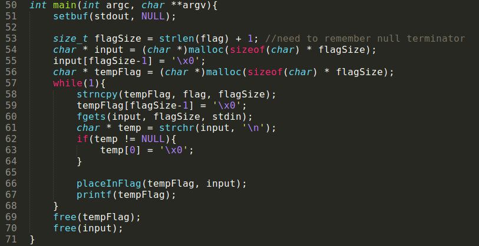
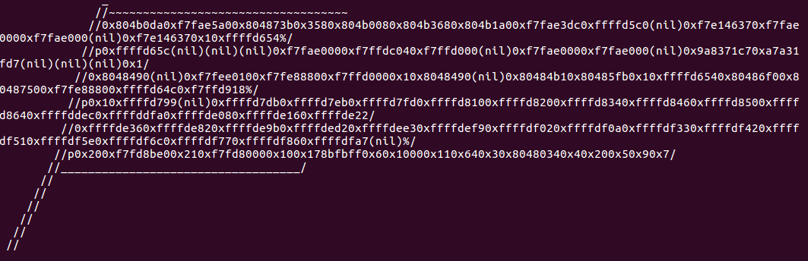
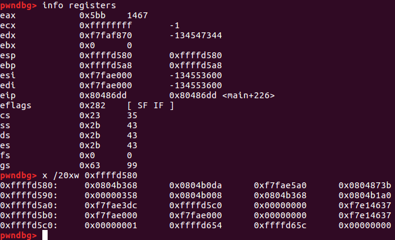
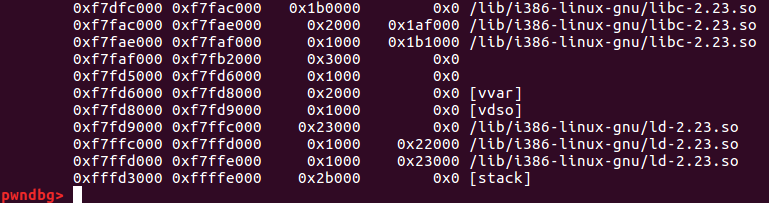
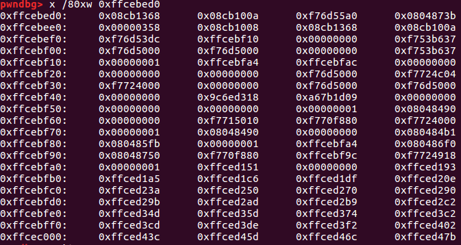
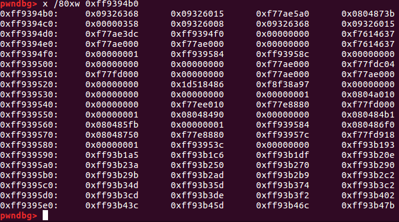
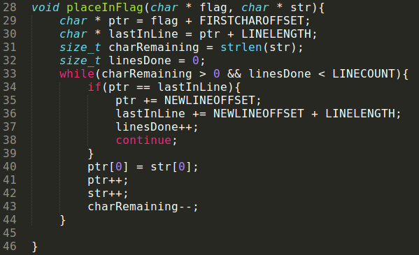
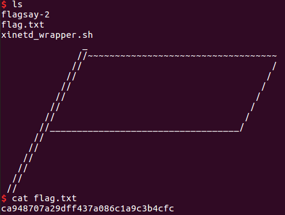
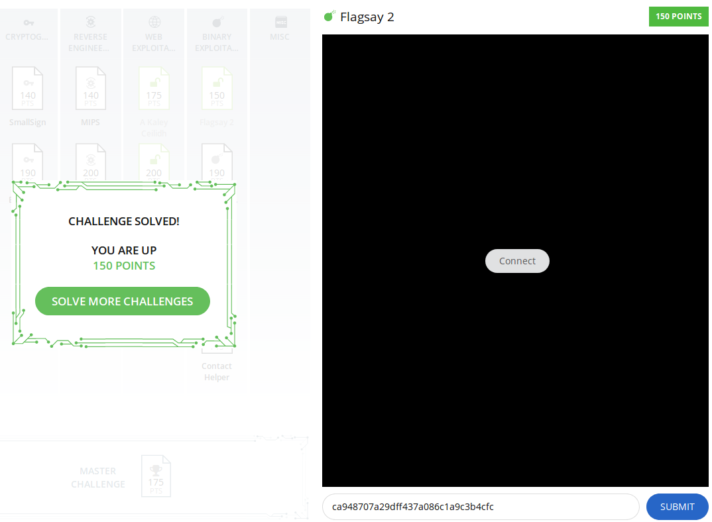
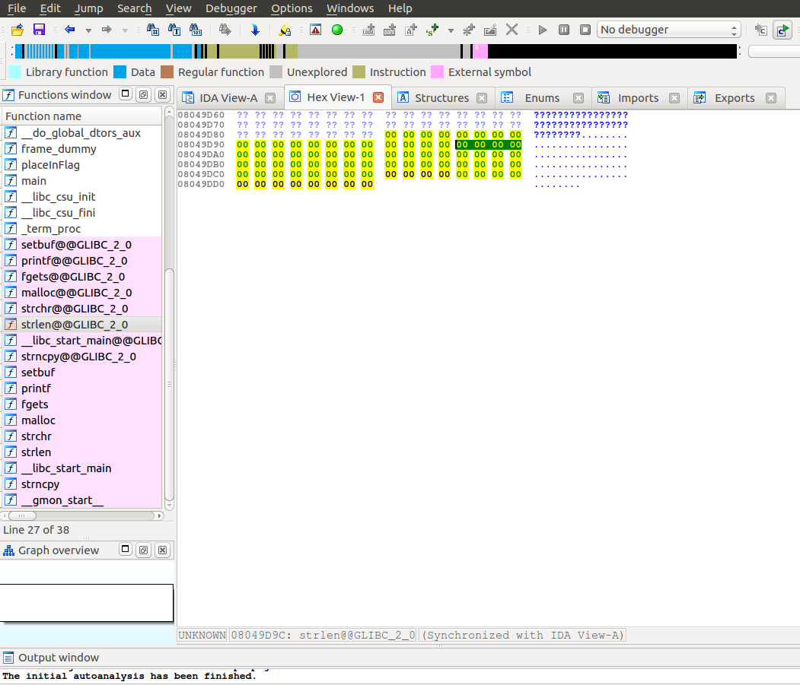

# Flagsay-2

This is a 165-point, Level 4 binary exploitation challenge from [PicoCTF2017](https://2017game.picoctf.com). The user types input, which is displayed back to the user inside of a flag, as a sort of mockery.

### Reconnaissance

The executable is a 32-bit ELF binary. User input is outputted to a flag in a never-ending `while` loop. A look at the [C code](./flagsay-2.c) indicates a format string vulnerability on line 67:

Sure enough, we can print information in memory to the flag:

The next step is to leak a `libc` address, then overwrite a function pointer in the Global Offset Table to redirect program execution and spawn a shell.

### Leaking a LibC Address

First, we leak a `libc` address. The amount of viewable memory is limited by the size of the flag: 35 blank spaces per line, six lines, and the requirement that a '%p' must be
consecutive characters in the flag for memory to be displayed makes for 17*6 = 102 addresses in 4-byte segments. Let's take a look:

Putting a breakpoint in `gdb` right after returning from `printf` and viewing the stack, we can see the stack addresses that are getting written to the flag:

With `info proc mappings` in `gdb` (or `vmmap` in `pwndbg`), we get:

So, the second `%p` in the input to `flagsay` causes a `libc` address to be outputted to the screen. Great! Now we can get a `libc` address with either a string containing two %p format strings or with a single %p format string, using direct parameter access. It's then easy to calculate the the address of the call to `system` in `libc`, using the `readelf -s` command with the appropriate version of `libc`. Next, we want to write that address to the address of the pointer to `printf` in the Global Offset Table (specifically, 0x0804a010), by crafting an appropriate format string.

### Writing to the GOT

Note that for this `flagsay` challenge, the contents of the flag are stored in the heap, not on the stack. But that means that my format string will be printing off elements on the stack around address space 0xfffd3000, while any format string elements that I can control are in the heap, around 0x0804c000. That significantly limits the available options for hacking this application! But the stack is writeable. Maybe it's possible to make some clever use of the bytes that are available on the stack, and which do not change from one run of the program to the next, to craft a format string anyway. First let's find an address in the GOT that happens to be on the stack, or think of some options for putting one there if it is not there now.

Here's what the stack looks like before a call to `printf`:

A solution can now be seen: referring to the address stored in 0xffcebed4 as "parameter 1" in the above diagram (using the parlance of direct parameter access in format strings), notice that the 17th four-byte "parameter" on the stack is 0xffcebfa4, the address of the 53rd "parameter" on the stack, which currently is 0xffced151. By writing a single short to this address with the right format string, we can
change the last two bytes of this address to bf5c, thereby pointing to the 35th "parameter" on the stack. This "parameter" points to the data section, and we can make it point to the Global Offset Table by overwriting the last two bytes with a second format string. Of course, due to ASLR we'll have to calculate the requisite bytes on the fly.

Here's the stack after changing these pointers with two writes:

Right towards the end there's one more catch: the `system` function is nearly 0x10000 bytes away from the `printf` function in `libc`, which means we actually need to perform two writes to the GOT to point `printf` to `system`.

Doing this works, and `printf` gets called with a single parameter, `tempFlag`. That means that this parameter will also contain quite a bit of junk in the form of the graphical edge of the flag, producing errors when `system` is executed (e.g. `sh: 2: //~~~~~~~~~~~~~~~~~~~~~~~~~~~~~~~~~~~: not found`). Passing in `;sh;` as the user input gets around this inconvenience and gives me a clean shell.

### Getting the Exploit to Work on the Server

At this point, I encountered additional difficulties associated with my not having debugged my exploit using the exact same execution environment as the server's. In particular, I seem able to read from and write to the stack without trouble, but as soon as I attempt to overwrite the GOT with the location of `system`, I'm kicked off the server. As the debugging efforts were informative for me, I thought I would add them to the write-up.

At first, I thought incorrectly that the issue was with the errors getting thrown by `bash`, so I decided to overwrite the `strlen` function instead. That function gets called inside `placeInFlag` (line 31, below) and takes a single parameter, the user input.

That didn't solve anything, so I inferred that the program on the server was seg faulting after the call to `system`. I then checked that my local version of the application and the server's version were both 32-bit applications (they were), and used `patchelf` to dynamically link my local version to the server's `libc` and linker applications. (A careful reader familiar with this particular problem would have noticed the wrong `libc` version linked to the local exploit code in one of the earlier screen captures.) That ensured that `system` would be in the same location in my local application and on the server. Even so, the exploit still only worked locally and not on the server! Frustrated, I finally consulted the hint associated with the challenge, which only told me what I had already figured out: the solution involved multiple writes to the stack and the use of two-byte format string writes. Convinced that what I was missing was mechanical and unrelated to the challenge, I consulted a  [write-up](https://github.com/Caesurus/PicoCTF2017/blob/master/L4_flagsay2/exploit.py) by Caesarus, and noticed that he references a Global Offset Table that is in a different location for his application than in mine.

Sure enough, at the beginning of this problem I compiled the provided source code into my own local application in order to not directly execute the code associated with the challenge. Now I trust the staff running this particular CTF, so in this case I corrected the problem by directly executing the provided executable locally, using `patchelf` again to link it to the server's version of `libc` and `ld-linux.so.2`. Using `patchelf` then ensured that the call to `system` would be in the correct location, but the GOT was still in a slightly different part of the address space!  It's noteworthy that not only is the GOT in a different location in this version than in my compiled application, but the function addresses in the GOT are in a different order.

Making that adjustment allowed me to get the exploit to work on the server:

Hooray! But the more important question is, what do you do when you don't want to directly run an executable (perhaps this is an attack and defense CTF, for example, where other teams could have modified it)? I tried opening it up in `IDA Pro`:

`IDA` is sophisticated enough to simply allow a user to browse to the desired location in the GOT and observe which `libc` function those four bytes will eventually link to at run time. In the present case, having access to the server's version of `libc` and `ld-linux.so.2`, along with some careful use of `patchelf`, `pwnlib` and a reverse-engineering tool such as `IDA`, would then be enough to get all the necessary addresses to execute this exploit without ever running the executable. Awesome.

### Comparison to Caesarus's approach

[Caesarus](https://github.com/Caesurus/PicoCTF2017/tree/master/L4_flagsay2) uses a similar approach, except that he observes that `printf` and `system` are fewer than 4,096 bytes apart in the version of `libc` running on the server. In particular, he noticed that roughly 10% of the time, the two addresses would have the same initial four bytes. While I observed the same and opted for two two-byte writes to the GOT in order to write the exact address of `system`, he decided to make a single write and then attempt the exploit over and over with a `for` loop, until it succeeded.

### Full Exploit Code

Here's the [exploit code](./exploit_flagsay_2.py).
