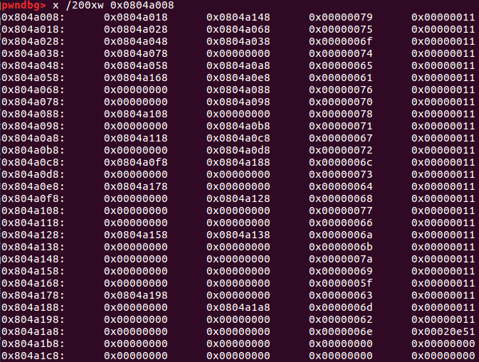

# Forest

This is a level 4, 200-point reverse engineering problem from PicoCTF2017. Here's the problem description:

  I was wandering the forest and found a [file](./forest). It came with some [string](./string.txt)

The executable for this problem is a 32-bit Linux ELF binary. The string is a combination of `L`, `R` and `D` characters that appear to be some sort of recipe for unlocking the flag.

Running `strings` on the file also shows one curious string, `yuoteavpxqgrlsdhwfjkzi_cmbn`, which gets accessed early in the process. Taking a look at the executable in `IDA Pro` shows that a function at 0x08048607 gets called recursively, so given the name of that problem, that function probably produces the forest, and understanding how it works is the key to solving the problem. I'll call the function at 0x08048607 `forest` because when I was solving the problem, I didn't know what it did and the name of the problem was as good as any.

An initial function at 0x0804873e (identified by `IDA Pro` as `main`) parses `yuoteavpxqgrlsdhwfjkzi_cmbn` one character at a time, passing each characters into `forest` via separate function calls. `forest` also takes in a pointer that may be null, and a character. When the first character (`y`) is passed in, the pointer argument is null, a 12-byte data structure that I'll call `node` gets `malloc`'ed, with `node[0]` and `node[1]` initialized to 0, and `node[2]` containing the character. Next, `u` gets passed into the function at 0x08048607 along with the pointer to `node`. `node[2]` is accessed to retrieve `y`, the byte value of `u` is compared to the byte value of `y`, and since it's less, the function at 0x08048607 gets called again recursively, passing as arguments `node[0]` and `u`. `node[0]` is null, so a new node gets `malloc`ed, `u` is stored inside, and when the address of this new node is returned to `forest+8e`, the pointer to this new node is stored in `node[0]`. Reading through the code that is run when the byte value of the current character is greater than or equal to the byte value of the previous character, the call is the same except the return value gets stored in `node[1]`. That is enough information for me to figure out that the letters in the input string are getting assembled into a binary tree. I placed a breakpoint at 0x8048760 (right after `yuoteavpxqgrlsdhwfjkzi_cmbn` is processed), and took a look at the heap:

It's possible to reassemble the forest from this diagram. At that point the recipe provided in [string.txt](./string.txt) makes sense: `D` means "done", `R` is "go right" and `L` is "go left". At that point I could have written a Python program to generate the flag from the input string, but given there were a maximum of 27 unique characters to parse, I found it just as fast to use find and replace in a text editor. The recipe produces the following flag for me:

    you_could_see_the_forest_for_the_trees_ckyljfxyfmsw

I didn't actually run the program with the flag, I just submitted it at that point and solved the problem.

 ### Comparison to Other approaches

[Robert Meade](https://github.com/MeadeRobert/PicoCTF2017/tree/master/reverse_engineering/level4/forest) used decompilers to reproduce the original C code, creates the binary tree in C, and parses it automatically with some Python code.

[This write-up](https://github.com/theKidOfArcrania/picoCTF-2017-Writeups/tree/master/Reverse%20Engineering/Forest%20%5B200%20points%5D) also provides the disassembled source code.
