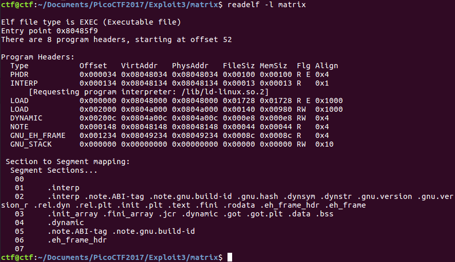
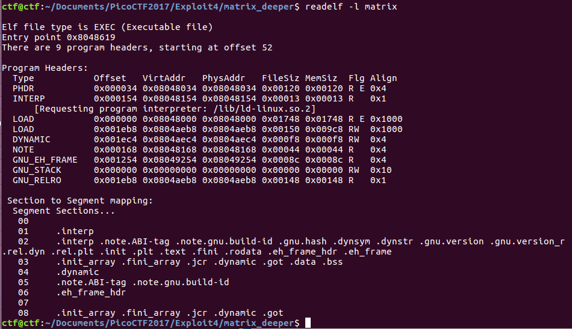
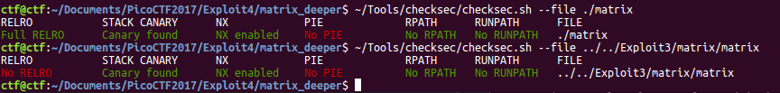
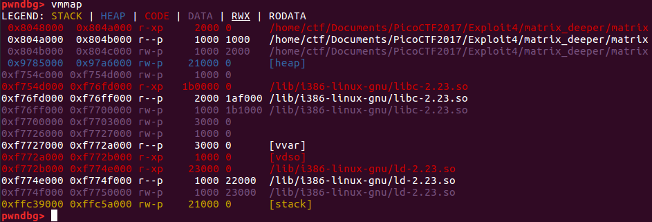
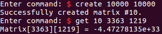
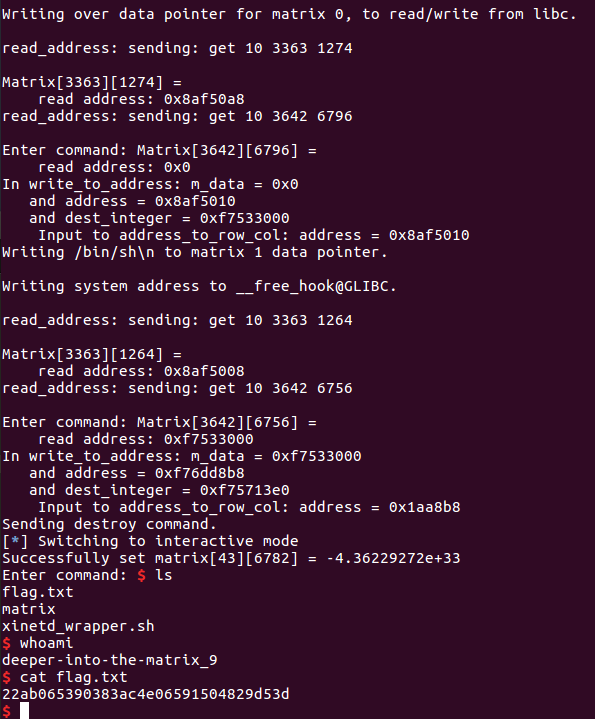
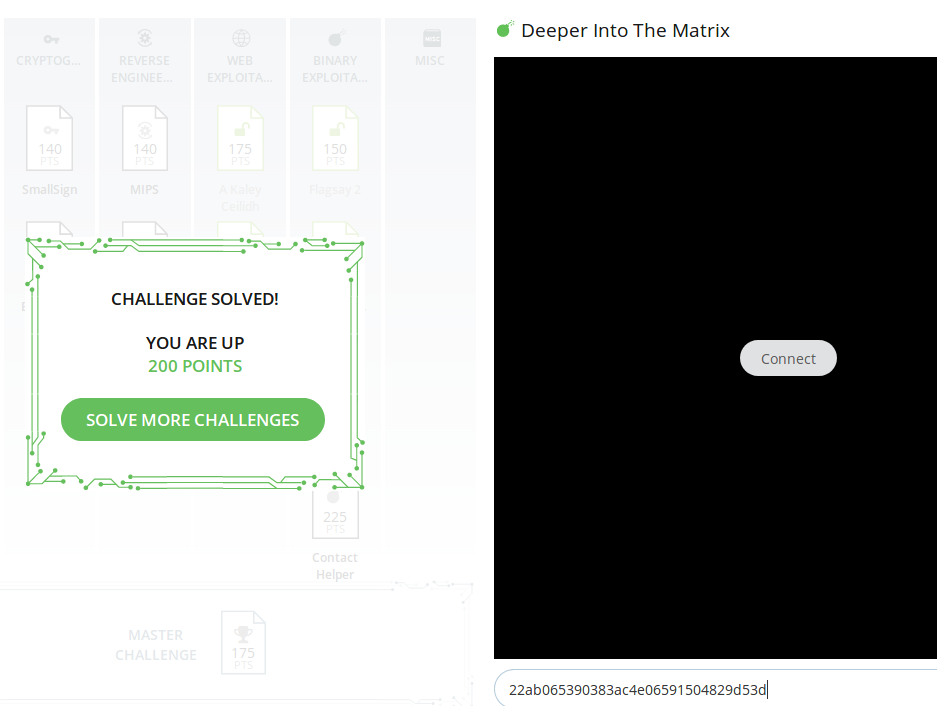

# Deeper Into the Matrix

This is a 200-point, level 4 binary exploitation problem for PicoCTF2017. "[Enter the Matrix](https://github.com/Sudoite/ctf-writeups/blob/master/PicoCTF2017/matrix/EnterTheMatrix.md)" is a level 3 problem that involves exploiting a for loop that is improperly indexed in order to read from and write to locations outside an array. Here's the description for this challenge:

    Flaws in the matrix have been corrected, and now you must dive deeper to discover its secrets.

The challenge includes a binary, but no C code. Presumably, most of the C code for the Level 3 challenge still applies -- but maybe not. It taught me some useful skills concerning floating point representation, memory allocation in `x86`, what full `RELRO` is and how to bypass it, and useful components of the `libc` address space.

### Reconnaissance

This is a 32-bit ELF binary. Running `string` on the file suggests that the application is quite similar to the original [matrix.c](https://github.com/Sudoite/ctf-writeups/blob/master/PicoCTF2017/matrix/matrix.c), so I started by reviewing the source code for that problem.

Without C code, we're expected to just run the binary. I opened it up with IDA Pro first. I thought about installing a plug-in to diff two ELF binaries, but it's fast enough to just compare the two files in this case, and I'm still getting used to IDA Pro so I wanted to start by practicing reading assembly using the tool. The `main` and `handle_command` functions are exactly the same. I want to start by making sure that functions such as `handle_create`, which I would expect to be the same, really are. That would allow me to reliably read the C code I already have for most functions. Okay, `handle_create` is the same, as expected. `handle_destroy` is the same. `matrix_info` is the same. `handle_print` is the same. `handle_list` is the same. Now since `handle_create` is the same in both binaries, I can infer that the structure of the `struct matrix` is the same in both binaries:

    struct matrix {
        int nrows, ncols;
        float * data;
    }

A careful look at the assembly for the `handle_get` function in the two binaries shows that the revised `matrix` binary has replaced line 112 with the following:

    INFO("Matrix[%d][%d] = %.9g", r, c, m->data[r * m->ncols + c]);

which is the correct indexing into the matrix. What about `handle_set`? Yep, same thing: line 124 has been replaced with:

    m->data[r * m->ncols + c] = v;

`usage` is the same. `get_matrix` and `find_free_index` are the same. `bye` is the same.

The only other lines that are different are in `main`, when data are read in. In the original `matrix` we have:

    0x080485dc push    ds: __bss_start  ; stream

whereas in the new `matrix` we have:

    0x080485fc push    ds:stdin@@GLIBC_2_0 ; stream

That suggests to me that some aspect of the running process may be writable in the latest version of `matrix` but not in the previous version.

Indeed, the segments are slightly different:

vs.

Notice that `GNU_RELRO` appears in the case of the present problem. That looks like a clue.

So I made use of Tobias Klein's [checksec](http://tk-blog.blogspot.com/search/label/checksec.sh) tool:

Yep, the current problem uses full RELRO protection, meaning the GOT is now read-only! So the challenge now is to find another bug, and then somehow bypass RELRO.

Some more investigation shows that neither the heap nor the stack are executable:

That suggests that I may need to leak a `libc` address and then use return-oriented programming to get a shell!

Next, I got stuck. The PicoCTF problem provides two hints:

    1. Sometimes a NULL pointer can be useful.

    2. The GOT is protected now - you'll have to find
       something else to attack.

I've already figured out that the application uses full `RELRO`, and I looked around for any NULL pointers that I could use or generate. I had considered way back in the original Matrix problem that it was odd that the matrices could be so giant, and perhaps I could force `calloc` to return a NULL pointer by allocating too much memory. But with 512 matrices of 10,000 x 10,000 floats, each four bytes in size, I had thought that amounts to 0xaf080000 bytes, which would fit into process memory as shown above. So I had dismissed the idea of allocating too many bytes of memory as impossible, without actually trying to get a null pointer. My error was that I arrived at 0xaf080000 by typing `p /x 4*10000*10000*512` into my `gdb` prompt, but did not realize that `gdb` will overflow the results. In fact, some back-of-the-envelope math in Python shows that the real number is somewhere around 2^37, which means that around 15-20 allocations of matrices of maximum size should yield a null pointer.

Now really stuck, I took a look at the first part of a write-up by [in-s-ane](https://github.com/in-s-ane/picoctf-2017/tree/master/Deeper-Into-The-Matrix_200). He follows the same approach (with the exception of using Hex-rays to get pseudocode straight from the binary functions). But he notes that he thinks `calloc` should be exploitable to return NULL. At that point I realized my earlier mistake.

Also, it's worth pointing out (for other problems) that even if a series of matrices of maximum size were to neatly fit into memory, we still could potentially break things by fragmenting the memory -- creating unusable holes in the heap by allocating space for slightly smaller matrices, destroying every other matrix, then creating new, larger matrices. Lesson learned.

So what could I do with a null pointer returned by `calloc`? Well, if `m->data` is NULL, `m->nrows` is 10000 and `m->ncols` is 10000, then I could write to any address between 0 and 0x17d78400. That includes the `.bss` section, which contains the pointers in the `matrices` array. The stack is also writable. So I can leak a `libc` address by reading from the GOT. Then, if I can leak a stack address, I can pivot from `handle_set` to an address on the heap, then use ROP to set up a call to `system`. With that approach I'd need to leak stack, heap, and libc addresses. Heap and libc addresses are easy to find, but the stack is less straightforward.

There's a section of about 0x1000 bytes in libc that can be written to, so I just displayed it with `gdb`, looking for pointers to the stack. I did find one, labeled `<tzname>`, which contains a pointer to the application name, stored on the stack. Displaying what is in that `libc` address can thus give me a stack address, and I figured I would need to then use that stack address to display a few more stack addresses before I could be certain where the return address from `handle_set` will be stored, in order to overwrite it and then get a solution using ROP. Okay, at this point I thought I had a road map to the solution. Progress!

### Understanding calloc

I found it useful, during this problem, to understand a bit more clearly how large amounts of memory are allocated by `glibc`. Let's say we want to allocate a matrix that's 10,000 rows and 10,000 columns using `calloc`. We know that we literally need 10,000 * 10,000 * `sizeof(float)` = 10,000*10,000*4 = 0x17d78400 bytes. But the actual `size` field for the chunk that ultimately gets allocated is 0x17d79002. Where does this number come from? Well `calloc` will try to `malloc` 0x17d78400 bytes, `malloc` discovers no available fastbins, smallbins or largebins to cover that requested size, and the topchunk is also much closer to the current end of the heap than would allow for a chunk to be allocated without moving the topchunk. Therefore, `malloc` calls `sysmalloc`, which checks if it's possible to map memory using `mmap` for this chunk. The answer is yes, so we round up the requested size to be a multiple of the page size -- 4096 bytes. That's how 0x17d79000 bytes end up getting allocated. `malloc` then sets the `M` flag for the page size to indicate that it's memory mapped, and the `U` flag to indicate that the previous chunk is in use is set to 0. (I believe, but I'm not completely sure, that that's because the `U` flag is always zero for `mmap`ped chunks. In addition, 4 bytes are to the size of the chunk because it can't be assumed that the `prev_size` field of the following chunk in memory is usable. We're not really on the heap any more, we're in shared memory that could be used by other programs, so who knows what the next four bytes after the end of the current chunk may contain.)

### Leaking a libc Address

After creating 10 matrices of size 10,000 x 10,000, there is no remaining memory to map the data for the final matrix, so `calloc` returns a null pointer. The location of `printf` in the GOT is at address 0x0804afcc, so by passing in the command `get 10 3363 1219`, I printed the contents of address 0x0804afcc to the screen as a float:

One lesson learned here: if I didn't wait long enough between sending requests to create a new matrix, the application spawned a new thread, which assigned a new arena to the new thread. That causes the attack to fail, because the m->data pointers are then in an address higher than 0+10000*10000*4.

### Trying (and Failing) to Leak a Stack Address

I tried reading the stack address contained in the writable portion of `libc`, but it turns out that if an address is something very high in the stack (like 0xfff531c6 in this case), then the number, in float format, is `-nan`. That's a huge problem because the output is just 0xffc00000 for any hex value greater than 0xffc00000. Overwriting the return address for `handle_get` is therefore going to be tricky. I also can't write any hex value that converts to `nan` or `-nan`. Although I don't actually need to ever write a stack address, I only need to write to a stack address.

I'm probably going about this the wrong way and should consider a different line of thought. At this point I took another hard look at everything else that was writable in memory, and considered possibly overwriting the function pointers to `stdin` or `stdout` in the .bss section -- but neither of these was useful because in any case I need both of these functions to be intact in order to make use of a shell.

I finally decided that most likely I needed to learn something new to continue, and referred back to in-s-ane's blog. It turns out that there are [writable hooks](https://www.gnu.org/software/libc/manual/html_node/Hooks-for-Malloc.html) to `malloc`, `calloc` and `free` in libc! I had no idea about hooks, that's a great lesson to learn.

### Final Steps

At that point I was able to call `system`, but the call was simply exiting and I could not get a shell. I wasn't sure if the problem might be the fact that two parameters were technically on the stack but `system` only uses one, or if it was something else. So I stepped deep into the assembly code, read the source code for `system.c`, disassembled a 32-bit and 64-bit version of libc with IDA Pro and compared a working 64-bit exploit to this 32-bit exploit (for practice. I found that this application was failing to fork a child process. I inferred that the reason was due to lack of memory -- of course, there's no memory available to fork another process after I've deliberately memory-mapped nearly the entire 32-bit address space! So I deleted several large matrices before trying to call `system`, and was able to get a shell locally.

### Comparison to Other Solutions

In this problem I was able to overwrite a libc address by first overwriting the `m->data` pointer for a currently-allocated matrix. [Another way](https://github.com/in-s-ane/picoctf-2017/tree/master/Deeper-Into-The-Matrix_200) to accomplish the same thing is to change `ncols` and `nrows` to be even larger. In retrospect I prefer that approach, as it is more elegant.
