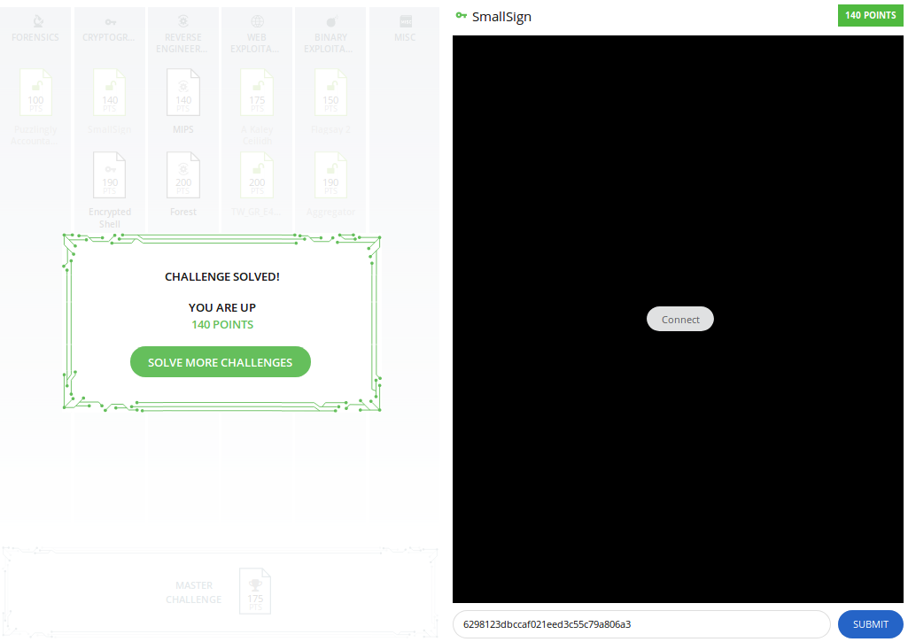

# Smallsign

This was a level 4 cryptography problem for PicoCTF 2017.

### Problem Description

This is a challenge to forge an RSA signature using a chosen plaintext attack. The player is given `N` (a 2048-bit number), `e`, and 60 seconds to forge the signature of a challenge message, which is a 32-bit long. The player can submit as many of their own messages as desired before time runs out, each of which will be signed with the server's key. The player then gets the flag if he or she is able to correctly submit to the server the signature of the challenge. [Here's](./smallsign.py) the code that was running on the server.

### Solution

RSA digital signatures are calculated as `m^d mod N`, where `m` denotes the message, `d` is the private key, `^` denotes exponentiation and `N` is `p*q` in the public key. The solution to this problem stems from the fact that if I factor `m` into its prime factors, then I can take each of those prime factors `m'`, compute `m'^d mod N`, and then multiply those signatures together to get the signature of `m` because `(a*b)^d mod N = a^d*b^d mod N`. The only catch here is that I can only get a set of signatures _before_ knowing the challenge number `m`. To solve the problem, I take advantage of the fact that a large number of numbers out there are smooth, meaning that they are a product of relatively small primes.

A `B`-smooth number is a product of primes less than `B`. Crandall and Pomerance (_Prime Numbers: A Computational Perspective, 2nd Edition_: 264-265) show that the probability that an integer _x_ in the range `[0,n]` is `B`-smooth can be approximated by `u^(-u)`, where `u = ln(n)/ln(B)`. In the present case, with `n=2^32`, then if `B=1300` then the probability that a given integer less than `2^32` will be `B`-smooth is about `0.03`. That means that I can start by calculating all prime numbers less than 1300 with the [Sieve of Eratosthenes](https://iamrafiul.wordpress.com/2013/04/28/sieve-of-eratosthenes-in-python/), sign all 211 of them (a process that takes much less than a minute), then ask for a challenge number. Every 33 or so attempts, I would expect to correctly forge a signature.

[Here's](./exploit-smallsign.py) the Python code that implements the solution.

Here's the flag:

Hooray!

### Comparison with Other Approaches

[Valar Dragon](https://hgarrereyn.gitbooks.io/th3g3ntl3man-ctf-writeups/content/2017/picoCTF_2017/problems/cryptography/Small_Sign/Small_Sign.html) takes the same approach and puzzles through what the optimum value of `B` would be to arrive at a solution as efficiently as possible. They arrive at a differential equation that they were unable to solve. Pretty interesting.
