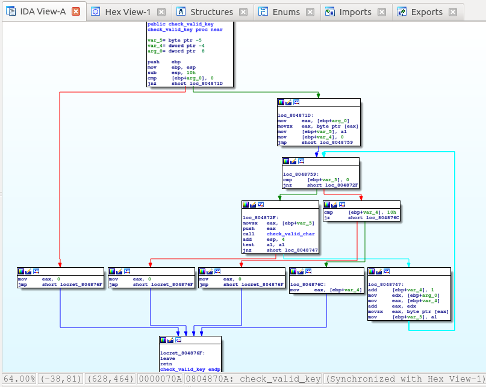
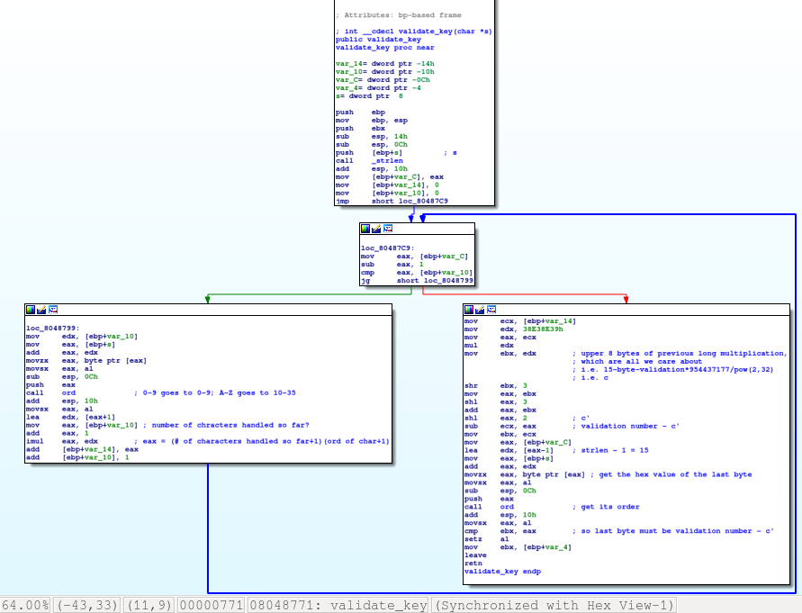

# keygen-me-1

This was a 400-point reverse engineering problem from PicoCTF 2018.

### Problem Description

Can you generate a valid product key for the validation [program](./activate)?

### Solution

I solved this problem using IDA Pro because it was October 2018, although nowadays I might reverse it with Ghidra to quickly get the decompiled C code.

This is a product activation program.

There are some important functions to understand. Let's start with the code to check that an input string is valid, followed by the code to check that it's a correct one.

Here is the code to determine if a key is valid:

`[ebp+var_4]` is a counter referencing the current character in a string that has been inputted by the user. The string has to be 16 characters long. If `check_valid_char` returns `0`, a character is valid. If all 16 characters are valid, this function returns the number `16`; otherwise, it returns `0`.

`check_valid_char` is what I have named the function at `0x08048686`, which checks that a character is valid:

A character is valid (i.e. the function returns `0`) if it lies in the interval [`0x30`, `0x39`] or in the interval [`0x41`, `0x5a`]. These correspond to the ASCII codes for numbers and capital letters.

Here's the function to validate a key:

