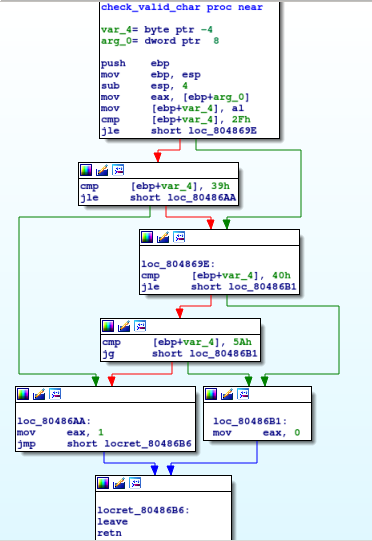

# keygen-me-1

This was a 400-point reverse engineering problem from PicoCTF 2018.

### Problem Description

Can you generate a valid product key for the validation [program](./activate)?

### Solution

I solved this problem using IDA Pro because it was October 2018, although nowadays I might reverse it with Ghidra to quickly get the decompiled C code.

This is a product activation program.


There are some important functions to understand. Let's start with the code to check that an input string is valid, followed by the code to check that it's a correct one.

Here is the code to determine if a key is valid:


`[ebp+var_4]` is a counter referencing the current character in a string that has been inputted by the user. The string has to be 16 characters long. If `check_valid_char` returns `0`, a character is valid. If all 16 characters are valid, this function returns the number `16`; otherwise, it returns `0`.

`check_valid_char` is what I have named the function at `0x08048686`, which checks that a character is valid:



A character is valid (i.e. the function returns `0`) if it lies in the interval [`0x30`, `0x39`] or in the interval [`0x41`, `0x5a`]. These correspond to the ASCII codes for numbers and capital letters.

Here's the function to validate a key:


There's a lot going on in this function -- any more and I would not have been able to capture it with a single screenshot.

`[ebp+var_c]` contains the length of the input string, which we know must be 16. `[ebp+var_10]` is an index into the string, which starts at `0`. For a valid key, the left-hand section of code happens 15 times, and the right-hand section happens just once. `[ebp+var_14]` stores an integer that gets initialized to `0` and which gets used during the validation process. I'll call it `checksum`. On the left, each character gets passed through the `ord` function (not shown), which converts a character with value `0-9` to the number 0-9, and a character with ASCII value `0x41-0x5a` (i.e. A-Z) to the number 10-35. We multiply the string index by the result of `ord` and add it to `checksum` with each pass through the left-hand box.

Then, on the last pass, the rightmost box does the equivalent of the following:

```
c = checksum * 954437177 >> 32
c_prime = (c - c%8 + (c >> 3))*4
result = checksum-c_prime
```
The activation key is valid if `result = ord(X)`, where X is the last letter in the input string. In other words, the first 15 characters can be any valid character, and the last one has to be a specific character. I could just try a number of activation keys via brute force, but I wrote a [Python script](./reverse-keygen-me.py) to calculate the last character. With an input string of "ABCDEFABCDEFABCD", the script shows that the last character must have an `ord` of `0xa`, i.e. it must be an ASCII 'A'. I passed the string "ABCDEFABCDEFABCA" into `keygen-me` on the server and got the flag: `picoCTF{k3yg3n5_4r3_s0_s1mp13_749501403}`.

### Comparison to Other Approaches

[Dvd848](https://github.com/Dvd848/CTFs/blob/master/2018_picoCTF/keygen-me-1.md) basically uses the same approach that I did, except with Radare. [pwnthem0le](https://pwnthemole.github.io/reverse/2018/10/18/PicoCTF2018-KeyGen1.html) notices that the rightmost box in the function I've called `validate_key` actually computes `checksum % 36` (which the author notes they noticed by stepping into the function with `gdb`). This is where a decompiler such as Ghidra would be particularly useful -- I recognized that the use of the magic number `954437177` combined with shifting probably corresponded to some sort of modulo operation, but decided not to try and reverse it, opting for simply doing the computation in Python. But as a result, I didn't have the insight this author did, that a brute force on the first 15 bytes of the key would definitely work. (I merely had a hunch that it would, which turns out to be true.) Both this write-up and [RoeeSefi](https://github.com/sefi-roee/CTFs-Writeups/blob/master/picoCTF-2018/Reversing/13-keygen_me_1-400/solution.md) reference [this tool](http://www.hackersdelight.org/magic.htm), which lets you calculate the magic number and right shift that correspond to division by a specific integer. But the tool is a one-way function: it doesn't let you get the integer divisor given the magic number and bit shift. So, RoeeSefi must have just guessed that division by 36 was taking place in the code and confirmed it with the tool, an intuition that is not unreasonable given the number of possible characters in the activation key was 36. As far as reversing goes, if I want to identify the divisor for integer division in a reversing problem, so far the best approach seems to be to start with Ghidra and confirm the information that the decompiler is giving with the [hacker's delight](http://www.hackersdelight.org/magic.htm) tool.
