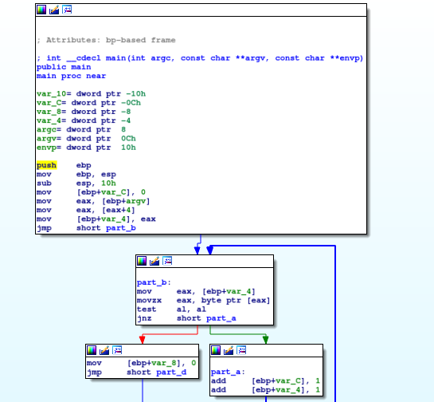
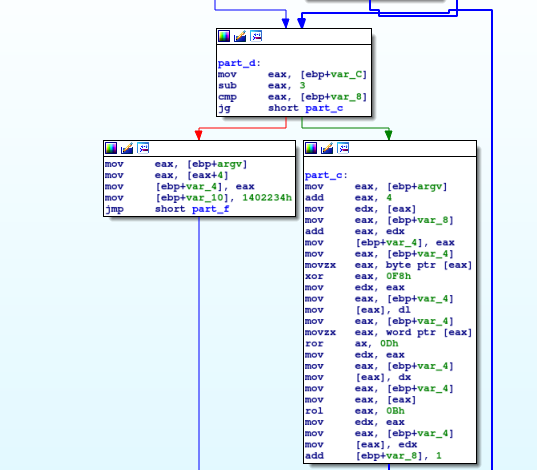
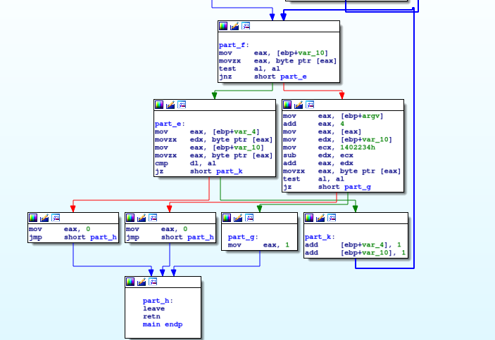

# Special PW

This is a 600-point reverse engineering problem from PicoCTF 2018 (level 3).

### Problem Description

Can you figure out the right argument to this program to login? We couldn't manage to get a copy of the binary but we did manage to dump some machine code and memory from the running process.

```
.intel_syntax noprefix
.bits 32

.global main	; int main(int argc, char **argv)

main:
	push   ebp
	mov    ebp,esp
	sub    esp,0x10
	mov    DWORD PTR [ebp-0xc],0x0
	mov    eax,DWORD PTR [ebp+0xc]
	mov    eax,DWORD PTR [eax+0x4]
	mov    DWORD PTR [ebp-0x4],eax
	jmp    part_b
part_a:
	add    DWORD PTR [ebp-0xc],0x1
	add    DWORD PTR [ebp-0x4],0x1
part_b:
	mov    eax,DWORD PTR [ebp-0x4]
	movzx  eax,BYTE PTR [eax]
	test   al,al
	jne    part_a
	mov    DWORD PTR [ebp-0x8],0x0
	jmp    part_d
part_c:
	mov    eax,DWORD PTR [ebp+0xc]
	add    eax,0x4
	mov    edx,DWORD PTR [eax]
	mov    eax,DWORD PTR [ebp-0x8]
	add    eax,edx
	mov    DWORD PTR [ebp-0x4],eax
	mov    eax,DWORD PTR [ebp-0x4]
	movzx  eax,BYTE PTR [eax]
	xor    eax,0xf8
	mov    edx,eax
	mov    eax,DWORD PTR [ebp-0x4]
	mov    BYTE PTR [eax],dl
	mov    eax,DWORD PTR [ebp-0x4]
	movzx  eax,WORD PTR [eax]
	ror    ax,0xd
	mov    edx,eax
	mov    eax,DWORD PTR [ebp-0x4]
	mov    WORD PTR [eax],dx
	mov    eax,DWORD PTR [ebp-0x4]
	mov    eax,DWORD PTR [eax]
	rol    eax,0xb
	mov    edx,eax
	mov    eax,DWORD PTR [ebp-0x4]
	mov    DWORD PTR [eax],edx
	add    DWORD PTR [ebp-0x8],0x1
part_d:
	mov    eax,DWORD PTR [ebp-0xc]
	sub    eax,0x3
	cmp    eax,DWORD PTR [ebp-0x8]
	jg     part_c
	mov    eax,DWORD PTR [ebp+0xc]
	mov    eax,DWORD PTR [eax+0x4]
	mov    DWORD PTR [ebp-0x4],eax
	mov    DWORD PTR [ebp-0x10],0x1402234
	jmp    part_f
part_e:
	mov    eax,DWORD PTR [ebp-0x4]
	movzx  edx,BYTE PTR [eax]
	mov    eax,DWORD PTR [ebp-0x10]
	movzx  eax,BYTE PTR [eax]
	cmp    dl,al
	je     part_k
	mov    eax,0x0
	jmp    part_h
part_k:
	add    DWORD PTR [ebp-0x4],0x1
	add    DWORD PTR [ebp-0x10],0x1
part_f:
	mov    eax,DWORD PTR [ebp-0x10]
	movzx  eax,BYTE PTR [eax]
	test   al,al
	jne    part_e
	mov    eax,DWORD PTR [ebp+0xc]
	add    eax,0x4
	mov    eax,DWORD PTR [eax]
	mov    edx,DWORD PTR [ebp-0x10]
	mov    ecx,0x1402234
	sub    edx,ecx
	add    eax,edx
	movzx  eax,BYTE PTR [eax]
	test   al,al
	je     part_g
	mov    eax,0x0			; LOGIN_FAILED
	jmp    part_h
part_g:
	mov    eax,0x1			; LOGIN_SUCCESS
part_h:
	leave
	ret


01402234:  7b 18 a6 34 d9 3c 2d a3  ff ce 86 ab 92 fb 9a 42   |{..4.<-........B|
01402244:  8b 32 a3 aa fb 96 8a 3b  42 a3 fa 86 82 bb 26 c3   |.2.....;B.....&.|
01402254:  ba 0e 32 ca ea 63 0c 5b  00                        |..2..c.[.|
```

### Solution

Well, at first glance it looks like I can simply go backwards through the assembly simply enough, but maybe I can just compile it and then reverse it with `IDA Pro`. I mean, I could probably do even better with `Ghidra` for this, but `Ghidra` wasn't around in October 2018 and I want to give myself the same challenge as would have been present at the time.

Okay, here's the compiled code reversed with `IDA Pro`:







In `part_f`, `0x1402234` attempts to get dereferenced, and that refers to the 40-character string given to the user along with the problem. Basically, looking at `part_e`, `part_f` and `part_k`, the operations in `part_c` should take the input string and turn it into the string at `0x1402234`. I can probably reverse engineer this string with a Python program.

So, the way `part_c` works, the first byte of the input gets `xor`ed with `0xF8`, then the bits of the first two bytes get rotated right by 13 bytes, then the bits of the first four bytes get rotated left by 11 bytes. We then move up a byte and repeat the process. Reversing turned out to be tricky for my in Python because I was teaching myself how to handle string encoding and decoding in Python 3 (migrating from Python 2) while addressing the fact that due to endianness, bytes get reversed when a string gets read as an integer or short. Here is the resulting code:

```python3
# Program to reverse special_pw
# By Sudoite
import binascii

result = "\x7b\x18\xa6\x34\xd9\x3c\x2d\xa3\xff\xce\x86\xab\x92\xfb\x9a\x42"
result += "\x8b\x32\xa3\xaa\xfb\x96\x8a\x3b\x42\xa3\xfa\x86\x82\xbb\x26\xc3"
result += "\xba\x0e\x32\xca\xea\x63\x0c\x5b\x00"

def byte_to_bitstring(s):
	tmp = hex(ord(s))[2:]
	if len(tmp) % 2 != 0:
		tmp = '0' + tmp
	return tmp


def to_bitstring(s, index, n_bytes):
	result = ''
	tmp = s[index:index+n_bytes]
	tmp = ''.join(byte_to_bitstring(c) for c in tmp[::-1]) # flipping the string around because of endianness
	tmp = bin(int(tmp,16))
	tmp = tmp[2:]
	tmp = "0"*(n_bytes*8 - len(tmp)) + tmp
	return tmp


def rotright(s, m):
	n = len(s)
	result = ['x']*n
	for i in range(len(s)):
		result[(i + m)%n] = s[i]
	return(''.join(result))


def rotleft(s, m):
	n = len(s)
	result = ['x']*n
	for i in range(len(s)):
		result[(i - m)%n] = s[i]
	return(''.join(result))


def from_bitstring(s):
	tmp = hex(int(s,2))[2:]
	if len(tmp)%2 != 0:
		tmp = "0" + tmp
	tmp = binascii.unhexlify(tmp.encode('unicode_escape'))
	tmp = tmp.decode('unicode_escape')
	return tmp


def string_replace(s,index,r):
	result = ''
	result += s[0:index]
	result += r[::-1] # because the string gets treated as an int or short, hence we have to deal with endianness
	result += s[index+len(r):]
	return result


def reverse_one_round(s, index):
	tmp = to_bitstring(s, index, 4)
	tmp = rotright(tmp, 0xb)
	s = string_replace(s, index, from_bitstring(tmp))
	tmp = to_bitstring(s, index, 2)
	tmp = rotleft(tmp, 0xd)
	s = string_replace(s, index, from_bitstring(tmp))
	tmp = ord(s[index])
	tmp = tmp ^ 0xf8
	s = string_replace(s, index, chr(tmp))
	return s


def reverse_string(s):
	for i in range(len(s)-5,-1,-1):
		s = reverse_one_round(s, i)
	return s
print("result: " + reverse_string(result))
```

The flag is `picoCTF{gEt_y0Ur_sH1fT5_r1gHt_007d87af9}`.


## Comparison to Other Approaches

The four write-ups on CTFTime all use the same general approach. I learned some useful programming techniques from some of these write-ups. First, [Dvd848](https://github.com/Dvd848/CTFs/blob/master/2018_picoCTF/special-pw.md) makes use of the `ror` and `rol` functions in Pwnlib, and also directly pastes data into a byte array (I did not realize that was possible). [Nine Inch Nulls](https://ctftime.org/writeup/11965) and [Mithreindeir](https://github.com/Mithreindeir/ctf-writeups/tree/master/pico-ctf2018/special-pw) provide solutions in C.
