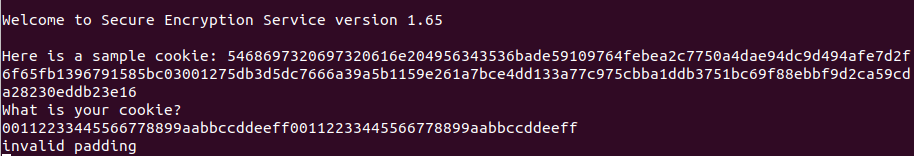
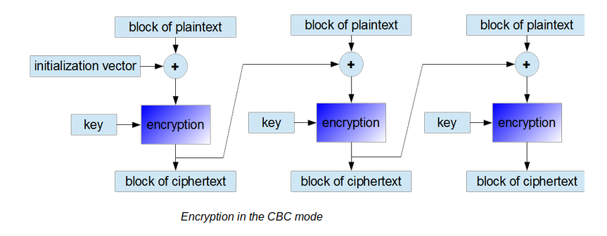
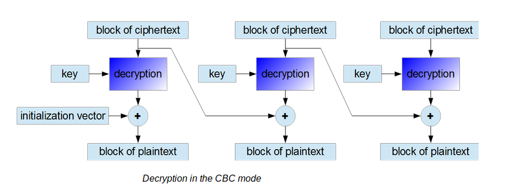
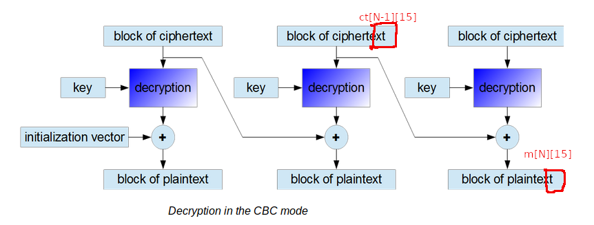
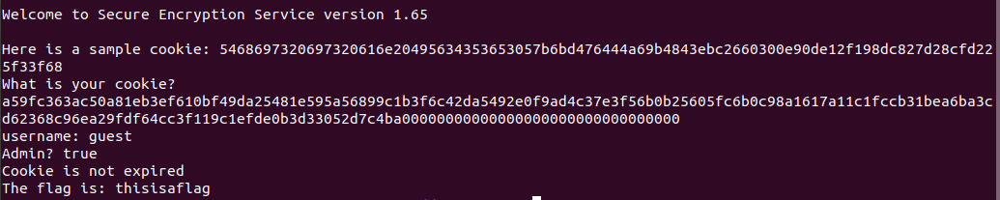
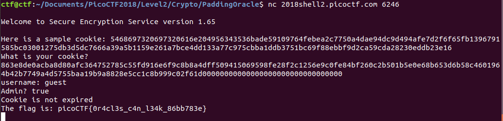

# Magic Padding Oracle

This is a 450-point cryptography challenge from PicoCTF 2018. The highest point value for a challenge was 900, but this problem got the second fewest number of solves -- about 250.

### Problem Description

Can you help us retreive the flag from this crypto service? Connect with `nc 2018shell.picoctf.com 6246`. We were able to recover some [Source](./pkcs7.py) Code.

This is very obviously a padding oracle vulnerability on a problem with PKCS7 padding, and so the challenge is more about how to exploit such a vulnerability than how to recognize one. A hint also points to a [useful](https://blog.skullsecurity.org/2013/padding-oracle-attacks-in-depth) blog post on using padding oracles. A teammate also referred me to [this](https://cryptopals.com/sets/3/challenges/19) practice problem.

### Reconnaissance

Here is some sample interaction with the server:



Here's the relevant code concerning how the server handles the user's cookie:

```
# Get their cookie
print "What is your cookie?"
cookie2 = sys.stdin.readline()
# decrypt, but remove the trailing newline first
cookie2decoded = decrypt(cookie2[:-1])

if isvalidpad(cookie2decoded):
   d=json.loads(unpad(cookie2decoded))
   print "username: " + d["username"]
   print "Admin? " + d["is_admin"]
   exptime=time.strptime(d["expires"],"%Y-%m-%d")
   if exptime > time.localtime():
      print "Cookie is not expired"
   else:
      print "Cookie is expired"
   if d["is_admin"]=="true" and exptime > time.localtime():
      print "The flag is: " + flag
else:
   print "invalid padding"
```

### Solution: Decryption

There were two steps to this problem: decrypting the server cookie and encrypting a fake cookie. First of all, the user is able to get back two different inputs from the server based on whether the submitted cookie contains valid padding. If the padding is not valid, the user will see an "invalid padding" message as per above. Otherwise, there will probably be some kind of Python error from the JSON parser after the decrypted cookie gets parsed (because the decrypted cookie is probably gibberish in most cases where the user is merely submitting a guess). But the Python error is actually useful information. Here's an example error message:

```
File "/problems/magic-padding-oracle_2_aaaaaaaaaaaaaaaaaaaaaaaaaaaaaaaa/pkcs7.py", line 47, in <module>
    d=json.loads(unpad(cookie2decoded))
File "/usr/lib/python2.7/json/__init__.py", line 339, in loads
		return _default_decoder.decode(s)
File "/usr/lib/python2.7/json/decoder.py", line 364, in decode
		obj, end = self.raw_decode(s, idx=_w(s, 0).end())
File "/usr/lib/python2.7/json/decoder.py", line 380, in raw_decode
		obj, end = self.scan_once(s, idx)
ValueError: Unterminated string starting at: line 1 column 14 (char 13)
```

I started by decrypting the sample cookie to determine what it contains. Instead of reading through the blog referenced by the hint, I just referred to Dan Boneh's excellent description of how to use a padding oracle in Week 2 of his Cryptography I course on Coursera.

This problem uses AES in CBC (cipher-block chaining) mode. Here are some diagrams from [this] blog for encryption and decryption using cipher-block chains:





I'm going to skip over a description of how cipher-block chaining works and just let the diagrams speak for themselves -- for a more in-depth explanation, see Dan Boneh's course.

We don't know the key on the server, and breaking AES without the key is a cryptographically hard problem. So, we use the padding oracle. AES works with 32-byte blocks. To decrypt a particular block of ciphertext in the cookie, first we throw away all of the ciphertext after the block in question. Let's say the last block of ciphertext in the diagram below doesn't correspond to a bock that would decrypt to a plaintext block that would contain padding. The attacker guesses the last byte of the plaintext, `m[N][15]` in the diagram below:



Let's call that guess `g`. The attacker then replaces the last byte of the second-to-last block of the ciphertext, `ct[N-1][15]`, with `ct[N-1][15] ^ g ^ 0x01`, where `^` refers to the `xor` operation. If the guess `g` is correct such that `g == m[N][15]`, then the last block of plaintext in the decrypted modified ciphertext will be `0x01`, which will be valid padding, and for the current problem the attacker would see a Python JSON parser error. Otherwise, the attacker would get an "invalid padding" message, and in this way can determine the value of `m[N][15]`. Next, to guess the second-to-last byte of the last block of the plaintext, the attacker replaces `ct[N-1][15]` with `ct[N-1][15] ^ m[N][15] ^ 0x02` and `ct[N-1][14]` with `ct[n-1][14] ^ g' ^ 0x02`, where `g'` is now a guess for the value of `m[N][14]`. Once again, if `g'` is a correct for `m[N][14]` then the attacker will get a Python JSON parser error from the server, and otherwise the server will return an "invalid padding" message. The procedure continues until the entire ciphertext block is decrypted.

In the case of decrypting the very last block of plaintext in the actual message, however, the procedure is a little trickier because the plaintext can contain padding bytes. As an example, suppose that the attacker replaces `ct[N-1][15]` with `ct[N-1][15] ^ g ^ 0x01`, and receives a Python JSON parser error. Then we know that `ct[N-1][15] ^ g ^ 0x01 ^ D(ct[N][15],key) = m[N][15] ^ g ^ 0x01 == 0x01`. In any case but the last block of ciphertext, we knew that `m[N][15] != 0x01`, so that would tell us that `g == m[N][15]`. But for the last block, we have three possibilities: first, `ct[N-1][15] ^ D(ct[N][15],key) != 0x01` and therefore `g == m[N][15]`. Second, we could have `m[N][15] == 0x01` and `g == 0x01`. But third, we could have `m[N][14] == 0x02`, `m[N][15] == 0x02`, and `m[N][15] ^ g == 0` such that `g == 0x02`. The third possibility would take place with a  probability of `1/256 * 1/16`, assuming that all padding values are equally probable. In this case, a guess of _either_ `0x01` or `0x02` would result in valid padding! In fact there is a non-zero probability of having `g` be any value between `0x01` and `0x16` and yet having the last byte of the decrypted guessed message be `0x01`. But notice that there can only ever be up to two valid guesses for the last byte, regardless of what value the actual padding is. To see this, consider the case where `m[N][13] == 0x03`, `m[N][14] == 0x03`, `m[N][15] == 0x03`, and `m[N][15] ^ g == 0` such that `g == 0x03`. Then a guess of `0x02` would always fail, and that's because `ct[N-1][14]` has not been modified, so the second-to-last byte _must_ decrypt to `0x03`, which would yield improper padding for a guess of `0x02`.

The [blog](https://blog.skullsecurity.org/2013/padding-oracle-attacks-in-depth) that the hint for this problem links to indicates just such a possibility. To solve this, I came up with an algorithm that I think is a little better than the blogger's:

```
# Strategy: There can't be more than two valid guesses for the last byte. If 1 is the only valid guess, the padding byte is 1.
# Otherwise, if there are two valid guesses, the padding byte is probably the one that's not 1
#    but it still could be 1.
#    In this situation, set the number of padding bytes equal to the case for the padding
#       byte not being one, and get all valid guesses for the next byte after the padding.
#       If no valid guesses are returned, the padding byte must be 1.
#       Otherwise, the padding byte is the one that's not 1.
```

And that's it. Once the attacker knows the value of the padding byte (let's call it) `p`, then the last `p` bytes of the message must be equal to `p` and decryption continues with the `16-p`th byte of the last message block, where the attacker knows that byte cannot be between `0x01` and `0x16` and the decryption algorithm reverts to the earlier case outlined by the diagram.

So, I wrote some special code to handle the padding block that implemented the above algorithm and the optimization for deducing the last `p` bytes of the padding block. I figured this out independently of the [Skullsecurity](https://blog.skullsecurity.org/2013/padding-oracle-attacks-in-depth) blog, so that was satisfying.

After the implementation and testing, I got the cookie back (padding included):

`{"username": "guest", "expires": "2000-01-07", "is_admin": "false"}\x0d\x0d\x0d\x0d\x0d\x0d\x0d\x0d\x0d\x0d\x0d\x0d\x0d`

So that's half the problem.

### Solution: Decryption

The other half of the problem required me to submit a valid cookie to the server. Now that I know the JSON format for a cookie, it's easy to forge such a cookie with valid padding: `{"username": "guest2", "expires": "2030-01-07", "is_admin": "true"}\x0d\x0d\x0d\x0d\x0d\x0d\x0d\x0d\x0d\x0d\x0d\x0d\x0d` would work for example. But the solution was unexpectedly tricky for me, since I'd solved a padding oracle problem for Dan Boneh's Coursera course in the past.

[Others](https://crypto.stackexchange.com/questions/68792/how-to-change-the-known-ciphertext-so-the-known-plaintext-is-changed-in-aes-cbc) also appear to have gotten stuck here. The issue was that in many online examples such as [this one](https://crypto.stackexchange.com/questions/67195/alter-plaintext-through-iv-in-block-cipher-aes-in-cbc-mode), very simple chosen ciphertext attacks against CBC encryption just involve flipping a few bits in the IV to change the first block of the message.

My problem was that to change "is_admin": "false" to "is_admin": "true", I would need to modify a ciphertext block that was far into the message and definitely not the IV. That would produce a block of gibberish. I would also need to modify multiple ciphertext blocks. My first intuition was that my modified encrypted cookie did not have to only have six ciphertext blocks as per the original. For example, let's say that I can change `m[N]` to `m[N]'` by computing `ct[N-1]' = ct[N-1] ^ m[N] ^ m[N']`, and prepend `ct[N-1]'` in the modified ciphertext with `ct[N-2]' = ct[N-1]`. That would produce a message containing `m[N-1]`, followed by 16 characters of gibberish, followed by `m[N]'`. In this manner, I could potentially forge a cookie containing valid JSON script by keeping the gibberish enclosed in quotes -- something like "a":"[gibberish]". The problem was that the control that I had over `m[N]'` was not enough to give me any way to forge a valid JSON cookie. That idea might work in other use cases, though, such as ones in which the JSON tokens are short. It has the benefit of allowing the attacker to instantly create a forged cookie after decrypting the server cookie.

I realized at that point that I needed to be able to create forged plaintext blocks that bordered each other, so I looked to the Piazza discussion board for this problem and found a link to [this](https://crypto.stackexchange.com/questions/40312/padding-oracle-attack-encrypting-your-own-message) forum post. The second answer contains an algorithm for forging a cookie using the padding oracle. The basic idea is that once I find the value of `ct[N-1]'` that produces my desired last message block `m[N]'`, I can tack any IV onto the front of those two blocks of ciphertext and use the padding oracle itself to deduce the value of `D(ct[N-1],key)`! Then I can flip more bits on the ciphertext block that is currently the IV and determine the value `ct[N-2]'` necessary to produce `m[N-1]' = ct[N-2]' ^ D(ct[N-1]',key)` for my desired value of `m[N-1]'`. I just continue this procedure until I have encrypted my entire desired ciphertext!

Here's the pseudocode:

```
## To encrypt a message:
## 1. Split it up into desired message blocks
## 2. Create a ciphertext block for the back that can be any value, and a random IV
## 3. Determine the value of the plaintext that would have produced that random message.
##    For this submission I can probably treat it like a message chunk that
##    does not end in padding. In theory the plaintext could accidentally end
##    in something like (0x02, 0x02), so I would need to deal with that when
##    generalizing this into a library function, but for now I'll ignore that edge case.
## 4. Bit-flip the IV to produce the desired plaintext and confirm that I can actually
##    produce the desired plaintext.
##    (This first plaintext needs to contain the padding bytes.)
## 5. The rest I can do in a loop:
##    a. Tack the IV onto the front.
##    b. Decrypt the first ciphertext block after the IV.
##    c. Bit flip the IV to produce the desired plaintext and confirm it works.
```

In fact, a savvy reader of the problem source code could probably deduce what keys and values the forged JSON cookie would need to have, and would not have needed to decrypt the sample cookie at all.

As an aside, I think I had figured out how to do this on my own in Dan Boneh's Cryptography I course, and then forgot about the second application of the padding oracle for encryption. This problem was a helpful review.

With that, I was able to quickly forge a cookie that worked with a local instance of the source code:



And with the test passing, I ran the program overnight and successfully forged a cookie that worked on the remote server:



Hooray! [Here](./use-padding-oracle.py) is the source code, slightly cleaned up but still with plenty of improvements to be made such as refactoring to make the function names simpler and turning the forged message encryption into a function for more general use as a library. With this code as a library, in the future using padding oracles for me will just become an issue of recognizing them in the first place, or even trying to transform a more complex problem into a padding oracle problem (for example, for encrypt-then-MAC problems, finding a way to bypass the authentication first and then solving the rest as a padding oracle problem).

### Comparison to Other Approaches

[Dvd848](https://github.com/Dvd848/CTFs/blob/master/2018_picoCTF/Magic%20Padding%20Oracle.md) uses [`Padbuster`](https://github.com/GDSSecurity/PadBuster) to solve the problem. [Yongun Seong](https://github.com/nevivurn/writeups/blob/master/2018-picoctf/Magic%20Padding%20Oracle/solution.py) wrote his own code to do the decryption, and I liked how elegant it was. I found it a little hard to read because of the iterative nature of some of the `xor`ing he did, but it is very clean.
