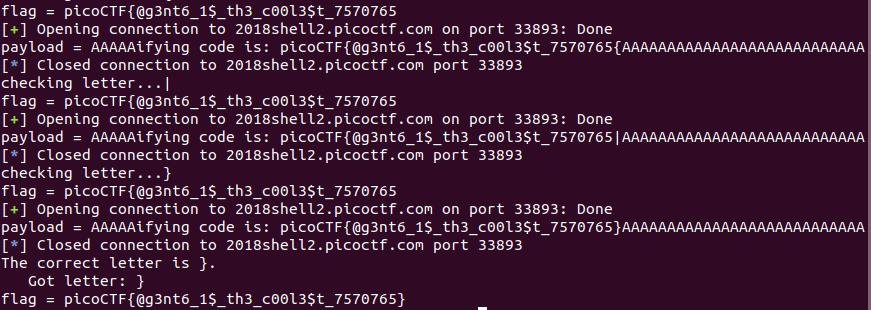

# SpyFi

This is a 300-point cyptography problem from PicoCTF 2018. Despite its relatively low points, it had only 573 solves (the cryptography challenges had few solves in general).

### Problem Description

James Brahm, James Bond's less-franchised cousin, has left his secure communication with HQ running, but we couldn't find a way to steal his agent identification code. Can you? Conect with `nc 2018shell.picoctf.com 33893`. [Source](./spy_terminal_no_flag.py).

### Solution

This problem makes use of AES in Electronic Code Book mode. That takes the same 16-byte blocks and encrypts them all with the same key, meaning that if two blocks of the plaintext are the same, the ciphertext will also be the same. I want to know the value of the `agent_code` variable, and I know the value of the plaintext immediately before that variable: "My agent identifying code is: ". I also can enter a `sitrep` string with a length that I control. That's enough to deduce the agent code one byte at a time. I start by placing the last 16 characters of "My agent identifying code is: " in the `sitrep` string, such that they appear exactly in a block of 16 characters (i.e. the index for the start of this string is a multiple of 16). Next, I compute the additional padding on the end of the `sitrep` string that is necessary in order for the  choosing a `sitrep` string with a length that forces a block of the plaintext to contain the last 16 characters of "My agent identifying code is: " to _also_ exactly occupy a 16-byte block of the plaintext. I confirm that the offsets are correct by making sure that I observe two blocks of ciphertext that are exactly the same.

Next, I remove a character of padding from the end of the `sitrep` string, so that one of the blocks of the plaintext will now contain the last 15 bytes of "My agent identifying code is: " followed by the first byte of `agent_code`. I then remove the last character from the last 16 characters of "My agent identifying code is: " in the `sitrep` string, and replace it with a guessed character. If my guess matches the first byte of `agent_code`, then I will once again get a ciphertext with two identical 16-byte blocks; otherwise, those two blocks will be different. I can repeatedly make guesses until I get the first byte of `agent_code`, then move on to the next byte, and so forth until I guess the entire string (which is of course the flag).

[Here](./break-spify.py) is my exploit code, and here's the flag:

### Comparison to Other Approaches

The other two write-ups on CTF Time used exactly the same approach that I did, although our Python code is of course different.
