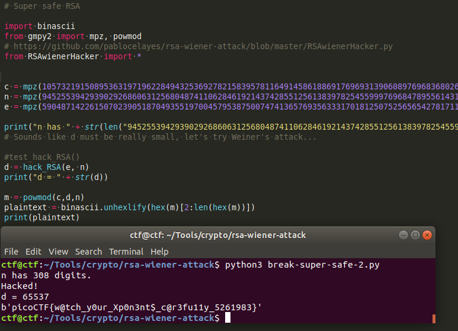

# Super Safe RSA 2

This is a 425-point cryptography problem for Pico CTF 2018.

### Problem Description

Wow, he made the exponent really large so the encryption MUST be safe, right?! Connect with `nc 2018shell.picoctf.com 56543`.

### Solution

This is part of a series involving RSA encryption. The player is presented with three very large numbers for `c`, `n`, and `e`, and must determine `d` in order to compute the message `m`. I considered the fact that perhaps the public and private keys had been switched, such that `d` was small. That would make the problem vulnerable to [Weiner's attack](https://en.wikipedia.org/wiki/Wiener%27s_Attack). The mathematics behind Weiner's attack are also covered in Dan Boneh's Cryptography I course on Coursera. The proof comes down to a demonstration that if `d < 1/3 * N^(1/4)`, then `d` can be computed by finding all the [convergents](https://en.wikipedia.org/wiki/Convergent_(continued_fraction%29) of `e/N`, one of which will be `d/k` for some integer `k`.

I found some code implementing the attack [here](https://github.com/pablocelayes/rsa-wiener-attack/blob/master/RSAwienerHacker.py), then simply imported it and ran the code. Here's a screenshot with the implementation and the flag:

### Comparison to other approaches

There are six solutions on CTF Time, and all but one appear to have used Wiener's attack -- the one that did not involved guessing `d`. [Dvd848](https://github.com/Dvd848/CTFs/blob/master/2018_picoCTF/Super%20Safe%20RSA%202.md) uses a multi-purpose tool called [RSACtfTool](https://github.com/Ganapati/RsaCtfTool) to do the cracking, which is fast but does not provide insight into why it works. [d4rkvaibhav](https://github.com/d4rkvaibhav/picoCTF-2018-Writeups/tree/master/Cryptography/Super%20Safe%20RSA%202) uses the same Python implementation of Weiner's attack that I did. [SAS Hackers](https://tcode2k16.github.io/blog/posts/picoctf-2018-writeup/cryptography/#super-safe-rsa-2) appear to have guessed `d`. [LiuHack](https://github.com/liuhack/writeups/blob/master/2018/picoCTF/Super_safe_RSA2/README.md) used a [script](https://gist.github.com/mananpal1997/73d07cdc91d58b4eb5c818aaab2d38bd) that goes straight to using continued fractions instead of even calling it Wiener's attack, which suggests that the author really understood the method.
