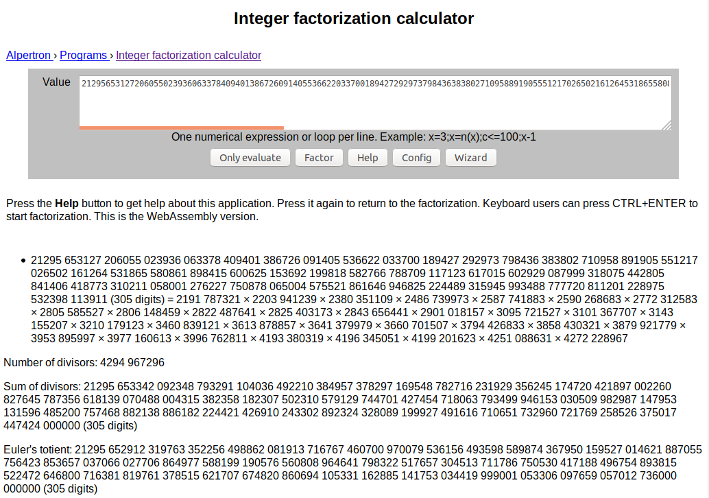
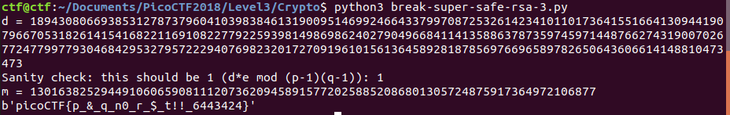
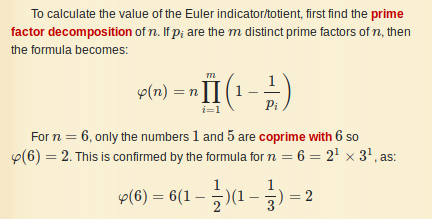

# Super Safe RSA 3

This is a 600-point, level 3 PicoCTF 2018 cryptography challenge.

### Problem Description

The more primes, the safer.. right.?.? Connect with `nc 2018shell.picoctf.com 55431`.

I considered that `n` might be a product of many small prime numbers. I used [this](https://www.alpertron.com.ar/ECM.HTM) online integer factorization calculator and got the following:



Okay, now with `n` factored into multiple small factors, how do I get `d`? I know that prime factorization site gives me Euler's totient which is `(p-1)(q-1)` and I know that `e*d = 1 mod (p-1)(q-1)`, so maybe I'm already done. That feels like cheating, though, and even if I solve the problem this way I still want to use the small primes themselves, and not that website, to get `d`.

That gives me the flag:



And here's the script for that:

```python
# break-super-safe-RSA-3
# by Sudoite

import binascii
from gmpy2 import mpz, powmod, invert, mul

c = mpz(12867719518936827932778557122811476146700840099186423511226077470913445647426374471760885540824893256101790504134040849851415843361648879835113293833708447861234018703921463720842515145946501295055003066514549631077073436092258612763654431758290302164030734355128355180317454131790133946417735427852349358)
n = mpz(21295653127206055023936063378409401386726091405536622033700189427292973798436383802710958891905551217026502161264531865580861898415600625153692199818582766788709117123617015602929087999318075442805841406418773310211058001276227750878065004575521861646946825224489315945993488777720811201228975532398113911)
e = mpz(65537)

totient = mpz(21295652912319763352256498862081913716767460700970079536156493598589874367950159527014621887055756423853657037066027706864977588199190576560808964641798322517657304513711786750530417188496754893815522472646800716381819761378515621707674820860694105331162885141753034419999001053306097659057012736000000000)

d = invert(e, totient)
print("d = " + str(d))
d = mpz(18943080669385312787379604103983846131900951469924664337997087253261423410110173641551664130944190796670531826141541682211691082277922593981498698624027904966841141358863787359745971448766274319007026772477997793046842953279572229407698232017270919610156136458928187856976696589782650643606614148810473473)

m = powmod(c,d,n)
test = mul(d,e) % totient
print("Sanity check: this should be 1 (d*e mod (p-1)(q-1)): " + str(test))
print("m = " + str(m))
print(binascii.unhexlify(hex(m)[2:]))
```

Okay, now just for my own edification, I want to figure out Euler's totient given those small primes.

### Additional Research

That Alpertron factorization site uses the [Elliptic-Curve Factorization Method](https://en.wikipedia.org/wiki/Lenstra_elliptic_curve_factorization) (ECM), which appears to work for factors up to about 60 digits in length.

[Here's](https://www.dcode.fr/euler-totient) a description of how to get Euler's totient:



I was indeed able to use that formula to get Euler's totient. I needed a precision of 1011 bits! Here's the Python code:

```python
# Compute Euler's totient

ps_string = "2191 787321 × 2203 941239 × 2380 351109 × 2486 739973 × 2587 741883 × 2590 268683 × 2772 312583 × 2805 585527 × 2806 148459 × 2822 487641 × 2825 403173 × 2843 656441 × 2901 018157 × 3095 721527 × 3101 367707 × 3143 155207 × 3210 179123 × 3460 839121 × 3613 878857 × 3641 379979 × 3660 701507 × 3794 426833 × 3858 430321 × 3879 921779 × 3953 895997 × 3977 160613 × 3996 762811 × 4193 380319 × 4196 345051 × 4199 201623 × 4251 088631 × 4272 228967".replace(" ","")
ps = ps_string.split("×")

pd = []
for i in range(len(ps)):
    pd.append(mpfr(int(ps[i],10)))

get_context().precision=1011 # up from 53. This turns out to be the minumum precision necessary to compute Euler's totient!
phi = mpfr(1.0)*n
for i in range(len(pd)):
    phi *= (mpfr(1) - div(mpfr(1),pd[i]))
print("      computed phi = " + str(mpz(phi)))
print("phi from alpertron = " + str(totient))
```

Great! Okay, I'm satisfied that this is a complete solution now.

### Comparison to Other Approaches

Most of the other write-ups noted that in the case where a prime number has multiple factors, Euler's totient is equal to the product of each of the prime factors minus 1. [For example](https://github.com/Dvd848/CTFs/blob/master/2018_picoCTF/Super%20Safe%20RSA%203.md),

```python
phi_n = 1
for i in range(len(r)):
    phi_n *= (r[i] - 1)
```

where `r` is the list of prime factors of `n`. Indeed, it's easy to see that the formula I used also reduces to that formula.

[d4rkvaibhav](https://github.com/d4rkvaibhav/picoCTF-2018-Writeups/blob/master/Cryptography/Super%20Safe%20RSA%203/README.Md) used the [`factordb`](https://factordb.com/) tool, which is no longer live. They also [implement](https://github.com/d4rkvaibhav/picoCTF-2018-Writeups/blob/master/Cryptography/Super%20Safe%20RSA%203/super3.py) the Euclidean algorithm to compute modular inverses, cute. [tcode2k16](https://tcode2k16.github.io/blog/posts/picoctf-2018-writeup/cryptography/#super-safe-rsa-3) and [Dark Knights](https://github.com/mzfr/ctf-writeups/blob/master/picoCTF-2018/Cryptography/rsa-madlibs/calculate-d.py) also use the Euclidean algorithm, instead of the `gmpy2` Python package as I did. [Liuhack](https://github.com/liuhack/writeups/blob/master/2018/picoCTF/Super_safe_RSA3/README.md) uses the Chinese Remainder Theorem to solve it, referencing [this](https://crypto.stackexchange.com/questions/31109/rsa-enc-decryption-with-multiple-prime-modulus-using-crt) forum post. This last approach might be the most computationally-efficient way to go in cases where the factors of `n` are still by themselves fairly large.

[W3ndige](https://www.rootnetsec.com/picoctf-2018-super-safe-rsa-3/) references a useful [write-up](https://github.com/p4-team/ctf/tree/master/2016-03-12-0ctf/rsa) concerning a harder scenario where `gcd(e, totient) != 1`.

It would seem that [Liuhack](https://github.com/liuhack/writeups/blob/master/2018/picoCTF/Super_safe_RSA3/README.md) gets an honorable mention here for the most mathematically distinct solution.
