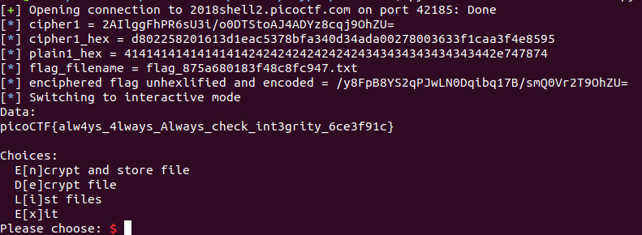

# eleCTRic

This is a 400-point cryptography problem from PicoCTF 2018. It's an attack on AES using counter mode.

### Problem description

You came across a custom server that Dr Xernon's company eleCTRic Ltd uses. It seems to be storing some encrypted files. Can you get us the flag? Connect with nc 2018shell2.picoctf.com 42185. [Source](./eleCTRic.py).

Looking through the source code, I can see that on program initialization, the code in `main` creates a new AES cipher in counter ("CTR") mode, with a 32-bit key and 32-bit random counter. Now each time a block of plain text gets encrypted, it will get XORed with the key plus the counter.

The interface allows the user to enter the title of a file and some content, which each then get encrypted and stored, with the base-64 encoding of the encrypted filename returned to the user. The user is also allowed to view the name of the file containing the encrypted flag. The trick is to figure out the base64 encryption of the filename.

### Solution

The main point is to realize that the counter is reset to its original value with each new encryption, so the first 32-byte block of plaintext is XORed with the same value every time. (After I finished this write-up and was comparing my solution to other approaches, I preferred [this description](https://srikavin.me/blog/posts/5bc15a23b7c5001b74f57e51-picoctf-2018-electric): the `aes.key` is supposed to be a nonce, but here the same value is used for every encryption.) In other words, let's say that I know the plaintext for a filename, `filename1`. Then the encrypted name of that file is `filename1 ^ [aes.key+aes.CTR]`. Well, if I XOR that encrypted name with the plaintext of the file name, `filename1`, I get back `[aes.key+aes.CTR]`. I also know the desired plaintext value of the name of the file containing the flag, which I'll call `flagfilename`. To get the encrypted name of that file, I just calculate `[aes.key+aes.CTR] ^ flagfilename`. I base64 encode that result, feed it to the program, and get my flag.

[Here's](./break-eleCTRic.py) the code, and here's the flag:

### Comparison to other approaches

There are three write-ups on CTF Time for this problem. They all take more or less the same approach. [One submitter](https://github.com/Dvd848/CTFs/blob/master/2018_picoCTF/eleCTRic.md) perhaps did not recognize that they could determine the value of the key plus the counter, so they passed to the program a filename that was one character different than the name of the flag file, got the encrypted result back that was a byte off, and brute-forced the solution.

### Additional resources

Dan Boneh's Cryptography I course on Coursera goes into more detail about how AES works in CTR mode, and is a good resource for anyone learning about block ciphers. Also my teammate recommended [this](https://cryptopals.com/sets/3/challenges/19) problem for learning more about the vulnerabilities of block ciphers using counter mode.
