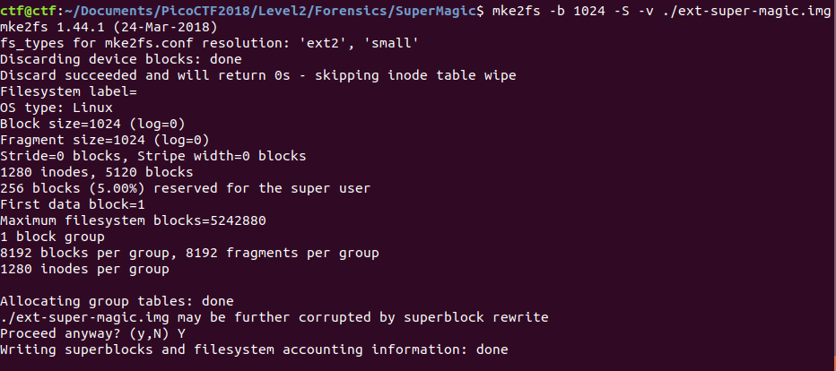
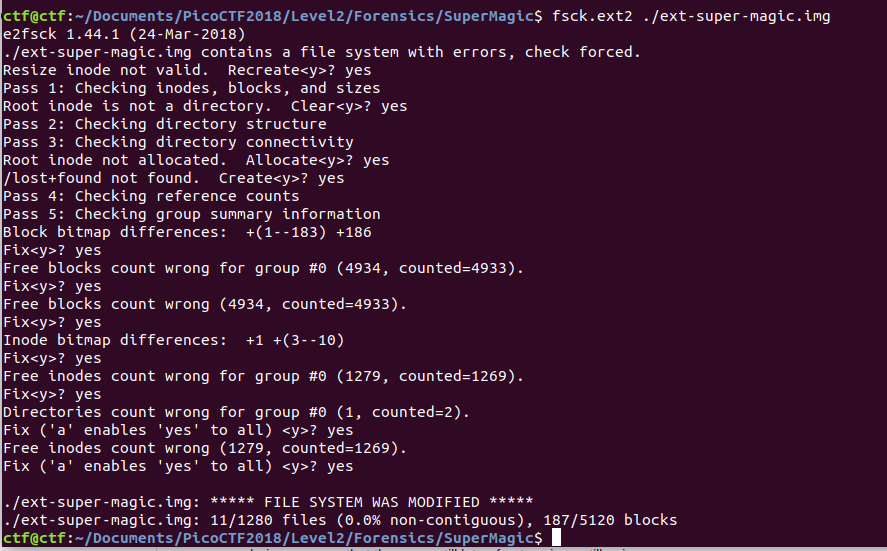
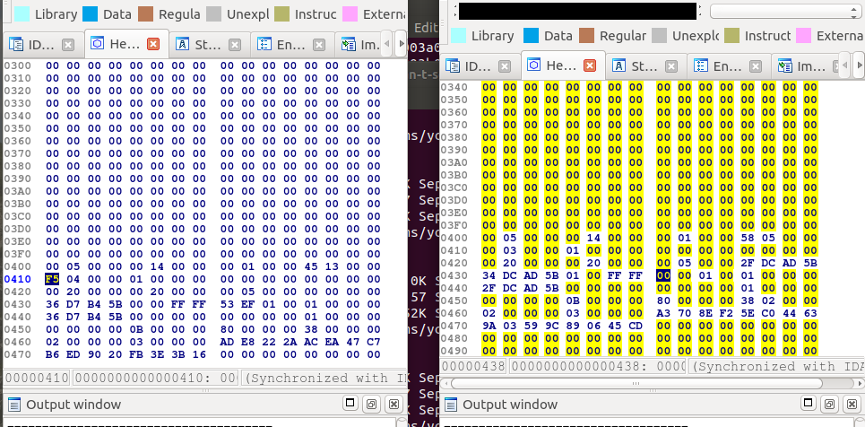
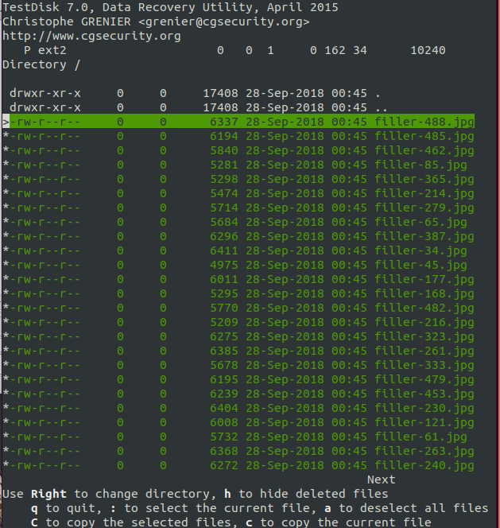
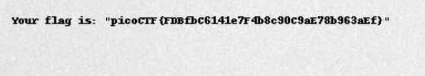

# Ext Super Magic

This is a simple data-recovery problem from PicoCTF 2018, worth 250 points.

### Problem Description

We salvaged a ruined Ext SuperMagic II-class mech recently and pulled the [filesystem](./ext-super-magic.img) out of the black box. It looks a bit corrupted, but maybe there's something interesting in there.

(The hints also refer the user to [this](http://www.nongnu.org/ext2-doc/ext2.html) file format specification for the EXT2 file system.)

### Solution

Running `file` on the `.img` file indicates that it is simply a data file, suggesting that the file has been corrupted somehow. I tried running `foremost` on the image file to retrieve its contents, but the tool was not able to extract complete files. Next, I skimmed through the specification for `ext2` files, and considered that the superblock was probably corrupt. I might be able to restore the corrupted superblock from one of the backup superblocks in the file, but first I used the `mke2fs` command to coerce the `ext2` file into a valid `ext2` file system while potentially overwriting useful data as follows:



I then ran `e2fsck` on the restored file system:



Next, I opened up the corrupted (i.e. original) `ext2` file with a hex editor and compared its superblock (located at offset `0x400`) to its fixed counterpart for which I'd likely destroyed its data:



Notice that the magic number, at offset `0x0438` according to the [spec](http://www.nongnu.org/ext2-doc/ext2.html), is supposed to be `0xEF53`. Changing the magic number in the corrupted file to its proper value produced a legitimate `ext2` file. Now, running `file` on the original file (with the correct magic number) produces the following output:

```
Linux rev 1.0 ext2 filesystem data, UUID=a3708ef2-5ec0-4463-9a03-599c890645cd (large files)
```

Also, in producing this write-up I realized that I could have directly run `e2fsck` on the corrupted file before running the `mke2fs` command. That would also have clued me in regarding the invalid magic number by producing the following output:

```
e2fsck 1.44.1 (24-Mar-2018)
ext2fs_open2: Bad magic number in super-block
fsck.ext2: Superblock invalid, trying backup blocks...
fsck.ext2: Bad magic number in super-block while trying to open ext-super-magic_orig.img

The superblock could not be read or does not describe a valid ext2/ext3/ext4
filesystem.  If the device is valid and it really contains an ext2/ext3/ext4
filesystem (and not swap or ufs or something else), then the superblock
is corrupt, and you might try running e2fsck with an alternate superblock:
   e2fsck -b 8193 <device>
or
   e2fsck -b 32768 <device>
```

Next, I used the `testdisk` utility to extract the contents of the filesystem:



That contains a file called `flag.png`:


which contains the flag:



### Comparison to Other Approaches

[Dvd848](https://github.com/Dvd848/CTFs/blob/master/2018_picoCTF/Ext%20Super%20Magic.md) patches the file with `dd`. [tcode2k16](https://tcode2k16.github.io/blog/posts/picoctf-2018-writeup/forensics/#ext-super-magic) uses a Python script to do the patching. [shiltemann](https://github.com/shiltemann/CTF-writeups-public/tree/master/PicoCTF_2018#forensics-250-ext-super-magic) uses the `debugfs` utility to determine that the magic number was corrupted, then mounts the file system instead of using `testdisk` to extract the files. This was a great example of a problem with multiple solutions, and I learned a bit from the write-ups.
