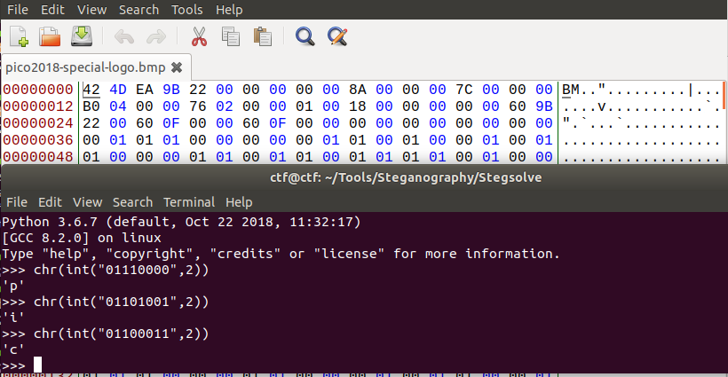

# LoadSomeBits

This is a 550-point PicoCTF 2018 forensics problem. It looks like steganography.

### Problem Description

Can you find the flag encoded inside this [image](./pico2018-special-logo.bmp)? You can also find the file in /problems/loadsomebits_4_7be73021cd0c9c84b08937323b0d6ae1 on the shell server.

There's a hint, which for a steg problem makes sense to look at:

    Look through the Least Significant Bits for the image

    If you interpret a binary sequence (seq) as ascii and then try interpreting the same binary sequence from an offset of 1 (seq[1:]) as ascii do you get something similar or completely different?

Whoops, I think that was too good of a hint.

I want to parse this with Python.

Well, first of all, I got various versions of "end of file" exceptions when attempting to read this file with three different tools. So, I opened up the file in a hex editor, and noticed some odd `0x01` bytes at the front of the file that looked like they could be binary. Sure enough:



Okay, so I just need to read the raw bytes out of the file and convert them to ASCII to get the flag. Easy enough.

Here's my code to solve the challenge:

```Python
# solve-load-some-bits.py
# by Sudoite

def bytes_to_char(byte_array):
    bin_string = ""
    for byte in byte_array:
        bin_string += str(byte)
    return chr(int(bin_string,2))

with open("./pico2018-special-logo.bmp", "rb") as f:
    f.read(0x36)
    flag = ""
    for i in range(60):
        byte_array = f.read(8)
        flag += bytes_to_char(byte_array)
    print("The flag is " + flag)
```

And the flag:
`The flag is picoCTF{st0r3d_iN_tH3_l345t_s1gn1f1c4nT_b1t5_2903593693}`

### Comparison to Other approaches

There were only two write-ups on CTF Time, and they were essentially the same. [Dvd848](https://github.com/Dvd848/CTFs/blob/master/2018_picoCTF/LoadSomeBits.md) used a nice memory-mapping function to read the raw bytes from the file that I haven't seen before. That looks pretty useful for later forensics problems. Here's his code:

```python
def memory_map(filename, access=mmap.ACCESS_READ):
    size = os.path.getsize(filename)
    fd = os.open(filename, os.O_RDWR)
    return mmap.mmap(fd, size, access=access)
```

Oddly, I was the only person to look at the bytes in a hex editor. Maybe I win this round?
