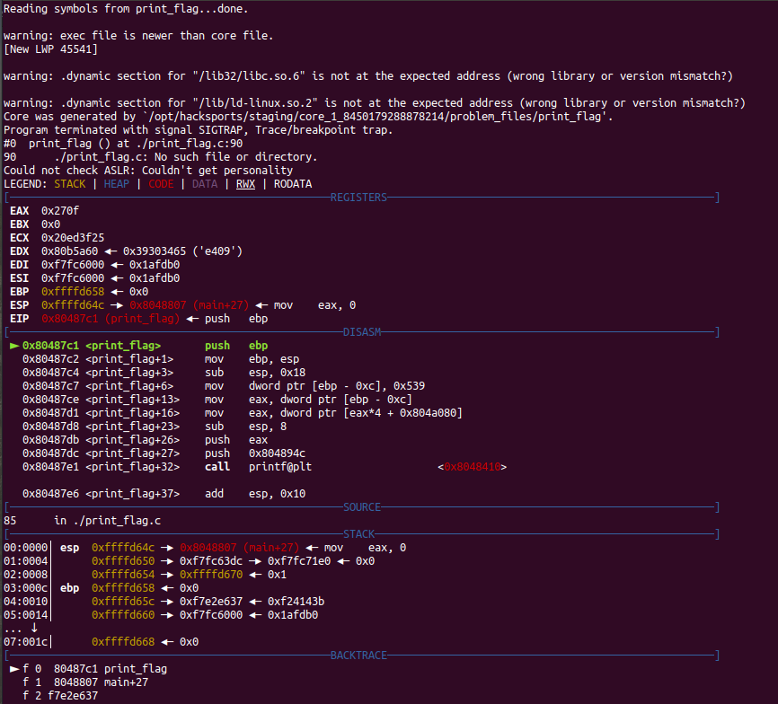

# Core

This is a 350-point, Level 2 PicoCTF 2018 forensics problem. It was pretty easy, but I thought I'd document how to analyze a core file.

### Problem Description

This program was about to print the flag when it died. Maybe the flag is still in this core file that it dumped? Also available at /problems/core_1_722685357ac5a814524ee76a3dcd1521 on the shell server.

### Solution

To analyze the core dump with `gdb`, the command is just `gdb print-flag core`. Here's where the program crashed:

`printf` is going to be called with two arguments. This is a 32-bit binary so the arguments are pushed on the stack in reverse order prior to calling `printf`. The first argument is the string at `0x804894c:	"your flag is: picoCTF{%s}\n"`. The second is the format string, which is referenced by the pointer located at `[0x539*4 + 0x804a080]`. In my case that string is "e52f4714963eb207ae54fd424ce3c7d4" so the flag is `picoCTF{e52f4714963eb207ae54fd424ce3c7d4}`. Short and sweet.

### Comparison to other write-ups

There's only one write-up for this problem on CTF Time, and it's exactly the same. There isn't really any room for creativity with this problem, the whole point is just to teach a specific forensics skill.
