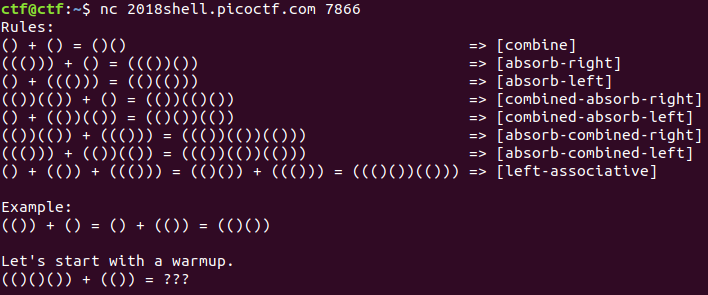
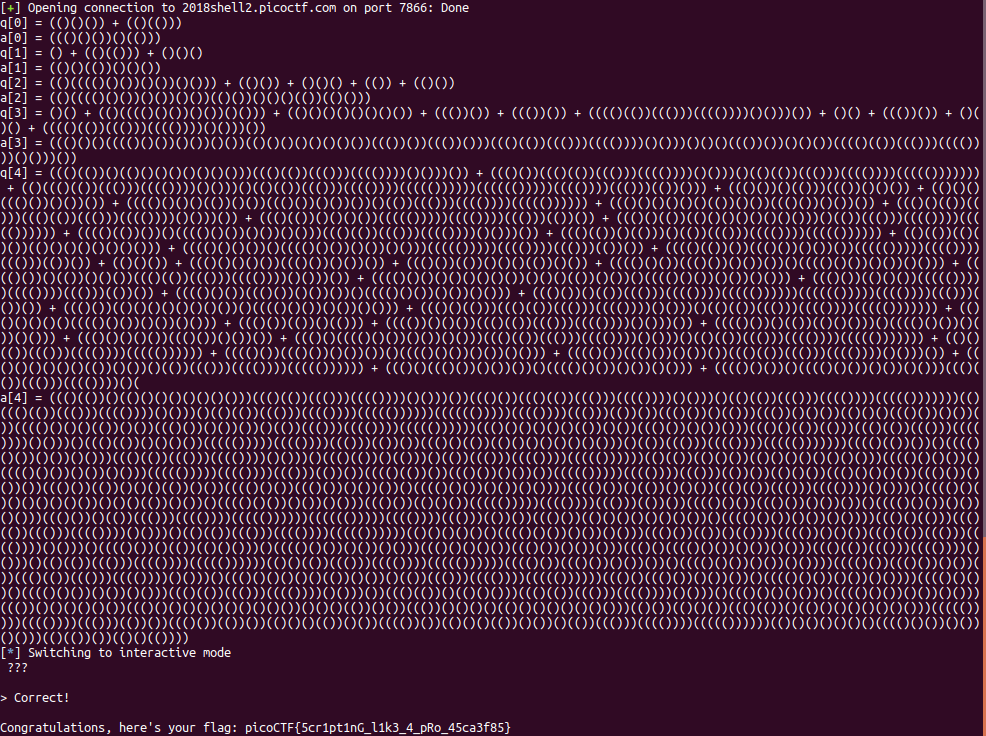

# ScriptMe

This is a 500-point, level 3 scripting problem from PicoCTF 2018.

### Overview

```
Can you understand the language and answer the questions to retrieve the flag? Connect to the service with nc 2018shell.picoctf.com 7866
```

This is a scripting challenge. The player is presented with the scripting rules:



Each problem can be viewed as a formula containing tokens, where a token is a set of consecutive characters only consisting of '(' or ')'. (So, the example adds two tokens, `(())` and `()`.) I first split each problem into tokens. Then I noticed that I could compute the maximum depth of a token. When adding two tokens, I combine them with `absorb-left` if the right token has the higher maximum depth; otherwise, I combine them with `absorb-right`. If the two tokens are of the same depth, I combine them with `combine`. That takes care of the `combined-absorb-right`, `combined-absorb-left`, `absorb-combined-right` and `absorb-combined-left` rules. I therefore implemented `combine`, `absorb-right` and `absorb-left` first. Then I parsed the formulas into arrays of tokens, and processed the tokens from left to right as per the `left-associative` rule. That's the entire logic for the solution -- the rest is just implementation, which follows.

[Here's](./solve-script-me.py) the Python code, with my unit tests left in.

Here's the flag:



### Comparison to other approaches

Other solutions reported right after the PicoCTF2018 competition used similar approaches. [findneo](https://ctftime.org/writeup/12068) has a clever use of `reduce()` in Python.
