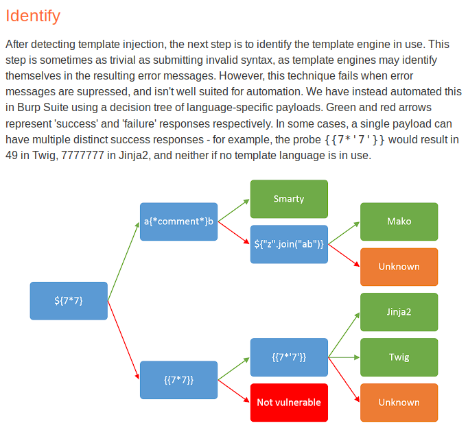
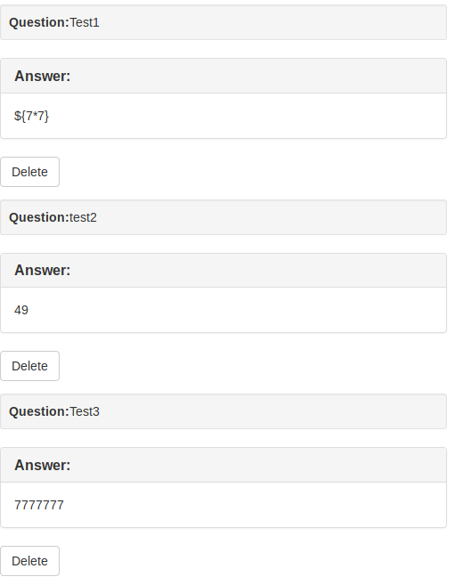
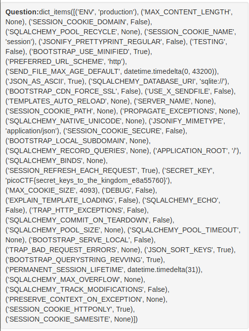

# Flask Cards

This is a 350-point Web challenge for PicoCTF 2018.

### Problem Description

We found this fishy [website](http://2018shell.picoctf.com:51878/) for flashcards that we think may be sending secrets. Could you take a look?

### Solution

After registering and logging in, the user can enter in a question and answer for a "flaskcard", then view those cards. I think I remember working on a Server-Side Template Injection problem for another CTF involving Flask, so on a hunch I entered `{{7*7}}` as the content for a "flaskcard", then when I displayed the card I got `49`. That's an SSTI vulnerability indeed. I remember now that the site is running `Jinja2`, but just for kicks, following [this guide](https://portswigger.net/blog/server-side-template-injection) let's do the fingerprinting explicitly.

I submitted three tests: `${7*7}` (test1), `{{7*7}}` (test2), and `{{7*'7'}}` (test3). Here's the result of the fingerprinting:

So, the server is running `Jinja2`.

Next, based on [this blog](https://www.lanmaster53.com/2016/03/exploring-ssti-flask-jinja2/), let's try a payload of `{{config.items()}}`:

And there's the flag! `picoCTF{secret_keys_to_the_kingdom_e8a55760}`.

### Comparison to other approaches

[Liuhack](https://github.com/liuhack/writeups/blob/master/2018/picoCTF/Flaskcards/README.md) and [wisp](https://www.wispwisp.com/?p=281) show that the command `{{config}}` works just as well as `{{config.items()}}`. [Dvd848](https://github.com/Dvd848/CTFs/blob/master/2018_picoCTF/Flaskcards.md) takes a more advanced approach, using `mro()` to go up the object tree and `.__subclasses__` to go back down again as per [this blog](https://nvisium.com/blog/2016/03/11/exploring-ssti-in-flask-jinja2-part-ii). That way they can actually do remote code execution and read the `config.py` file right off the server to get the same information. That's an approach I ended up using later, with the 900-point Flaskcards and Freedom problem -- but it works for this problem as well. I'd say Dvd848's approach is perhaps the "better" one because it is more versatile, although the solutions that display `{{config}}` or `{{config.items()}}` directly could be called "better" in this case because they are faster.
