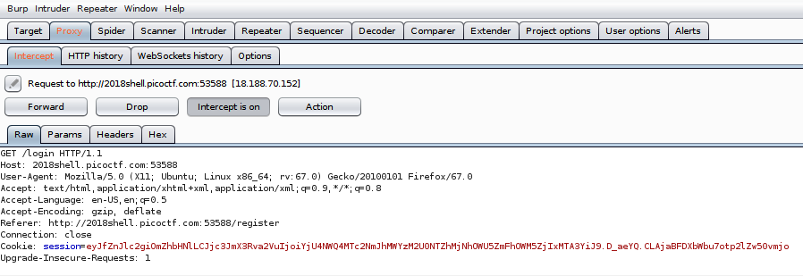
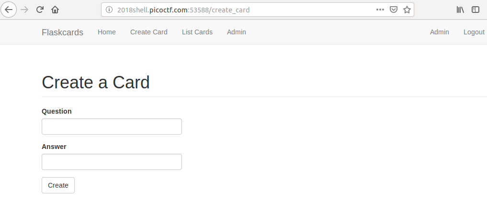
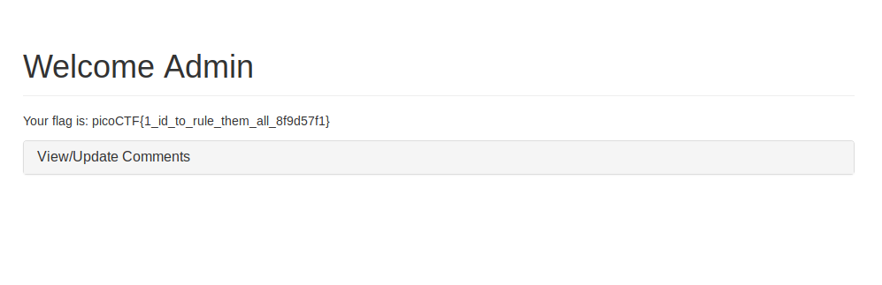

# Flaskcards Skeleton Key

This is a 600-point PicoCTF 2018 problem that is the second of three in the "Flaskcards" series.

### Problem Description

Nice! You found out they were sending the Secret_key: a155eb4e1743baef085ff6ecfed943f2. Now, can you find a way to log in as admin? ([link](http://2018shell.picoctf.com:53588)).

This problem involves forging a session cookie.

### Solution

We already know this web application is running Flask on Jinja2. I want to start by logging in, viewing my session cookie, and decoding it with the secret key.

Here's the session cookie, captured with BurpSuite:

I found some Python code to [decode](https://gist.github.com/babldev/502364a3f7c9bafaa6db) and [encode](https://gist.github.com/aescalana/7e0bc39b95baa334074707f73bc64bfe) a Flask session cookie. Decoding the cookie gives me the following:

`{u'csrf_token': u'b585d81766ba1f33e456a23a9e9faa9c9f21107b', u'_fresh': False}``

That's if I'm not logged in. If I register as a user and then log in, it becomes:

`{u'csrf_token': u'b585d81766ba1f33e456a23a9e9faa9c9f21107b', u'_fresh': True, u'user_id': u'29', u'_id': u'273d78a6c515c1aa8ba566f9ec403b4716970a65784b82a7680053894f950f3c421e7e597441a73e480c5a1e7b2ef548ecfa81f47a73ae2a1b56ea38560a363c'}`

Now logging in as a different user actually gives me the same CSRF token and the same `_id` field. So that means I jsut need to figure out what the `_id` field should be in the unencrypted session cookie to log in as the administrator (assuming they have an ID of 1).

Well, how about changing it to 1? I can re-encrypt the cookie and submit that string using Burp.

`{u'csrf_token': u'b585d81766ba1f33e456a23a9e9faa9c9f21107b', u'_fresh': True, u'user_id': u'1', u'_id': u'273d78a6c515c1aa8ba566f9ec403b4716970a65784b82a7680053894f950f3c421e7e597441a73e480c5a1e7b2ef548ecfa81f47a73ae2a1b56ea38560a363c'}`

Encrypting it gives me an admin cookie of `.eJwlj8uqAjEQRP8laxfp9DP-zNDJdKMICjO6utx_N-C2ilOc-itbHnHeyvV9fOJStvterqUp7mouk4EnuNtwFskekyoOUpCu1YXVaFhzFauV0Tpl55o4qUFocFcicMUgq5N9ZaNFMlnMdIMkXaVHcxgs4Wgs1VFwlkuZ55Hb-_WI5_IZbLwbqMhwSFyDLN7Qe_R077NnA6g6Fvc54_idgPL_Be7OPdk.D_anDA.meOQLzrVGNFkRKyKp4H7Q5jmGr4`. Let's try it:

Let's navigate to that "Admin" tab. (I have to manually replace the session cookie during navigation to remain admin.)

Alright! That's a wrap. [Here's](./solve-flaskcards-skeleton-key.py) the solution (with different values for the cookie in the comments, as the server apparently resets every two hours).

### Comparison to Other Approaches

The write-ups on CTF Time basically take the same approach, but the implementations differ a bit. [Dvd848](https://github.com/Dvd848/CTFs/blob/master/2018_picoCTF/Flaskcards%20Skeleton%20Key.md) logs in and retrieves the session cookie programmatically, whereas my approach is more manual. [k3ddr](https://ctftime.org/writeup/11812) takes an approach similar to mine. Multiple submitters referred to [this write-up](https://terryvogelsang.tech/MITRECTF2018-my-flask-app/), which also indicates that the `MYFLASKAPP_SECRET` environment variable stores the secret key. Hence, Server-Side Template Injection may pave the way for forging credentials. [This write-up](https://teamrocketist.github.io/2017/09/11/Web-ASIS-Golem-is-stupid/) also was cited twice. Finally, [d4rkvaibhav](https://github.com/d4rkvaibhav/picoCTF-2018-Writeups/tree/master/WEB_EXPLOITATION/Flaskcards%20Skeleton%20Key) uses an online tool for decoding and encoding Flask session cookies. And [Liuhack](https://github.com/liuhack/writeups/blob/master/2018/picoCTF/Flaskcards_Skeleton_Key/README.md) uses [this tool](https://github.com/noraj/flask-session-cookie-manager) to encode and decode his session cookies.
