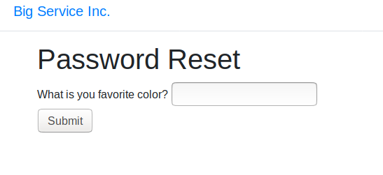
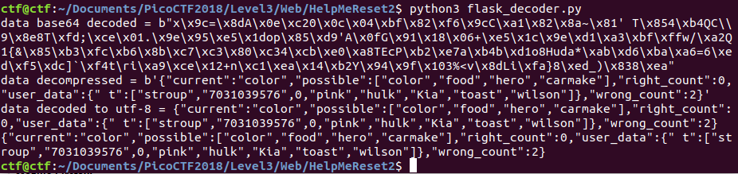
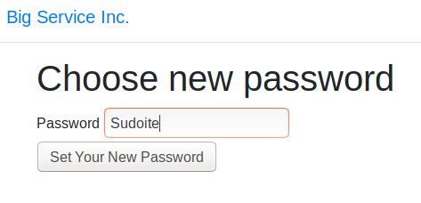
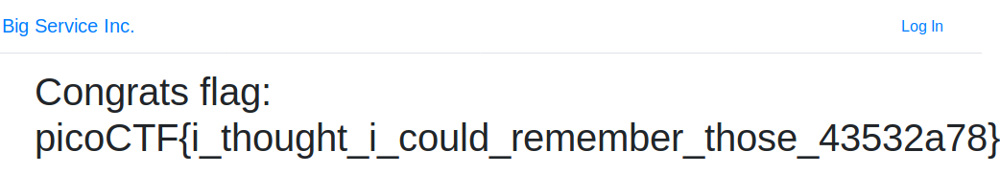

# Help Me Reset 2

This is a 600-point Web Exploitation problem from PicoCTF 2018.

### Problem Description

There is a website running at http://2018shell.picoctf.com:29523 ([link](http://2018shell.picoctf.com:29523)). We need to get into any user for a flag!

### Reconnaissance

Reading through the source code of the main screen gives me:

```
<!--Proudly maintained by stroup-->
```

If that's not the handle of the problem author, maybe that's a username that would work.

The buttons on the main page don't work. All I can do is go to `login`. Now when I try to login, I'm asked for a username and password. If I enter "test" for user I get a message: "User does not exist." If I enter "stroup", I get a new screen:



Well first let me see if that's vulnerable to SQL injection. If not, maybe I can guess Stroup's favorite color.

If I answer color incorrectly I get asked for a favorite hero.

Then I tried ' or '1'='1 for hero and that failed.

Well, what if after guessing once, I ask for the page where I started guessing, and I use the session cookie associated with the first time I referenced that page? I'm wondering if the number of failed guesses gets saved in the session cookie. If so, then I might be able to brute force guessing Stroup's favorite color.

Well, I guessed that it's a Flask application because of the look and feel of the site, and because the other web applications for PicoCTF 2018 have been Flask applications. I grabbed a Flask cookie decoder from [here](https://www.kirsle.net/wizards/flask-session.cgi). Using the online decoder failed with a "not valid JSON" error for the decoded cookie, but the source code for the decoder was available. So, I created my own Python file with the source code, hacked away the parts that I didn't need, put in some print statements to print intermediate values of the decoded cookie, and ran it. Here's the result:



Awesome! The answers to the security questions are right there in the cookie. The funny thing is, I actually guessed their favorite food correctly when just trying this out, but it looks like I needed to get more than one security question right.

That lets me reset the password:



And I get the flag:



Great! The lesson from this challenge: Flask cookies are dangerous because they can be decoded. They can't be forged without the server key, but sometimes decoding them is all that is necessary for the attacker to gain an advantage.

Here's the decoding script:

```python
"""Flask session cookie decoder."""
# From https://www.kirsle.net/wizards/flask-session.cgi#source
# Modified by Sudoite

#import cgitb
#cgitb.enable()

import os
import codecs
import cgi
import jinja2
from base64 import b64decode
from itsdangerous import base64_decode
import zlib
import json
import pygments
from pygments.formatters import HtmlFormatter
from pygments.lexers import PythonLexer, JsonLexer
import uuid
from werkzeug.http import parse_date
from flask import Markup

env = jinja2.Environment(loader=jinja2.FileSystemLoader("."))

def main():
    # Template variables.
    #action   = form.get("action", "index")
    cookie   = ".eJw9jUEOwjAMBL-C9pxDoYKKfoEnIFSFNLRRQ1w5jjhU_TvOAS6eleUdb3CF2SdBD0eRGAYr5Rye0aO__3cvolExeyaFs_y2i8fDgMM0y-CoVEVjULLnYbRi0W84SHVkYSqr1rqmPTbt9dxdYPR0DWmpzhIrbsHqFLJZlJ8QMyU8do1Mafp9OO1fKYM46g.EBHA2g.cMAHdMnvxcCutPTr0zISI8BM16M"
    contents = decode(cookie)
    print(contents)
'''
        # Test whether it's JSON data.
        try:
            json_contents = flask_loads(contents)

            # Pretty-print it.
            pretty = json.dumps(json_contents,
                sort_keys=True,
                indent=4,
                separators=(',', ': '))
            pretty = pygments.highlight(pretty, JsonLexer(), HtmlFormatter())
        except Exception as e:
            contents = "[ERR: Not JSON data]"
'''
    #template = env.get_template("flask-session.tp")

def decode(cookie):
    """Decode a Flask cookie."""
    try:
        compressed = False
        payload = cookie

        if payload.startswith('.'):
            compressed = True
            payload = payload[1:]

        data = payload.split(".")[0]

        data = base64_decode(data)
        print("data base64 decoded = " + str(data))
        if compressed:
            data = zlib.decompress(data)
            print("data decompressed = " + str(data))
        data_decoded = data.decode("utf-8")
        print("data decoded to utf-8 = " + str(data_decoded))
        return data.decode("utf-8")
    except Exception as e:
        return "[Decoding error: are you sure this was a Flask session cookie? {}]".format(e)

if __name__ == "__main__":
    main()
```

### Comparison to Other Approaches

Of the six write-ups on CTF Time, about half took the same approach I did, finding a user name and then decoding the Flask cookie. [root3r](https://ctftime.org/writeup/11657) has a great approach. When I got access, I was directed to http://2018shell.picoctf.com:29523/profile. Well, root3r simply guessed what the link would be. Smart. [k3d4r](http://blog.iodbh.net/picoctf2018-web-help-me-reset-2.html) guessed the security questions, and the flag contents suggest that maybe that was actually the intended solution. [tcode2k16](https://tcode2k16.github.io/blog/posts/picoctf-2018-writeup/web-exploitation/#help-me-reset-2) had a nice approach -- they noticed that after correctly guessing one of the security questions, it was possible to refresh the page and get the same question two more times. So, with that approach I could have gotten in with "toast"!

My favorite write-up is (once again!) by [Dvd848](https://github.com/Dvd848/CTFs/blob/master/2018_picoCTF/Help%20Me%20Reset%202.md), who uses [`dirsearch`](https://github.com/maurosoria/dirsearch) to find the profile page. That's a useful tool to know about.  
