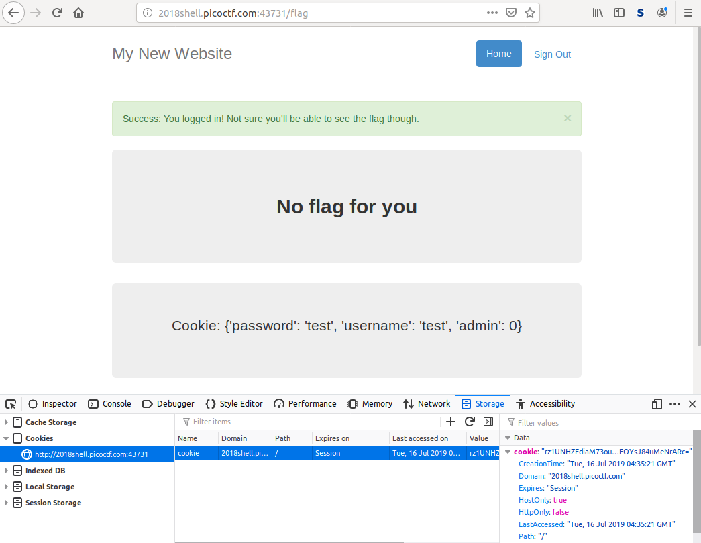
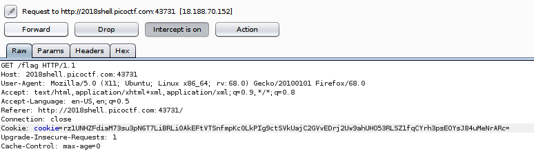
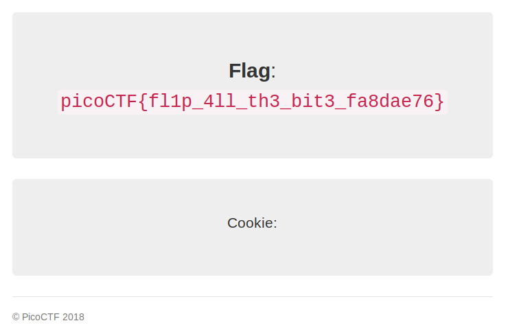

# Secure Logon

This is a 500-point, Level 3 PicoCTF 2018 web security problem.

### Problem Description

Uh oh, the login page is more secure... I think. http://2018shell.picoctf.com:43731 ([link](https://2018shell.picoctf.com:43731)). [Source](./server_noflag.py).

Here is the source code:

```python
from flask import Flask, render_template, request, url_for, redirect, make_response, flash
import json
from hashlib import md5
from base64 import b64decode
from base64 import b64encode
from Crypto import Random
from Crypto.Cipher import AES

app = Flask(__name__)
app.secret_key = 'seed removed'
flag_value = 'flag removed'

BLOCK_SIZE = 16  # Bytes
pad = lambda s: s + (BLOCK_SIZE - len(s) % BLOCK_SIZE) * \
                chr(BLOCK_SIZE - len(s) % BLOCK_SIZE)
unpad = lambda s: s[:-ord(s[len(s) - 1:])]


@app.route("/")
def main():
    return render_template('index.html')

@app.route('/login', methods=['GET', 'POST'])
def login():
    if request.form['user'] == 'admin':
        message = "I'm sorry the admin password is super secure. You're not getting in that way."
        category = 'danger'
        flash(message, category)
        return render_template('index.html')
    resp = make_response(redirect("/flag"))

    cookie = {}
    cookie['password'] = request.form['password']
    cookie['username'] = request.form['user']
    cookie['admin'] = 0
    print(cookie)
    cookie_data = json.dumps(cookie, sort_keys=True)
    encrypted = AESCipher(app.secret_key).encrypt(cookie_data)
    print(encrypted)
    resp.set_cookie('cookie', encrypted)
    return resp

@app.route('/logout')
def logout():
    resp = make_response(redirect("/"))
    resp.set_cookie('cookie', '', expires=0)
    return resp

@app.route('/flag', methods=['GET'])
def flag():
  try:
      encrypted = request.cookies['cookie']
  except KeyError:
      flash("Error: Please log-in again.")
      return redirect(url_for('main'))
  data = AESCipher(app.secret_key).decrypt(encrypted)
  data = json.loads(data)

  try:
     check = data['admin']
  except KeyError:
     check = 0
  if check == 1:
      return render_template('flag.html', value=flag_value)
  flash("Success: You logged in! Not sure you'll be able to see the flag though.", "success")
  return render_template('not-flag.html', cookie=data)

class AESCipher:
    """
    Usage:
        c = AESCipher('password').encrypt('message')
        m = AESCipher('password').decrypt(c)
    Tested under Python 3 and PyCrypto 2.6.1.
    """

    def __init__(self, key):
        self.key = md5(key.encode('utf8')).hexdigest()

    def encrypt(self, raw):
        raw = pad(raw)
        iv = Random.new().read(AES.block_size)
        cipher = AES.new(self.key, AES.MODE_CBC, iv)
        return b64encode(iv + cipher.encrypt(raw))

    def decrypt(self, enc):
        enc = b64decode(enc)
        iv = enc[:16]
        cipher = AES.new(self.key, AES.MODE_CBC, iv)
        return unpad(cipher.decrypt(enc[16:])).decode('utf8')

if __name__ == "__main__":
    app.run()
```

### Solution

The server uses AES in CBC mode for encryption, so the vulnerability is similar to that for the [Magic Padding Oracle](https://github.com/Sudoite/ctf-writeups/tree/master/PicoCTF2018/crypto/MagicPaddingOracle) problem. It looks as though the `'admin'` field is the first in the cookie because the keys get sorted prior to encryption. And I probably just have to change its value, `0`, to a `1`. That means that I can probably get away with flipping a single bit in the IV to change that value. To determine exactly which bit I have to flip, I want to run my own local code that will produce the encrypted cookie and print out its value prior to encryption. Then I'll flip a bit in the IV, perform the decryption, and verify that the new cookie does indeed have an `admin` value of `1`. Next I'll submit the modified cookie to the server for points.

The cookie data prior to encryption looks something like this:

`{"admin": 0, "password": "testpwd", "username": "testuser"}`

Indeed! So, I need to change cookie[10] to 1 by xoring IV[20:22] with `0x30 ^ 0x31`.

Here's a sample login:



I can get the cookie, modify it, and return it with Burp:



And that gives me the flag!



Here's my Python code:

```python
# solve-secure-logon.py
# by Sudoite

import json
from base64 import b64decode
from base64 import b64encode
from binascii import hexlify

cookie = {}
cookie['password'] = 'testpwd'
cookie['username'] = 'testuser'
cookie['admin'] = 0
print(cookie)
cookie_data = json.dumps(cookie, sort_keys=True)
print(cookie_data) # Shows I need to modify the 10th byte
print(len(cookie_data))

# Copied from Firefox
ct = b64decode("rz1UNHZFdiaM73ou3pN6T7LiBRLi0AkEFtVTSnfmpKc0LkPIg9ctSVkUajC2GVvEDrj2Uw9ahUHO53RLSZ1fqCYrh3psEOYsJ84uMeNrARc=")

# Modify byte n of the ciphertext so that the plaintext goes from a to b
def modify_byte_n(ct, n, a, b):
	ct2 = ct[0:n] + bytes([ct[n] ^ a ^ b]) + ct[(n+1):]
	return ct2

modified_cookie = b64encode(modify_byte_n(ct, 10, 0x30, 0x31))
print("Modified cookie = " + str(modified_cookie))
```

### Comparison to Other Approaches

Four write-ups on CTF Time use the same approach that I did. Among these, [zomry1](https://ctftime.org/writeup/13273) also packs the write-up full of memes, so that's fun. [Two](https://ctftime.org/writeup/11748) [additional](https://github.com/Dvd848/CTFs/blob/master/2018_picoCTF/Secure%20Logon.md) write-ups use a bit-flipping tool in `BurpSuite Intruder` instead of native Python to do the bit flipping. Out of the two, I liked [Dvd848](https://github.com/Dvd848/CTFs/blob/master/2018_picoCTF/Secure%20Logon.md)'s write-up, which walks the reader through the use of the tool and shows that with that approach the cookie can be brute-forced: it's not necessary to know which bit to flip.
